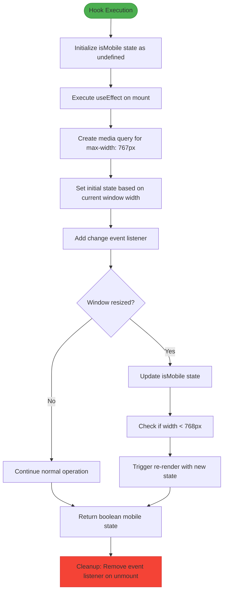
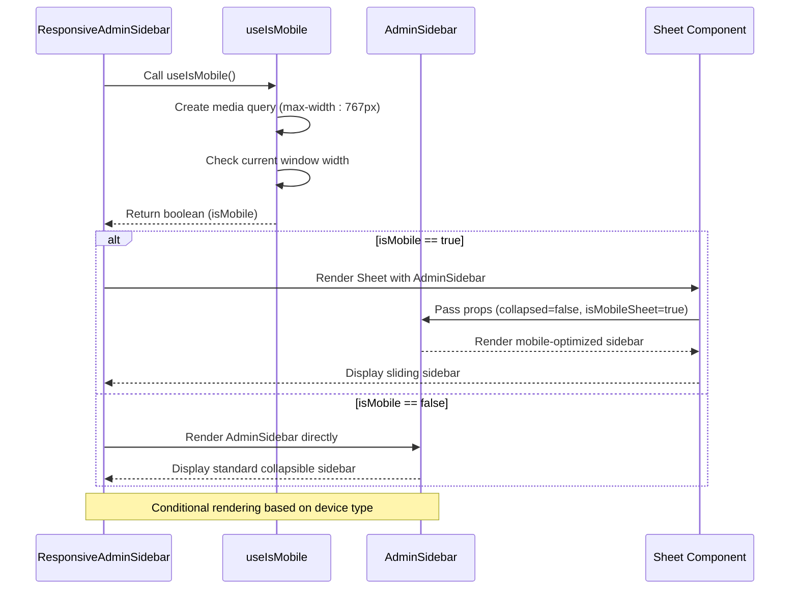

# useIsMobile Hook

<cite>
**Referenced Files in This Document**   
- [use-mobile.tsx](file://src/hooks/use-mobile.tsx)
- [ResponsiveAdminSidebar.tsx](file://src/components/ResponsiveAdminSidebar.tsx)
- [AdminSidebar.tsx](file://src/components/AdminSidebar.tsx)
- [tailwind.config.ts](file://tailwind.config.ts)
</cite>

## Table of Contents
1. [Introduction](#introduction)
2. [Implementation Details](#implementation-details)
3. [Usage in Components](#usage-in-components)
4. [Breakpoint Configuration](#breakpoint-configuration)
5. [Performance Considerations](#performance-considerations)
6. [Integration with Tailwind CSS](#integration-with-tailwind-css)
7. [Best Practices](#best-practices)

## Introduction

The `useIsMobile` custom hook is a React utility function designed to detect mobile device screen sizes in the lovable-rise application. It leverages the browser's `window.matchMedia` API to determine whether the current viewport width falls below a defined mobile breakpoint threshold. This hook returns a boolean value indicating the mobile state, which components can use to adapt their layout and behavior accordingly. The implementation follows React best practices using `useState` for state management and `useEffect` for side effects, ensuring proper cleanup of event listeners to prevent memory leaks.

**Section sources**
- [use-mobile.tsx](file://src/hooks/use-mobile.tsx#L4-L18)

## Implementation Details

The `useIsMobile` hook implements a responsive detection mechanism using the `window.matchMedia` API, which provides a more reliable approach than directly monitoring `window.innerWidth` changes. The hook initializes with an undefined state and updates this state based on the media query evaluation during component mounting. The media query `(max-width: ${MOBILE_BREAKPOINT - 1}px)` is used to detect screens smaller than the defined breakpoint value.

The implementation includes proper event listener management within the `useEffect` hook, registering a change listener that updates the mobile state when the viewport crosses the breakpoint threshold. Crucially, the effect returns a cleanup function that removes the event listener when the component unmounts, preventing potential memory leaks and ensuring proper resource management. The hook returns a boolean value (using double negation `!!isMobile`) to ensure a consistent boolean type is returned even when the internal state is initially undefined.

**Diagram sources**
- [use-mobile.tsx](file://src/hooks/use-mobile.tsx#L4-L18)

**Section sources**
- [use-mobile.tsx](file://src/hooks/use-mobile.tsx#L4-L18)

## Usage in Components

The `useIsMobile` hook is primarily consumed by responsive components such as `ResponsiveAdminSidebar` to adapt their layout based on device type. When the hook returns `true`, indicating a mobile device, the component renders a mobile-optimized interface using a Sheet component that slides in from the side. On desktop devices (when the hook returns `false`), the component renders the standard `AdminSidebar` with collapsible functionality.

The `ResponsiveAdminSidebar` component uses the hook result to conditionally render different UI structures, demonstrating a common pattern for responsive design in React applications. This approach allows for significant layout differences between mobile and desktop views while maintaining a single component interface. The mobile implementation includes specific props like `isMobileSheet` and `onMobileClose` to handle mobile-specific interactions such as closing the sidebar by clicking outside or using a close button.

**Diagram sources**
- [ResponsiveAdminSidebar.tsx](file://src/components/ResponsiveAdminSidebar.tsx#L17-L49)
- [use-mobile.tsx](file://src/hooks/use-mobile.tsx#L4-L18)

**Section sources**
- [ResponsiveAdminSidebar.tsx](file://src/components/ResponsiveAdminSidebar.tsx#L17-L49)
- [AdminSidebar.tsx](file://src/components/AdminSidebar.tsx#L1-L180)

## Breakpoint Configuration

The mobile detection threshold is defined by the `MOBILE_BREAKPOINT` constant set to 768 pixels in the `use-mobile.tsx` file. This value represents the standard tablet breakpoint commonly used in responsive design, where screens narrower than 768px are considered mobile devices. The hook uses a media query with `max-width: ${MOBILE_BREAKPOINT - 1}px` (767px) to detect mobile devices, ensuring that exactly 768px wide screens are treated as desktop.

This breakpoint value aligns with common responsive design practices and matches the default small (sm) breakpoint in many CSS frameworks. The implementation uses a hardcoded constant rather than importing from a configuration file, making the breakpoint value directly visible in the hook's source code. The choice of 768px as the threshold ensures that most tablets in portrait mode are detected as mobile devices, while tablets in landscape mode and larger devices are treated as desktop.

**Section sources**
- [use-mobile.tsx](file://src/hooks/use-mobile.tsx#L2-L18)

## Performance Considerations

The `useIsMobile` hook implements several performance optimizations to ensure efficient operation. The `useEffect` dependency array is empty (`[]`), ensuring the effect runs only once during component mounting rather than on every render. This prevents unnecessary recreation of the media query listener and improves rendering performance.

The hook properly cleans up the event listener in the cleanup function returned by `useEffect`, preventing memory leaks that could occur if listeners accumulate across component mounts and unmounts. This is particularly important for applications with frequent navigation where components using this hook may be repeatedly mounted and unmounted.

The state update is optimized by using the media query change event rather than listening to all window resize events, reducing the frequency of state updates and re-renders. The media query API is specifically designed for this use case and is more efficient than debounced resize event listeners, as it only triggers when the media condition actually changes rather than on every pixel of resize.

**Section sources**
- [use-mobile.tsx](file://src/hooks/use-mobile.tsx#L4-L18)

## Integration with Tailwind CSS

While the `useIsMobile` hook uses a hardcoded breakpoint value of 768px, Tailwind CSS in the lovable-rise application uses the default breakpoint configuration without custom mobile breakpoints. The Tailwind configuration file (`tailwind.config.ts`) extends the default theme screens but does not explicitly define a custom mobile breakpoint that corresponds to the 768px threshold used in the hook.

This creates a potential inconsistency between the JavaScript-based mobile detection and CSS-based responsive styling. Components that rely on Tailwind's responsive prefixes (like `md:`, `lg:`) may have different breakpoint behaviors than components using the `useIsMobile` hook. Developers should be aware of this discrepancy when implementing responsive features that combine CSS classes with JavaScript logic.

The application could benefit from centralizing the breakpoint definition, either by importing the `MOBILE_BREAKPOINT` value into the Tailwind configuration or by defining the breakpoint in Tailwind and referencing it in the hook, ensuring consistent responsive behavior across both CSS and JavaScript.

**Section sources**
- [use-mobile.tsx](file://src/hooks/use-mobile.tsx#L2-L18)
- [tailwind.config.ts](file://tailwind.config.ts#L1-L147)

## Best Practices

When using the `useIsMobile` hook, developers should follow several best practices to ensure reliable and maintainable code. First, the hook should be used for significant layout changes rather than minor styling adjustments, reserving CSS media queries for visual refinements and using the hook for structural component changes.

Components consuming this hook should handle the initial undefined state gracefully, though the current implementation ensures the state is quickly resolved on mount. The hook is designed to work in client-side environments and is not suitable for server-side rendering scenarios without modification, though this is not a concern in the current application architecture.

For optimal performance, avoid calling the hook in frequently re-rendering components unless necessary, as each call creates a new media query listener. In cases where multiple components need mobile detection, consider lifting the state to a common ancestor or using a context-based approach to share the mobile state.

The hook demonstrates proper React patterns including dependency array optimization, effect cleanup, and state initialization, serving as a model for other custom hooks in the application.

**Section sources**
- [use-mobile.tsx](file://src/hooks/use-mobile.tsx#L4-L18)
- [ResponsiveAdminSidebar.tsx](file://src/components/ResponsiveAdminSidebar.tsx#L17-L49)