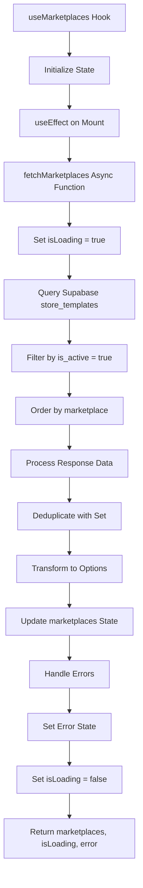
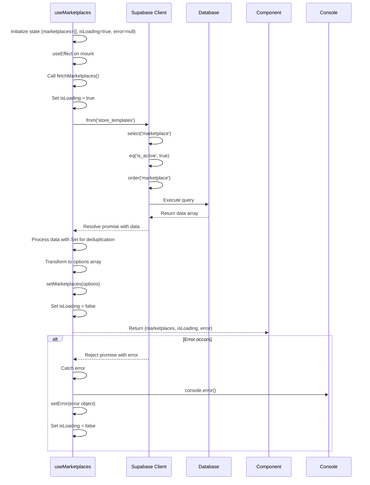

# useMarketplaces Hook

<cite>
**Referenced Files in This Document**   
- [useMarketplaces.ts](file://src/hooks/useMarketplaces.ts)
- [EditShopDialog.tsx](file://src/components/user/shops/EditShopDialog.tsx)
- [ShopForm.tsx](file://src/components/user/shops/ShopForm.tsx)
</cite>

## Table of Contents
1. [Introduction](#introduction)
2. [Core Components](#core-components)
3. [Architecture Overview](#architecture-overview)
4. [Detailed Component Analysis](#detailed-component-analysis)
5. [Performance Considerations](#performance-considerations)
6. [Troubleshooting Guide](#troubleshooting-guide)

## Introduction
The `useMarketplaces` custom hook is a React hook designed to fetch and manage active marketplace options from the `store_templates` table in the Supabase database for use in form dropdowns within the lovable-rise application. It retrieves distinct marketplace values where `is_active = true`, transforms them into selectable options, and handles loading states, errors, and deduplication. This hook is primarily used in shop management forms to allow users to select a marketplace format when creating or editing shops.

## Core Components

The `useMarketplaces` hook implements a standard pattern for data fetching in React applications using the `useState` and `useEffect` hooks. It manages three key states: `marketplaces` (the list of available options), `isLoading` (loading state), and `error` (error state). The hook performs a Supabase query to fetch marketplace data from the `store_templates` table, applies client-side deduplication using JavaScript's `Set` object, and transforms the results into a standardized option format with `value` and `label` properties.

**Section sources**
- [useMarketplaces.ts](file://src/hooks/useMarketplaces.ts#L8-L55)

## Architecture Overview



**Diagram sources**
- [useMarketplaces.ts](file://src/hooks/useMarketplaces.ts#L8-L55)

## Detailed Component Analysis

### useMarketplaces Hook Implementation

The `useMarketplaces` hook follows a standard data-fetching pattern with proper error handling and state management. It uses `useEffect` to trigger the data fetch operation when the component mounts (empty dependency array). The fetch operation is wrapped in an async function that handles the entire lifecycle of the request.

The hook queries the `store_templates` table using Supabase's client, selecting only the `marketplace` field and filtering for records where `is_active` is true. The results are ordered alphabetically by marketplace name. After receiving the data, the hook performs client-side deduplication using JavaScript's `Set` object to ensure unique marketplace values, then transforms the array of strings into an array of objects with `value` and `label` properties as required by the Select component.



**Diagram sources**
- [useMarketplaces.ts](file://src/hooks/useMarketplaces.ts#L8-L55)

### Integration with Shop Forms

The `useMarketplaces` hook is integrated into shop management components such as `EditShopDialog` and `ShopForm`. These components use the hook to populate a Select dropdown with available marketplace options. The hook's loading state is used to disable the dropdown during data fetching, and error handling ensures the application remains functional even if the marketplace data cannot be retrieved.

In both components, additional logic is implemented to handle the selection of a marketplace, which triggers the loading of corresponding template data (XML structure and mapping rules) from the same `store_templates` table. This creates a cascading effect where selecting a marketplace automatically configures the shop with the appropriate template.

```mermaid
classDiagram
class MarketplaceOption {
+value : string
+label : string
}
class useMarketplaces {
+marketplaces : MarketplaceOption[]
+isLoading : boolean
+error : Error | null
+useMarketplaces() : {marketplaces, isLoading, error}
}
class EditShopDialog {
+marketplaces : MarketplaceOption[]
+marketplacesLoading : boolean
+selectedMarketplace : string
+handleMarketplaceChange(marketplace : string) : void
}
class ShopForm {
+marketplaces : MarketplaceOption[]
+marketplacesLoading : boolean
+selectedMarketplace : string
+handleMarketplaceChange(marketplace : string) : void
}
useMarketplaces --> MarketplaceOption : returns array of
EditShopDialog --> useMarketplaces : uses
ShopForm --> useMarketplaces : uses
```

**Diagram sources**
- [useMarketplaces.ts](file://src/hooks/useMarketplaces.ts#L3-L6)
- [EditShopDialog.tsx](file://src/components/user/shops/EditShopDialog.tsx#L26-L208)
- [ShopForm.tsx](file://src/components/user/shops/ShopForm.tsx#L19-L205)

**Section sources**
- [useMarketplaces.ts](file://src/hooks/useMarketplaces.ts#L8-L55)
- [EditShopDialog.tsx](file://src/components/user/shops/EditShopDialog.tsx#L26-L208)
- [ShopForm.tsx](file://src/components/user/shops/ShopForm.tsx#L19-L205)

## Performance Considerations

The current implementation performs client-side deduplication using JavaScript's `Set` object, which has O(n) time complexity. While this works correctly, it would be more efficient to perform deduplication at the database level using SQL's `DISTINCT` keyword. The query could be optimized by changing `.select('marketplace')` to `.select('DISTINCT marketplace')`, which would reduce the amount of data transferred from the database and eliminate the need for client-side deduplication.

The hook currently fetches all active store templates and then extracts unique marketplace values, which may result in unnecessary data transfer when only the distinct marketplace names are needed. By using `DISTINCT` in the database query, the result set would be smaller and the client-side processing simpler.

Additionally, the hook lacks caching mechanisms, meaning it will re-fetch data every time it's mounted. For better performance, consider implementing memoization or using a state management library to cache the results across component instances.

## Troubleshooting Guide

The `useMarketplaces` hook includes comprehensive error handling that logs errors to the console and sets an error state that can be used by consuming components to display appropriate error messages. Common issues include:

1. **TypeScript ignore annotations**: The code contains `@ts-ignore` comments due to missing type definitions for the `store_templates` table. This should be resolved by generating proper types from the database schema, either through Supabase's type generation tools or by manually defining the interface.

2. **Loading state management**: The hook properly manages loading states, setting `isLoading` to true before the request and false in the `finally` block, ensuring the loading state is always reset even if an error occurs.

3. **Empty or null values**: The transformation process includes a `.filter(Boolean)` step to remove any null or undefined marketplace values from the results, preventing invalid options from being displayed in the UI.

4. **Supabase client access**: The hook uses `(supabase as any)` to bypass TypeScript checks, which is necessary temporarily but should be replaced with proper typing once the schema types are available.

**Section sources**
- [useMarketplaces.ts](file://src/hooks/useMarketplaces.ts#L8-L55)
- [EditShopDialog.tsx](file://src/components/user/shops/EditShopDialog.tsx#L26-L208)
- [ShopForm.tsx](file://src/components/user/shops/ShopForm.tsx#L19-L205)