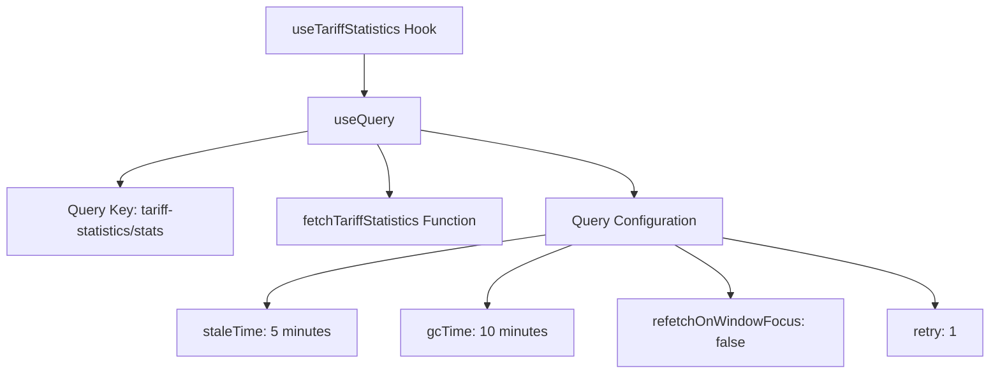
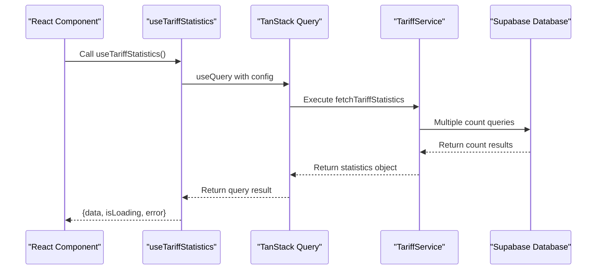
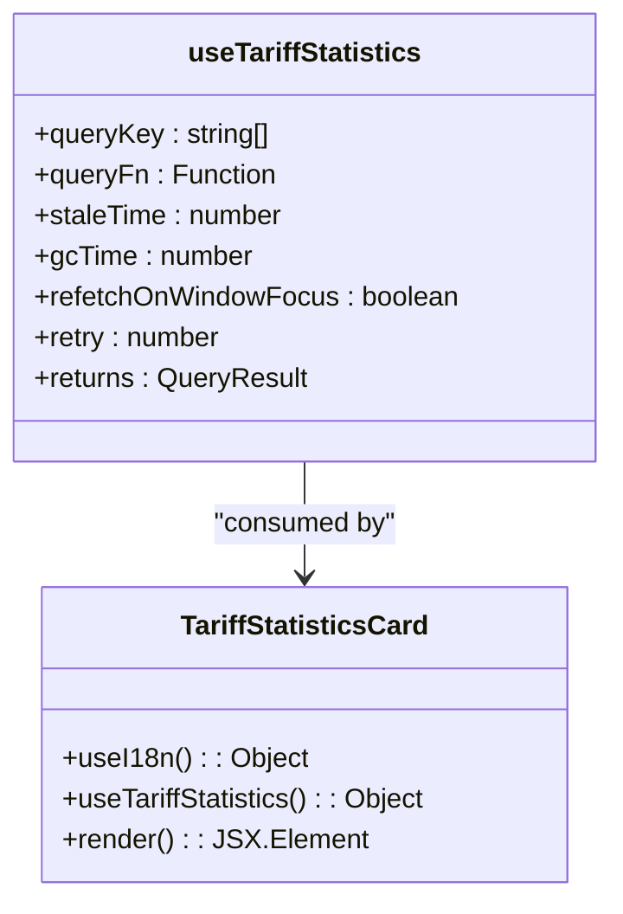
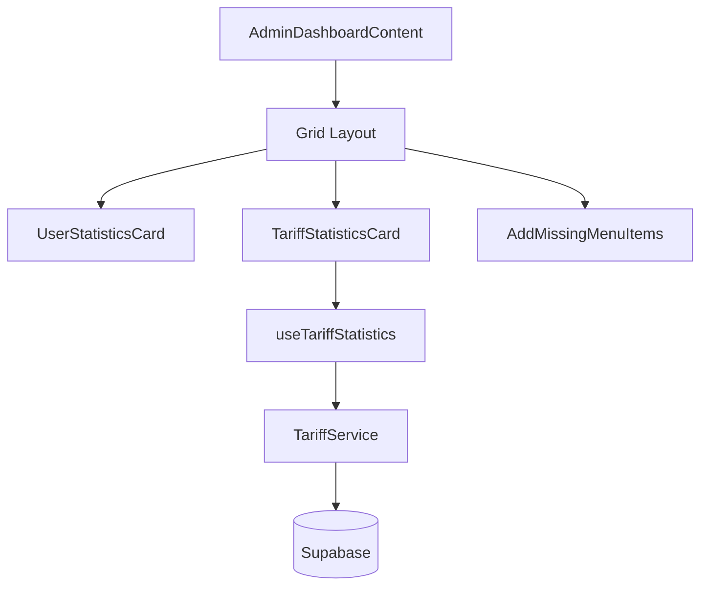

# useTariffStatistics Hook

<cite>
**Referenced Files in This Document**   
- [useTariffStatistics.ts](file://src/hooks/useTariffStatistics.ts)
- [tariff-service.ts](file://src/lib/tariff-service.ts)
- [TariffStatisticsCard.tsx](file://src/components/admin/TariffStatisticsCard.tsx)
- [AdminDashboardContent.tsx](file://src/pages/AdminDashboardContent.tsx)
</cite>

## Table of Contents
1. [Introduction](#introduction)
2. [Hook Implementation](#hook-implementation)
3. [Data Fetching Mechanism](#data-fetching-mechanism)
4. [Integration with TariffStatisticsCard](#integration-with-tariffstatisticscard)
5. [Dashboard Consumption Example](#dashboard-consumption-example)
6. [Backend Data Aggregation](#backend-data-aggregation)
7. [Caching and Data Consistency](#caching-and-data-consistency)
8. [Scalability Considerations](#scalability-considerations)

## Introduction
The `useTariffStatistics` custom hook provides subscription and tariff usage analytics for administrative dashboards in the lovable-rise application. It leverages TanStack Query to efficiently fetch and cache tariff statistics, enabling real-time monitoring of key performance indicators such as active subscriptions, churn rate, and revenue trends. This hook serves as a critical component for administrative decision-making and business intelligence.

**Section sources**
- [useTariffStatistics.ts](file://src/hooks/useTariffStatistics.ts#L1-L30)

## Hook Implementation
The `useTariffStatistics` hook is implemented using TanStack Query's `useQuery` function to manage data fetching, caching, and state. It returns a query object containing the tariff statistics data, loading state, and error information. The hook is designed with specific caching parameters to balance data freshness with performance optimization.

**Diagram sources**
- [useTariffStatistics.ts](file://src/hooks/useTariffStatistics.ts#L21-L30)

**Section sources**
- [useTariffStatistics.ts](file://src/hooks/useTariffStatistics.ts#L21-L30)

## Data Fetching Mechanism
The hook utilizes a dedicated data fetching function `fetchTariffStatistics` that calls the `TariffService.getTariffStatistics()` method. This service method executes multiple Supabase queries to aggregate tariff statistics from the database. The hook's configuration includes a stale time of 5 minutes and garbage collection time of 10 minutes, ensuring data remains reasonably fresh while minimizing unnecessary network requests.

The query key is structured hierarchically using the `tariffStatisticsQueries` object, which helps with query invalidation and refetching when needed. The `refetchOnWindowFocus` option is disabled to prevent automatic refetching when users return to the dashboard, avoiding potential performance issues and data flickering.

**Diagram sources**
- [useTariffStatistics.ts](file://src/hooks/useTariffStatistics.ts#L13-L13)
- [useTariffStatistics.ts](file://src/hooks/useTariffStatistics.ts#L21-L30)

**Section sources**
- [useTariffStatistics.ts](file://src/hooks/useTariffStatistics.ts#L13-L13)
- [useTariffStatistics.ts](file://src/hooks/useTariffStatistics.ts#L21-L30)

## Integration with TariffStatisticsCard
The `useTariffStatistics` hook is consumed by the `TariffStatisticsCard` component to display key tariff metrics in the administrative dashboard. The card component handles three states: loading, error, and success. During loading, skeleton placeholders provide visual feedback. In case of errors, a user-friendly error message is displayed with appropriate styling.

The card specifically displays the number of active tariffs, which is one of the key metrics returned by the hook. The component uses internationalization (i18n) to support multiple languages, ensuring accessibility for a global user base. The visual design includes appropriate icons and color coding to enhance data comprehension.

**Diagram sources**
- [useTariffStatistics.ts](file://src/hooks/useTariffStatistics.ts#L21-L30)
- [TariffStatisticsCard.tsx](file://src/components/admin/TariffStatisticsCard.tsx#L6-L56)

**Section sources**
- [TariffStatisticsCard.tsx](file://src/components/admin/TariffStatisticsCard.tsx#L6-L56)

## Dashboard Consumption Example
The `AdminDashboardContent` component integrates the `TariffStatisticsCard` to present tariff analytics alongside other administrative metrics. The dashboard uses a responsive grid layout that adapts to different screen sizes, ensuring optimal viewing experience across devices. The tariff statistics card occupies one column in the grid, positioned alongside user statistics and other administrative tools.

This implementation demonstrates the compositional nature of the React component architecture, where specialized components like `TariffStatisticsCard` are combined to create comprehensive dashboard views. The dashboard serves as a central hub for administrative oversight, providing immediate visibility into key business metrics.

**Diagram sources**
- [AdminDashboardContent.tsx](file://src/pages/AdminDashboardContent.tsx#L1-L31)
- [TariffStatisticsCard.tsx](file://src/components/admin/TariffStatisticsCard.tsx#L6-L56)

**Section sources**
- [AdminDashboardContent.tsx](file://src/pages/AdminDashboardContent.tsx#L1-L31)

## Backend Data Aggregation
The tariff statistics are derived from the Supabase database using direct count queries on the tariffs table. The `getTariffStatistics` method in `TariffService` executes three separate count operations: total tariffs, active tariffs, and free tariffs. These counts are then used to calculate additional metrics such as paid tariffs.

The implementation relies on Supabase's efficient counting capabilities rather than materialized views, suggesting that the dataset size is manageable with direct queries. The counting is performed with specific filters (e.g., `is_active = true`, `is_free = true`) to categorize tariffs appropriately. This approach provides accurate, up-to-date statistics without the complexity of maintaining separate aggregation tables.

**Section sources**
- [tariff-service.ts](file://src/lib/tariff-service.ts#L702-L738)

## Caching and Data Consistency
The application employs a multi-layer caching strategy to optimize performance. While the `useTariffStatistics` hook manages client-side caching with TanStack Query, the system also includes a separate `TariffCache` class for caching full tariff data. This dual caching approach reduces database load and improves response times.

Data inconsistency can occur due to caching delays, particularly when tariff configurations are modified through administrative interfaces. The system addresses this by explicitly clearing caches when data is updated, as seen in the `AdminTariffManagement` component's refresh functionality. However, there is a potential window of inconsistency between when data is updated and when caches expire or are cleared.

Mitigation strategies include:
- Implementing cache invalidation after write operations
- Using appropriate stale times based on data criticality
- Providing manual refresh options for administrators
- Monitoring cache hit rates and adjusting strategies accordingly

**Section sources**
- [tariff-service.ts](file://src/lib/tariff-service.ts#L702-L738)
- [tariff-cache.ts](file://src/lib/tariff-cache.ts#L1-L46)

## Scalability Considerations
For large datasets, the current implementation may face performance challenges as count queries on large tables can become slow. Potential scalability improvements include:

1. **Materialized Views**: Implementing materialized views in Supabase that pre-compute tariff statistics, updated on a schedule or through triggers.

2. **Real-time Streaming**: Utilizing Supabase's real-time capabilities to push updates to tariff statistics, reducing the need for polling.

3. **Database Indexing**: Ensuring appropriate indexes on filtering columns (is_active, is_free) to optimize count query performance.

4. **Caching Strategy Optimization**: Implementing more sophisticated caching with cache warming and pre-fetching strategies.

5. **Alternative Aggregation Methods**: Using database triggers to maintain running totals in a separate statistics table, updated on each tariff modification.

The current 5-minute stale time represents a reasonable balance between data freshness and performance, but this could be adjusted based on specific business requirements and usage patterns.