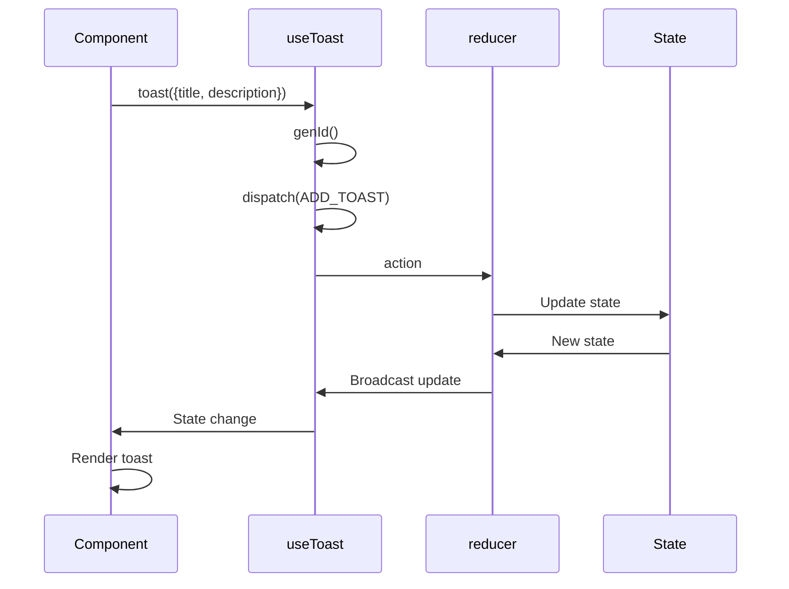

# useToast Hook

<cite>
**Referenced Files in This Document**   
- [use-toast.ts](file://src/hooks/use-toast.ts)
- [toaster.tsx](file://src/components/ui/toaster.tsx)
- [sonner.tsx](file://src/components/ui/sonner.tsx)
- [App.tsx](file://src/App.tsx)
</cite>

## Table of Contents
1. [Introduction](#introduction)
2. [Architecture Overview](#architecture-overview)
3. [Core Components](#core-components)
4. [Implementation Details](#implementation-details)
5. [Usage Examples](#usage-examples)
6. [Common Issues and Solutions](#common-issues-and-solutions)
7. [Customization Options](#customization-options)
8. [Conclusion](#conclusion)

## Introduction

The `useToast` custom hook provides a global toast notification system for the lovable-rise application, enabling components to display transient feedback messages to users. This hook implements an in-memory state management solution with a listener pattern that allows multiple components to dispatch and receive toast updates. The system integrates with the Sonner library to provide visually appealing notifications with configurable behavior. The hook exposes essential methods like `toast()` for triggering notifications and `dismiss()` for clearing them, making it easy for components to provide user feedback across the application.

## Architecture Overview

The toast notification system follows a publish-subscribe pattern where the `useToast` hook acts as both publisher and subscriber. The architecture consists of a central state management system that broadcasts updates to all registered listeners (components using the hook). This design enables global toast coordination while maintaining React's reactivity principles.

```mermaid
graph TD
A[Component] --> |Calls| B[toast() function]
B --> C[dispatch Action]
C --> D[reducer Function]
D --> E[Update memoryState]
E --> F[Broadcast to Listeners]
F --> G[Component State Update]
G --> H[Render Toast UI]
I[Toaster Component] --> |Subscribes| J[useToast Hook]
J --> |Receives| F
```

**Diagram sources**
- [use-toast.ts](file://src/hooks/use-toast.ts)
- [toaster.tsx](file://src/components/ui/toaster.tsx)

**Section sources**
- [use-toast.ts](file://src/hooks/use-toast.ts)
- [App.tsx](file://src/App.tsx)

## Core Components

The toast system comprises several key components that work together to provide a seamless notification experience. The `useToast` hook manages the state and provides the API for components to interact with the toast system. The `Toaster` component renders the toast notifications in the UI by subscribing to the toast state. The system also integrates with the Sonner library for enhanced styling and theming capabilities. These components are initialized in the main application component, ensuring global availability throughout the application.

**Section sources**
- [use-toast.ts](file://src/hooks/use-toast.ts#L170-L188)
- [toaster.tsx](file://src/components/ui/toaster.tsx#L10-L32)
- [sonner.tsx](file://src/components/ui/sonner.tsx#L7-L28)

## Implementation Details

The `useToast` hook implements a sophisticated state management system using React's useState and useEffect hooks. It maintains a global memory state (`memoryState`) that persists across component re-renders. The hook registers itself as a listener in the `listeners` array during component mount and removes itself during unmount, preventing memory leaks. The `dispatch` function updates the global state and notifies all listeners of changes. The `toast` function generates unique IDs for each notification and manages their lifecycle, including automatic removal after a specified delay. The reducer function handles different toast actions like adding, updating, dismissing, and removing notifications according to the defined action types.



**Diagram sources**
- [use-toast.ts](file://src/hooks/use-toast.ts#L141-L168)
- [use-toast.ts](file://src/hooks/use-toast.ts#L132-L137)

**Section sources**
- [use-toast.ts](file://src/hooks/use-toast.ts#L51-L191)

## Usage Examples

Components can easily integrate toast notifications by importing and using the `useToast` hook. The most common usage pattern involves destructuring the `toast` function from the hook and calling it with configuration options. Components typically trigger toasts in response to user actions or asynchronous operations like API calls. The hook can be used in various contexts, such as form submissions, data updates, or error handling scenarios.

```mermaid
flowchart TD
A[Component Mount] --> B[Import useToast]
B --> C[Destructure toast function]
C --> D[Call toast() with options]
D --> E[Toast appears in UI]
E --> F[Auto-dismiss or user-dismiss]
F --> G[Toast removed from state]
```

**Diagram sources**
- [use-toast.ts](file://src/hooks/use-toast.ts#L141-L168)
- [CreateUserDialog.tsx](file://src/components/admin/CreateUserDialog.tsx#L46-L257)

**Section sources**
- [use-toast.ts](file://src/hooks/use-toast.ts#L141-L168)
- [CreateUserDialog.tsx](file://src/components/admin/CreateUserDialog.tsx#L46-L257)
- [FormPage.tsx](file://src/pages/page-types/FormPage.tsx#L26-L132)

## Common Issues and Solutions

The toast system addresses several common issues in notification management. Memory leaks are prevented by properly cleaning up listeners in the useEffect cleanup function. Race conditions in rapid toast updates are mitigated by the reducer's atomic state updates and the toast limit configuration. The system handles concurrent toast operations by queuing updates and ensuring consistent state transitions. For scenarios with frequent toast triggers, the implementation includes timeout management to prevent resource accumulation.

**Section sources**
- [use-toast.ts](file://src/hooks/use-toast.ts#L170-L188)
- [use-toast.ts](file://src/hooks/use-toast.ts#L100-L120)

## Customization Options

The toast system provides several customization options through the configuration object passed to the `toast()` function. Developers can customize the appearance and behavior of notifications by specifying options like duration, variant (success, error, etc.), and callback functions. The integration with Sonner allows for theme-aware styling that adapts to the application's current theme. Additional customization can be achieved by extending the toast options with custom actions or styling classes.

**Section sources**
- [use-toast.ts](file://src/hooks/use-toast.ts#L141-L168)
- [sonner.tsx](file://src/components/ui/sonner.tsx#L7-L28)

## Conclusion

The `useToast` hook provides a robust and flexible solution for global toast notifications in the lovable-rise application. Its implementation of in-memory state management with a listener pattern ensures efficient communication between components while maintaining React's reactivity principles. The integration with Sonner enhances the visual appeal and theming capabilities of the notifications. By exposing a simple API through the `toast()` and `dismiss()` methods, the hook makes it easy for components to provide timely feedback to users. The system effectively addresses common issues like memory leaks and race conditions, making it a reliable component of the application's user experience.