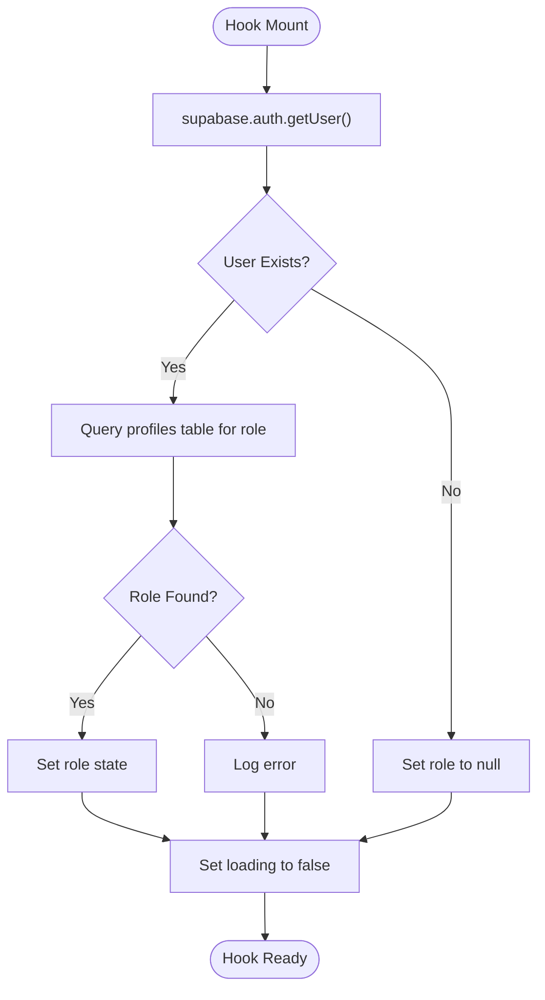
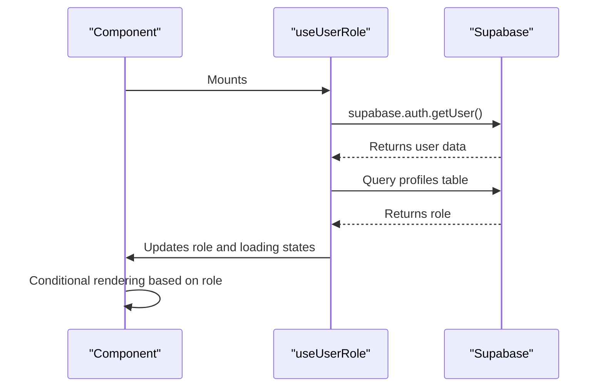

# useUserRole Hook

<cite>
**Referenced Files in This Document**   
- [useUserRole.ts](file://src/hooks/useUserRole.ts)
- [client.ts](file://src/integrations/supabase/client.ts)
- [profile-service.ts](file://src/lib/profile-service.ts)
- [ProtectedRoutes.tsx](file://src/components/ProtectedRoutes.tsx)
- [AdminLayout.tsx](file://src/components/AdminLayout.tsx)
</cite>

## Table of Contents
1. [Introduction](#introduction)
2. [Implementation Details](#implementation-details)
3. [Usage Examples](#usage-examples)
4. [Supabase Integration](#supabase-integration)
5. [Common Issues and Best Practices](#common-issues-and-best-practices)
6. [Performance Considerations](#performance-considerations)
7. [Conclusion](#conclusion)

## Introduction
The `useUserRole` custom hook is a React hook designed to retrieve and manage user role information in the lovable-rise application. It leverages React's `useState` and `useEffect` hooks to fetch the authenticated user's role from the Supabase 'profiles' table via Supabase Auth and database integration. This hook is essential for role-based access control, enabling components to conditionally render UI based on the user's role.

**Section sources**
- [useUserRole.ts](file://src/hooks/useUserRole.ts#L3-L33)

## Implementation Details
The `useUserRole` hook initializes two state variables: `role` and `loading`. The `role` state holds the user's role, defaulting to `null`, while the `loading` state tracks the data fetching process, initially set to `true`. The hook uses `useEffect` to execute an asynchronous function `fetchRole` when the component mounts. This function first retrieves the authenticated user using `supabase.auth.getUser()`. If a user is found, it queries the 'profiles' table to select the user's role based on their ID. On successful retrieval, the role is set in the state, and the loading state is set to `false` in the `finally` block, ensuring it updates regardless of the outcome.

**Diagram sources**
- [useUserRole.ts](file://src/hooks/useUserRole.ts#L3-L33)

**Section sources**
- [useUserRole.ts](file://src/hooks/useUserRole.ts#L3-L33)

## Usage Examples
The `useUserRole` hook is utilized in components like `AdminRoute` and `UserRoute` within `ProtectedRoutes.tsx` to control access based on user roles. For instance, `AdminRoute` checks if the user's role is 'admin' or 'manager'; if not, it redirects to the user dashboard. Similarly, `UserRoute` redirects users with 'admin' or 'manager' roles to the admin dashboard. The hook is also integral to `AdminLayout.tsx`, where it helps in rendering the admin interface by fetching the user's profile and role, ensuring only authorized users access admin functionalities.

**Diagram sources**
- [ProtectedRoutes.tsx](file://src/components/ProtectedRoutes.tsx#L3-L22)
- [ProtectedRoutes.tsx](file://src/components/ProtectedRoutes.tsx#L24-L43)
- [AdminLayout.tsx](file://src/components/AdminLayout.tsx#L100-L150)

**Section sources**
- [ProtectedRoutes.tsx](file://src/components/ProtectedRoutes.tsx#L3-L43)
- [AdminLayout.tsx](file://src/components/AdminLayout.tsx#L100-L150)

## Supabase Integration
The `useUserRole` hook depends on the Supabase client, which is configured in `client.ts` with the Supabase URL and publishable key. The integration with Supabase Auth allows the hook to authenticate users and access the 'profiles' table. Row Level Security (RLS) policies in Supabase ensure that users can only access their own profile data, enhancing security. The hook's reliance on Supabase's real-time capabilities ensures that role information is up-to-date, reflecting any changes made in the database.

**Section sources**
- [client.ts](file://src/integrations/supabase/client.ts#L1-L30)
- [profile-service.ts](file://src/lib/profile-service.ts#L324-L368)

## Common Issues and Best Practices
A common issue with `useUserRole` is race conditions during authentication state changes, where the hook might fetch role data before the user is fully authenticated. To mitigate this, ensure that the authentication state is stable before invoking the hook. Handling null roles or unauthenticated states gracefully is crucial; the hook should provide a default role or redirect users to a login page. Best practices include validating the user's session before fetching role data and using error boundaries to catch and handle exceptions.

**Section sources**
- [useUserRole.ts](file://src/hooks/useUserRole.ts#L3-L33)
- [profile-service.ts](file://src/lib/profile-service.ts#L324-L368)

## Performance Considerations
The `useUserRole` hook lacks caching beyond the component mount, leading to potential refetching on remount. This can impact performance, especially in applications with frequent component re-renders. To optimize, consider implementing a caching mechanism, such as storing the role in a context or using a state management library. Additionally, debouncing or throttling the role fetch operation can reduce unnecessary database queries, improving overall application performance.

**Section sources**
- [useUserRole.ts](file://src/hooks/useUserRole.ts#L3-L33)

## Conclusion
The `useUserRole` hook is a vital component for managing user roles in the lovable-rise application, enabling secure and dynamic UI rendering based on user permissions. Its integration with Supabase provides a robust foundation for authentication and authorization, while careful consideration of common issues and performance optimizations ensures a smooth user experience. By following best practices and leveraging Supabase's features, developers can build scalable and secure applications.