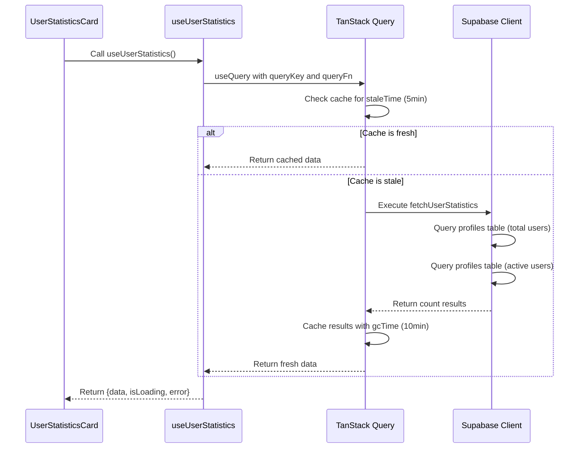
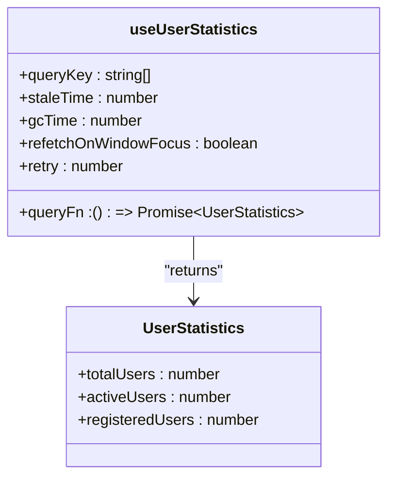
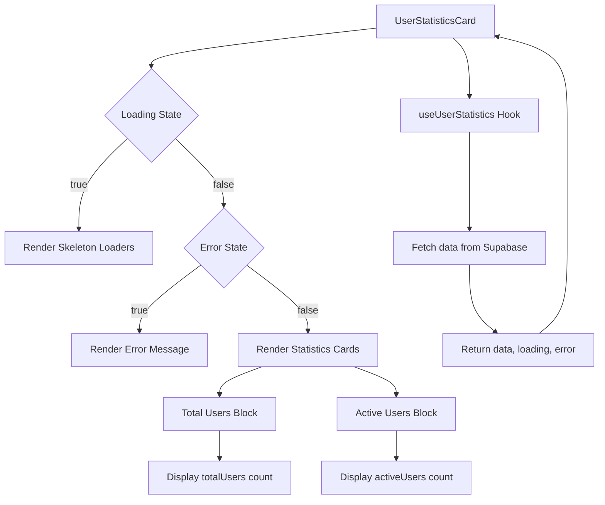
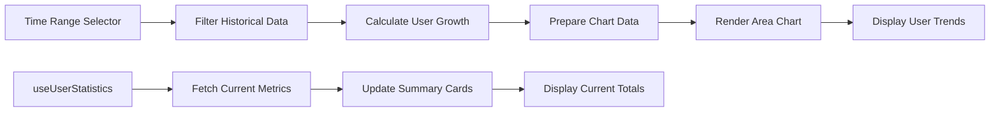

# useUserStatistics Hook

<cite>
**Referenced Files in This Document**   
- [useUserStatistics.ts](file://src/hooks/useUserStatistics.ts)
- [UserStatisticsCard.tsx](file://src/components/admin/UserStatisticsCard.tsx)
- [chart-area-interactive.tsx](file://src/components/chart-area-interactive.tsx)
- [users/index.ts](file://supabase/functions/users/index.ts)
</cite>

## Table of Contents
1. [Introduction](#introduction)
2. [Implementation Details](#implementation-details)
3. [Data Shape and Structure](#data-shape-and-structure)
4. [Integration with UserStatisticsCard](#integration-with-userstatisticscard)
5. [Backend Aggregation and Supabase RPC](#backend-aggregation-and-supabase-rpc)
6. [Practical Example with Chart Rendering](#practical-example-with-chart-rendering)
7. [Common Issues and Cache Invalidation](#common-issues-and-cache-invalidation)
8. [Performance Considerations](#performance-considerations)
9. [Conclusion](#conclusion)

## Introduction
The `useUserStatistics` custom hook is a React hook designed to retrieve aggregated user metrics for dashboard visualization in the lovable-rise application. It leverages TanStack Query (formerly React Query) to manage data fetching, caching, and background refetching for user statistics. The hook provides real-time insights into user base metrics such as total users, active users, and registration trends, which are essential for administrative decision-making and system monitoring.

**Section sources**
- [useUserStatistics.ts](file://src/hooks/useUserStatistics.ts#L1-L50)

## Implementation Details
The `useUserStatistics` hook is implemented using TanStack Query's `useQuery` function, which handles the data fetching lifecycle, caching strategy, and background updates. The hook uses a dedicated query key generated by the `statisticsQueries.userStats()` function, which creates a unique identifier for the user statistics query. This query key enables efficient cache management and targeted invalidation when needed.

The data fetching is performed by the `fetchUserStatistics` function, which makes two separate Supabase queries to the `profiles` table: one to count all users with the 'user' role and another to count only active users. The hook is configured with a stale time of 5 minutes and a garbage collection time of 10 minutes, meaning the data is considered fresh for 5 minutes before being marked as stale and potentially refetched. Background refetching on window focus is disabled to prevent unnecessary network requests when users return to the application.

**Diagram sources**
- [useUserStatistics.ts](file://src/hooks/useUserStatistics.ts#L16-L39)

**Section sources**
- [useUserStatistics.ts](file://src/hooks/useUserStatistics.ts#L1-L50)

## Data Shape and Structure
The `useUserStatistics` hook returns a well-defined data structure that represents key user metrics for the application. The returned object conforms to the `UserStatistics` interface, which includes three primary properties: `totalUsers`, `activeUsers`, and `registeredUsers`. The `totalUsers` field represents the count of all users with the 'user' role in the system, regardless of their status. The `activeUsers` field specifically counts users who have both the 'user' role and an 'active' status, providing insight into the currently engaged user base.

Currently, the `registeredUsers` field is implemented as an alias for `totalUsers`, suggesting that all registered users are counted in the total user count. This data shape is designed to support various dashboard visualizations, including summary cards, trend charts, and comparative analytics. The numeric values are guaranteed to be non-null through the use of nullish coalescing operators in the fetch function, ensuring consistent data presentation even when queries return undefined counts.

**Diagram sources**
- [useUserStatistics.ts](file://src/hooks/useUserStatistics.ts#L4-L14)

**Section sources**
- [useUserStatistics.ts](file://src/hooks/useUserStatistics.ts#L4-L14)

## Integration with UserStatisticsCard
The `useUserStatistics` hook is directly integrated with the `UserStatisticsCard` component, which renders the user metrics in a visually appealing dashboard card format. The component consumes the hook's return value, which includes the `data`, `isLoading`, and `error` states, allowing it to provide appropriate user feedback during different loading scenarios. When data is being fetched, the component displays skeleton loaders to maintain a smooth user experience. If an error occurs during the fetch operation, the component renders an error state with descriptive messaging.

The `UserStatisticsCard` component displays two primary metrics: total users and active users, each presented in a separate card block with appropriate icons and labels. The component uses internationalization through the `useI18n` hook to display localized text for "total_users" and "active_users". The visual design includes responsive styling that adapts to different screen sizes, with larger text and spacing on desktop views. The component's grid layout ensures that the statistics are displayed side by side on larger screens and stacked vertically on mobile devices.

**Diagram sources**
- [UserStatisticsCard.tsx](file://src/components/admin/UserStatisticsCard.tsx#L7-L85)

**Section sources**
- [UserStatisticsCard.tsx](file://src/components/admin/UserStatisticsCard.tsx#L7-L85)

## Backend Aggregation and Supabase RPC
The `useUserStatistics` hook relies on direct Supabase client queries to the `profiles` table for user statistics aggregation. The frontend implementation makes two separate count queries to the database: one to count all users with the 'user' role and another to count users with both the 'user' role and 'active' status. These queries use Supabase's count functionality with the `exact` count type and `head` option to optimize performance by returning only the count without the actual data.

While the current implementation performs aggregation on the client side through direct table queries, the codebase contains Supabase Edge Functions in the `supabase/functions/users/index.ts` file that suggest a more sophisticated backend architecture for user management. These functions include administrative operations for user creation, updates, and deletion, as well as permission checks for admin access. The presence of these functions indicates that user data integrity and access control are managed through serverless functions, which could potentially be extended to include more complex aggregation queries or real-time statistics updates in the future.

**Section sources**
- [useUserStatistics.ts](file://src/hooks/useUserStatistics.ts#L16-L39)
- [users/index.ts](file://supabase/functions/users/index.ts#L1-L489)

## Practical Example with Chart Rendering
Although the `useUserStatistics` hook currently provides aggregate counts rather than time-series data, its design principles can be extended to support chart rendering components like `chart-area-interactive.tsx`. The `ChartAreaInteractive` component demonstrates how time-series data can be visualized with interactive controls for different time ranges (90 days, 30 days, 7 days). While this specific chart uses mock data for visitor analytics, a similar approach could be applied to user growth metrics by modifying the data source to use historical user statistics.

To integrate user statistics with a time-series chart, the application would need to implement a backend function that aggregates user registration data over time periods (daily, weekly, monthly). This data could then be fetched by a custom hook similar to `useUserStatistics` but designed for time-series data. The chart component could display user growth trends, showing how the total user count and active user count have evolved over time, with interactive controls allowing administrators to focus on specific time periods of interest.

**Diagram sources**
- [chart-area-interactive.tsx](file://src/components/chart-area-interactive.tsx#L138-L291)

**Section sources**
- [chart-area-interactive.tsx](file://src/components/chart-area-interactive.tsx#L138-L291)

## Common Issues and Cache Invalidation
One potential issue with the current `useUserStatistics` implementation is delayed metric updates following user creation or status changes. Since the data is cached for 5 minutes with no automatic refetching on window focus, administrators may not see immediate updates to user statistics after performing user management operations. This delay could lead to confusion when verifying that user operations have been successfully completed.

To address this issue, the application should implement targeted cache invalidation strategies. When a new user is created or an existing user's status is changed through administrative functions, the `statisticsQueries.userStats()` cache should be invalidated to trigger an immediate refetch of the updated statistics. This can be achieved by calling `queryClient.invalidateQueries(statisticsQueries.userStats())` after successful user operations. Additionally, the application could implement WebSocket-based real-time updates or polling mechanisms for critical administrative views where up-to-the-minute statistics are essential.

**Section sources**
- [useUserStatistics.ts](file://src/hooks/useUserStatistics.ts#L40-L50)

## Performance Considerations
The `useUserStatistics` hook is designed with performance optimization in mind, using TanStack Query's caching mechanisms to minimize unnecessary network requests. The 5-minute stale time strikes a balance between data freshness and network efficiency, preventing excessive polling of the database. The garbage collection time of 10 minutes ensures that unused data is cleaned up from memory, preventing memory leaks in long-running applications.

However, the current implementation makes two separate database queries for each fetch operation, which could be optimized by combining them into a single query with conditional counting. This would reduce the database load and improve response times, especially as the user base grows. For applications requiring more frequent updates, implementing delta updates or real-time subscriptions could further enhance performance by only transmitting changes rather than full counts on each refresh. The disabled `refetchOnWindowFocus` setting is a deliberate performance optimization that prevents unnecessary refetching when users switch between browser tabs.

**Section sources**
- [useUserStatistics.ts](file://src/hooks/useUserStatistics.ts#L40-L50)

## Conclusion
The `useUserStatistics` hook provides a robust solution for retrieving and displaying user metrics in the lovable-rise application. By leveraging TanStack Query's powerful caching and background update capabilities, the hook delivers a seamless user experience with minimal network overhead. The integration with the `UserStatisticsCard` component demonstrates effective pattern for presenting key metrics in an accessible and visually appealing format. While the current implementation focuses on basic user counts, the architecture is extensible and could be enhanced with time-series data, real-time updates, and more sophisticated aggregation queries to meet evolving dashboard requirements.