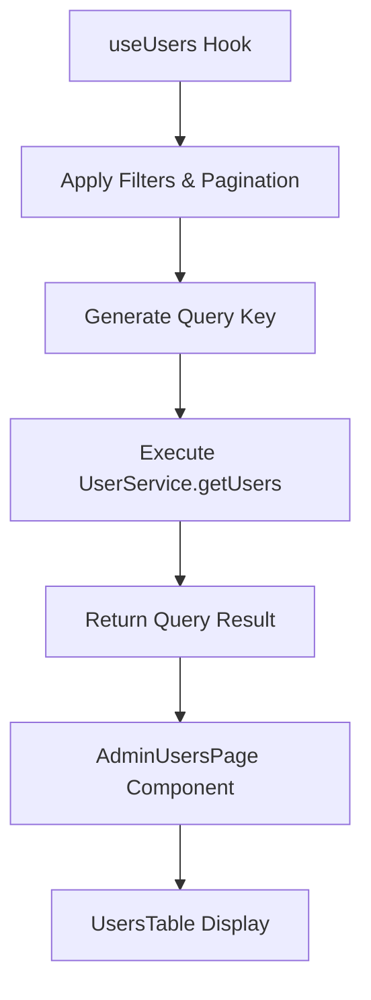
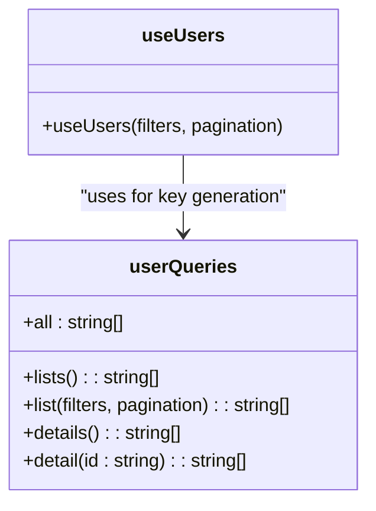
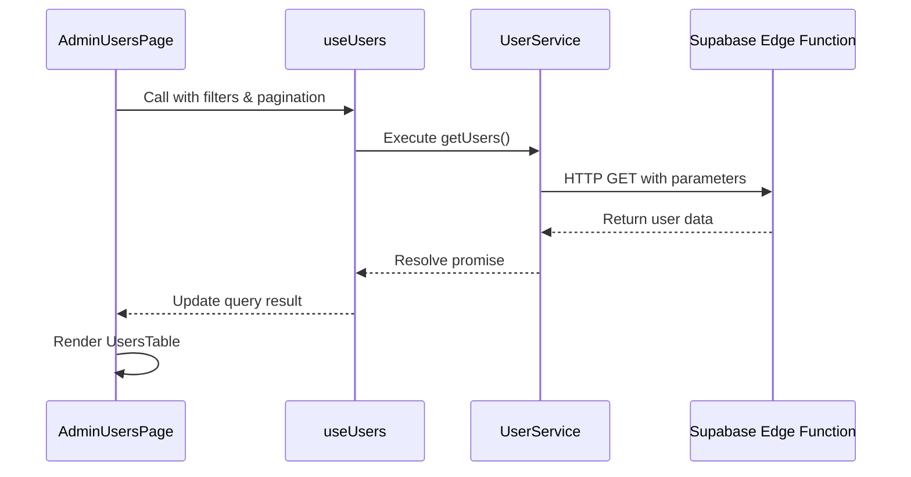

# useUsers Hook

<cite>
**Referenced Files in This Document**   
- [useUsers.ts](file://src/hooks/useUsers.ts)
- [user-service.ts](file://src/lib/user-service.ts)
- [AdminUsersPage.tsx](file://src/pages/admin/AdminUsersPage.tsx)
- [UsersTable.tsx](file://src/components/admin/UsersTable.tsx)
</cite>

## Table of Contents
1. [Introduction](#introduction)
2. [Core Functionality](#core-functionality)
3. [Query Key Generation](#query-key-generation)
4. [Caching and Refetching Strategy](#caching-and-refetching-strategy)
5. [Integration with Admin Interface](#integration-with-admin-interface)
6. [Backend Integration](#backend-integration)
7. [Data Freshness and Mutation Handling](#data-freshness-and-mutation-handling)
8. [Performance Optimization](#performance-optimization)
9. [Conclusion](#conclusion)

## Introduction

The `useUsers` custom hook provides paginated and filtered access to user data within the admin interface of the lovable-rise application. Built on TanStack Query, it enables efficient data fetching, caching, and state management for user listings. This hook serves as the primary interface between the admin UI components and the backend user management system, supporting complex filtering, sorting, and pagination requirements.

**Section sources**
- [useUsers.ts](file://src/hooks/useUsers.ts#L69-L78)

## Core Functionality

The `useUsers` hook leverages TanStack Query's `useQuery` to fetch user data through the `UserService.getUsers` method. It accepts two primary parameters: `filters` and `pagination`, allowing for dynamic data retrieval based on user interface interactions.

The hook supports multiple filtering options including search text, status (active/inactive), role (user/admin/manager), and sorting criteria. Pagination is implemented with configurable page numbers and limits, enabling efficient loading of large datasets. The hook returns a standard TanStack Query result object containing data, loading state, error information, and refetch functionality.

**Diagram sources**
- [useUsers.ts](file://src/hooks/useUsers.ts#L69-L78)
- [user-service.ts](file://src/lib/user-service.ts#L83-L131)

**Section sources**
- [useUsers.ts](file://src/hooks/useUsers.ts#L69-L78)
- [user-service.ts](file://src/lib/user-service.ts#L83-L131)

## Query Key Generation

The hook utilizes a sophisticated query key generation system through the `userQueries` object, which creates unique, deterministic keys based on the provided filters and pagination parameters. This approach enables TanStack Query to properly cache and deduplicate requests.

The query key structure follows a hierarchical pattern:
- Base key: `["users"]`
- List scope: `["users", "list"]`
- Full key: `["users", "list", filters, pagination]`

This structure allows for effective cache invalidation at different levels. For example, when a user is created or updated, the system can invalidate all list queries without affecting individual user detail queries.

**Diagram sources**
- [useUsers.ts](file://src/hooks/useUsers.ts#L59-L66)

**Section sources**
- [useUsers.ts](file://src/hooks/useUsers.ts#L59-L66)

## Caching and Refetching Strategy

The hook implements a carefully designed caching strategy with specific time-to-live values to balance data freshness and performance:

- **Stale time**: 5 minutes (300,000 milliseconds)
- **Garbage collection time**: 10 minutes (600,000 milliseconds)
- **Refetch on window focus**: Disabled

The 5-minute stale time ensures that user data remains responsive while still providing reasonably fresh information. After this period, subsequent requests will automatically trigger a background refetch. The 10-minute garbage collection time allows cached data to persist long enough to be useful while preventing memory bloat.

Disabling refetch on window focus prevents unnecessary network requests when users switch between browser tabs, improving both performance and user experience. This is particularly important in an admin interface where users may frequently switch between multiple applications.

Additionally, the hook employs a minimum delay wrapper (`withMinimumDelay`) that ensures a minimum 300ms loading time, preventing unpleasant loading state flicker for fast requests.

**Section sources**
- [useUsers.ts](file://src/hooks/useUsers.ts#L69-L78)
- [useUsers.ts](file://src/hooks/useUsers.ts#L50-L56)

## Integration with Admin Interface

The `useUsers` hook is primarily consumed by the `AdminUsersPage` component, which provides a comprehensive user management interface. This integration demonstrates the hook's practical application in a real-world scenario.

The `AdminUsersPage` uses the hook to populate a `UsersTable` component, passing the fetched data along with callback functions for various user actions. The page implements a complete filtering and search interface, allowing administrators to:

- Search users by name or email
- Filter by status (active/inactive)
- Filter by role (user/admin/manager)
- Sort by various criteria (creation date, name, email)
- Navigate through paginated results

When filters or pagination change, the component automatically updates the parameters passed to `useUsers`, triggering a new data fetch with the updated criteria.

**Diagram sources**
- [AdminUsersPage.tsx](file://src/pages/admin/AdminUsersPage.tsx#L49-L348)
- [UsersTable.tsx](file://src/components/admin/UsersTable.tsx#L247-L412)

**Section sources**
- [AdminUsersPage.tsx](file://src/pages/admin/AdminUsersPage.tsx#L49-L348)
- [UsersTable.tsx](file://src/components/admin/UsersTable.tsx#L247-L412)

## Backend Integration

The `useUsers` hook integrates with the application's backend through Supabase Edge Functions, specifically the users function endpoint. The `UserService.getUsers` method constructs HTTP requests with appropriate authentication headers and query parameters.

Key integration aspects include:
- Authentication via Bearer tokens from Supabase session
- Query parameter encoding for filters and pagination
- Direct fetch API calls to the Edge Function endpoint
- Response parsing and error handling
- Row Level Security (RLS) enforcement on the backend

The Edge Function architecture allows for custom business logic and security rules to be applied at the database level, ensuring that only authorized administrators can access user data. RLS policies prevent unauthorized data access even if the API endpoint is compromised.

**Section sources**
- [user-service.ts](file://src/lib/user-service.ts#L83-L131)

## Data Freshness and Mutation Handling

A critical aspect of the `useUsers` implementation is maintaining data consistency after mutations (create, update, delete operations). The application addresses the common issue of stale data through a comprehensive query invalidation strategy.

When user mutations occur through related hooks (`useCreateUser`, `useUpdateUser`, `useDeleteUser`, `useToggleUserStatus`), the system automatically invalidates the user list queries, triggering a refetch of the latest data. This ensures that the UI reflects the current state of the database.

The invalidation occurs in the `onSuccess` callbacks of mutation hooks, using the query client to invalidate queries with the `userQueries.lists()` key. This approach provides immediate visual feedback to administrators while ensuring data accuracy.

For status toggling operations, the application implements an optimistic update pattern in the `useToggleUserStatus` mutation, which immediately updates the UI state before the server response, providing a responsive user experience.

**Section sources**
- [useUsers.ts](file://src/hooks/useUsers.ts#L226-L226)
- [useUsers.ts](file://src/hooks/useUsers.ts#L101-L125)
- [AdminUsersPage.tsx](file://src/pages/admin/AdminUsersPage.tsx#L111-L119)

## Performance Optimization

The `useUsers` hook incorporates several performance optimization techniques to ensure a smooth user experience:

1. **Debounced filtering**: While not explicitly implemented in the hook itself, the component integration allows for potential debounce strategies on search input to prevent excessive API calls during typing.

2. **Efficient database filtering**: All filtering operations are pushed to the database level through query parameters, minimizing data transfer and reducing client-side processing.

3. **Pagination**: Data is loaded in chunks rather than all at once, reducing initial load time and memory usage.

4. **Caching strategy**: The 5-minute stale time and 10-minute GC time balance freshness with performance, reducing redundant network requests.

5. **Loading state management**: The `withMinimumDelay` wrapper prevents loading state flicker, creating a more polished user experience.

6. **Prefetching capabilities**: The complementary `usePrefetchUsers` hook allows for proactive data loading, anticipating user navigation patterns.

These optimizations work together to create a responsive admin interface capable of handling large user datasets efficiently.

**Section sources**
- [useUsers.ts](file://src/hooks/useUsers.ts#L50-L56)
- [useUsers.ts](file://src/hooks/useUsers.ts#L208-L225)

## Conclusion

The `useUsers` custom hook provides a robust, efficient solution for managing user data in the lovable-rise application's admin interface. By leveraging TanStack Query's powerful caching and state management capabilities, it delivers a responsive user experience while maintaining data consistency.

The hook's design effectively separates concerns, with clear responsibilities for data fetching, caching, and UI integration. Its flexible parameter system supports complex filtering and pagination requirements, while the integration with Supabase Edge Functions and RLS policies ensures secure data access.

For optimal performance, administrators should be aware of the caching behavior and consider manual refetching when immediate data freshness is required. The comprehensive mutation handling system ensures that most updates are automatically reflected in the UI, maintaining data consistency across the application.