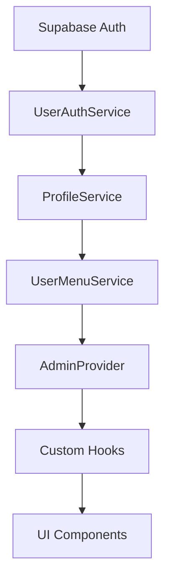
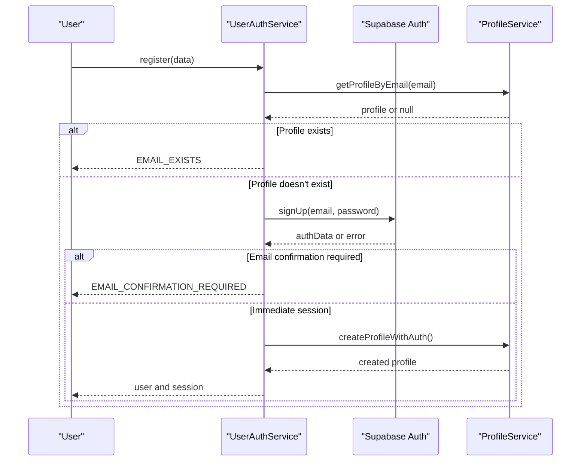
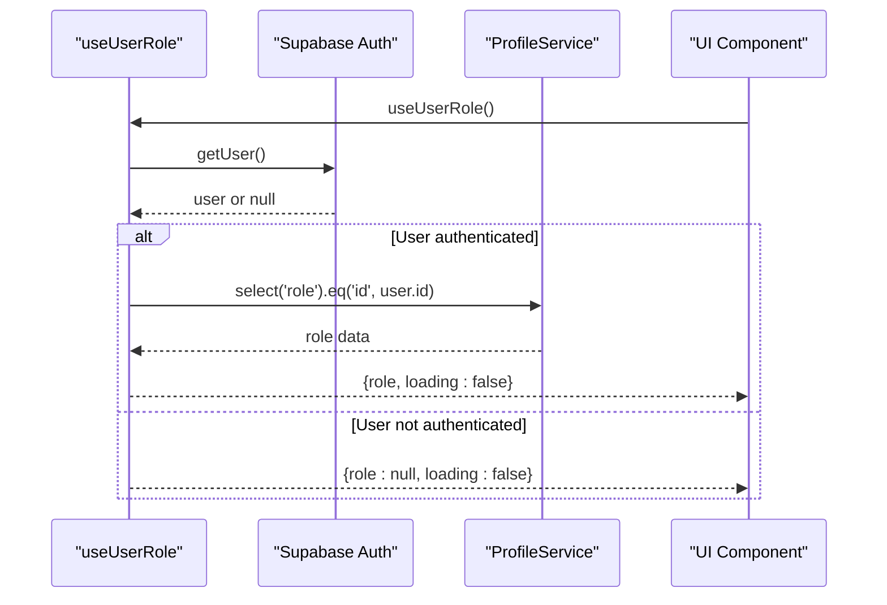
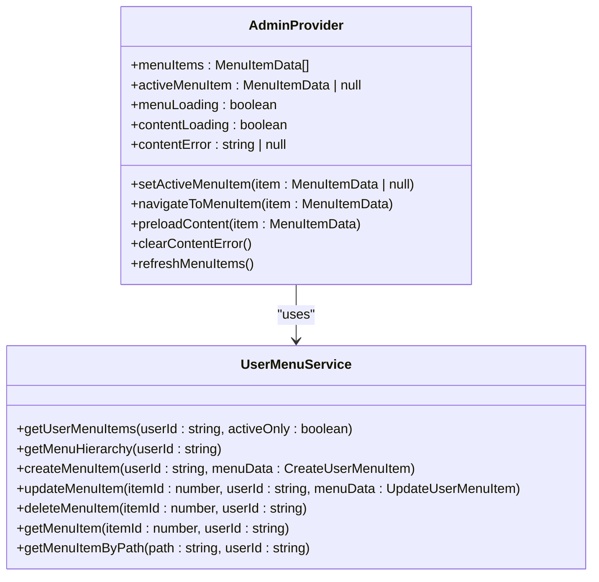
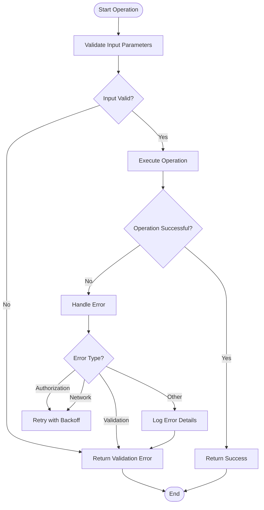
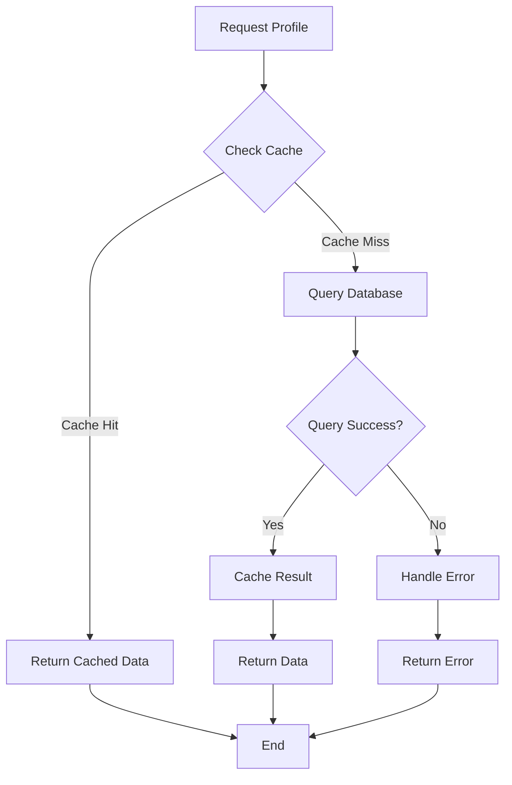
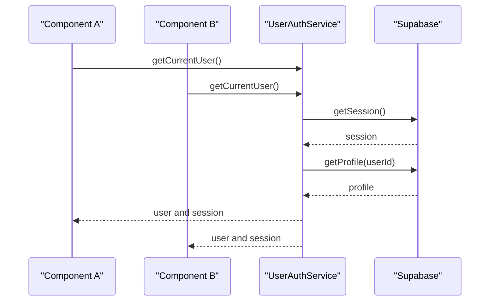

# State Flow Patterns

<cite>
**Referenced Files in This Document**   
- [user-auth-service.ts](file://src/lib/user-auth-service.ts)
- [profile-service.ts](file://src/lib/profile-service.ts)
- [user-menu-service.ts](file://src/lib/user-menu-service.ts)
- [useUserRole.ts](file://src/hooks/useUserRole.ts)
- [admin-provider.tsx](file://src/providers/admin-provider.tsx)
- [session-validation.ts](file://src/lib/session-validation.ts)
- [menu-content/index.ts](file://supabase/functions/menu-content/index.ts)
</cite>

## Table of Contents
1. [Introduction](#introduction)
2. [State Flow Architecture](#state-flow-architecture)
3. [Authentication State Flow](#authentication-state-flow)
4. [Role Management and Authorization](#role-management-and-authorization)
5. [Menu State Management](#menu-state-management)
6. [Error Handling and Loading States](#error-handling-and-loading-states)
7. [Performance Optimization](#performance-optimization)
8. [Common Issues and Solutions](#common-issues-and-solutions)

## Introduction
This document details the state flow patterns in the lovable-rise application, focusing on the interaction between providers, hooks, and services. The application implements a sophisticated state management system that coordinates authentication, user roles, and menu content across different components. The state flow begins with Supabase authentication and propagates through various services and providers to ensure consistent state across the application. This documentation will explore the sequence of operations during application initialization, state change propagation, error handling strategies, and performance considerations for the state management system.

## State Flow Architecture
The lovable-rise application implements a layered state management architecture that coordinates authentication, user roles, and menu content through a combination of services, providers, and custom hooks. The architecture follows a unidirectional data flow pattern where state changes originate from services and propagate through providers to UI components via hooks.

The core components of the state flow architecture include:
- **Supabase Authentication**: Handles user authentication and session management
- **UserAuthService**: Orchestrates registration, login, and profile creation
- **ProfileService**: Manages user profile data and role information
- **UserMenuService**: Handles menu item management and content retrieval
- **AdminProvider**: Provides menu state to admin components
- **Custom Hooks**: Facilitate state access in UI components

**Diagram sources**
- [user-auth-service.ts](file://src/lib/user-auth-service.ts)
- [profile-service.ts](file://src/lib/profile-service.ts)
- [user-menu-service.ts](file://src/lib/user-menu-service.ts)
- [admin-provider.tsx](file://src/providers/admin-provider.tsx)

## Authentication State Flow
The authentication state flow in the lovable-rise application follows a comprehensive process that ensures proper session validation and profile creation. When a user authenticates through Supabase, the application initiates a series of operations to validate the session and create or retrieve the user profile.

The authentication flow begins with the UserAuthService, which handles both registration and login operations. During registration, the service first checks if a profile already exists for the provided email address. If no profile is found, it proceeds with Supabase authentication signup. The registration process follows Supabase's email confirmation workflow, where users are created but no session token is issued until email confirmation.

**Diagram sources**
- [user-auth-service.ts](file://src/lib/user-auth-service.ts#L173-L986)
- [profile-service.ts](file://src/lib/profile-service.ts#L59-L814)

During login, the UserAuthService validates credentials with Supabase and checks if a profile exists for the authenticated user. If no profile is found, it creates one using the user's authentication data. The service also validates the user's role, redirecting admin or manager users to the admin interface.

The session validation process is enhanced with comprehensive validation through the SessionValidator class. This utility ensures that access tokens are properly handled for Row Level Security (RLS) policies and validates session expiration and auto-refresh. The waitForValidSession method implements a polling mechanism that checks for valid sessions at regular intervals, ensuring that database operations have proper user context.

**Section sources**
- [user-auth-service.ts](file://src/lib/user-auth-service.ts#L173-L986)
- [session-validation.ts](file://src/lib/session-validation.ts#L42-L343)

## Role Management and Authorization
Role management in the lovable-rise application is implemented through a combination of database storage and client-side services. User roles are stored in the profiles table and accessed through the ProfileService, which provides methods for retrieving and validating user roles.

The useUserRole custom hook provides a simple interface for components to access the current user's role. This hook uses Supabase's authentication system to retrieve the current user and then queries the profiles table to fetch the user's role. The hook manages loading states and returns both the role and loading status to consuming components.

**Diagram sources**
- [useUserRole.ts](file://src/hooks/useUserRole.ts#L3-L33)
- [profile-service.ts](file://src/lib/profile-service.ts#L59-L814)

The ProfileService implements several methods for role management, including getUserRole, isAdmin, and hasAdminAccess. These methods provide different levels of role validation for various use cases. The service also includes error handling for cases where profiles don't exist or role information is missing.

Authorization is enforced through a combination of database RLS policies and client-side validation. The SessionValidator class includes methods for validating RLS context by testing queries that depend on auth.uid(). This ensures that database operations have proper user context before executing.

The application also implements enhanced authorization error detection with session validation context. When authorization errors occur, the system logs detailed debug information to help diagnose issues related to token handling and RLS policies.

**Section sources**
- [useUserRole.ts](file://src/hooks/useUserRole.ts#L3-L33)
- [profile-service.ts](file://src/lib/profile-service.ts#L59-L814)
- [session-validation.ts](file://src/lib/session-validation.ts#L42-L343)

## Menu State Management
Menu state management in the lovable-rise application is handled by the AdminProvider and UserMenuService, which work together to provide menu content to UI components. The AdminProvider serves as a context provider that manages menu state, while the UserMenuService handles data retrieval and manipulation.

The AdminProvider initializes by loading menu items from the database when the component mounts. It maintains several state variables including menuItems, activeMenuItem, menuLoading, contentLoading, and contentError. The provider also includes methods for navigating to menu items, setting the active menu item, and refreshing the menu items.

**Diagram sources**
- [admin-provider.tsx](file://src/providers/admin-provider.tsx#L229-L422)
- [user-menu-service.ts](file://src/lib/user-menu-service.ts#L0-L665)

The UserMenuService provides methods for retrieving menu items by user ID, organizing them in hierarchical structure, and performing CRUD operations. The service includes auto-icon assignment for supplier, shop, and payment-related items based on their title or path. It also implements path validation to prevent duplicates and ensures proper ordering of menu items.

The AdminProvider integrates with the UserMenuService through the loadMenuItems method, which retrieves active menu items and maps them to the MenuItemData format. The provider also handles static routes that are always available regardless of database state, creating virtual menu items for these routes when needed.

Menu state changes are propagated through React's context system, with the AdminProvider wrapping components that need access to menu state. Custom hooks like useAdmin provide a convenient interface for components to access the menu context and its methods.

**Section sources**
- [admin-provider.tsx](file://src/providers/admin-provider.tsx#L229-L422)
- [user-menu-service.ts](file://src/lib/user-menu-service.ts#L0-L665)

## Error Handling and Loading States
The lovable-rise application implements comprehensive error handling and loading state management across its state flow system. Each service and component includes appropriate error handling to ensure a smooth user experience and provide meaningful feedback when issues occur.

The UserAuthService implements detailed error handling for registration, login, and profile operations. It maps Supabase errors to user-friendly messages and includes specific error types for different scenarios such as email confirmation requirements, invalid credentials, and network errors. The service also includes enhanced error logging with performance metrics to monitor the registration flow.

**Diagram sources**
- [user-auth-service.ts](file://src/lib/user-auth-service.ts#L173-L986)
- [profile-service.ts](file://src/lib/profile-service.ts#L59-L814)

The ProfileService includes error handling for PostgREST PGRST116 errors, converting empty result errors to null instead of throwing exceptions. This prevents 406 "Not Acceptable" errors when profiles don't exist. The service also implements retry logic for authorization issues, with exponential backoff between attempts.

Loading states are managed through boolean flags in both services and providers. The AdminProvider includes menuLoading and contentLoading states to indicate when menu items or content are being retrieved. The useUserRole hook includes a loading state to indicate when the user's role is being fetched.

The application also implements error boundaries and toast notifications to provide user feedback for errors. Components like AdminAuth and UserAuth display error messages to users and use toast notifications for success and error states.

**Section sources**
- [user-auth-service.ts](file://src/lib/user-auth-service.ts#L173-L986)
- [profile-service.ts](file://src/lib/profile-service.ts#L59-L814)
- [admin-provider.tsx](file://src/providers/admin-provider.tsx#L229-L422)

## Performance Optimization
The lovable-rise application implements several performance optimizations to minimize re-renders and optimize data fetching sequences. These optimizations are critical for maintaining a responsive user interface, especially during application initialization and state changes.

One key optimization is the use of caching in the ProfileService. The service implements a ProfileCache that stores profile data by user ID and email, reducing the number of database queries needed to retrieve profile information. This cache is updated whenever profile data is created or updated, ensuring data consistency.

**Diagram sources**
- [profile-service.ts](file://src/lib/profile-service.ts#L59-L814)

The AdminProvider implements content preloading through the preloadContent method, which caches content data for menu items before they are navigated to. This reduces perceived loading times when users navigate between menu items.

The application also optimizes data fetching sequences by batching operations where possible. For example, the checkMultipleUsersExist method in ProfileService processes emails in batches to avoid overwhelming the database with individual queries.

To minimize re-renders, the application uses React's useCallback and useMemo hooks to memoize functions and values that are passed to child components. The AdminProvider wraps its methods in useCallback to prevent unnecessary re-renders of consuming components.

The UserMenuService implements efficient data retrieval by using Supabase's maybeSingle method instead of single, which prevents errors when records don't exist. It also uses the in operator to retrieve multiple records in a single query when checking for multiple users.

**Section sources**
- [profile-service.ts](file://src/lib/profile-service.ts#L59-L814)
- [admin-provider.tsx](file://src/providers/admin-provider.tsx#L229-L422)
- [user-menu-service.ts](file://src/lib/user-menu-service.ts#L0-L665)

## Common Issues and Solutions
The lovable-rise application addresses several common issues related to state management, including race conditions during startup, inconsistent state between providers, and state synchronization challenges.

One common issue is race conditions during application initialization, particularly when multiple components attempt to access authentication state simultaneously. The application addresses this through the SessionValidator's waitForValidSession method, which implements a polling mechanism that checks for valid sessions at regular intervals until a valid session is found or a timeout occurs.

Inconsistent state between different providers is mitigated through the use of a single source of truth for authentication state (Supabase) and careful coordination between services. The UserAuthService ensures that profile creation is properly synchronized with authentication by waiting for valid sessions before attempting profile operations.

**Diagram sources**
- [user-auth-service.ts](file://src/lib/user-auth-service.ts#L173-L986)

State synchronization is maintained through the use of React's context system and custom hooks. The AdminProvider ensures that menu state is consistent across all consuming components by providing a single context that all components use.

The application also implements solutions for handling authorization errors during profile creation. When authorization errors occur, the system implements retry logic with exponential backoff, allowing time for session tokens to become valid before retrying the operation.

For debugging state-related issues, the application includes comprehensive logging through the RegistrationLogger and SessionValidator classes. These utilities provide detailed debug information about the state flow, including timestamps, durations, and error details.

**Section sources**
- [user-auth-service.ts](file://src/lib/user-auth-service.ts#L173-L986)
- [session-validation.ts](file://src/lib/session-validation.ts#L42-L343)