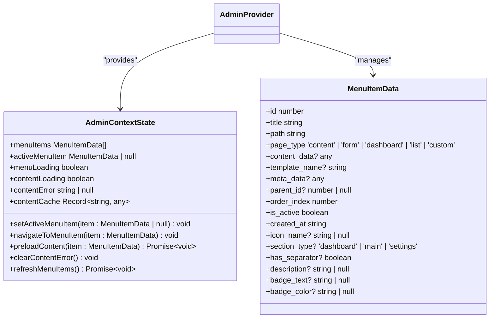
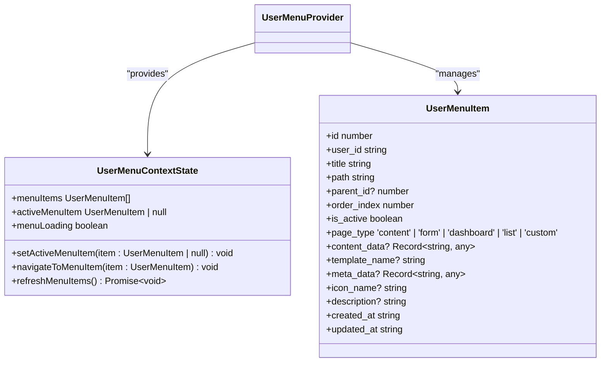
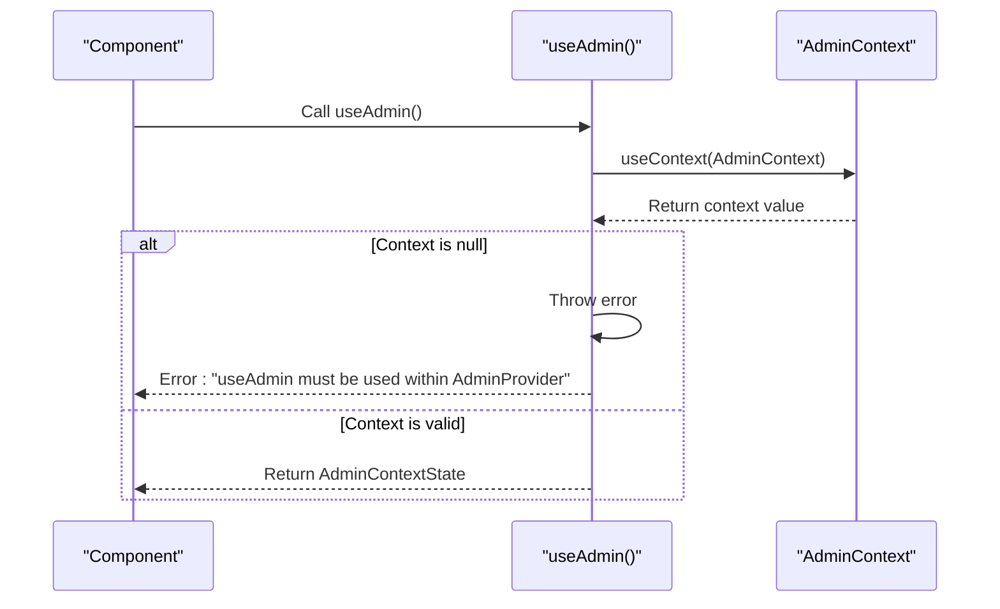
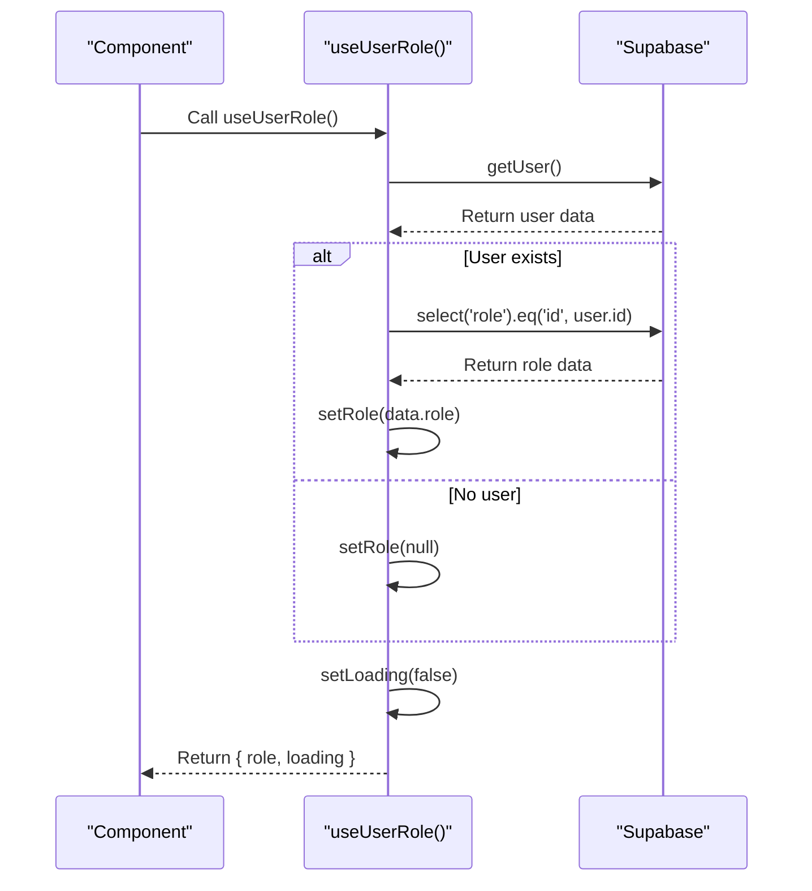
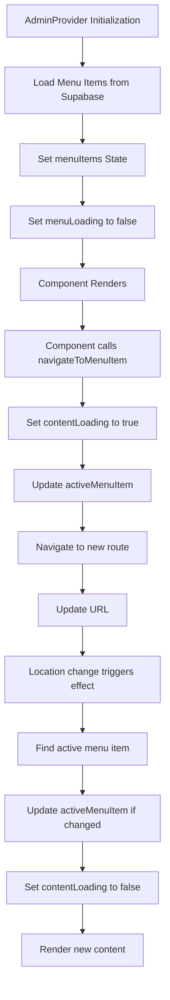
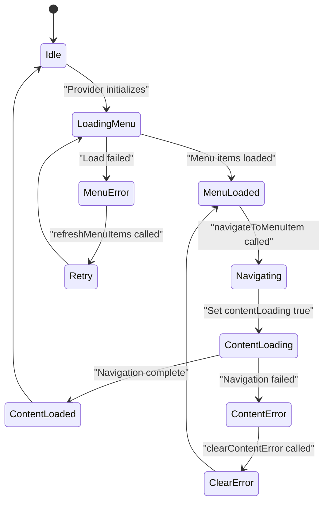
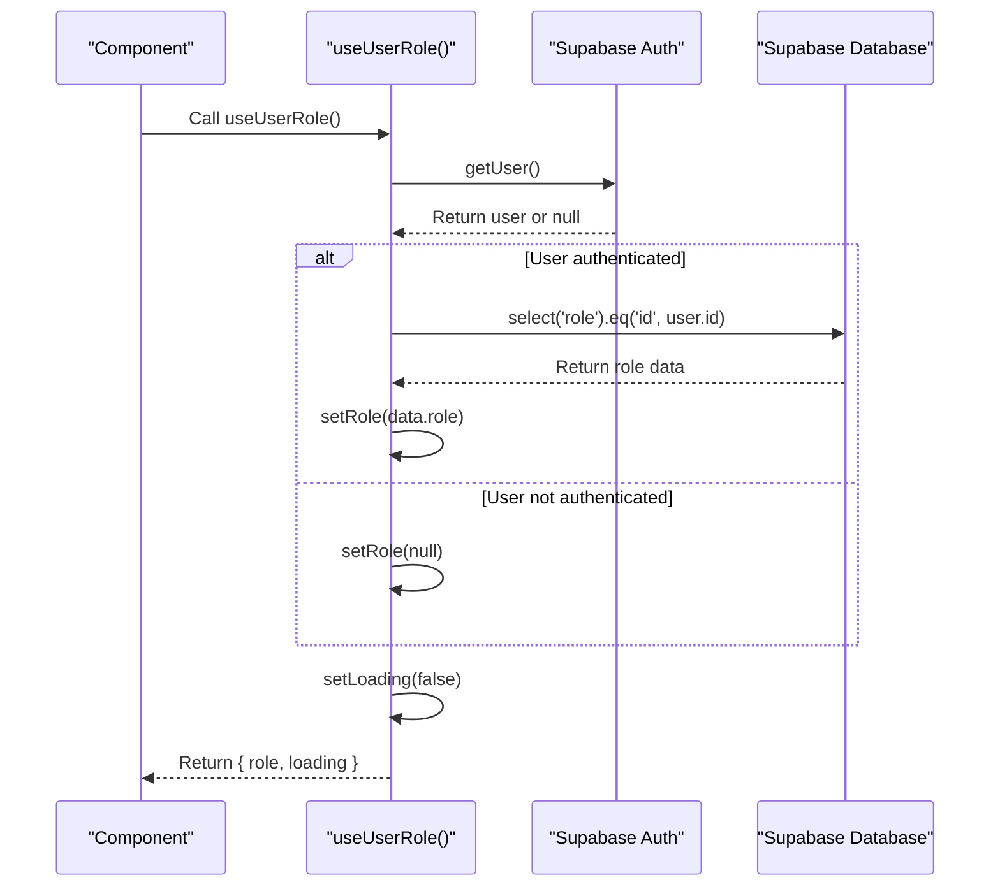

# State Management

<cite>
**Referenced Files in This Document**   
- [admin-provider.tsx](file://src/providers/admin-provider.tsx)
- [UserLayout.tsx](file://src/components/UserLayout.tsx)
- [useUserRole.ts](file://src/hooks/useUserRole.ts)
- [useBreadcrumbs.ts](file://src/hooks/useBreadcrumbs.ts)
- [use-toast.ts](file://src/hooks/use-toast.ts)
- [client.ts](file://src/integrations/supabase/client.ts)
</cite>

## Table of Contents
1. [Introduction](#introduction)
2. [Core State Providers](#core-state-providers)
3. [Custom State Hooks](#custom-state-hooks)
4. [Data Flow and Component Integration](#data-flow-and-component-integration)
5. [Error Handling and Loading States](#error-handling-and-loading-states)
6. [Integration with Supabase Authentication](#integration-with-supabase-authentication)
7. [Common Issues and Solutions](#common-issues-and-solutions)
8. [Performance Optimization](#performance-optimization)
9. [Conclusion](#conclusion)

## Introduction
The lovable-rise application implements a robust state management system using React Context API with custom providers and hooks. This documentation provides a comprehensive overview of the state management architecture, focusing on the AdminProvider and UserMenuProvider for managing application state, and custom hooks like useUserRole, useBreadcrumbs, and useToast for accessing and manipulating state. The system is designed to be accessible to beginners while providing sufficient technical depth for experienced developers, covering implementation details, data flow patterns, error handling, and integration with Supabase authentication.

**Section sources**
- [admin-provider.tsx](file://src/providers/admin-provider.tsx)
- [UserLayout.tsx](file://src/components/UserLayout.tsx)

## Core State Providers

The application utilizes two primary state providers: AdminProvider for administrative functionality and UserMenuProvider for user-facing menu management. These providers encapsulate state and actions, making them available to child components through React Context.

The AdminProvider manages menu items, active menu selection, loading states, content errors, and caching. It initializes by loading menu items from the Supabase database and provides methods for navigating between menu items, preloading content, and refreshing the menu. The provider uses several useState hooks to manage different aspects of the application state, including menuItems, activeMenuItem, menuLoading, contentLoading, contentError, and contentCache.

**Diagram sources**
- [admin-provider.tsx](file://src/providers/admin-provider.tsx#L1-L422)

The UserMenuProvider serves a similar purpose for user-facing functionality, managing user menu items, active selection, and loading states. It also includes subscription validation to ensure users have valid access based on their subscription end date. The provider listens for window focus and visibility changes to periodically check subscription status, implementing a "fail open" approach on errors to maintain user access.

**Diagram sources**
- [UserLayout.tsx](file://src/components/UserLayout.tsx#L56-L232)

**Section sources**
- [admin-provider.tsx](file://src/providers/admin-provider.tsx#L1-L422)
- [UserLayout.tsx](file://src/components/UserLayout.tsx#L56-L232)

## Custom State Hooks

The application implements several custom hooks to access and manipulate application state. These hooks abstract the complexity of context usage and provide a clean API for components to interact with state.

The useAdmin hook provides access to the AdminProvider context with validation to ensure it's used within the provider. This prevents runtime errors by throwing a descriptive error message if the hook is used outside the provider's scope. The hook returns the complete AdminContextState, giving components access to all state values and actions.

**Diagram sources**
- [admin-provider.tsx](file://src/providers/admin-provider.tsx#L217-L223)

The useUserRole hook fetches the current user's role from the Supabase database by first retrieving the authenticated user and then querying the profiles table for the role information. It manages loading state and includes error handling to prevent the application from breaking if the role cannot be fetched.

**Diagram sources**
- [useUserRole.ts](file://src/hooks/useUserRole.ts#L3-L33)

The useBreadcrumbs hook generates breadcrumb navigation based on the current route, using route mapping configurations for both admin and user interfaces. It handles both static routes and dynamic paths, providing appropriate labels and navigation hierarchy. The hook uses useMemo to optimize performance by memoizing the breadcrumb computation.

The useToast hook manages toast notifications by maintaining a state of toasts and providing methods to add, update, and dismiss them. It uses a listener pattern to notify components when the toast state changes, allowing multiple components to respond to toast events.

**Section sources**
- [useUserRole.ts](file://src/hooks/useUserRole.ts#L3-L33)
- [useBreadcrumbs.ts](file://src/hooks/useBreadcrumbs.ts#L42-L169)
- [use-toast.ts](file://src/hooks/use-toast.ts#L170-L188)

## Data Flow and Component Integration

The state management system follows a clear data flow pattern from providers to components through hooks. Providers initialize state and expose actions, hooks consume context and provide simplified APIs, and components use hooks to access state and trigger actions.

When a user navigates to an admin page, the AdminProvider loads menu items from the Supabase database during initialization. Components that need to navigate between pages use the navigateToMenuItem action from the useAdmin hook, which updates the active menu item and triggers navigation. The provider manages loading states to provide visual feedback during navigation.

**Diagram sources**
- [admin-provider.tsx](file://src/providers/admin-provider.tsx#L229-L422)

For user menu functionality, the UserMenuProvider follows a similar pattern but includes additional subscription validation. When a user accesses the application, the provider checks their subscription status and updates the hasAccess state accordingly. This state is used to conditionally render content or redirect users with expired subscriptions.

Components integrate with the state management system by importing and using the appropriate hooks. For example, a component that needs to display the current user's role would use the useUserRole hook, while a component that needs to show toast notifications would use the useToast hook. This pattern promotes reusability and separation of concerns.

**Section sources**
- [admin-provider.tsx](file://src/providers/admin-provider.tsx#L229-L422)
- [UserLayout.tsx](file://src/components/UserLayout.tsx#L78-L232)

## Error Handling and Loading States

The state management system implements comprehensive error handling and loading states to provide a smooth user experience. Each provider manages its own loading and error states, which components can use to display appropriate UI elements.

The AdminProvider manages several loading states: menuLoading during menu initialization and contentLoading during navigation. It also manages contentError to display error messages when content fails to load. Components can use these states to show spinners, skeleton loaders, or error messages.

**Diagram sources**
- [admin-provider.tsx](file://src/providers/admin-provider.tsx#L229-L422)

Error handling is implemented at multiple levels. The useUserRole hook includes try-catch blocks to handle errors when fetching the user role, preventing the application from crashing if the database query fails. Similarly, the AdminProvider includes error handling when loading menu items, logging errors to the console but continuing execution to avoid blocking the user interface.

The system also handles edge cases such as network failures, authentication errors, and database connection issues. For example, when checking subscription status, the UserMenuProvider implements a "fail open" approach by setting hasAccess to true if an error occurs, ensuring users are not unexpectedly locked out of the application.

**Section sources**
- [admin-provider.tsx](file://src/providers/admin-provider.tsx#L229-L422)
- [UserLayout.tsx](file://src/components/UserLayout.tsx#L78-L232)

## Integration with Supabase Authentication

The state management system is tightly integrated with Supabase authentication, using the Supabase client to manage user sessions and authentication state. The supabase client is imported from '@/integrations/supabase/client' and configured with the appropriate URL and publishable key.

Authentication state is used to conditionally load data and control access to application features. For example, the useUserRole hook depends on the authenticated user to fetch the role from the database. If no user is authenticated, the hook returns null for the role. Similarly, the UserMenuProvider uses the user ID to load user-specific menu items and validate subscription status.

**Diagram sources**
- [client.ts](file://src/integrations/supabase/client.ts#L1-L30)
- [useUserRole.ts](file://src/hooks/useUserRole.ts#L3-L33)

The integration also includes session validation and token management. The application uses Supabase's built-in session management with localStorage persistence, automatic token refresh, and session detection from URLs. This ensures that users remain authenticated across sessions and that tokens are refreshed before they expire.

**Section sources**
- [client.ts](file://src/integrations/supabase/client.ts#L1-L30)
- [useUserRole.ts](file://src/hooks/useUserRole.ts#L3-L33)

## Common Issues and Solutions

Several common issues can arise when working with the state management system, particularly related to context usage and authentication integration. Understanding these issues and their solutions is crucial for maintaining application stability.

One common issue is the "context consumer error," which occurs when a hook like useAdmin is used outside its corresponding provider. This is prevented by the validation check in the hook, which throws a descriptive error message. To resolve this issue, ensure that components using the hook are wrapped in the appropriate provider in the component tree.

Another common issue is stale state or missed updates when dependencies change. This is addressed by carefully managing useEffect dependencies and using useCallback for functions that are passed as dependencies. For example, the AdminProvider uses useCallback for functions like loadMenuItems and navigateToMenuItem to prevent unnecessary re-renders.

Authentication-related issues can occur when the Supabase session is not properly synchronized with the application state. This is mitigated by using Supabase's session management features and implementing proper error handling in authentication flows. The application also includes session validation to ensure that database operations use the correct authentication context.

**Section sources**
- [admin-provider.tsx](file://src/providers/admin-provider.tsx#L217-L223)
- [useUserRole.ts](file://src/hooks/useUserRole.ts#L3-L33)

## Performance Optimization

The state management system includes several performance optimizations to ensure efficient rendering and data handling. These optimizations are critical for maintaining a responsive user interface, especially as the application scales.

One key optimization is the use of useMemo in the useBreadcrumbs hook, which memoizes the breadcrumb computation based on the current pathname and translation function. This prevents unnecessary recalculations on every render, improving performance for components that use breadcrumbs.

The providers use useCallback to memoize action functions like navigateToMenuItem and setActiveMenuItem. This prevents these functions from being recreated on every render, which could trigger unnecessary re-renders in child components that use them as dependencies.

State normalization is another optimization technique used in the system. The AdminProvider normalizes menu items into a tree structure using the buildMenuTree function, which improves lookup performance when rendering hierarchical menus. This reduces the computational complexity of menu rendering from O(n²) to O(n).

The system also implements data caching through the contentCache state in the AdminProvider. This cache stores preloaded content for menu items, reducing the need for repeated data fetching when users navigate between pages. The cache is implemented as a simple object with menu item IDs as keys, providing O(1) lookup performance.

**Section sources**
- [admin-provider.tsx](file://src/providers/admin-provider.tsx#L229-L422)
- [useBreadcrumbs.ts](file://src/hooks/useBreadcrumbs.ts#L42-L169)

## Conclusion

The state management system in the lovable-rise application provides a robust foundation for managing application state using React Context API and custom hooks. The system is designed with clear separation of concerns, comprehensive error handling, and performance optimizations to ensure a smooth user experience. By leveraging Supabase authentication and database integration, the system provides real-time state management that scales with the application's complexity. The documented patterns and best practices serve as a guide for both new and experienced developers working with the application.