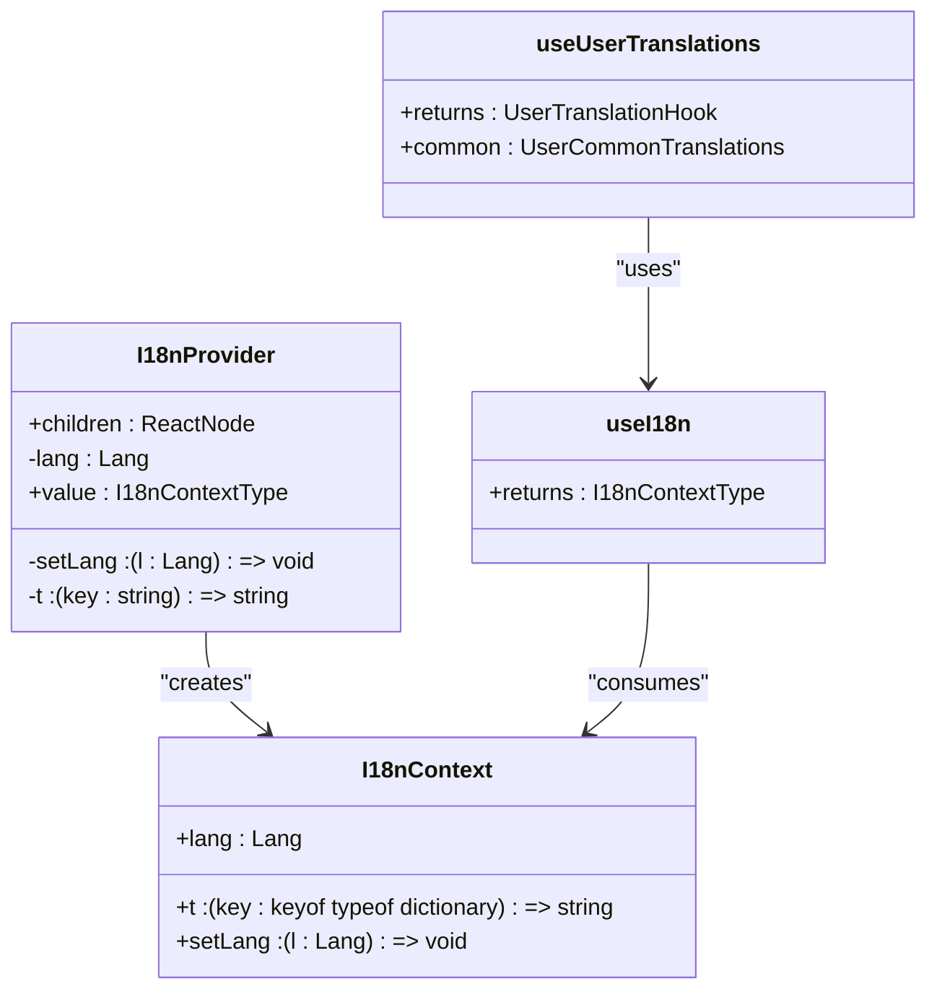
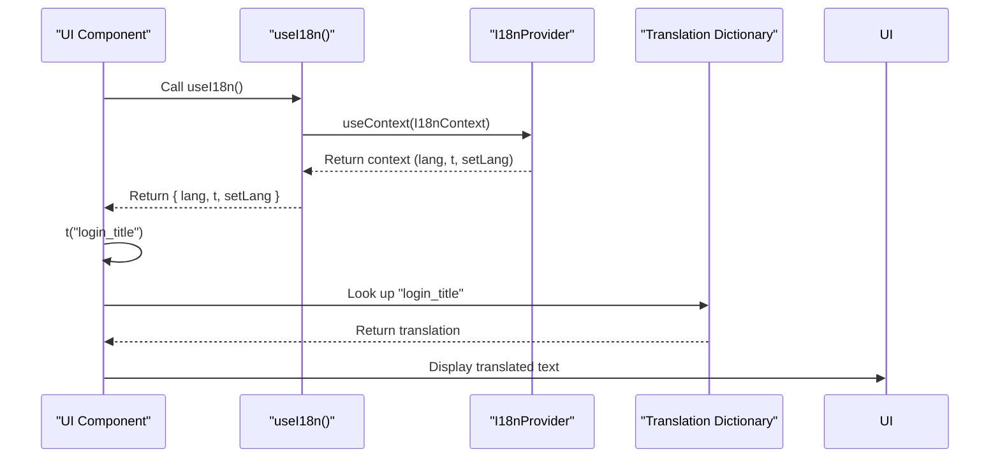

# Internationalization

<cite>
**Referenced Files in This Document**   
- [i18n-provider.tsx](file://src/providers/i18n-provider.tsx)
- [menu-item-with-icon.tsx](file://src/components/ui/menu-item-with-icon.tsx)
- [UserSidebar.tsx](file://src/components/UserSidebar.tsx)
- [MenuSection.tsx](file://src/components/ui/menu-section.tsx)
- [MenuItemWithIcon.tsx](file://src/components/user/MenuItemWithIcon.tsx)
</cite>

## Table of Contents
1. [Introduction](#introduction)
2. [Core Internationalization Architecture](#core-internationalization-architecture)
3. [Language Support Implementation](#language-support-implementation)
4. [Adding New Languages](#adding-new-languages)
5. [Translation Consumption in Components](#translation-consumption-in-components)
6. [Dynamic Content Translation](#dynamic-content-translation)
7. [Performance Considerations](#performance-considerations)
8. [Best Practices and Common Issues](#best-practices-and-common-issues)

## Introduction

The lovable-rise application implements a comprehensive internationalization (i18n) system that enables seamless language switching and multilingual support across the entire platform. This documentation details the architecture, implementation, and usage patterns of the i18n system, focusing on the `i18n-provider` context that manages language state and translation functions. The system currently supports Ukrainian ("uk") and English ("en") languages, with a scalable architecture that allows for easy addition of new languages. The implementation follows React best practices using context for state management and custom hooks for consuming translation data throughout the component tree.

**Section sources**
- [i18n-provider.tsx](file://src/providers/i18n-provider.tsx#L2-L1005)

## Core Internationalization Architecture

The internationalization system in lovable-rise is built around a React context provider pattern that exposes translation functions and language state to all components in the application. The architecture consists of three main components: the translation dictionary, the context provider, and consumer hooks.



**Diagram sources**
- [i18n-provider.tsx](file://src/providers/i18n-provider.tsx#L942-L1005)

The core of the system is defined in `i18n-provider.tsx`, which establishes the types and data structures for the internationalization system. The `Lang` type is a union type that restricts language codes to "uk" and "en", ensuring type safety throughout the application. The `Dictionary` type is a nested record structure that maps translation keys to their corresponding values in each supported language.

The `I18nProvider` component serves as the root provider that wraps the application and makes the internationalization context available to all child components. It maintains the current language state using React's `useState` hook, with Ukrainian ("uk") as the default language. The provider also implements the translation function `t` that looks up translation keys in the dictionary and returns the appropriate string for the current language.

**Section sources**
- [i18n-provider.tsx](file://src/providers/i18n-provider.tsx#L2-L1005)

## Language Support Implementation

The language support in lovable-rise is implemented through a centralized dictionary object that contains all translatable strings for the application. This dictionary is structured as a TypeScript `Record` with string keys and nested objects containing translations for each supported language.

The implementation follows a systematic approach to ensure consistency and maintainability:

1. **Translation Dictionary Structure**: The dictionary is defined as a constant object with keys representing translation identifiers and values containing language-specific strings. Each key maps to an object with "uk" and "en" properties for Ukrainian and English translations respectively.

2. **Translation Function (t)**: The core `t` function is implemented within the `I18nProvider` and provides a type-safe way to retrieve translations. It accepts a translation key and returns the corresponding string for the current language. The function includes comprehensive error handling to log missing keys or languages and returns a fallback value (the key wrapped in brackets) when translations are missing.

3. **Context Management**: The `I18nContext` is created using React's `createContext` and is populated with the current language, translation function, and language setter function. This context is then provided to all components through the `I18nProvider`.

4. **Custom Hooks**: Two custom hooks are provided for consuming translations:
   - `useI18n`: The primary hook that returns the full context, allowing components to access the current language, translation function, and language setter.
   - `useUserTranslations`: A specialized hook that provides pre-translated common terms for user management interfaces, improving performance by memoizing frequently used translations.

The system also includes helper functions and translation maps in various UI components, particularly in menu-related components, to handle dynamic translation of menu items based on their titles.

**Section sources**
- [i18n-provider.tsx](file://src/providers/i18n-provider.tsx#L942-L1005)
- [menu-item-with-icon.tsx](file://src/components/ui/menu-item-with-icon.tsx#L27-L66)
- [UserSidebar.tsx](file://src/components/UserSidebar.tsx#L99-L136)

## Adding New Languages

Adding new languages to the lovable-rise application requires modifications to several components of the internationalization system. The process is designed to be straightforward while maintaining type safety and consistency across the application.

### Step 1: Update Language Type

The first step is to modify the `Lang` type in `i18n-provider.tsx` to include the new language code. Currently defined as `type Lang = "uk" | "en"`, this union type must be extended with the new language code (e.g., "es" for Spanish):

```typescript
type Lang = "uk" | "en" | "es"; // Add new language codes here
```

### Step 2: Extend Translation Dictionary

For each existing translation key in the `dictionary` object, add the corresponding translation for the new language. This must be done consistently across all entries to maintain the integrity of the translation system. For example:

```typescript
login_title: { 
  uk: "Вхід до MarketGrow", 
  en: "Sign in to MarketGrow",
  es: "Iniciar sesión en MarketGrow" 
}
```

### Step 3: Update Translation Maps

Several UI components contain translation maps for specific use cases, particularly menu items. These maps must be updated to include the new language. The primary locations are:

- `translateMenuItem` function in `menu-item-with-icon.tsx`
- `translateMenuItem` function in `UserSidebar.tsx` 
- `translateMenuItem` function in `menu-section.tsx`

Each of these functions contains a `translationMap` object that maps display titles to translation keys. When adding a new language, ensure that all relevant titles in the new language are mapped to their corresponding translation keys.

### Step 4: Set Default Language (Optional)

If the new language should be the default for certain users or regions, update the initial state in the `I18nProvider`:

```typescript
const [lang, setLang] = useState<Lang>("es"); // Change default language
```

Alternatively, implement language detection logic based on user preferences, browser settings, or geolocation.

### Step 5: Test Thoroughly

After implementing the new language, thoroughly test the application to ensure:
- All UI elements display the correct translations
- Language switching works seamlessly
- No missing translations are displayed (shown as `[key]`)
- Layouts accommodate text expansion/contraction in the new language
- Date, number, and currency formatting is appropriate for the locale

The system's error handling will log any missing translations to the console, making it easier to identify and fix incomplete translations.

**Section sources**
- [i18n-provider.tsx](file://src/providers/i18n-provider.tsx#L2-L1005)
- [menu-item-with-icon.tsx](file://src/components/ui/menu-item-with-icon.tsx#L27-L66)
- [UserSidebar.tsx](file://src/components/UserSidebar.tsx#L99-L136)

## Translation Consumption in Components

Components in the lovable-rise application consume translation data through the `useI18n` hook, which provides access to the translation function and language state. This section demonstrates practical examples of how components use the internationalization system.

### Basic Translation Usage

The most common pattern involves importing the `useI18n` hook and using the `t` function to translate static strings:



**Diagram sources**
- [i18n-provider.tsx](file://src/providers/i18n-provider.tsx#L976-L980)

### Menu Item Translation

A specialized pattern is used for translating menu items, which involves mapping display titles to translation keys. This is implemented in multiple components including `MenuItemWithIcon`, `MenuSection`, and `UserSidebar`. The `translateMenuItem` function uses a lookup table to convert menu titles to their corresponding translation keys:

```typescript
const translateMenuItem = (title: string): string => {
  const translationMap: Record<string, string> = {
    "Forms": "menu_forms",
    "Settings": "menu_settings", 
    "Users": "menu_users",
    // ... other mappings
  };
  
  const translationKey = translationMap[title];
  return translationKey ? t(translationKey as any) : title;
};
```

This approach allows the system to translate menu items regardless of their original language, supporting both English and Ukrainian interface titles.

### Specialized Translation Hook

The `useUserTranslations` hook provides a convenient way to access commonly used translations in user management interfaces:

```typescript
export const useUserTranslations = () => {
  const { t, lang } = useI18n();
  
  return {
    t: (key: keyof typeof dictionary) => t(key),
    lang,
    get common() {
      return {
        users: t("users_title"),
        addUser: t("add_user"),
        editUser: t("edit_user"),
        // ... other common translations
      };
    },
  };
};
```

This hook improves performance by memoizing the translation of frequently used terms and provides a clean API for components that primarily deal with user management functionality.

**Section sources**
- [i18n-provider.tsx](file://src/providers/i18n-provider.tsx#L976-L1005)
- [menu-item-with-icon.tsx](file://src/components/ui/menu-item-with-icon.tsx#L27-L66)
- [UserSidebar.tsx](file://src/components/UserSidebar.tsx#L99-L136)

## Dynamic Content Translation

The internationalization system in lovable-rise addresses several challenges related to dynamic content translation. The implementation includes strategies for handling various scenarios where content is generated or modified at runtime.

### Missing Translation Handling

One of the key features of the translation system is its robust error handling for missing translations. When a translation key is not found in the dictionary, or when a language is missing for a particular key, the system logs an error to the console and returns a fallback value:

```typescript
const t = (key: keyof typeof dictionary) => {
  const entry = dictionary[key];
  if (!entry) {
    console.error(`Translation key "${key}" not found in dictionary`);
    return `[${key}]`; // Return key wrapped in brackets
  }
  if (!(lang in entry)) {
    console.error(`Language "${lang}" not found for key "${key}"`, entry);
    return `[${key}]`; // Return key wrapped in brackets
  }
  // ... rest of implementation
};
```

This approach makes missing translations immediately visible in the UI (displayed as `[key]`) while preventing the application from breaking due to translation errors.

### Dynamic Menu Translation

The application handles dynamic menu content through the `translateMenuItem` function, which uses a comprehensive mapping system to translate menu titles regardless of their original language. This is particularly important for user-generated menu items or dynamically loaded content:

```typescript
const translationMap: Record<string, string> = {
  "Forms": "menu_forms",
  "Форми": "menu_forms",
  "Settings": "menu_settings",
  "Налаштування": "menu_settings",
  // ... bidirectional mappings
};
```

This bidirectional mapping ensures that menu items are properly translated whether they are created in English or Ukrainian, supporting a seamless multilingual experience.

### Translation Key Management

The system uses a consistent naming convention for translation keys, typically following a pattern of `component_purpose` (e.g., "login_title", "menu_settings"). This convention makes it easier to locate and manage translations, especially as the application grows. For user interface elements, keys often start with the component or page name followed by the specific element purpose.

### Runtime Language Switching

The system supports runtime language switching through the `setLang` function exposed by the context. When a user changes the language, React's state management automatically triggers re-renders of all components that consume the translation context, ensuring that the entire UI updates to the new language without requiring a page refresh.

**Section sources**
- [i18n-provider.tsx](file://src/providers/i18n-provider.tsx#L955-L971)
- [menu-item-with-icon.tsx](file://src/components/ui/menu-item-with-icon.tsx#L27-L66)

## Performance Considerations

The internationalization implementation in lovable-rise includes several performance optimizations to minimize impact on application load time and runtime performance.

### Bundle Size Impact

The translation dictionary is included in the main application bundle, which can increase the overall bundle size. To mitigate this:

1. **Tree Shaking**: The system uses ES6 module syntax and type definitions that allow bundlers to eliminate unused code through tree shaking.

2. **Lazy Loading Considerations**: While the current implementation loads all translations upfront, the architecture could be extended to support lazy loading of language packs for applications with many languages or very large translation sets.

3. **Minification**: Translation strings are minified along with the rest of the application code during the build process, reducing their impact on bundle size.

### Memoization and Optimization

The implementation leverages React's `useMemo` hook to optimize the context value:

```typescript
const value = useMemo(() => ({ lang, t, setLang }), [lang]);
```

This prevents unnecessary re-creations of the context value object when the component re-renders, improving performance by reducing the number of context updates propagated to consumers.

The `useUserTranslations` hook also implements memoization through its `common` getter, which caches frequently used translations and only recalculates them when the language changes.

### Component-Specific Optimizations

Menu components implement several optimizations to handle translation efficiently:

1. **Translation Map Caching**: The `translationMap` object in menu components is defined once per component instance, avoiding recreation on each render.

2. **Selective Re-renders**: Menu components only re-render when their specific props or the global language state changes, thanks to React's reconciliation algorithm and proper use of memoization.

3. **Conditional Translation**: The translation system only processes strings that require translation, falling back to the original string when no translation key is found, minimizing unnecessary string operations.

### Future Optimization Opportunities

Potential enhancements for improved performance include:

- **Code Splitting**: Implementing code splitting to load language packs asynchronously
- **Caching**: Adding localStorage caching for translation dictionaries to reduce load times on subsequent visits
- **Compression**: Implementing gzip or Brotli compression for translation files in production
- **On-demand Loading**: Loading translations only for currently visible components or routes

**Section sources**
- [i18n-provider.tsx](file://src/providers/i18n-provider.tsx#L972-L973)
- [menu-item-with-icon.tsx](file://src/components/ui/menu-item-with-icon.tsx#L27-L66)

## Best Practices and Common Issues

This section outlines recommended practices for working with the internationalization system and addresses common issues developers may encounter.

### Best Practices

1. **Consistent Key Naming**: Use a consistent naming convention for translation keys (e.g., `component_purpose`) to make them easily discoverable and maintainable.

2. **Comprehensive Error Logging**: The system's approach of logging missing translations to the console while providing visible fallbacks (`[key]`) is an excellent practice that helps identify incomplete translations during development.

3. **Type Safety**: Leverage TypeScript's type system to ensure translation keys are valid and prevent runtime errors.

4. **Context Usage**: Always use the `useI18n` hook within components that need translations, rather than passing translation functions through multiple component layers.

5. **Performance Awareness**: Be mindful of the performance implications of translations in frequently rendered components and use memoization when appropriate.

### Common Issues and Solutions

1. **Missing Translations**: The most common issue is missing translation keys. The system handles this gracefully by logging errors and displaying the key in brackets, making it easy to identify and fix.

2. **Language Detection**: The current implementation uses Ukrainian as the default language. For production applications, consider implementing language detection based on browser settings, user preferences, or geolocation.

3. **Text Expansion**: Different languages have varying text lengths. Design UI components to accommodate text expansion (particularly from English to other languages) to prevent layout issues.

4. **Date and Number Formatting**: While the current system focuses on string translation, consider implementing locale-specific formatting for dates, numbers, and currencies in future enhancements.

5. **RTL Language Support**: The current implementation does not address right-to-left languages. For applications requiring RTL support, additional CSS and layout considerations would be necessary.

6. **Pluralization and Grammar**: The simple key-value translation system does not handle complex linguistic features like pluralization rules or grammatical gender. For applications with complex translation needs, consider integrating a more sophisticated i18n library.

The internationalization system in lovable-rise provides a solid foundation for multilingual support with room for future enhancements as the application's language requirements evolve.

**Section sources**
- [i18n-provider.tsx](file://src/providers/i18n-provider.tsx#L955-L971)
- [menu-item-with-icon.tsx](file://src/components/ui/menu-item-with-icon.tsx#L27-L66)