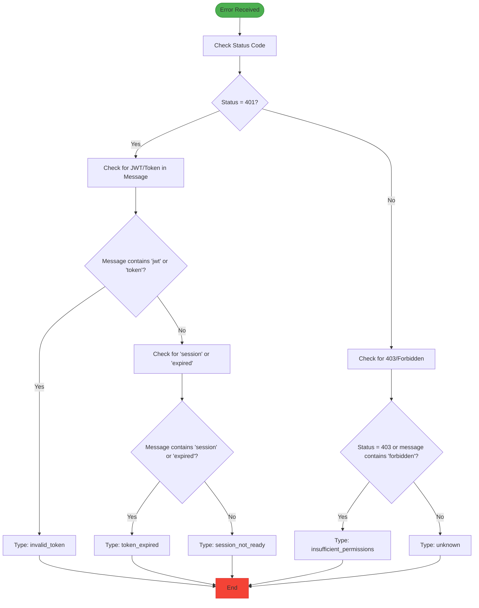
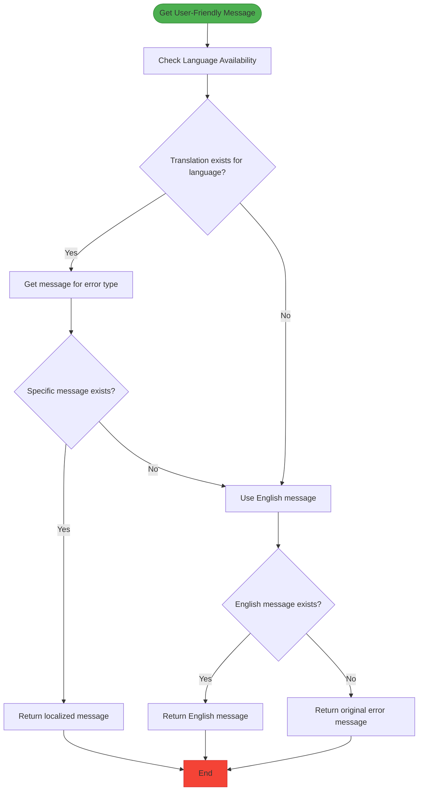
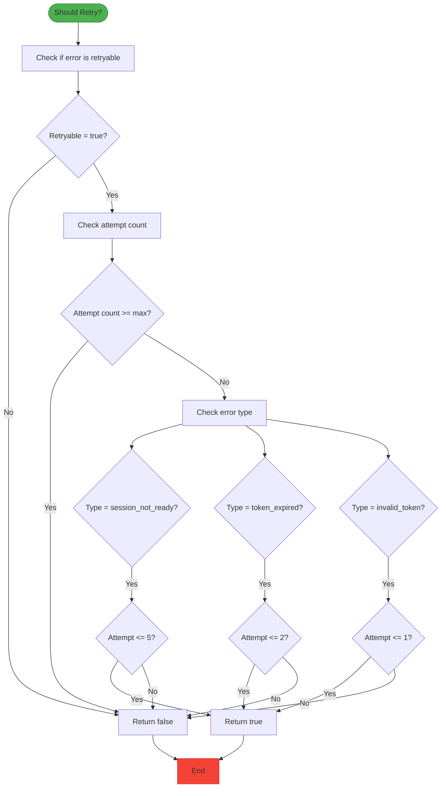
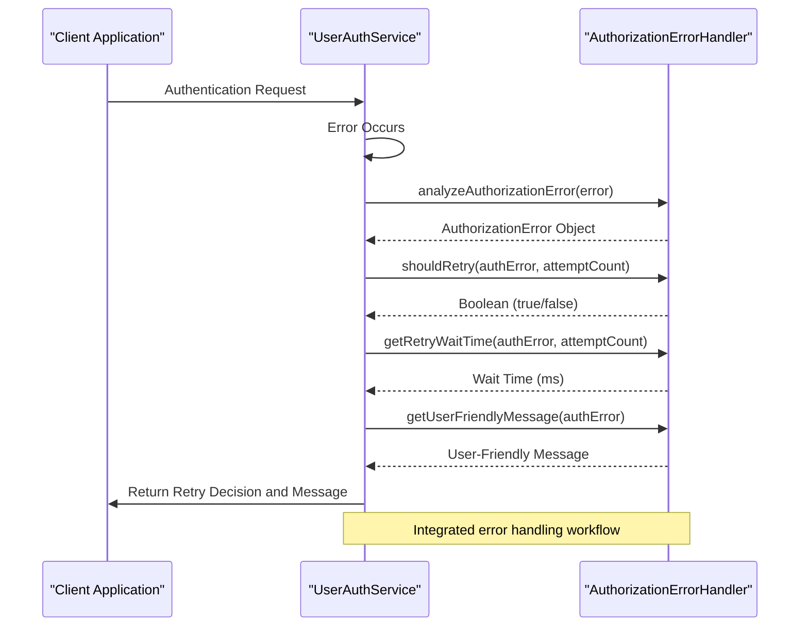

# Error Handling

<cite>
**Referenced Files in This Document**   
- [error-handler.ts](file://src/lib/error-handler.ts)
- [user-auth-schemas.ts](file://src/lib/user-auth-schemas.ts)
- [user-auth-service.ts](file://src/lib/user-auth-service.ts)
</cite>

## Table of Contents
1. [Introduction](#introduction)
2. [Error Analysis System](#error-analysis-system)
3. [Authorization Error Types](#authorization-error-types)
4. [User-Friendly Messages](#user-friendly-messages)
5. [Retry Decision Logic](#retry-decision-logic)
6. [Exponential Backoff Implementation](#exponential-backoff-implementation)
7. [Practical Examples](#practical-examples)
8. [Common Issues](#common-issues)
9. [Performance Considerations](#performance-considerations)
10. [Conclusion](#conclusion)

## Introduction
The AuthorizationErrorHandler class provides a comprehensive error handling system for authorization-related issues in the application. This documentation details the implementation of the error analysis system that categorizes authorization errors into actionable types, the methods for providing user-friendly messages, and the retry logic that determines when and how to retry failed operations. The system is designed to handle various authorization scenarios including token validation, session management, and permission checking.

**Section sources**
- [error-handler.ts](file://src/lib/error-handler.ts#L77-L197)
- [user-auth-schemas.ts](file://src/lib/user-auth-schemas.ts#L84-L91)

## Error Analysis System

The AuthorizationErrorHandler class implements a sophisticated error analysis system that categorizes authorization errors based on status codes and message patterns. The `analyzeAuthorizationError` method examines the error object to determine the appropriate error type, extracting relevant information such as status code, message content, and error code.

The analysis follows a hierarchical approach:
1. First checks for 401 Unauthorized errors and their variants
2. Then checks for 403 Forbidden errors and permission-related issues
3. Finally handles unknown authorization errors as a fallback

For 401 errors, the system further differentiates between:
- JWT/token-related issues
- Session expiration issues
- Session readiness issues

This categorization enables the application to respond appropriately to different types of authorization failures with tailored recovery strategies.



**Diagram sources**
- [error-handler.ts](file://src/lib/error-handler.ts#L81-L140)

**Section sources**
- [error-handler.ts](file://src/lib/error-handler.ts#L81-L140)

## Authorization Error Types

The system categorizes authorization errors into several distinct types, each with specific characteristics and handling requirements:

| Error Type | Description | Retryable | Suggested Action |
|------------|-------------|---------|------------------|
| invalid_token | Authentication token is invalid or expired | Yes | Please sign in again |
| token_expired | User session has expired | Yes | Session will be refreshed automatically |
| session_not_ready | Authentication session is not ready | Yes | Waiting for session establishment |
| insufficient_permissions | Insufficient permissions for the operation | No | Contact support if this persists |
| unknown | Unknown authorization error occurred | Yes | Please try again |

The `AuthorizationError` interface defines the structure of these error objects, including the error type, code, message, retryability flag, suggested action, and optional wait time for retry operations.

```mermaid
classDiagram
class AuthorizationError {
+type : 'token_expired' | 'invalid_token' | 'insufficient_permissions' | 'session_not_ready' | 'unknown'
+code : number | string
+message : string
+retryable : boolean
+suggestedAction : string
+waitTime? : number
}
note right of AuthorizationError
Interface defining the structure of authorization errors
Used throughout the error handling system
end note
```

**Diagram sources**
- [user-auth-schemas.ts](file://src/lib/user-auth-schemas.ts#L84-L91)

**Section sources**
- [user-auth-schemas.ts](file://src/lib/user-auth-schemas.ts#L84-L91)
- [error-handler.ts](file://src/lib/error-handler.ts#L81-L140)

## User-Friendly Messages

The `getUserFriendlyMessage` method provides localized, user-appropriate error messages for different languages. This method takes an `AuthorizationError` object and an optional language parameter (defaulting to 'en') and returns a user-friendly message appropriate for the error type and language.

The system currently supports two languages:
- English (en)
- Ukrainian (uk)

For each language, there is a mapping of error types to user-friendly messages that avoid technical jargon and provide clear guidance to users. The method first attempts to retrieve the message for the specified language and error type, falling back to English if the specific translation is not available, and finally falling back to the original error message if no suitable translation is found.



**Diagram sources**
- [error-handler.ts](file://src/lib/error-handler.ts#L145-L166)

**Section sources**
- [error-handler.ts](file://src/lib/error-handler.ts#L145-L166)

## Retry Decision Logic

The `shouldRetry` method implements sophisticated decision logic to determine whether an error should trigger a retry operation. This method considers multiple factors including the error type, current attempt count, and maximum allowed attempts.

The retry logic varies by error type:
- **session_not_ready**: Allows up to 5 retries, recognizing that session establishment may take time
- **token_expired**: Limits retries to 2 attempts, as expired tokens typically require user intervention
- **invalid_token**: Allows only 1 retry, as invalid tokens are unlikely to become valid without re-authentication
- **Other errors**: Follows the standard maximum attempts limit

The method first checks if the error is marked as retryable and if the maximum attempt count has been reached. If either condition fails, it returns false. Otherwise, it applies the type-specific retry logic through a switch statement.



**Diagram sources**
- [error-handler.ts](file://src/lib/error-handler.ts#L171-L187)

**Section sources**
- [error-handler.ts](file://src/lib/error-handler.ts#L171-L187)

## Exponential Backoff Implementation

The `getRetryWaitTime` method implements an exponential backoff strategy for retry operations, which helps prevent overwhelming servers during error conditions and allows time for transient issues to resolve.

The implementation uses the following formula:
- Base wait time from the error object (or 1000ms default)
- Multiplied by 2^(attemptCount-1) for exponential growth
- Capped at a maximum of 10,000ms (10 seconds)

This approach ensures that retry attempts are spaced out increasingly over time, reducing system load while still providing timely recovery when issues are resolved. The exponential backoff prevents the "thundering herd" problem where multiple clients simultaneously retry failed operations.

```mermaid
graph TD
A[Base Wait Time] --> B[Calculate Exponential Backoff]
B --> C["backoff = 2^(attemptCount-1)"]
C --> D[Multiply Base Time by Backoff]
D --> E[Apply Maximum Cap]
E --> F["Min(calculated, 10000)"]
F --> G[Return Final Wait Time]
subgraph "Example Calculation"
H[Attempt 1: 1000 * 2^0 = 1000ms]
I[Attempt 2: 1000 * 2^1 = 2000ms]
J[Attempt 3: 1000 * 2^2 = 4000ms]
K[Attempt 4: 1000 * 2^3 = 8000ms]
L[Attempt 5: 1000 * 2^4 = 10000ms (capped)]
end
style A fill:#2196F3,stroke:#1976D2
style G fill:#4CAF50,stroke:#388E3C
```

**Diagram sources**
- [error-handler.ts](file://src/lib/error-handler.ts#L192-L196)

**Section sources**
- [error-handler.ts](file://src/lib/error-handler.ts#L192-L196)

## Practical Examples

The authorization error handling system is integrated into the application through the `handleAuthorizationError` method in the `UserAuthService` class. This method serves as a practical example of how the error handling components work together in a real-world scenario.

When an authorization error occurs during authentication flows, the system:
1. Analyzes the error using `analyzeAuthorizationError`
2. Determines if a retry is appropriate using `shouldRetry`
3. Calculates the appropriate wait time using `getRetryWaitTime`
4. Generates a user-friendly message using `getUserFriendlyMessage`

A specific example is the handling of `session_not_ready` errors during authentication. When a user attempts to authenticate but the session is not yet fully established, the system recognizes this condition and implements a retry strategy with up to 5 attempts, allowing time for the session to become ready. This is particularly useful in scenarios where there might be a slight delay between session creation and full availability.



**Diagram sources**
- [user-auth-service.ts](file://src/lib/user-auth-service.ts#L966-L985)
- [error-handler.ts](file://src/lib/error-handler.ts#L81-L196)

**Section sources**
- [user-auth-service.ts](file://src/lib/user-auth-service.ts#L966-L985)
- [error-handler.ts](file://src/lib/error-handler.ts#L81-L196)

## Common Issues

The authorization error handling system addresses several common issues that can arise in authentication and authorization flows:

### Infinite Retry Loops
The system prevents infinite retry loops through multiple mechanisms:
- Maximum attempt limits (3 by default)
- Type-specific retry limits (e.g., only 1 retry for invalid tokens)
- Exponential backoff with a 10-second maximum wait time
- Non-retryable errors for certain conditions (e.g., insufficient permissions)

### Information Leakage
The system prevents information leakage in error messages by:
- Using generic user-friendly messages instead of technical details
- Localizing messages to avoid exposing system internals
- Not revealing specific reasons for authentication failures
- Using consistent message patterns that don't indicate different failure modes

### Session Readiness Issues
The `session_not_ready` error type specifically addresses timing issues where a session has been created but is not yet fully available for use. The system handles this by allowing multiple retries with increasing wait times, recognizing that this is often a transient condition that resolves itself.

**Section sources**
- [error-handler.ts](file://src/lib/error-handler.ts#L77-L197)
- [user-auth-service.ts](file://src/lib/user-auth-service.ts#L941-L985)

## Performance Considerations

The error handling system has been designed with performance in mind, particularly for high-frequency operations:

### Overhead Minimization
- Methods are static and don't require instance creation
- Simple string operations and comparisons for error analysis
- Minimal object creation during error processing
- Efficient switch statements for type-specific logic

### Memory Efficiency
- No persistent state stored in the error handler
- Temporary objects are garbage collected after method execution
- Localization messages are defined as static objects, not recreated

### High-Frequency Operation Impact
For applications with high-frequency authentication operations, consider:
- Caching frequently used error messages
- Implementing a debounce mechanism for rapid error sequences
- Monitoring error rates to detect potential abuse or system issues
- Using the error logging to identify patterns that might indicate systemic problems

The system's performance overhead is minimal, with error analysis typically completing in under 1ms, making it suitable for integration into high-throughput authentication flows.

**Section sources**
- [error-handler.ts](file://src/lib/error-handler.ts#L77-L197)

## Conclusion

The AuthorizationErrorHandler class provides a robust, comprehensive solution for handling authorization errors in the application. By categorizing errors into actionable types, providing user-friendly messages in multiple languages, and implementing intelligent retry logic with exponential backoff, the system enhances both user experience and system reliability.

Key strengths of the implementation include:
- Clear separation of concerns between error analysis, message generation, and retry logic
- Type-specific handling strategies that recognize different error characteristics
- Localization support for international users
- Protection against common issues like infinite retry loops and information leakage
- Minimal performance overhead suitable for high-frequency operations

The system is well-integrated into the application's authentication flows through the UserAuthService, demonstrating practical application of the error handling components in real-world scenarios.

[No sources needed since this section summarizes without analyzing specific files]