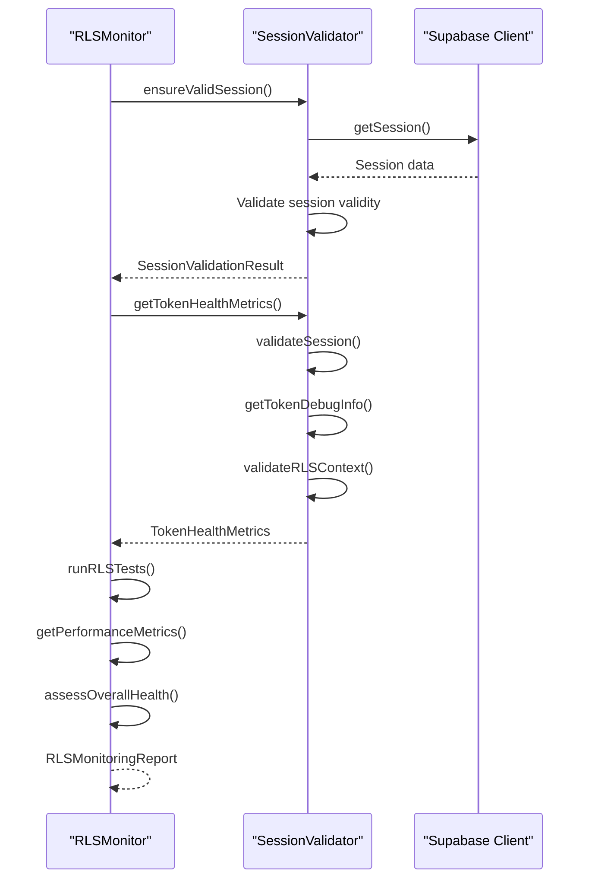
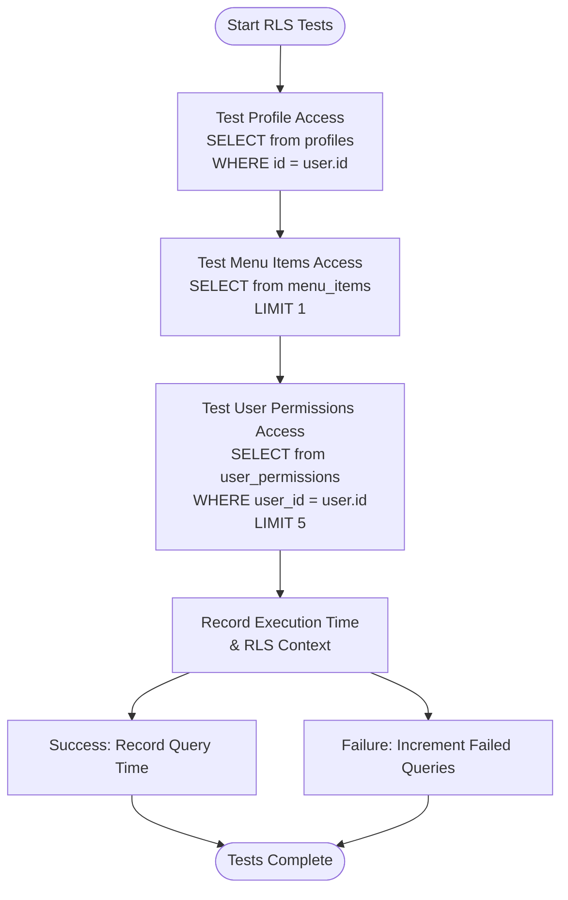
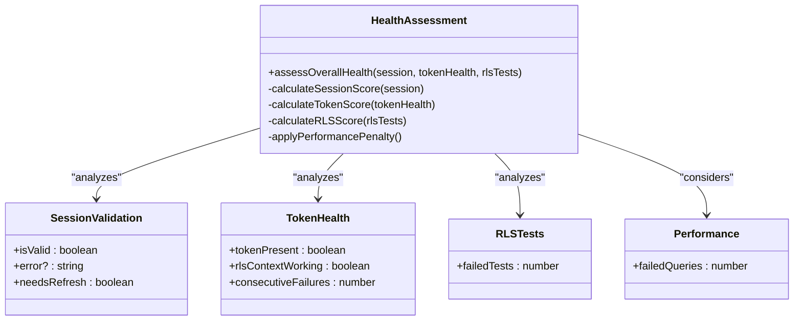
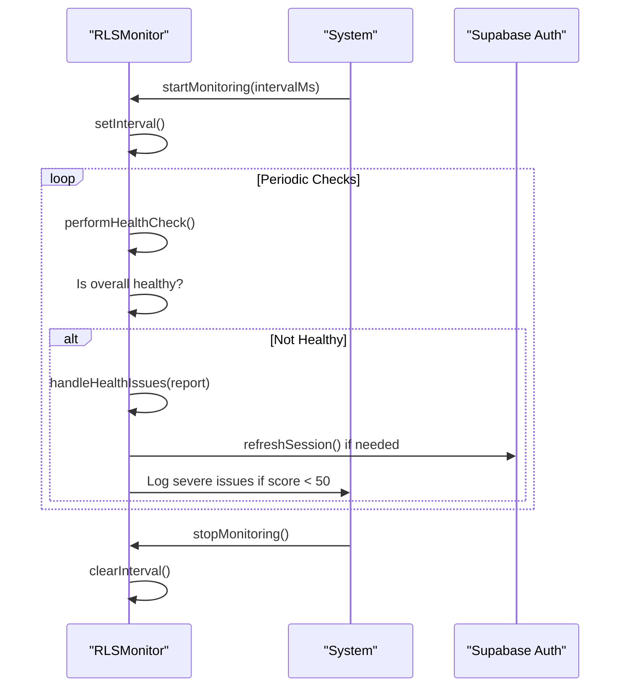
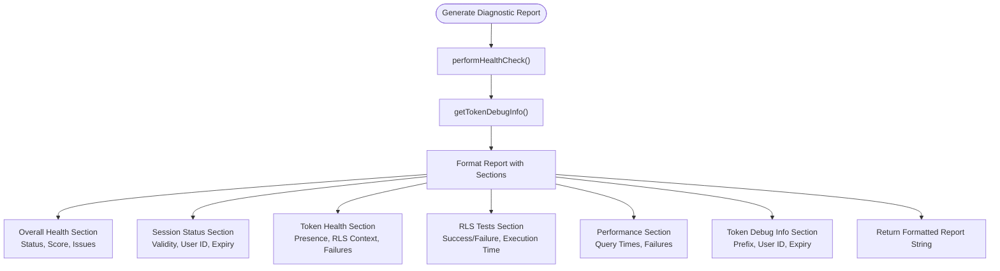

# RLS Implementation

<cite>
**Referenced Files in This Document**   
- [rls-monitor.ts](file://src/lib/rls-monitor.ts)
- [session-validation.ts](file://src/lib/session-validation.ts)
- [client.ts](file://src/integrations/supabase/client.ts)
</cite>

## Table of Contents
1. [Introduction](#introduction)
2. [Core Components](#core-components)
3. [Health Check System](#health-check-system)
4. [RLS Policy Testing](#rls-policy-testing)
5. [Overall Health Assessment](#overall-health-assessment)
6. [Continuous Monitoring](#continuous-monitoring)
7. [Diagnostic Reporting](#diagnostic-reporting)
8. [Common Issues and Solutions](#common-issues-and-solutions)
9. [Performance Considerations](#performance-considerations)

## Introduction
The RLS (Row Level Security) implementation in this application provides a comprehensive health monitoring system that validates RLS policies across the application. The system ensures that database access is properly restricted based on user identity and permissions through a series of automated checks and validations. The core of this implementation is the RLSMonitor class, which orchestrates health checks, policy testing, and continuous monitoring to maintain the integrity of the application's security model.

## Core Components
The RLS monitoring system consists of several key components that work together to validate and maintain RLS policy enforcement. The primary component is the RLSMonitor class, which serves as the central orchestrator for all health checks and monitoring activities. This class works in conjunction with the SessionValidator utility to ensure proper session and token validation. The system also relies on the Supabase client for database operations and RLS policy enforcement.

**Section sources**
- [rls-monitor.ts](file://src/lib/rls-monitor.ts#L61-L536)
- [session-validation.ts](file://src/lib/session-validation.ts#L42-L343)
- [client.ts](file://src/integrations/supabase/client.ts#L10-L30)

## Health Check System
The health check system is orchestrated by the `performHealthCheck` method in the RLSMonitor class. This method executes a comprehensive validation process that includes session validation, token health assessment, and RLS policy testing. The health check begins by validating the current session through the SessionValidator's `ensureValidSession` method, which confirms that a valid authentication session exists and refreshes it if necessary.

The token health assessment evaluates several critical metrics including session validity, token presence, token expiration, and RLS context functionality. The system tracks consecutive failures to identify potential authentication issues. The health check process is designed to be comprehensive, assessing multiple dimensions of the authentication and authorization system to ensure RLS policies are properly enforced.

**Diagram sources**
- [rls-monitor.ts](file://src/lib/rls-monitor.ts#L97-L141)
- [session-validation.ts](file://src/lib/session-validation.ts#L80-L122)

## RLS Policy Testing
The RLS policy testing is implemented through the `runRLSTests` method, which executes real database queries to verify RLS enforcement across key application areas. The testing system evaluates three critical components: profile access, menu items access, and user permissions access.

The profile access test verifies that users can retrieve their own profile information by querying the profiles table with a filter on the user's ID. This test confirms that the RLS policy correctly allows access to the user's own data while preventing access to other users' profiles. The menu items access test checks role-based access to menu items by retrieving a limited set of menu items, ensuring that the RLS policies properly restrict menu visibility based on user roles. The user permissions test validates that users can access their assigned permissions by querying the user_permissions table with a filter on the user ID.

Each test is executed through the `testRLSOperation` method, which measures execution time and captures the RLS context including token validity and auth.uid() information. The system records successful query times for performance monitoring and increments a failure counter for unsuccessful queries.

**Diagram sources**
- [rls-monitor.ts](file://src/lib/rls-monitor.ts#L177-L271)
- [session-validation.ts](file://src/lib/session-validation.ts#L227-L272)

## Overall Health Assessment
The overall health assessment is performed by the `assessOverallHealth` method, which calculates a health score based on session validity, token presence, and test outcomes. The algorithm uses a weighted scoring system with session health accounting for 40 points, token health for 30 points, and RLS tests for 30 points, resulting in a maximum score of 100.

The assessment identifies issues in several categories. Session-related issues include invalid sessions and sessions that need refresh. Token-related issues include missing access tokens and non-functional RLS context (where auth.uid() returns null). The system also evaluates the number of consecutive failures and failed RLS tests. Each identified issue reduces the health score proportionally, with critical issues like missing access tokens resulting in significant score reductions.

The health assessment also considers performance metrics, applying additional penalties for high query failure rates. A system is considered healthy if the score is 80 or higher with no critical issues. The assessment provides a comprehensive view of the RLS system's health, identifying both immediate problems and potential risks.

**Diagram sources**
- [rls-monitor.ts](file://src/lib/rls-monitor.ts#L307-L351)

## Continuous Monitoring
The continuous monitoring system is implemented through the `startMonitoring` method, which establishes periodic health checks at configurable intervals (default 30 seconds). The monitoring system runs in the background, automatically executing health checks and responding to detected issues without requiring manual intervention.

When health issues are detected (indicated by a non-healthy overall status), the system triggers the `handleHealthIssues` method to attempt automatic recovery. For invalid sessions with refresh tokens available, the system attempts to refresh the session automatically. The monitoring system also logs detailed diagnostics for severe issues (score below 50), providing comprehensive information for troubleshooting.

The monitoring system maintains state through static properties including `monitoringInterval` for the interval timer, `lastHealthCheck` for the most recent report, and `consecutiveFailures` for tracking failure patterns. This state allows the system to provide continuity between monitoring cycles and maintain historical context for issue diagnosis.

**Diagram sources**
- [rls-monitor.ts](file://src/lib/rls-monitor.ts#L392-L441)

## Diagnostic Reporting
The diagnostic reporting system is implemented through the `generateDiagnosticReport` method, which produces detailed troubleshooting output in a human-readable format. The report includes comprehensive information about the system's health, session status, token health, RLS test results, performance metrics, and token debug information.

The diagnostic report is structured with clear sections that provide both high-level status indicators (using emoji for quick visual assessment) and detailed technical information. The report includes timestamps for all data points, allowing for temporal analysis of issues. It also includes specific error messages and context information that can help identify the root cause of problems.

The report generation process calls the `performHealthCheck` method to obtain current system status and the `getTokenDebugInfo` method to gather detailed token information. This ensures that the report contains up-to-date and comprehensive information about the system's state.

**Diagram sources**
- [rls-monitor.ts](file://src/lib/rls-monitor.ts#L496-L525)

## Common Issues and Solutions
The most common issue addressed by this system is RLS context failure due to missing auth.uid(). This occurs when the Supabase client is not properly configured with the user's access token, causing auth.uid() to return null in RLS policies. The system detects this issue through the `validateRLSContext` method in SessionValidator, which explicitly tests whether auth.uid() returns the expected user ID.

The solution implemented in the system is to ensure proper token handling throughout the application. The Supabase client is configured without hardcoded Authorization or apikey headers to prevent conflicts with Edge Functions. Instead, the system relies on the Supabase authentication flow to automatically include the proper access token in requests. The RLSMonitor and SessionValidator classes work together to validate that the correct token is present and functional.

Additional issues include session expiration, token refresh failures, and header conflicts. The system addresses these through automatic session refresh attempts, comprehensive error logging that includes RLS context, and careful header management to prevent conflicts between different authentication mechanisms.

**Section sources**
- [rls-monitor.ts](file://src/lib/rls-monitor.ts#L338)
- [session-validation.ts](file://src/lib/session-validation.ts#L255)
- [client.ts](file://src/integrations/supabase/client.ts#L25-L28)

## Performance Considerations
The monitoring system's impact on database load is carefully managed through several optimization strategies. The system limits RLS policy tests to minimal queries with LIMIT clauses to reduce database overhead. Query execution times are tracked and stored, with only the most recent 100 measurements retained to prevent memory growth.

The monitoring interval is configurable (default 30 seconds), allowing adjustment based on performance requirements. For high-traffic applications, this interval can be increased to reduce database load. The system also implements performance penalties in the health score calculation when query failure rates exceed thresholds, providing early warning of performance issues.

The diagnostic reporting system is designed to be on-demand rather than continuous, generating detailed reports only when requested. This prevents the overhead of comprehensive reporting from affecting regular monitoring operations. The system also uses efficient data structures and minimizes redundant operations to maintain optimal performance.

**Section sources**
- [rls-monitor.ts](file://src/lib/rls-monitor.ts#L351-L398)
- [rls-monitor.ts](file://src/lib/rls-monitor.ts#L268-L313)