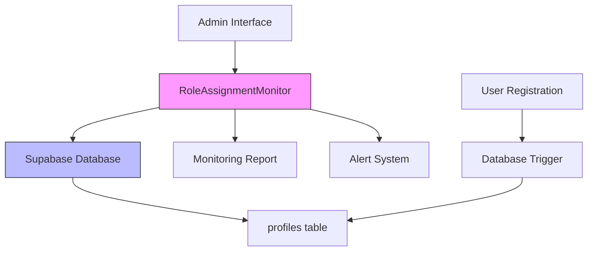
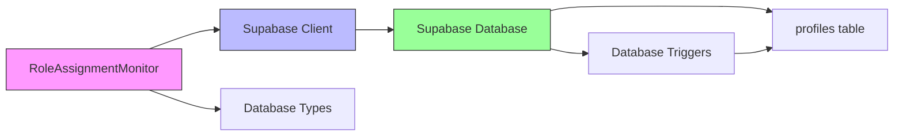

# Role-Based Access Control

<cite>
**Referenced Files in This Document**   
- [role-assignment-monitor.ts](file://src/lib/role-assignment-monitor.ts)
- [types.ts](file://src/integrations/supabase/types.ts)
- [users/index.ts](file://supabase/functions/users/index.ts)
</cite>

## Table of Contents
1. [Introduction](#introduction)
2. [Core Components](#core-components)
3. [Architecture Overview](#architecture-overview)
4. [Detailed Component Analysis](#detailed-component-analysis)
5. [Dependency Analysis](#dependency-analysis)
6. [Performance Considerations](#performance-considerations)
7. [Troubleshooting Guide](#troubleshooting-guide)
8. [Conclusion](#conclusion)

## Introduction
The Role Assignment Monitoring system is a critical security component designed to detect potential issues in user role provisioning within the application. This system ensures the integrity of role-based access control by continuously monitoring role assignments and identifying anomalies that could indicate security vulnerabilities or system regressions. The implementation focuses on preventing unauthorized privilege escalation, particularly by detecting inappropriate manager role assignments, while ensuring essential administrative roles are properly maintained.

## Core Components
The RoleAssignmentMonitor class serves as the central component for monitoring user role assignments across the system. It provides comprehensive metrics collection, issue detection, and reporting capabilities to maintain the security and integrity of the role-based access control system. The monitor interacts with the Supabase database to retrieve user profile information and analyze role assignment patterns, with particular attention to recent registration trends and potential security issues.

**Section sources**
- [role-assignment-monitor.ts](file://src/lib/role-assignment-monitor.ts#L28-L259)

## Architecture Overview
The role assignment monitoring system follows a service-oriented architecture that integrates with the Supabase backend to provide real-time insights into user role provisioning. The system operates by querying the profiles table to collect role assignment data, processing this information to identify potential security issues, and generating comprehensive reports for system administrators. The architecture is designed to be lightweight and non-intrusive, operating as a monitoring layer that complements the existing authentication and authorization infrastructure.



**Diagram sources**
- [role-assignment-monitor.ts](file://src/lib/role-assignment-monitor.ts#L28-L259)
- [users/index.ts](file://supabase/functions/users/index.ts#L239-L263)

## Detailed Component Analysis

### RoleAssignmentMonitor Class Analysis
The RoleAssignmentMonitor class implements a comprehensive monitoring solution for user role assignments, providing several key methods for metrics collection, issue detection, and reporting. The system is designed to proactively identify potential security issues in the role provisioning process, particularly focusing on preventing unauthorized privilege escalation through inappropriate role assignments.

#### Class Structure and Relationships:
```mermaid
classDiagram
class RoleAssignmentMonitor {
-supabase : SupabaseClient
+constructor(supabaseUrl : string, supabaseKey : string)
+getRoleMetrics() : Promise<RoleAssignmentMetrics | null>
+checkForIssues() : Promise<RoleAssignmentAlert[]>
+getRecentRegistrations(hours : number) : Promise<any[]>
+generateMonitoringReport() : Promise<string>
+validateTriggerFunction() : Promise<boolean>
}
class RoleAssignmentMetrics {
+total_users : number
+admin_count : number
+manager_count : number
+user_count : number
+recent_registrations_24h : number
+recent_user_assignments_24h : number
+potential_issues : number
+last_checked : string
}
class RoleAssignmentAlert {
+type : 'warning' | 'error' | 'info'
+message : string
+details : any
+timestamp : string
}
RoleAssignmentMonitor --> RoleAssignmentMetrics
RoleAssignmentMonitor --> RoleAssignmentAlert
RoleAssignmentMonitor --> "SupabaseClient"
```

**Diagram sources**
- [role-assignment-monitor.ts](file://src/lib/role-assignment-monitor.ts#L28-L259)

### getRoleMetrics Method Analysis
The getRoleMetrics method calculates key metrics for user role assignments by querying the profiles table and analyzing role distribution patterns. This method provides essential data for monitoring the health of the role-based access control system, including counts of users in each role category and trends in recent registrations. The metrics include 24-hour registration trends to identify potential security issues related to role assignment patterns.

The method retrieves role and creation timestamp data from all user profiles, then calculates various metrics including total user counts by role (admin, manager, user) and recent registration activity within the past 24 hours. A key feature is the identification of potential issues by detecting users assigned the manager role within the last 24 hours, which could indicate a regression in the role assignment logic.

**Section sources**
- [role-assignment-monitor.ts](file://src/lib/role-assignment-monitor.ts#L50-L94)

### checkForIssues Method Analysis
The checkForIssues method generates alerts for critical conditions by analyzing the role metrics collected by getRoleMetrics. This method implements several detection rules to identify potential security issues, including missing admin users and unexpected manager role assignments. The alert system uses a tiered approach with different severity levels (error, warning, info) to prioritize issues that require immediate attention.

Key detection rules include:
- Warning alerts for any users assigned the manager role in the last 24 hours, which may indicate a regression in role assignment logic
- Error alerts when no admin users exist in the system, which could cause access issues
- Warning alerts when recent registrations are detected but no users were assigned the standard user role
- Informational alerts confirming healthy role assignment patterns when recent registrations show proper role assignments

The method returns an array of structured alerts containing type, message, details, and timestamp information for comprehensive issue tracking and reporting.

**Section sources**
- [role-assignment-monitor.ts](file://src/lib/role-assignment-monitor.ts#L96-L173)

### getRecentRegistrations Method Analysis
The getRecentRegistrations method provides forensic analysis capabilities for user creation patterns by retrieving detailed information about recently registered users. This method supports security investigations by enabling analysis of registration trends and role assignment patterns over configurable time periods (defaulting to 24 hours). The method returns comprehensive user data including ID, email, name, role, status, and creation timestamp, ordered by registration time for chronological analysis.

This functionality is particularly valuable for identifying suspicious registration patterns, verifying the effectiveness of role assignment rules, and investigating potential security incidents. The method includes robust error handling to ensure reliable operation even when database queries encounter issues.

**Section sources**
- [role-assignment-monitor.ts](file://src/lib/role-assignment-monitor.ts#L175-L197)

### generateMonitoringReport Method Analysis
The generateMonitoringReport method produces comprehensive system health reports with actionable recommendations by combining metrics, alerts, and recent registration data into a formatted text report. The report includes sections for current metrics, detected alerts, recent registrations, and recommendations, providing a complete overview of the role assignment system's status.

The report generation process follows a structured format with clear section headings and hierarchical organization of information. It uses visual indicators (icons) to quickly convey alert severity and includes detailed JSON-formatted details for technical analysis. The recommendations section provides actionable guidance based on the detected issues, ranging from critical attention requirements to confirmation of system health.

**Section sources**
- [role-assignment-monitor.ts](file://src/lib/role-assignment-monitor.ts#L199-L231)

## Dependency Analysis
The RoleAssignmentMonitor class has critical dependencies on the Supabase database infrastructure and type definitions that enable its monitoring functionality. The primary dependency is on the Supabase client library for database access, which allows the monitor to query the profiles table and retrieve user role information. Additionally, the implementation depends on type definitions from the Supabase integration layer that define the structure of user roles and profile data.

The system also has an indirect dependency on database trigger functions that automatically assign user roles during the registration process. The validateTriggerFunction method specifically checks the effectiveness of these triggers by analyzing recent role assignment patterns. This creates a feedback loop where the monitoring system verifies the proper operation of the automated role assignment mechanism.



**Diagram sources**
- [role-assignment-monitor.ts](file://src/lib/role-assignment-monitor.ts#L28-L259)
- [types.ts](file://src/integrations/supabase/types.ts#L0-L542)
- [users/index.ts](file://supabase/functions/users/index.ts#L239-L263)

## Performance Considerations
The monitoring queries on the profiles table are designed with performance optimization in mind, particularly for the getRoleMetrics method which retrieves only essential fields (role and created_at) rather than the complete profile data. This selective querying approach minimizes data transfer and processing overhead, making the monitoring operations efficient even as the user base grows.

For larger datasets, the system could benefit from database indexing on the role and created_at columns to accelerate the filtering operations performed in the metrics calculation. The 24-hour trend analysis uses date comparisons that can be optimized with proper indexing strategies. Additionally, caching mechanisms could be implemented to reduce database load when monitoring reports are generated frequently.

The getRecentRegistrations method includes a configurable time window parameter that allows for performance tuning based on analysis requirements - shorter time windows reduce the result set size and improve query performance. The method also uses database-level filtering (via the gt operator) rather than in-memory filtering, pushing the filtering operation to the database engine for better efficiency.

## Troubleshooting Guide
Common issues with the role assignment monitoring system typically involve role assignment regressions where users are incorrectly assigned elevated privileges. The primary solution is to verify the proper operation of database trigger functions that handle automatic role assignment. The validateTriggerFunction method provides a built-in mechanism to check trigger effectiveness by ensuring that at least 80% of recent registrations receive the standard user role.

Other common issues include missing admin users, which can be resolved by manually creating an admin account through the administrative interface, and alert system failures, which may require checking Supabase credentials and database connectivity. When investigating role assignment issues, the getRecentRegistrations method should be used to analyze registration patterns and identify any anomalies in role distribution.

**Section sources**
- [role-assignment-monitor.ts](file://src/lib/role-assignment-monitor.ts#L233-L259)
- [users/index.ts](file://supabase/functions/users/index.ts#L239-L263)

## Conclusion
The RoleAssignmentMonitor implementation provides a robust security monitoring solution for user role provisioning, effectively detecting potential issues in the role-based access control system. By combining comprehensive metrics collection, intelligent issue detection, and detailed reporting capabilities, the system helps maintain the integrity of user privileges and prevents unauthorized access. The design emphasizes proactive security through continuous monitoring and automated alerting, ensuring that potential issues are identified and addressed before they can be exploited. The integration with Supabase's database infrastructure and trigger functions creates a cohesive security ecosystem that protects against role assignment regressions and other access control vulnerabilities.