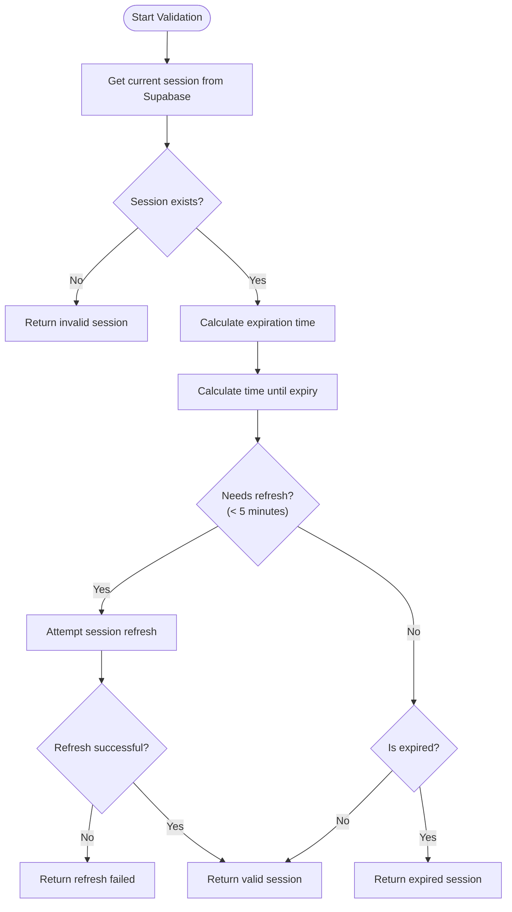
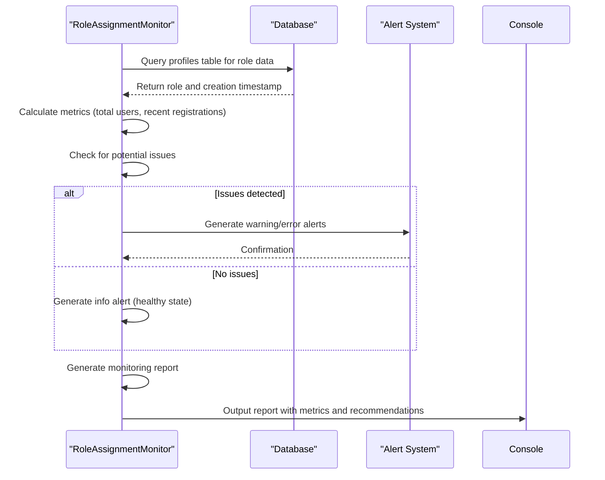
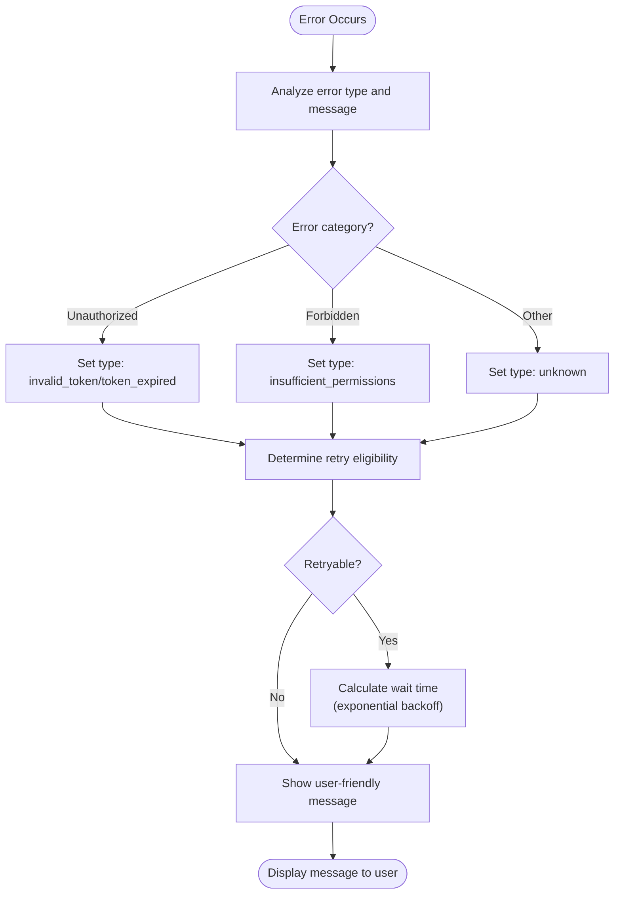

# Security Considerations

<cite>
**Referenced Files in This Document**   
- [session-validation.ts](file://src/lib/session-validation.ts)
- [rls-monitor.ts](file://src/lib/rls-monitor.ts)
- [role-assignment-monitor.ts](file://src/lib/role-assignment-monitor.ts)
- [error-handler.ts](file://src/lib/error-handler.ts)
</cite>

## Table of Contents
1. [Multi-Layered Security Architecture](#multi-layered-security-architecture)
2. [Session Validation Process](#session-validation-process)
3. [Row Level Security Monitoring](#row-level-security-monitoring)
4. [Role Assignment Monitoring](#role-assignment-monitoring)
5. [Error Handling Strategy](#error-handling-strategy)
6. [Security Issue Mitigation](#security-issue-mitigation)
7. [Performance Considerations](#performance-considerations)

## Multi-Layered Security Architecture

The lovable-rise application implements a comprehensive multi-layered security approach that combines session validation, Row Level Security (RLS) monitoring, and role assignment validation to ensure robust protection of user data and system integrity. This architecture is designed to prevent unauthorized access, detect security anomalies, and maintain data privacy through multiple overlapping security mechanisms.

The security framework operates on three primary layers: authentication security through session validation, data access security through RLS monitoring, and authorization security through role assignment monitoring. These layers work in concert to create a defense-in-depth strategy that addresses potential vulnerabilities at multiple points in the application flow. The system leverages Supabase's authentication and RLS capabilities while adding custom monitoring and validation layers to enhance security beyond the default configurations.

**Section sources**
- [session-validation.ts](file://src/lib/session-validation.ts#L1-L50)
- [rls-monitor.ts](file://src/lib/rls-monitor.ts#L1-L50)
- [role-assignment-monitor.ts](file://src/lib/role-assignment-monitor.ts#L1-L50)

## Session Validation Process

The session validation process in the lovable-rise application ensures token authenticity and expiration through a comprehensive validation system implemented in the `SessionValidator` class. This process begins with retrieving the current session from Supabase authentication and validating its integrity by checking for the presence of essential components including the access token, refresh token, and user information.

The validation system implements a refresh threshold of 5 minutes, proactively refreshing sessions that are approaching expiration to prevent interruptions in user experience. When a session is found to be invalid or expired, the system attempts to refresh it using the refresh token before returning an error state. The validation process also includes a mechanism to wait for a valid session during critical operations like registration or login, ensuring that proper token availability is established before proceeding with sensitive operations.



**Diagram sources**
- [session-validation.ts](file://src/lib/session-validation.ts#L42-L150)

**Section sources**
- [session-validation.ts](file://src/lib/session-validation.ts#L42-L343)

## Row Level Security Monitoring

The RLS monitoring system ensures database policies are properly enforced through continuous health checks and real-time validation of RLS context. Implemented in the `RLSMonitor` class, this system performs comprehensive health checks that validate session integrity, token health, and RLS policy enforcement across multiple test operations.

The monitoring process executes three primary RLS tests: profile access validation, menu items access verification, and user permissions access testing. Each test validates that database queries properly respect RLS policies by confirming that users can only access data they are authorized to view. The system measures execution time for each query and tracks failure rates to identify potential performance issues or policy violations.

The RLS monitoring system uses a scoring mechanism to assess overall health, allocating points for session validity (40 points), token health (30 points), and RLS test success (30 points). A score below 80 indicates potential issues that trigger automatic recovery attempts and detailed diagnostic logging. The system also implements automatic session refresh for invalid sessions and logs detailed diagnostics for severe issues with scores below 50.

```mermaid
classDiagram
class RLSMonitor {
+static performHealthCheck() Promise~RLSMonitoringReport~
+static startMonitoring(intervalMs) Function
+static stopMonitoring() void
+static generateDiagnosticReport() Promise~string~
}
class SessionValidator {
+static validateSession() Promise~SessionValidationResult~
+static ensureValidSession() Promise~SessionValidationResult~
+static validateRLSContext() Promise~{isValid, userId, error}~
}
RLSMonitor --> SessionValidator : "uses"
RLSMonitor ..> RLSMonitoringReport : "returns"
class RLSMonitoringReport {
+timestamp : string
+overall : {healthy, score, issues}
+session : SessionValidationResult
+tokenHealth : TokenHealthMetrics
+rlsTests : RLSTestResult[]
+performance : {averageQueryTime, slowQueries, failedQueries}
}
class RLSTestResult {
+testName : string
+success : boolean
+error? : string
+executionTime : number
+rlsContext : {hasValidToken, authUid, tokenType}
}
RLSMonitoringReport --> RLSTestResult : "contains"
```

**Diagram sources**
- [rls-monitor.ts](file://src/lib/rls-monitor.ts#L61-L536)
- [session-validation.ts](file://src/lib/session-validation.ts#L42-L343)

**Section sources**
- [rls-monitor.ts](file://src/lib/rls-monitor.ts#L61-L536)

## Role Assignment Monitoring

The role assignment monitoring system detects unauthorized privilege escalation by continuously tracking role assignments and identifying potential security issues. Implemented in the `RoleAssignmentMonitor` class, this system analyzes user role metrics to ensure that role assignments follow expected patterns and detects any anomalies that might indicate security breaches or system malfunctions.

The monitoring process calculates key metrics including total user counts by role (admin, manager, user), recent registrations within the last 24 hours, and recent role assignments. It specifically watches for potential issues such as users being assigned manager roles upon registration, which could indicate a regression in the role assignment logic. The system also verifies that at least one admin user exists, as the absence of admin users could compromise system administration capabilities.

The monitoring system generates alerts based on detected issues, categorizing them as errors, warnings, or informational messages. Critical alerts are triggered when no admin users are found or when there are signs of unauthorized privilege escalation. The system also validates that the database trigger function responsible for role assignment is working correctly by ensuring that at least 80% of recent registrations receive the appropriate 'user' role.



**Diagram sources**
- [role-assignment-monitor.ts](file://src/lib/role-assignment-monitor.ts#L28-L259)

**Section sources**
- [role-assignment-monitor.ts](file://src/lib/role-assignment-monitor.ts#L28-L259)

## Error Handling Strategy

The error handling strategy in the lovable-rise application prevents information leakage through a comprehensive error categorization and sanitization system. Implemented in the `AuthorizationErrorHandler` class, this strategy analyzes authorization errors and transforms technical error details into user-friendly messages that do not expose system internals.

The error handling system categorizes authorization errors into specific types including 'invalid_token', 'token_expired', 'insufficient_permissions', and 'session_not_ready'. For each error type, the system provides appropriate retry logic, suggested actions, and wait times for retry attempts. The retry strategy varies by error type, allowing more retries for session establishment issues (up to 5 attempts) while limiting retries for expired tokens (2 attempts) and invalid tokens (1 attempt).

The system implements exponential backoff for retry attempts, calculating wait times based on the base wait time for each error type and the current attempt count. This prevents overwhelming the server with rapid retry requests while maintaining a responsive user experience. User-friendly error messages are provided in multiple languages, with English as the fallback, ensuring accessibility while maintaining security by not revealing technical details.



**Diagram sources**
- [error-handler.ts](file://src/lib/error-handler.ts#L77-L197)

**Section sources**
- [error-handler.ts](file://src/lib/error-handler.ts#L77-L197)

## Security Issue Mitigation

The application addresses common security issues such as token theft through multiple mitigation strategies. For token theft prevention, the system implements short-lived access tokens with automatic refresh functionality, reducing the window of opportunity for stolen tokens to be exploited. The session validation process includes token prefix checking and expiration validation to detect and reject compromised tokens.

To prevent privilege escalation, the role assignment monitoring system continuously verifies that role assignments follow expected patterns and immediately alerts administrators to any anomalies. The RLS monitoring system ensures that database policies are consistently enforced, preventing unauthorized data access even if authentication tokens are compromised.

The system also implements header conflict detection to prevent common issues that could lead to 500 errors or security vulnerabilities. During session establishment, the system validates that the Authorization header contains the correct access token and does not conflict with other authentication mechanisms. For registration and login flows, the system includes a waiting mechanism that ensures proper token availability before proceeding with sensitive operations.

**Section sources**
- [session-validation.ts](file://src/lib/session-validation.ts#L42-L343)
- [rls-monitor.ts](file://src/lib/rls-monitor.ts#L61-L536)
- [role-assignment-monitor.ts](file://src/lib/role-assignment-monitor.ts#L28-L259)

## Performance Considerations

Security operations in the lovable-rise application are designed with performance impact in mind, balancing security requirements with request latency considerations. The session validation checks are optimized to minimize network requests by caching validation results and using efficient token expiration calculations based on client-side timestamps.

The RLS monitoring system implements performance metrics tracking, recording query execution times and failure rates to identify potential performance bottlenecks. The system maintains a rolling window of the last 100 query times to calculate average performance while avoiding memory bloat. The continuous monitoring feature can be configured with customizable intervals (default 30 seconds) to balance monitoring frequency with system resource usage.

For high-frequency operations, the system implements a background session monitoring process that proactively refreshes sessions before they expire, preventing the performance impact of on-demand refresh operations during user interactions. The error handling system uses exponential backoff for retry attempts, preventing cascading failures during temporary system issues while maintaining acceptable response times.

The role assignment monitoring system is designed to run on a scheduled basis rather than with every request, minimizing its impact on regular application performance. Database queries for monitoring are optimized with appropriate indexing and limited result sets to ensure they do not degrade overall system performance.

**Section sources**
- [session-validation.ts](file://src/lib/session-validation.ts#L42-L343)
- [rls-monitor.ts](file://src/lib/rls-monitor.ts#L61-L536)
- [role-assignment-monitor.ts](file://src/lib/role-assignment-monitor.ts#L28-L259)