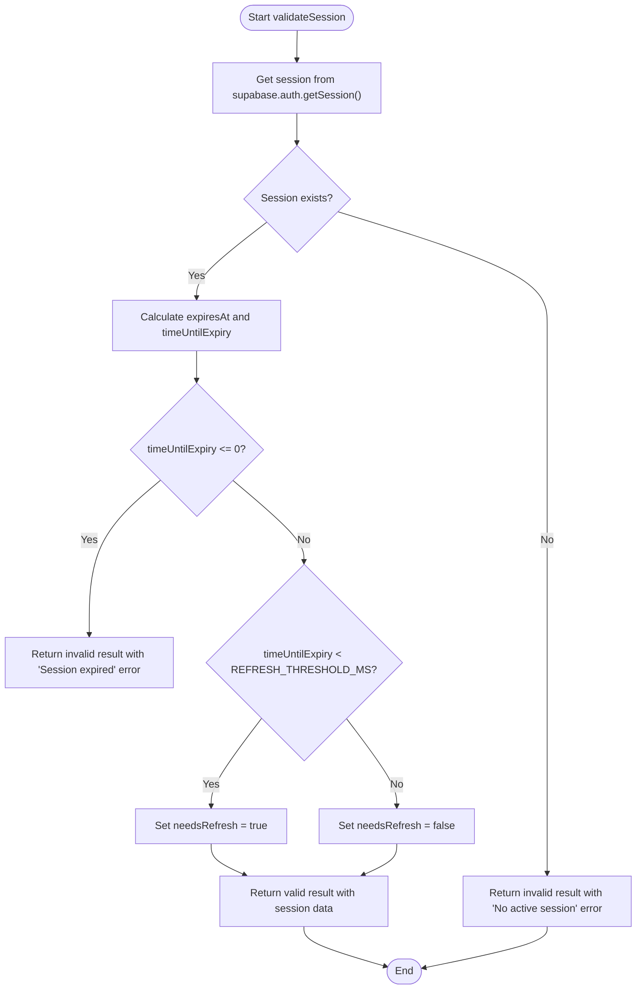
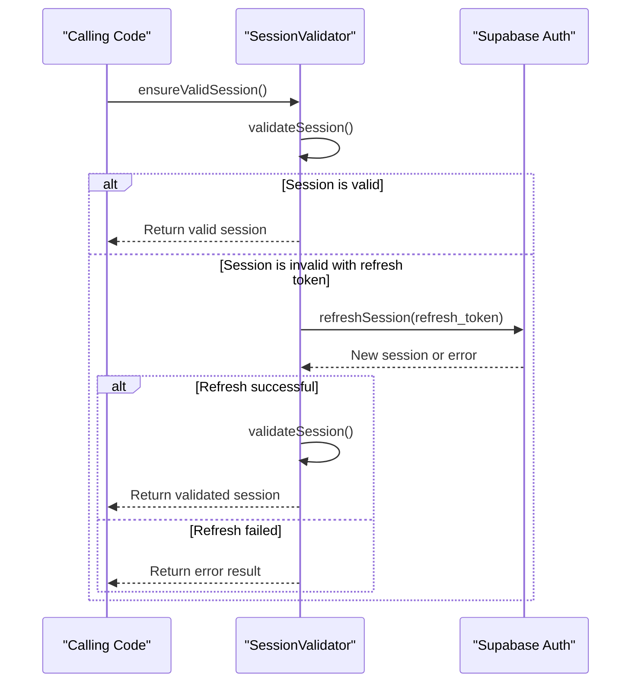
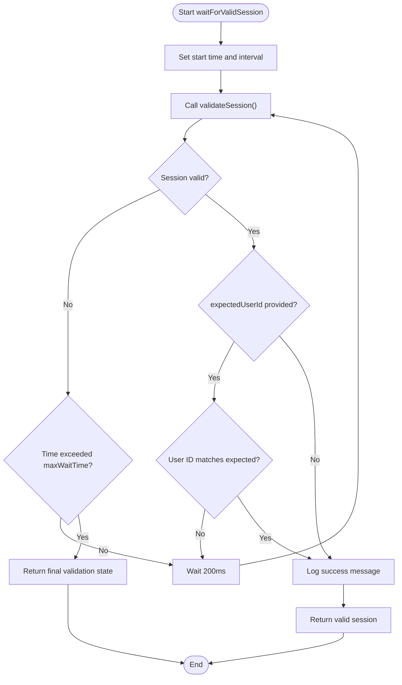
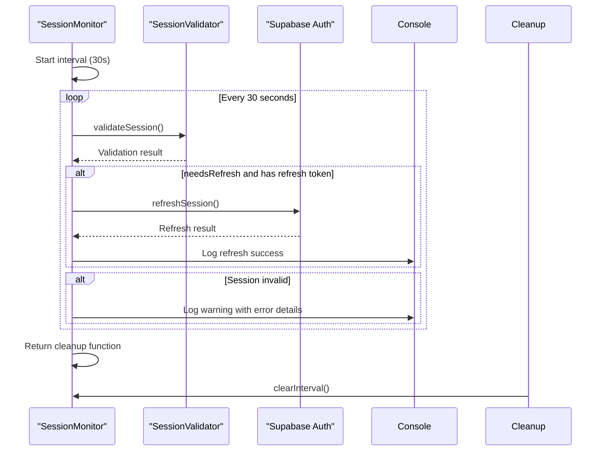
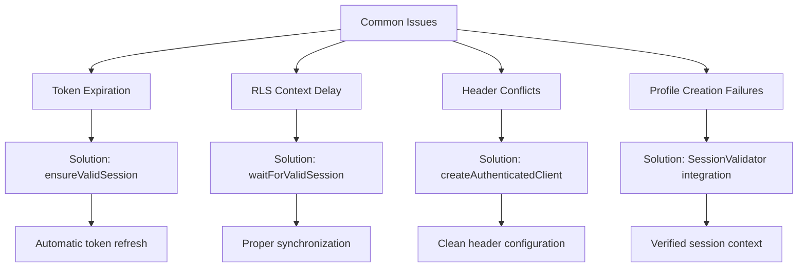

# Session Validation

<cite>
**Referenced Files in This Document**   
- [session-validation.ts](file://src/lib/session-validation.ts)
- [profile-service.ts](file://src/lib/profile-service.ts)
</cite>

## Table of Contents
1. [Introduction](#introduction)
2. [Core Components](#core-components)
3. [Session Validation Process](#session-validation-process)
4. [Token Refresh Mechanism](#token-refresh-mechanism)
5. [Session Synchronization](#session-synchronization)
6. [Debugging Utilities](#debugging-utilities)
7. [Proactive Monitoring](#proactive-monitoring)
8. [Common Issues and Solutions](#common-issues-and-solutions)
9. [Performance Considerations](#performance-considerations)

## Introduction

The SessionValidator class provides a comprehensive solution for managing authentication sessions in the application, specifically addressing token validation, expiration handling, and Row Level Security (RLS) context readiness. This documentation details the implementation of the session validation system that ensures secure and reliable access to protected resources through proper token management and validation.

**Section sources**
- [session-validation.ts](file://src/lib/session-validation.ts#L1-L50)

## Core Components

The session validation system consists of several key components that work together to maintain valid authentication states. The SessionValidator class serves as the central component, providing static methods for session validation, token refresh, and debugging. It works in conjunction with supporting interfaces like SessionValidationResult and TokenDebugInfo that define the structure of validation responses and debug information.

```mermaid
classDiagram
class SessionValidator {
+static readonly REFRESH_THRESHOLD_MS : number
+static readonly SESSION_CHECK_INTERVAL : number
+static validateSession() : Promise~SessionValidationResult~
+static ensureValidSession() : Promise~SessionValidationResult~
+static waitForValidSession(expectedUserId? : string, maxWaitTime : number) : Promise~SessionValidationResult~
+static getTokenDebugInfo() : Promise~TokenDebugInfo~
+static validateRLSContext() : Promise~{isValid : boolean, userId : string | null, error? : string}~
+static logSessionDebugInfo(context : string) : Promise~void~
+static startSessionMonitoring() : () => void
-static detectHeaderConflicts() : {hasConflict : boolean, details? : string}
}
class SessionValidationResult {
+isValid : boolean
+session : Session | null
+user : User | null
+accessToken : string | null
+refreshToken : string | null
+expiresAt : number | null
+timeUntilExpiry : number | null
+needsRefresh : boolean
+error? : string
}
class TokenDebugInfo {
+hasAccessToken : boolean
+hasRefreshToken : boolean
+tokenPrefix : string
+userId : string | null
+isExpired : boolean
+expiresIn : number | null
+sessionAge : number | null
}
SessionValidator --> SessionValidationResult : "returns"
SessionValidator --> TokenDebugInfo : "returns"
```

**Diagram sources**
- [session-validation.ts](file://src/lib/session-validation.ts#L42-L343)

**Section sources**
- [session-validation.ts](file://src/lib/session-validation.ts#L16-L36)

## Session Validation Process

The validateSession method performs comprehensive validation of the current authentication session by checking token authenticity, expiration status, and user information. It retrieves the current session from Supabase, verifies the presence of essential components like access token and user data, and calculates the time until expiration. The method returns a detailed SessionValidationResult object that includes flags for validity, expiration status, and refresh requirements.

The validation process follows these steps:
1. Retrieve the current session from Supabase authentication
2. Check for session existence and authentication errors
3. Calculate expiration time and time until expiry
4. Determine if refresh is needed based on threshold
5. Return comprehensive validation result



**Diagram sources**
- [session-validation.ts](file://src/lib/session-validation.ts#L50-L114)

**Section sources**
- [session-validation.ts](file://src/lib/session-validation.ts#L50-L114)

## Token Refresh Mechanism

The ensureValidSession method implements automatic token refresh functionality for expired sessions. When a session is found to be invalid but has a refresh token available, the method attempts to refresh the session using Supabase's refreshSession API. This ensures that users maintain continuous access to protected resources without requiring manual re-authentication.

The refresh process includes:
1. Initial session validation
2. Detection of invalid session with available refresh token
3. Refresh attempt using refresh token
4. Re-validation of the refreshed session
5. Return of updated validation result



**Diagram sources**
- [session-validation.ts](file://src/lib/session-validation.ts#L120-L153)

**Section sources**
- [session-validation.ts](file://src/lib/session-validation.ts#L120-L153)

## Session Synchronization

The waitForValidSession utility method provides synchronization capabilities during authentication flows, particularly useful during user registration and login processes. It implements a polling mechanism that checks for a valid session at regular intervals until either a valid session is found or a timeout is reached.

Key features of the synchronization process:
- Configurable maximum wait time (default: 10 seconds)
- 200ms polling interval for responsive detection
- Optional user ID verification to ensure correct user context
- Comprehensive logging for debugging authentication flows



**Diagram sources**
- [session-validation.ts](file://src/lib/session-validation.ts#L159-L199)

**Section sources**
- [session-validation.ts](file://src/lib/session-validation.ts#L159-L199)

## Debugging Utilities

The session validation system includes comprehensive debugging utilities to assist with troubleshooting authentication and RLS issues. The getTokenDebugInfo method provides detailed information about token status, while logSessionDebugInfo consolidates session, token, and RLS context information into a single diagnostic log.

Key debugging methods:
- getTokenDebugInfo: Returns token metadata including prefix, expiration, and user ID
- logSessionDebugInfo: Logs comprehensive session state with contextual information
- validateRLSContext: Tests database RLS policies by querying user-specific data
- detectHeaderConflicts: Checks for potential header conflicts that could cause 500 errors

```mermaid
classDiagram
class DebuggingUtilities {
+static getTokenDebugInfo() : Promise~TokenDebugInfo~
+static logSessionDebugInfo(context : string) : Promise~void~
+static validateRLSContext() : Promise~{isValid : boolean, userId : string | null, error? : string}~
+static detectHeaderConflicts() : {hasConflict : boolean, details? : string}
}
DebuggingUtilities --> SessionValidator : "extends"
DebuggingUtilities --> TokenDebugInfo : "returns"
```

**Diagram sources**
- [session-validation.ts](file://src/lib/session-validation.ts#L205-L303)

**Section sources**
- [session-validation.ts](file://src/lib/session-validation.ts#L205-L303)

## Proactive Monitoring

The startSessionMonitoring method implements proactive session health monitoring through periodic background checks. It establishes a 30-second interval timer that continuously validates the session state and automatically refreshes tokens when they approach expiration (within 5 minutes).

Monitoring workflow:
1. Initialize 30-second interval timer
2. Validate session on each interval
3. Proactively refresh session if nearing expiration
4. Log warnings for invalid sessions
5. Return cleanup function to stop monitoring



**Diagram sources**
- [session-validation.ts](file://src/lib/session-validation.ts#L312-L342)

**Section sources**
- [session-validation.ts](file://src/lib/session-validation.ts#L312-L342)

## Common Issues and Solutions

The session validation system addresses several common authentication issues:

### Token Expiration During Long-Running Operations
**Issue**: Access tokens expire during extended operations, causing 401 errors.
**Solution**: The ensureValidSession method automatically refreshes expired tokens before operations begin.

### RLS Context Not Ready After Authentication
**Issue**: Database queries fail with RLS violations immediately after login due to delayed context propagation.
**Solution**: The waitForValidSession method synchronizes operations until the RLS context is fully established.

### Header Conflicts Causing 500 Errors
**Issue**: Conflicting authorization headers cause server errors.
**Solution**: The createAuthenticatedClient utility creates clients with proper header configuration, avoiding apikey conflicts.

### Profile Creation Failures Due to Authorization
**Issue**: Profile creation fails when session context isn't properly established.
**Solution**: The ProfileService integrates with SessionValidator to ensure valid sessions before profile operations.



**Section sources**
- [session-validation.ts](file://src/lib/session-validation.ts#L120-L153)
- [session-validation.ts](file://src/lib/session-validation.ts#L159-L199)
- [session-validation.ts](file://src/lib/session-validation.ts#L375-L398)
- [profile-service.ts](file://src/lib/profile-service.ts#L433-L449)

## Performance Considerations

The session validation system balances security requirements with performance considerations:

### Validation Overhead
- Each validation call makes one Supabase API request
- Methods are designed to minimize redundant calls through proper caching patterns
- The 30-second monitoring interval represents a reasonable trade-off between responsiveness and API usage

### Latency Impact
- Synchronous validation adds minimal latency (typically < 100ms)
- Asynchronous methods like waitForValidSession can introduce up to 10 seconds of additional latency during authentication flows
- Proactive monitoring runs in the background without blocking main operations

### Optimization Strategies
- The REFRESH_THRESHOLD_MS (5 minutes) prevents last-minute refresh attempts that could impact user experience
- The SESSION_CHECK_INTERVAL (30 seconds) balances timely detection with API efficiency
- Methods are designed to fail gracefully when validation cannot be completed

**Section sources**
- [session-validation.ts](file://src/lib/session-validation.ts#L44-L45)
- [session-validation.ts](file://src/lib/session-validation.ts#L50-L114)
- [session-validation.ts](file://src/lib/session-validation.ts#L312-L342)