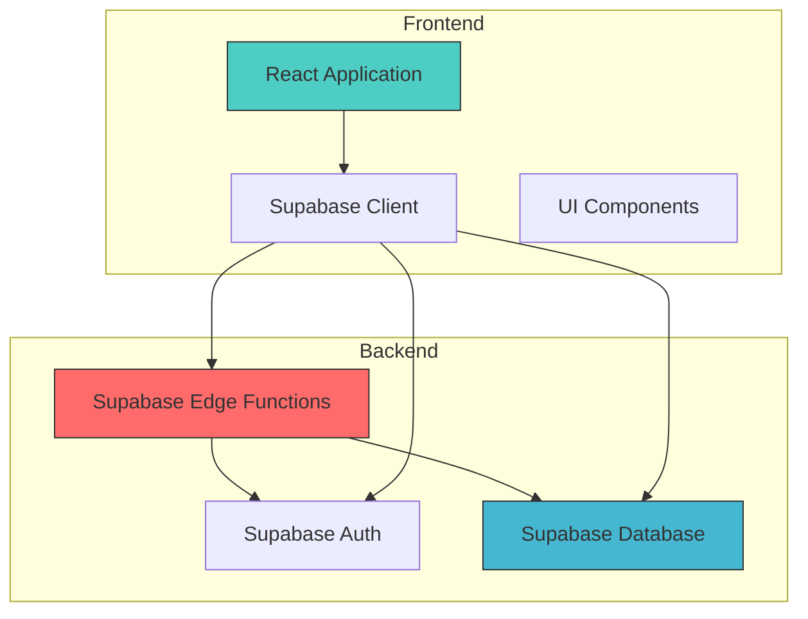
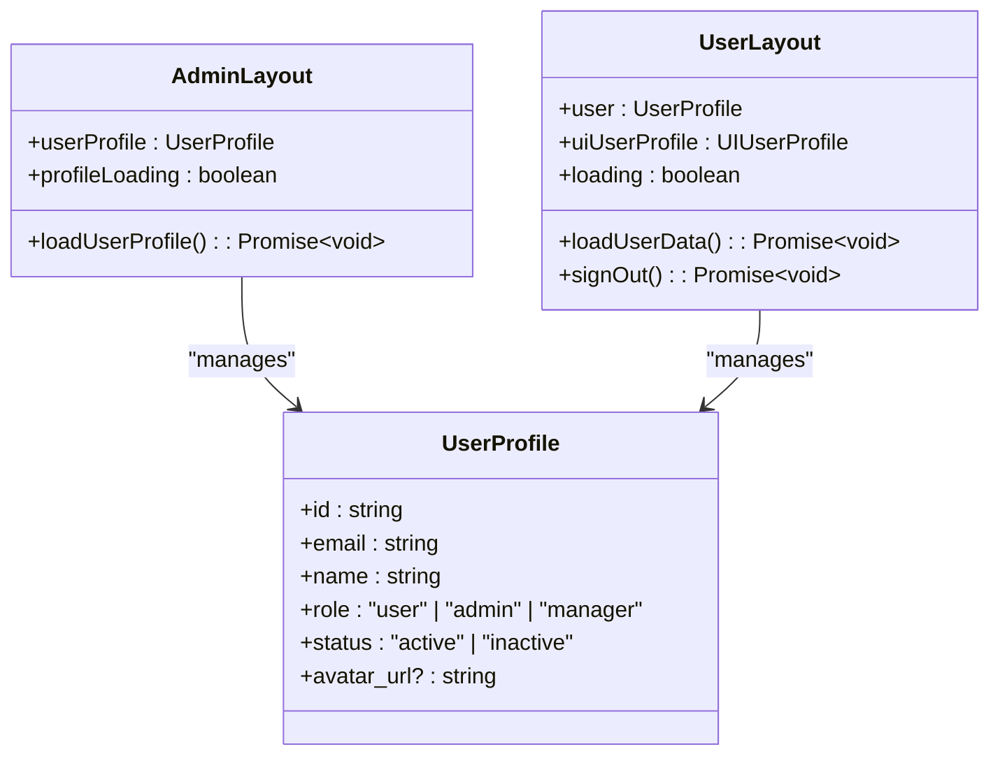
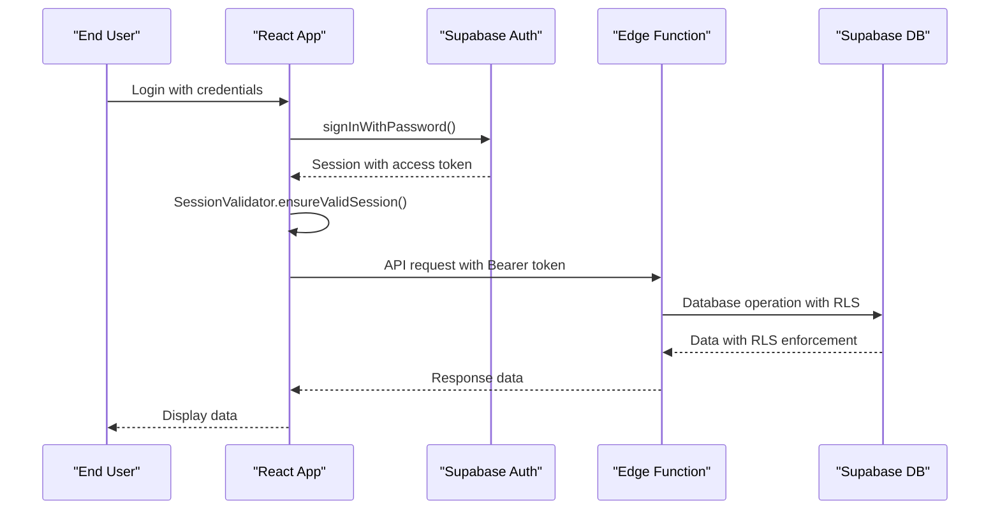
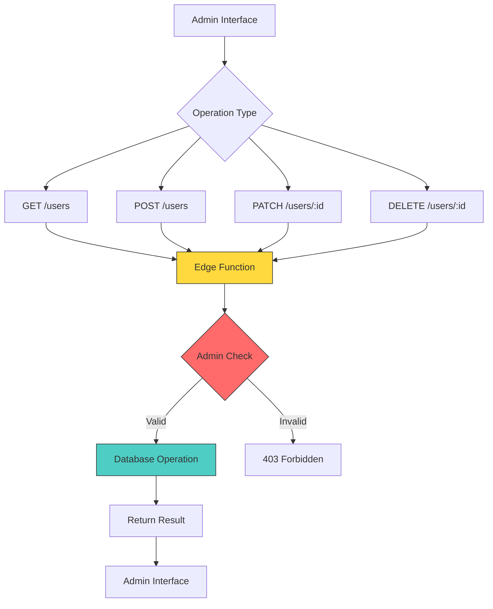
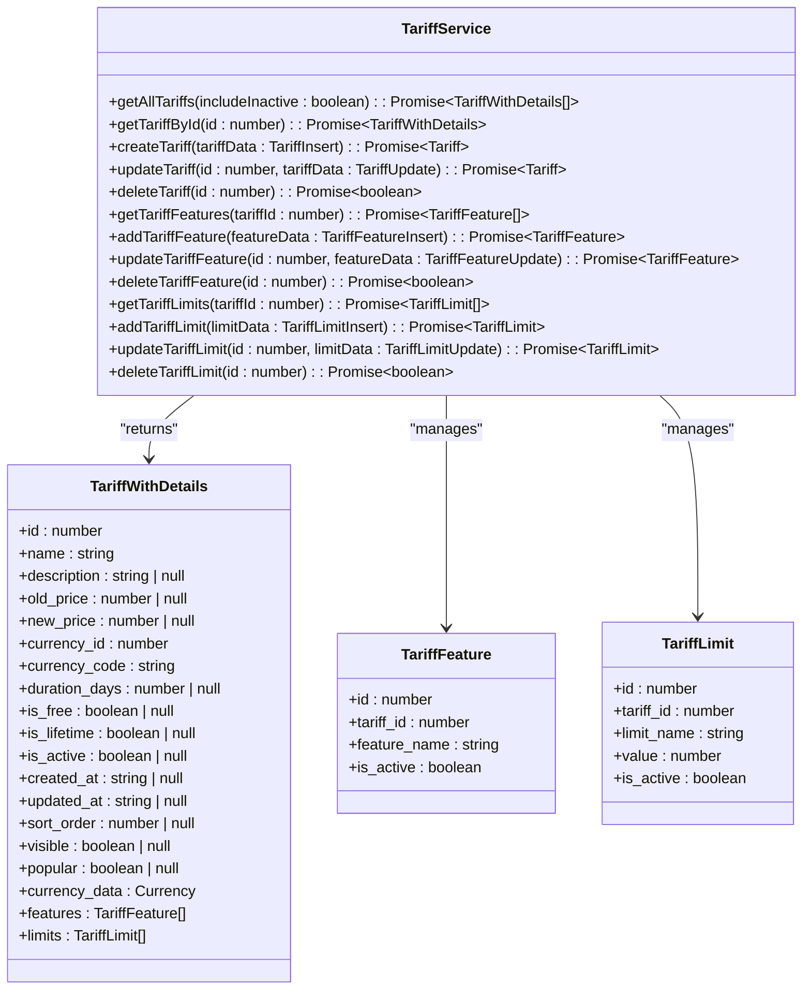
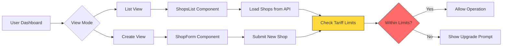
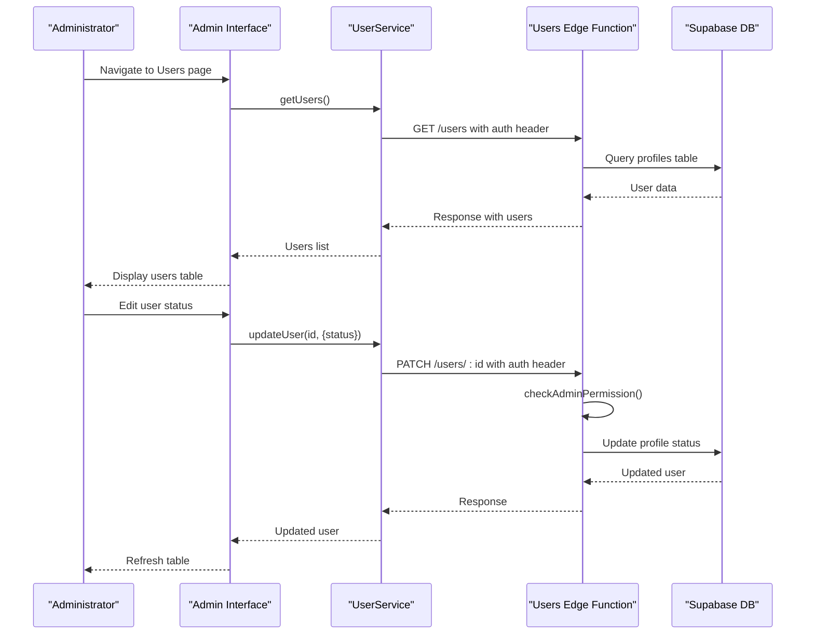

# System Overview

<cite>
**Referenced Files in This Document**   
- [AdminLayout.tsx](file://src/components/AdminLayout.tsx)
- [UserLayout.tsx](file://src/components/UserLayout.tsx)
- [user-service.ts](file://src/lib/user-service.ts)
- [tariff-service.ts](file://src/lib/tariff-service.ts)
- [session-validation.ts](file://src/lib/session-validation.ts)
- [user-auth-service.ts](file://src/lib/user-auth-service.ts)
- [profile-service.ts](file://src/lib/profile-service.ts)
- [UsersTable.tsx](file://src/components/admin/UsersTable.tsx)
- [Shops.tsx](file://src/pages/user/Shops.tsx)
- [supabase/functions/users/index.ts](file://supabase/functions/users/index.ts)
</cite>

## Table of Contents
1. [Introduction](#introduction)
2. [Architecture Overview](#architecture-overview)
3. [Core Components](#core-components)
4. [Authentication and Session Management](#authentication-and-session-management)
5. [User Management System](#user-management-system)
6. [Tariff Management System](#tariff-management-system)
7. [Business Data Management](#business-data-management)
8. [Key User Workflows](#key-user-workflows)
9. [Conclusion](#conclusion)

## Introduction

The lovable-rise application is a comprehensive full-stack platform designed for admin and user management with robust role-based access control, sophisticated tariff management, and comprehensive business data management capabilities. The system combines a modern React frontend with Supabase Edge Functions backend to deliver a scalable and secure solution for managing users, subscriptions, and business operations.

The application serves two primary user roles: administrators who manage the system, users, and subscription plans, and end-users who manage their business operations within the constraints of their assigned tariff plans. The architecture is designed to enforce strict security boundaries through Row Level Security (RLS) policies while providing a seamless user experience.

Key terminology used throughout the system includes:
- **Tariff**: Subscription plans that define user capabilities and limitations
- **Profile**: User information and role assignments stored in the database
- **Session validation**: Process of ensuring authentication tokens are valid and properly configured for RLS policies
- **RLS (Row Level Security)**: Database security mechanism that restricts data access based on user identity

The platform supports critical business operations including user lifecycle management, subscription plan configuration, and business entity management such as shops and products, all within a secure, role-based access control framework.

**Section sources**
- [AdminLayout.tsx](file://src/components/AdminLayout.tsx#L147-L250)
- [UserLayout.tsx](file://src/components/UserLayout.tsx#L233-L331)

## Architecture Overview

The lovable-rise application follows a modern full-stack architecture with a clear separation between frontend and backend components. The system leverages React for the frontend UI, Supabase for backend services including authentication and database management, and Supabase Edge Functions for secure API endpoints that enforce business logic and security policies.

**Diagram sources**
- [AdminLayout.tsx](file://src/components/AdminLayout.tsx#L147-L250)
- [supabase/functions/users/index.ts](file://supabase/functions/users/index.ts#L0-L489)

The architecture implements a security-first approach where direct database access from the frontend is restricted by RLS policies. Instead, most data operations flow through Supabase Edge Functions, which act as API endpoints that validate permissions, enforce business logic, and securely interact with the database. This design pattern ensures that even if frontend code is compromised, attackers cannot bypass security rules implemented in the Edge Functions.

The React frontend uses React Router for navigation between admin and user interfaces, with protected routes that verify authentication status before rendering sensitive content. The UI is built with a component-based architecture using ShadCN UI components, providing a consistent and accessible user experience across different views and functionality.

**Section sources**
- [AdminLayout.tsx](file://src/components/AdminLayout.tsx#L147-L250)
- [supabase/functions/users/index.ts](file://supabase/functions/users/index.ts#L0-L489)

## Core Components

The lovable-rise application is built around several core components that handle user interface rendering, state management, and business logic. The system uses a layout-based component structure with distinct layouts for admin and user interfaces, each providing role-appropriate navigation and functionality.

The AdminLayout component serves as the container for all administrative functionality, handling user profile loading and authentication state management. It ensures that administrators have the necessary permissions to access management features while providing a consistent interface for user and tariff management operations.

**Diagram sources**
- [AdminLayout.tsx](file://src/components/AdminLayout.tsx#L147-L250)
- [UserLayout.tsx](file://src/components/UserLayout.tsx#L233-L331)

The UserLayout component provides the interface for end-users, allowing them to manage their business operations within the constraints of their subscription plan. Both layouts implement similar patterns for user data loading and session management, but expose different functionality based on the user's role.

These components work in conjunction with service classes that handle data operations, ensuring a clean separation between presentation logic and business logic. The layout components are responsible for authentication state management, while specialized service components handle data retrieval and manipulation.

**Section sources**
- [AdminLayout.tsx](file://src/components/AdminLayout.tsx#L147-L250)
- [UserLayout.tsx](file://src/components/UserLayout.tsx#L233-L331)

## Authentication and Session Management

The lovable-rise application implements a robust authentication and session management system using Supabase Auth as the foundation, enhanced with custom validation and error handling to ensure secure and reliable user sessions. The system addresses common challenges with Supabase authentication, particularly around token handling for Row Level Security (RLS) policies.

The SessionValidator class plays a critical role in ensuring authentication integrity by validating session tokens and ensuring they are properly configured for RLS operations. It checks for valid access tokens, verifies session expiration, and handles token refresh when necessary. The validator also provides debugging utilities to diagnose authentication issues that could prevent database operations.

**Diagram sources**
- [session-validation.ts](file://src/lib/session-validation.ts#L80-L122)
- [user-auth-service.ts](file://src/lib/user-auth-service.ts#L732-L760)

The system implements several key patterns to ensure reliable authentication:
- Session validation before all sensitive operations
- Proper token handling to avoid header conflicts
- RLS context validation to ensure database queries have proper user context
- Background session monitoring to proactively refresh expiring tokens

The authentication flow differs slightly between new user registration and existing user login, with special handling for email confirmation workflows. During registration, the system checks for existing profiles before attempting to create a new user, preventing duplicate accounts and ensuring consistent user data management.

**Section sources**
- [session-validation.ts](file://src/lib/session-validation.ts#L80-L122)
- [user-auth-service.ts](file://src/lib/user-auth-service.ts#L732-L760)

## User Management System

The user management system in lovable-rise provides administrators with comprehensive tools for managing user accounts, roles, and status. The system implements a secure architecture where user operations are performed through Supabase Edge Functions rather than direct database access, ensuring that all operations respect RLS policies and business rules.

The UserService class provides methods for all user management operations, including retrieving user lists, creating new users, updating user information, and deleting users. These methods validate the user's session before performing any operations and handle errors appropriately. The service communicates with the Edge Function API using fetch requests with proper authentication headers.

**Diagram sources**
- [user-service.ts](file://src/lib/user-service.ts#L81-L311)
- [supabase/functions/users/index.ts](file://supabase/functions/users/index.ts#L0-L489)

The Edge Function implements strict access control, requiring admin privileges for create, update, and delete operations. It validates the authorization header, extracts the user token, and verifies that the authenticated user has the admin role before proceeding with any modifications. This ensures that only authorized administrators can modify user accounts.

The user interface for user management includes a UsersTable component that displays user information including name, email, role, status, and subscription details. Administrators can sort and filter the user list, edit user information, change user status, and delete users through a dropdown menu interface. The table also shows subscription status, indicating whether a user's tariff plan is active.

**Section sources**
- [user-service.ts](file://src/lib/user-service.ts#L81-L311)
- [UsersTable.tsx](file://src/components/admin/UsersTable.tsx#L0-L412)
- [supabase/functions/users/index.ts](file://supabase/functions/users/index.ts#L0-L489)

## Tariff Management System

The tariff management system in lovable-rise enables administrators to configure subscription plans that define user capabilities and limitations. The system supports complex tariff structures with multiple features, limits, and pricing options, allowing for flexible business models and tiered service offerings.

The TariffService class provides a comprehensive API for managing tariff plans, including creating, reading, updating, and deleting tariffs, as well as managing tariff features and limits. The service optimizes data loading by making separate queries for tariffs, features, and limits, then combining the results to minimize database load while ensuring data consistency.

**Diagram sources**
- [tariff-service.ts](file://src/lib/tariff-service.ts#L39-L720)

The system supports various tariff configurations including free plans, time-limited plans, and lifetime plans. Each tariff can have multiple features that describe what is included in the plan, and limits that restrict usage of specific resources. For example, a tariff might include a feature for "Unlimited projects" and a limit of "Storage (GB): 50".

Administrators can view tariff statistics through the TariffStatisticsCard component, which displays key metrics such as the number of active tariffs, free tariffs, and paid tariffs. This provides a quick overview of the subscription plan landscape and helps administrators make informed decisions about pricing and plan offerings.

**Section sources**
- [tariff-service.ts](file://src/lib/tariff-service.ts#L39-L720)
- [TariffStatisticsCard.tsx](file://src/components/admin/TariffStatisticsCard.tsx#L0-L58)

## Business Data Management

The business data management system in lovable-rise enables end-users to manage their business operations within the constraints of their assigned tariff plans. The system includes functionality for managing shops, products, and suppliers, with appropriate limits enforced based on the user's subscription level.

The shop management system allows users to create and manage multiple shops, with the number of allowed shops determined by their tariff plan. The Shops component implements a view mode pattern, allowing users to switch between a list view of their shops and a form view for creating new shops. When creating a new shop, the system checks against the user's tariff limits to ensure they have not exceeded their allowed quota.

**Diagram sources**
- [Shops.tsx](file://src/pages/user/Shops.tsx#L0-L135)

The ShopService class provides methods for all shop operations, including retrieving the user's shops, creating new shops, and deleting existing shops. Before creating a new shop, the service checks the user's current shop count against their tariff limit to ensure compliance with their subscription plan. This prevents users from exceeding their allowed resource usage.

The system implements a responsive UI that adapts to different screen sizes, with mobile-friendly navigation and layout. The user interface provides clear feedback about resource usage, displaying the current count of shops against the maximum allowed in the page header. When a user reaches their limit, the system displays a toast notification suggesting they upgrade their plan to create additional shops.

**Section sources**
- [Shops.tsx](file://src/pages/user/Shops.tsx#L0-L135)
- [shop-service.ts](file://src/lib/shop-service.ts)

## Key User Workflows

The lovable-rise application supports several key user workflows that represent common operations performed by administrators and end-users. These workflows demonstrate how the various components of the system work together to provide a seamless user experience while enforcing security and business rules.

For administrators, a common workflow is managing users, which involves viewing the list of users, filtering or sorting the list, editing user information, and changing user status. The administrator accesses the user management page, which loads the UsersTable component. This component fetches the user list from the UserService, which in turn calls the Edge Function API. The administrator can then use the interface to edit a user's information, which triggers an update operation through the UserService.

**Diagram sources**
- [UsersTable.tsx](file://src/components/admin/UsersTable.tsx#L0-L412)
- [user-service.ts](file://src/lib/user-service.ts#L81-L311)
- [supabase/functions/users/index.ts](file://supabase/functions/users/index.ts#L0-L489)

For end-users, a common workflow is managing shops, which involves viewing existing shops, creating new shops, and deleting shops. The user accesses the shops page, which initially displays the list view. If the user has not reached their tariff limit, they can click a button to switch to the create view and add a new shop. The system checks the user's current shop count against their tariff limit before allowing the creation of a new shop.

These workflows demonstrate the end-to-end operation of the system, from user interface interactions through service layer processing to database operations, with appropriate security checks and business rule enforcement at each step.

**Section sources**
- [UsersTable.tsx](file://src/components/admin/UsersTable.tsx#L0-L412)
- [Shops.tsx](file://src/pages/user/Shops.tsx#L0-L135)

## Conclusion

The lovable-rise application is a sophisticated full-stack platform that effectively combines React frontend technologies with Supabase backend services to deliver a comprehensive admin and user management solution. The system's architecture prioritizes security through the use of Supabase Edge Functions and Row Level Security policies, ensuring that data access is properly controlled and business rules are consistently enforced.

Key strengths of the system include its robust authentication and session management, comprehensive user and tariff management capabilities, and flexible business data management features. The application successfully implements role-based access control, allowing administrators to manage users and subscription plans while enabling end-users to operate within the constraints of their assigned tariffs.

The codebase demonstrates several best practices in modern web development, including separation of concerns between UI components and service classes, proper error handling and validation, and optimization of database queries to minimize load. The use of TypeScript provides strong typing throughout the application, reducing the likelihood of runtime errors and improving code maintainability.

Future enhancements could include additional analytics features, more sophisticated tariff plan configurations, and expanded integration capabilities. However, the current implementation provides a solid foundation for a scalable and secure user management platform that can support a wide range of business requirements.