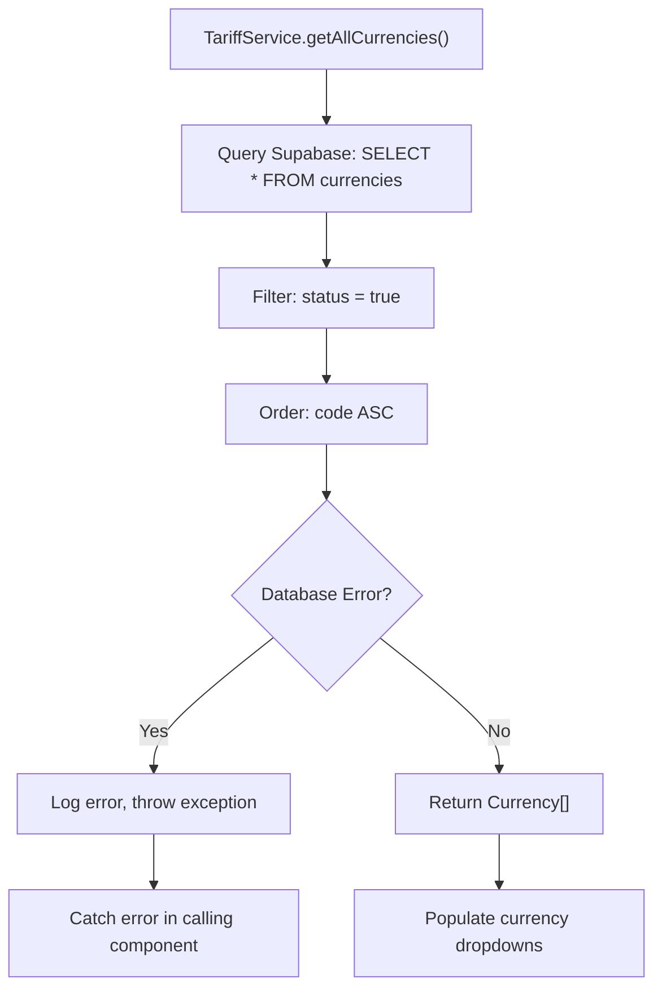
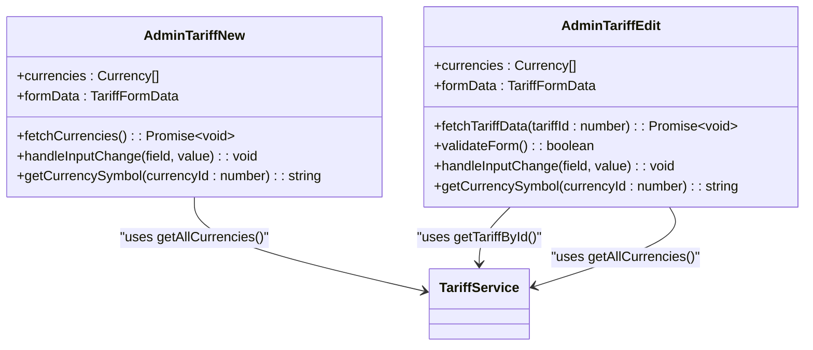
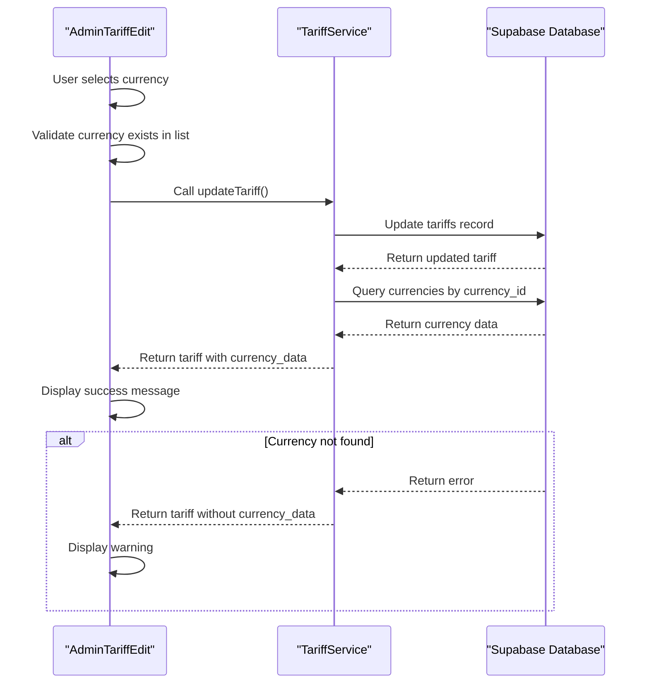
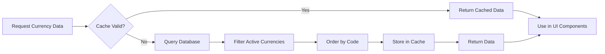
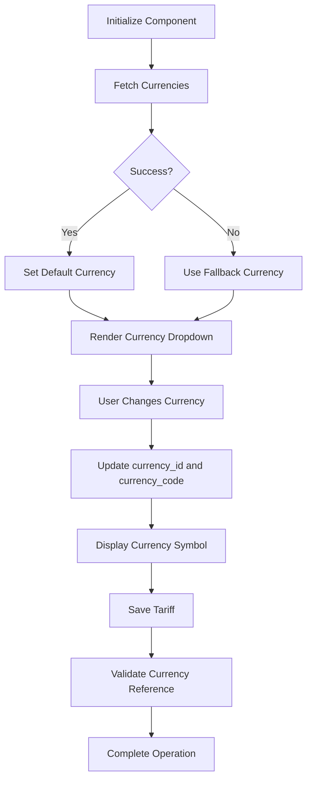

# Currency Management

<cite>
**Referenced Files in This Document**   
- [tariff-service.ts](file://src/lib/tariff-service.ts)
- [AdminTariffEdit.tsx](file://src/pages/admin/AdminTariffEdit.tsx)
- [AdminTariffNew.tsx](file://src/pages/admin/AdminTariffNew.tsx)
- [CurrencyManagement.tsx](file://src/pages/admin/settings/CurrencyManagement.tsx)
- [tariff-cache.ts](file://src/lib/tariff-cache.ts)
</cite>

## Table of Contents
1. [Introduction](#introduction)
2. [Currency Data Model and Relationships](#currency-data-model-and-relationships)
3. [TariffService.getAllCurrencies Implementation](#tariffservicegetallcurrencies-implementation)
4. [Currency Integration in Tariff Flows](#currency-integration-in-tariff-flows)
5. [AdminTariffEdit and AdminTariffNew Components](#admintariffedit-and-admintariffnew-components)
6. [Error Handling and Data Validation](#error-handling-and-data-validation)
7. [Currency Field Naming Inconsistencies](#currency-field-naming-inconsistencies)
8. [Performance Considerations and Caching](#performance-considerations-and-caching)
9. [Usage Examples and Code Patterns](#usage-examples-and-code-patterns)
10. [Currency Management Interface](#currency-management-interface)

## Introduction
The Currency Management functionality enables international tariff pricing by providing a robust system for handling multiple currencies in tariff plans. This document details the implementation of the `TariffService.getAllCurrencies` method and its integration with tariff creation and editing flows. The system supports international pricing through a comprehensive currency management solution that maps currency data to tariff records using both `currency_id` and `currency_code` fields. The implementation ensures that tariff plans can be configured with appropriate currency settings for global customers, supporting business expansion across different regions and markets.

## Currency Data Model and Relationships
The currency management system is built around a relational data model that connects tariffs with their corresponding currency information. The primary relationship exists between the `tariffs` table and the `currencies` table, established through the `currency_id` foreign key. Each tariff record maintains a reference to its currency through the `currency_id` field, while also storing the `currency_code` for quick access and display purposes.

The data model includes bidirectional mapping between currency identifiers and codes, ensuring consistency across the application. When a tariff is created or updated, both the `currency_id` and `currency_code` fields are populated to provide redundancy and improve data integrity. This dual-field approach allows the system to maintain referential integrity through the numeric `currency_id` while enabling efficient filtering and display operations using the textual `currency_code`.

The relationship is implemented as a one-to-many association, where a single currency can be associated with multiple tariff plans, but each tariff is linked to exactly one currency. This design supports the business requirement of offering the same currency options across different tariff tiers while maintaining data normalization principles. The currency records themselves contain essential information such as the currency code (e.g., USD, EUR), name, exchange rate, and status flags that determine visibility and availability.

**Section sources**
- [tariff-service.ts](file://src/lib/tariff-service.ts#L477-L491)
- [CurrencyManagement.tsx](file://src/pages/admin/settings/CurrencyManagement.tsx#L10-L364)

## TariffService.getAllCurrencies Implementation
The `TariffService.getAllCurrencies` method provides the core functionality for retrieving currency data from the system. This static method is implemented within the `TariffService` class and serves as the primary interface for accessing currency information throughout the application. The implementation follows a straightforward pattern of querying the Supabase database for active currencies, ordering them by code for consistent presentation.

The method executes a database query against the `currencies` table, selecting all columns while filtering for records where the `status` field equals `true`. This ensures that only active currencies are returned to the client application, preventing the display of disabled or archived currency options in tariff configuration interfaces. The results are ordered alphabetically by the `code` field to provide a predictable and user-friendly sorting order.

Error handling is implemented comprehensively within the method, with try-catch blocks that capture and log any database errors while re-throwing them for upstream handling. Successful responses are returned as an array of `Currency` objects, typed according to the database schema definition. The method returns only active currencies, as determined by the `status` field in the database, ensuring that tariff creation and editing interfaces only present valid currency options to administrators.

The implementation demonstrates a clean separation of concerns by focusing solely on data retrieval without incorporating business logic or presentation concerns. This approach allows the method to be reused across different components and contexts while maintaining consistency in currency data access patterns throughout the application.

**Diagram sources **
- [tariff-service.ts](file://src/lib/tariff-service.ts#L477-L491)

**Section sources**
- [tariff-service.ts](file://src/lib/tariff-service.ts#L477-L491)

## Currency Integration in Tariff Flows
The currency system is deeply integrated into both tariff creation and editing workflows, ensuring consistent handling of currency data across different operational contexts. During tariff creation, the system initializes default currency values, typically setting USD as the default currency with appropriate fallbacks when currency data cannot be retrieved. The integration follows a pattern of first creating the tariff record and then separately fetching the associated currency data to populate the `currency_data` property.

When editing existing tariffs, the system retrieves the complete tariff record including its currency association through the `getTariffById` method. This method performs a separate query to fetch currency data based on the `currency_id` field, ensuring that the currency information is up-to-date and consistent with the current state of the currency management system. The integration handles both `currency_id` and `currency` field references, providing backward compatibility while migrating to the standardized `currency_id` field.

The currency integration includes business rule enforcement, such as automatically updating the `currency_code` when the `currency_id` changes in the user interface. This ensures data consistency between the numeric identifier and textual code representation. The system also implements defensive checks to validate that selected currencies exist in the available currencies list, preventing the saving of tariffs with invalid or non-existent currency references.

Throughout both creation and editing flows, the currency data is used to enhance the user experience by displaying appropriate currency symbols in price input fields and providing meaningful labels in dropdown selectors. This integration ensures that administrators can clearly see the currency context when configuring tariff pricing, reducing the likelihood of configuration errors in international pricing setups.

**Section sources**
- [tariff-service.ts](file://src/lib/tariff-service.ts#L230-L270)
- [tariff-service.ts](file://src/lib/tariff-service.ts#L272-L313)

## AdminTariffEdit and AdminTariffNew Components
The `AdminTariffEdit` and `AdminTariffNew` components implement the user interface for managing tariff currency settings, providing administrators with tools to configure currency options for tariff plans. Both components share a common implementation pattern for currency handling, ensuring consistency between tariff creation and editing experiences.

The `AdminTariffNew` component initializes with a default currency selection, typically USD, and fetches the complete list of active currencies during component initialization. The currency selection is implemented as a dropdown menu that displays both the currency code and name, providing clear identification for administrators. When a currency is selected, the component automatically updates both the `currency_id` and `currency_code` fields in the form data, maintaining data consistency.

The `AdminTariffEdit` component extends this functionality by first loading the existing tariff's currency data and pre-selecting the appropriate option in the dropdown. It includes additional validation to ensure that the tariff's currency remains valid even if currency options have changed since the tariff was originally created. The component implements a defensive check that validates the selected currency against the available currencies list, preventing the display of invalid or deleted currency options.

Both components use the `getCurrencySymbol` utility function to display appropriate currency symbols in price input fields, enhancing the user experience by providing visual context for the selected currency. The components also handle edge cases such as missing currency data by providing sensible fallbacks and error messages, ensuring that the interface remains functional even when currency data cannot be retrieved from the server.

**Diagram sources **
- [AdminTariffNew.tsx](file://src/pages/admin/AdminTariffNew.tsx#L35-L858)
- [AdminTariffEdit.tsx](file://src/pages/admin/AdminTariffEdit.tsx#L39-L1218)

**Section sources**
- [AdminTariffNew.tsx](file://src/pages/admin/AdminTariffNew.tsx#L35-L858)
- [AdminTariffEdit.tsx](file://src/pages/admin/AdminTariffEdit.tsx#L39-L1218)

## Error Handling and Data Validation
The currency management system implements comprehensive error handling and data validation to ensure data integrity and provide a robust user experience. Validation occurs at multiple levels, including form-level validation in the UI components and server-side validation in the database layer.

Form-level validation in the `AdminTariffEdit` and `AdminTariffNew` components includes checks for required currency selection, ensuring that administrators cannot save tariffs without specifying a currency. The validation also includes a defensive check that verifies the selected `currency_id` exists in the available currencies list, preventing the saving of tariffs with invalid currency references. When validation fails, descriptive error messages are displayed to guide administrators in correcting their input.

The `TariffService` methods implement robust error handling for database operations, with try-catch blocks that capture and log errors while providing meaningful feedback to calling components. When currency data cannot be retrieved, the system implements graceful degradation by returning tariff records without currency data rather than failing completely. This approach ensures that core tariff functionality remains available even when currency data is temporarily unavailable.

Server-side validation is enforced through database constraints, including foreign key relationships that prevent the creation of tariffs with non-existent currency IDs. The system also handles edge cases such as currency deletion by preventing the removal of currencies that are currently referenced by active tariffs, or by requiring administrators to update affected tariffs before deletion can proceed.

**Diagram sources **
- [tariff-service.ts](file://src/lib/tariff-service.ts#L230-L270)
- [tariff-service.ts](file://src/lib/tariff-service.ts#L272-L313)
- [AdminTariffEdit.tsx](file://src/pages/admin/AdminTariffEdit.tsx#L183-L208)

**Section sources**
- [tariff-service.ts](file://src/lib/tariff-service.ts#L230-L270)
- [tariff-service.ts](file://src/lib/tariff-service.ts#L272-L313)
- [AdminTariffEdit.tsx](file://src/pages/admin/AdminTariffEdit.tsx#L183-L208)

## Currency Field Naming Inconsistencies
The system addresses currency field naming inconsistencies through a transitional implementation strategy that supports both `currency` and `currency_id` field names. This approach ensures backward compatibility while migrating to a standardized field naming convention. The `TariffService` methods implement logic to handle both field names, checking for `currency_id` first and falling back to `currency` if the preferred field is not present.

This dual-field support is implemented consistently across all tariff operations, including creation, updating, and retrieval. When creating or updating tariffs, the system explicitly uses the `currency_id` field name in the database operations while also including the `currency_code` field for completeness. During data retrieval, the service checks both field names in the returned data to ensure compatibility with existing records that may use the older `currency` field name.

The transitional strategy includes automatic mapping between the numeric `currency_id` and textual `currency_code`, ensuring that both fields remain synchronized. When a tariff is saved, the system updates both fields based on the selected currency, preventing inconsistencies between the identifier and code representation. This approach allows for a gradual migration to the standardized `currency_id` field without disrupting existing functionality or data integrity.

The system also includes defensive programming practices to handle cases where currency data might be missing or invalid, providing default values and fallback mechanisms to ensure that tariff operations can proceed even in edge cases. This comprehensive approach to field naming inconsistencies ensures a smooth transition to the standardized naming convention while maintaining system stability and data consistency.

**Section sources**
- [tariff-service.ts](file://src/lib/tariff-service.ts#L230-L270)
- [tariff-service.ts](file://src/lib/tariff-service.ts#L272-L313)
- [tariff-service.ts](file://src/lib/tariff-service.ts#L621-L655)

## Performance Considerations and Caching
The currency management system incorporates several performance optimizations to ensure efficient data retrieval and minimize database load. The primary optimization is implemented in the `getAllCurrencies` method, which retrieves all active currencies in a single database query with appropriate filtering and sorting. This approach minimizes round-trips to the database and reduces latency in currency-dependent operations.

The system leverages the `tariff-cache.ts` module to implement caching strategies for frequently accessed data. While the current implementation focuses on caching tariff data, the architecture supports extending caching to currency data as well. The cache uses a time-based invalidation strategy with a configurable duration, ensuring that data remains fresh while reducing the frequency of database queries.

Additional performance optimizations include the use of indexed database queries, with the `currency_id` field serving as a primary key and the `code` field indexed for efficient lookups. The system also implements client-side caching of currency data within components, preventing unnecessary re-fetching when navigating between tariff management interfaces.

The implementation follows a lazy loading pattern for currency data, retrieving currency information only when needed rather than pre-loading all currency data application-wide. This approach conserves memory and network resources, particularly in scenarios where users may not access currency-dependent features during their session.

**Diagram sources **
- [tariff-cache.ts](file://src/lib/tariff-cache.ts#L1-L47)
- [tariff-service.ts](file://src/lib/tariff-service.ts#L477-L491)

**Section sources**
- [tariff-cache.ts](file://src/lib/tariff-cache.ts#L1-L47)
- [tariff-service.ts](file://src/lib/tariff-service.ts#L477-L491)

## Usage Examples and Code Patterns
The currency management system demonstrates several effective code patterns for handling currency data in tariff operations. One key pattern is the separation of data retrieval from business logic, with the `TariffService.getAllCurrencies` method focusing solely on data access while components handle presentation and user interaction concerns.

A common usage pattern involves initializing form data with default currency values and then updating both `currency_id` and `currency_code` fields simultaneously when the selection changes. This ensures data consistency and prevents synchronization issues between the identifier and code representation. The pattern is implemented in both `AdminTariffNew` and `AdminTariffEdit` components through the `handleInputChange` method.

Another important pattern is the use of defensive programming to handle edge cases such as missing currency data. The system implements fallback values and error recovery mechanisms that allow tariff operations to proceed even when currency data cannot be retrieved. This approach enhances system reliability and provides a better user experience during temporary service disruptions.

The implementation also demonstrates effective error handling patterns, with comprehensive try-catch blocks that capture and log errors while providing meaningful feedback to users. The patterns include specific error messages for different failure scenarios, helping administrators understand and resolve issues quickly.

**Diagram sources **
- [AdminTariffNew.tsx](file://src/pages/admin/AdminTariffNew.tsx#L35-L858)
- [AdminTariffEdit.tsx](file://src/pages/admin/AdminTariffEdit.tsx#L39-L1218)

**Section sources**
- [AdminTariffNew.tsx](file://src/pages/admin/AdminTariffNew.tsx#L35-L858)
- [AdminTariffEdit.tsx](file://src/pages/admin/AdminTariffEdit.tsx#L39-L1218)

## Currency Management Interface
The Currency Management interface provides administrators with comprehensive tools for managing currency options used in tariff pricing. Implemented in the `CurrencyManagement.tsx` component, the interface displays a table of all currencies with their key attributes including code, name, exchange rate, and status. Administrators can create new currencies, edit existing ones, and toggle their active status directly from the interface.

The interface includes validation to prevent the creation of duplicate currency codes and protects the base currency from deletion. When editing currencies, the system enforces data integrity by requiring all fields to be completed and validating the exchange rate as a positive number. The status toggle allows administrators to deactivate currencies without deleting them, preserving historical tariff data while preventing the currency from being selected for new tariffs.

The interface is integrated with the tariff management system through the `TariffService.getAllCurrencies` method, ensuring that changes to currency data are immediately reflected in tariff creation and editing interfaces. This real-time synchronization maintains data consistency across the application and provides administrators with confidence that their currency configurations are up-to-date.

**Section sources**
- [CurrencyManagement.tsx](file://src/pages/admin/settings/CurrencyManagement.tsx#L10-L364)