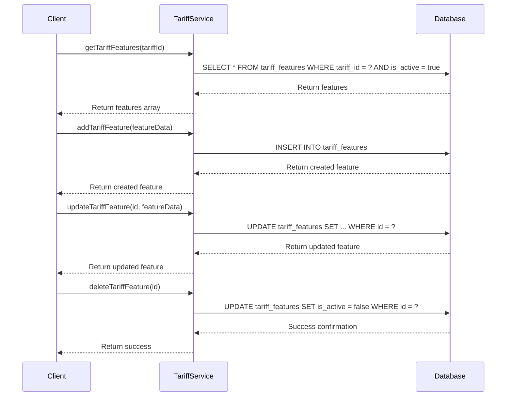
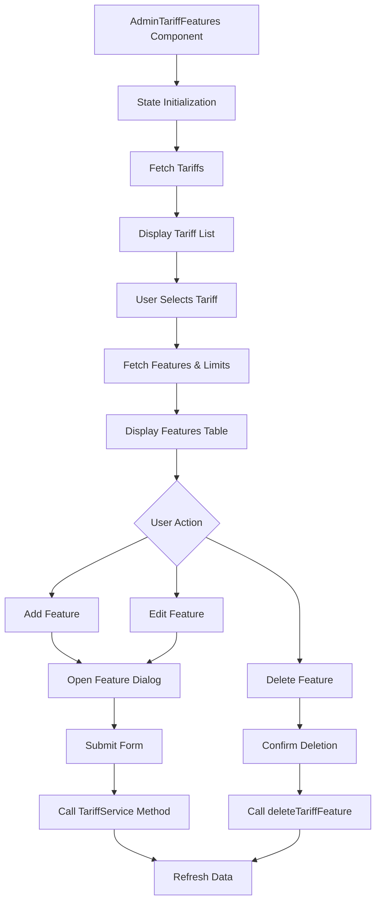

# Feature Management

<cite>
**Referenced Files in This Document**   
- [tariff-service.ts](file://src/lib/tariff-service.ts)
- [AdminTariffFeatures.tsx](file://src/pages/admin/AdminTariffFeatures.tsx)
</cite>

## Table of Contents
1. [Introduction](#introduction)
2. [Tariff Feature Service Methods](#tariff-feature-service-methods)
3. [AdminTariffFeatures Component](#admintarifffeatures-component)
4. [Feature Data Structure and Validation](#feature-data-structure-and-validation)
5. [Relationship with Parent Tariff Entity](#relationship-with-parent-tariff-entity)
6. [Common Issues and Solutions](#common-issues-and-solutions)
7. [Performance Considerations](#performance-considerations)
8. [Usage Examples](#usage-examples)

## Introduction
This document provides comprehensive documentation for the Feature Management functionality within tariff plans. It details the implementation of key TariffService methods for managing tariff features, explains the AdminTariffFeatures component's functionality, and covers important aspects such as data structure, validation, and performance considerations. The feature management system enables administrators to create, update, and manage features associated with different tariff plans, providing flexibility in defining what each pricing tier offers to users.

## Tariff Feature Service Methods
The TariffService class provides four core methods for managing tariff features: getTariffFeatures, addTariffFeature, updateTariffFeature, and deleteTariffFeature. These methods interact with the tariff_features table in the database to perform CRUD operations.

The getTariffFeatures method retrieves all active features for a specific tariff by tariffId, filtering by is_active = true and ordering by feature_name alphabetically. This ensures that only currently active features are returned to the client.

The addTariffFeature method inserts a new feature into the database with the provided featureData, which includes the tariff_id, feature_name, and is_active status. The method returns the created feature object upon successful insertion.

The updateTariffFeature method modifies an existing feature by its ID with the provided featureData. It uses the Supabase update operation with an equality filter on the feature ID to ensure the correct record is modified.

The deleteTariffFeature method removes a feature from the system by its ID. It performs a soft delete by setting the is_active flag to false rather than permanently removing the record, preserving historical data.



**Diagram sources**
- [tariff-service.ts](file://src/lib/tariff-service.ts#L339-L405)

**Section sources**
- [tariff-service.ts](file://src/lib/tariff-service.ts#L339-L405)

## AdminTariffFeatures Component
The AdminTariffFeatures component provides a user interface for administrators to manage tariff features and limits. It displays a list of available tariffs in a sidebar, allowing selection of a specific tariff to manage its features and limits.

When a tariff is selected, the component fetches and displays all active features and limits associated with that tariff. Features are displayed in a table with columns for feature name, status (active/inactive), and action buttons for editing and deletion.

The component implements form interactions for creating and updating features through a dialog interface. When adding a new feature, the form requires a feature name and allows setting the active status. For existing features, the same form is used for editing with pre-filled values.

State management in the component includes:
- tariffs: Array of all available tariffs
- features: Array of features for the selected tariff
- limits: Array of limits for the selected tariff
- selectedTariff: Currently selected tariff for management
- editingFeature: Feature being edited (if any)
- featureFormData: Form data for feature creation/editing

The component handles state updates through various event handlers that modify the component's state and synchronize with the backend via the TariffService methods. When a feature is added, updated, or deleted, the component refreshes the feature list to reflect changes.



**Diagram sources**
- [AdminTariffFeatures.tsx](file://src/pages/admin/AdminTariffFeatures.tsx#L26-L58)

**Section sources**
- [AdminTariffFeatures.tsx](file://src/pages/admin/AdminTariffFeatures.tsx#L26-L58)

## Feature Data Structure and Validation
The feature data structure is defined by the TariffFeature type, which includes the following properties:
- id: Unique identifier for the feature
- tariff_id: Foreign key linking to the parent tariff
- feature_name: Text description of the feature
- is_active: Boolean flag indicating if the feature is currently active

Validation is implemented at multiple levels. Client-side validation in the AdminTariffFeatures component ensures that the feature name is not empty before submitting the form. The component displays an error toast if validation fails.

Server-side validation is handled by the database constraints and Supabase's built-in validation. The database schema enforces that feature_name is a non-null varchar(255) field, preventing empty or excessively long feature names.

The component also implements business logic validation by filtering out inactive features when displaying the feature list. Only features with is_active = true are shown in the main table, though administrators can still access and reactivate previously deactivated features.

When creating or updating features, the system validates that a tariff is selected before allowing feature operations. The UI disables feature management controls when no tariff is selected, preventing invalid operations.

**Section sources**
- [tariff-service.ts](file://src/lib/tariff-service.ts#L339-L405)
- [AdminTariffFeatures.tsx](file://src/pages/admin/AdminTariffFeatures.tsx#L87-L130)

## Relationship with Parent Tariff Entity
Tariff features have a one-to-many relationship with the parent tariff entity, enforced by a foreign key constraint in the database. The tariff_id field in the tariff_features table references the id field in the tariffs table with ON DELETE CASCADE behavior.

This relationship means that when a tariff is deleted, all associated features are automatically removed from the database. However, in practice, tariffs are typically deactivated rather than deleted to preserve historical data and subscription information.

The system implements active status filtering at the service level. The getTariffFeatures method automatically filters for is_active = true, ensuring that only active features are returned to the client. This allows administrators to deactivate features without losing their configuration, enabling easy reactivation when needed.

When retrieving tariff data, the system loads features as a nested collection within the tariff object. This is done through separate database queries rather than joins, optimizing performance by reducing data transfer and allowing independent caching of tariff and feature data.

The foreign key relationship is also enforced by Row Level Security (RLS) policies in Supabase, which ensure that users can only access features belonging to tariffs they have permission to view.

**Section sources**
- [tariff-service.ts](file://src/lib/tariff-service.ts#L339-L405)
- [db/backup_before_uuid.sql](file://db/backup_before_uuid.sql#L1238-L1239)

## Common Issues and Solutions
Several common issues arise in feature management, with specific solutions implemented in the system:

**Duplicate Feature Names**: The system does not enforce uniqueness on feature names at the database level, allowing multiple features with the same name. This is by design to accommodate different tariff plans having similar but plan-specific features. The solution is to rely on administrative oversight and clear naming conventions rather than technical constraints.

**Inactive Feature Handling**: When features are deactivated, they are not removed from the database but marked with is_active = false. This preserves historical data and allows for easy reactivation. The UI clearly indicates inactive features with visual cues and provides options to filter or sort by status.

**Race Conditions**: When multiple administrators edit features simultaneously, there is potential for race conditions. The solution is to use optimistic concurrency control with the updated_at timestamp field, though this is not currently implemented. The current approach relies on last-write-wins behavior.

**Temporary ID Management**: When creating new features in the UI, temporary IDs are used (Date.now()) to distinguish them from existing features. The system identifies temporary IDs by checking if they are greater than 1,000,000, then creates the actual database record when saving. This prevents conflicts between client-generated and database-generated IDs.

**Error Handling**: Comprehensive error handling is implemented with try-catch blocks in all service methods. Errors are logged to the console and propagated to the UI, where they are displayed as toast notifications to inform administrators of issues.

**Section sources**
- [tariff-service.ts](file://src/lib/tariff-service.ts#L339-L405)
- [AdminTariffFeatures.tsx](file://src/pages/admin/AdminTariffFeatures.tsx#L87-L130)

## Performance Considerations
The feature management system incorporates several performance optimizations:

**Batch Loading**: When loading all tariffs with their features, the system uses a three-query approach rather than N+1 queries. It first loads all tariffs, then all features for those tariffs in a single query using the IN operator, and finally all limits. This reduces database round trips from potentially hundreds to just three.

**Selective Field Loading**: The getTariffFeatures method uses SELECT * but could be optimized to load only required fields. However, given the small size of feature records, this optimization has minimal impact.

**Client-Side Caching**: The AdminTariffFeatures component maintains state locally, reducing the need for repeated API calls when navigating between features of the same tariff. Data is only refreshed after create, update, or delete operations.

**Indexing**: The database schema includes appropriate indexes on frequently queried fields: the primary key id, the foreign key tariff_id, and the is_active status field. This ensures fast lookups when filtering features by tariff or active status.

**Connection Pooling**: The Supabase client handles connection pooling automatically, reusing database connections across requests to minimize connection overhead.

For large-scale operations, such as updating features across multiple tariffs, the system could implement batch operations to reduce the number of individual API calls, though this functionality is not currently implemented.

**Section sources**
- [tariff-service.ts](file://src/lib/tariff-service.ts#L339-L405)
- [AdminTariffFeatures.tsx](file://src/pages/admin/AdminTariffFeatures.tsx#L87-L130)

## Usage Examples
The following examples demonstrate how to use the TariffService methods and AdminTariffFeatures component:

**Service Method Usage**:
```typescript
// Get all features for a tariff
const features = await TariffService.getTariffFeatures(1);

// Add a new feature to a tariff
await TariffService.addTariffFeature({
  tariff_id: 1,
  feature_name: "Advanced Analytics",
  is_active: true
});

// Update an existing feature
await TariffService.updateTariffFeature(5, {
  feature_name: "Enhanced Analytics",
  is_active: true
});

// Delete a feature
await TariffService.deleteTariffFeature(5);
```

**Component Interaction Flow**:
1. Administrator navigates to the tariff features management page
2. Selects a tariff from the sidebar list
3. Views existing features in the features table
4. Clicks "Add Feature" to open the feature dialog
5. Enters feature name and sets active status
6. Submits the form to create the new feature
7. The feature appears in the table immediately
8. Can edit or delete the feature using the action buttons

The AdminTariffFeatures component orchestrates these interactions, handling state management, form validation, and service method calls to provide a seamless user experience for managing tariff features.

**Section sources**
- [tariff-service.ts](file://src/lib/tariff-service.ts#L339-L405)
- [AdminTariffFeatures.tsx](file://src/pages/admin/AdminTariffFeatures.tsx#L87-L130)