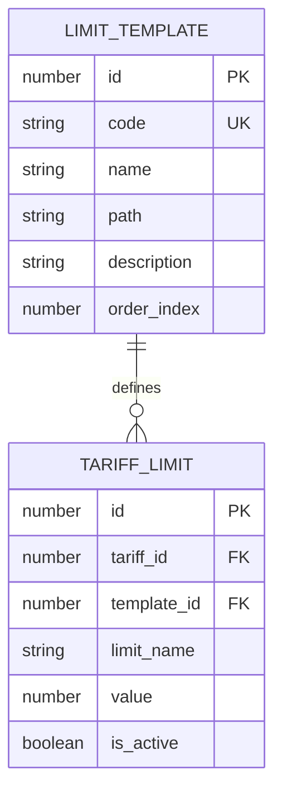
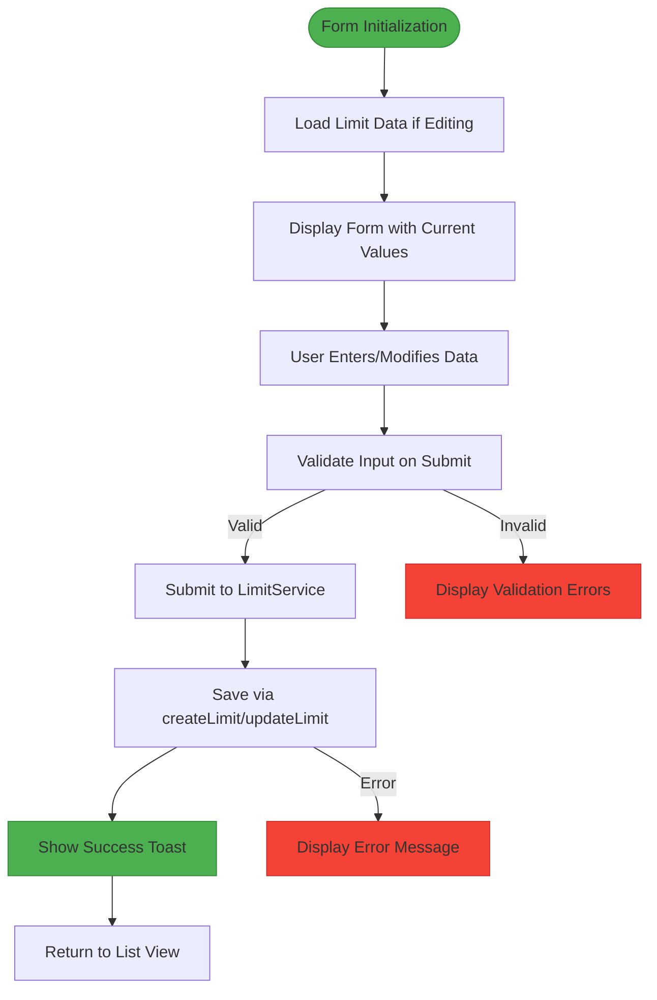
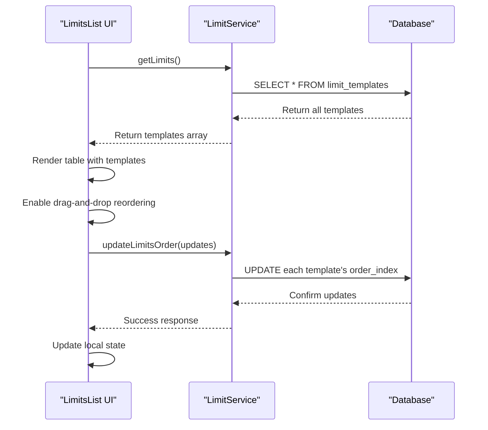
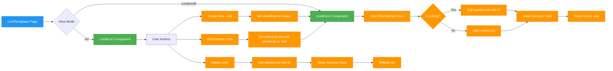

# Limit Management

<cite>
**Referenced Files in This Document**   
- [tariff-service.ts](file://src/lib/tariff-service.ts)
- [limit-service.ts](file://src/lib/limit-service.ts)
- [LimitForm.tsx](file://src/components/admin/limits/LimitForm.tsx)
- [LimitsList.tsx](file://src/components/admin/limits/LimitsList.tsx)
- [LimitTemplates.tsx](file://src/pages/admin/LimitTemplates.tsx)
</cite>

## Table of Contents
1. [Introduction](#introduction)
2. [Tariff Limit Service Implementation](#tariff-limit-service-implementation)
3. [Domain Model of Tariff Limits](#domain-model-of-tariff-limits)
4. [Limit Form Component](#limit-form-component)
5. [Limits List Component](#limits-list-component)
6. [Complete Interaction Flow](#complete-interaction-flow)
7. [Validation and Error Handling](#validation-and-error-handling)
8. [Performance Considerations](#performance-considerations)
9. [Common Issues and Solutions](#common-issues-and-solutions)

## Introduction
The Limit Management functionality provides a comprehensive system for managing tariff plan limits within the application. This documentation details the implementation of the TariffService methods for limit management, the components used for displaying and editing limits, and the complete workflow for creating, updating, and deleting tariff limits. The system is designed to provide administrators with a user-friendly interface for configuring tariff plans with various usage limits that control feature access and resource allocation for users.

## Tariff Limit Service Implementation

The TariffService class provides a comprehensive API for managing tariff limits through several key methods that handle CRUD operations. These methods follow a consistent pattern of interacting with the Supabase database to manage limit records associated with tariff plans.

```mermaid
classDiagram
class TariffService {
+static getTariffLimits(tariffId : number) Promise~TariffLimit[]~
+static addTariffLimit(limitData : TariffLimitInsert) Promise~TariffLimit~
+static updateTariffLimit(id : number, limitData : TariffLimitUpdate) Promise~TariffLimit~
+static deleteTariffLimit(id : number) Promise~boolean~
}
class LimitService {
+static getLimits() Promise~LimitTemplate[]~
+static createLimit(limitData : CreateLimitData) Promise~LimitTemplate~
+static updateLimit(id : number, limitData : UpdateLimitData) Promise~LimitTemplate~
+static deleteLimit(id : number) Promise~void~
+static updateLimitsOrder(limits : {id : number, order_index : number}[]) Promise~void~
}
TariffService --> LimitService : "uses for template management"
```

**Diagram sources**
- [tariff-service.ts](file://src/lib/tariff-service.ts#L408-L458)
- [limit-service.ts](file://src/lib/limit-service.ts#L25-L199)

**Section sources**
- [tariff-service.ts](file://src/lib/tariff-service.ts#L408-L458)

### getTariffLimits Method
The `getTariffLimits` method retrieves all active limits for a specific tariff plan by tariff ID. It queries the `tariff_limits` table with filters for the tariff ID and active status, ordering results by limit name for consistent presentation. The method returns a Promise that resolves to an array of TariffLimit objects, which include the limit value, name, and active status.

### addTariffLimit Method
The `addTariffLimit` method creates a new limit record in the database by inserting data into the `tariff_limits` table. It accepts a TariffLimitInsert object containing the tariff ID, limit name, value, and active status. The method performs the insertion with a single select query to return the created record, ensuring data consistency.

### updateTariffLimit Method
The `updateTariffLimit` method modifies an existing limit by updating specific fields in the `tariff_limits` table. It uses the limit ID as a primary key to identify the record and applies the updates specified in the TariffLimitUpdate object. The method returns the updated limit record to confirm the changes were applied successfully.

### deleteTariffLimit Method
The `deleteTariffLimit` method removes a limit from the system by deleting the corresponding record from the `tariff_limits` table. It uses the limit ID to identify the specific record to delete and returns a boolean indicating the success of the operation.

## Domain Model of Tariff Limits

The domain model for tariff limits consists of two primary entities: TariffLimit for actual limit values in tariff plans, and LimitTemplate for reusable limit definitions. This separation allows administrators to define standard limits once and apply them across multiple tariff plans.



**Diagram sources**
- [tariff-service.ts](file://src/lib/tariff-service.ts#L11-L11)
- [limit-service.ts](file://src/lib/limit-service.ts#L2-L9)

**Section sources**
- [tariff-service.ts](file://src/lib/tariff-service.ts#L11-L11)
- [limit-service.ts](file://src/lib/limit-service.ts#L2-L9)

### TariffLimit Entity
The TariffLimit entity represents a specific limit value within a tariff plan. It contains:
- **id**: Unique identifier for the limit record
- **tariff_id**: Foreign key linking to the parent tariff plan
- **limit_name**: Display name of the limit (e.g., "Storage (GB)")
- **value**: Numeric value representing the limit threshold
- **is_active**: Boolean flag indicating whether the limit is currently enforced
- **template_id**: Optional reference to a LimitTemplate for standardized limits

### LimitTemplate Entity
The LimitTemplate entity defines reusable limit definitions that can be applied to multiple tariff plans. It contains:
- **id**: Unique identifier for the template
- **code**: System name in snake_case format used for programmatic reference
- **name**: User-friendly display name
- **path**: Optional path identifier for hierarchical organization
- **description**: Detailed explanation of what the limit controls
- **order_index**: Position for sorting templates in the interface

## Limit Form Component

The LimitForm component provides a user interface for creating and editing limit templates. It implements comprehensive form validation and state management to ensure data integrity.



**Diagram sources**
- [LimitForm.tsx](file://src/components/admin/limits/LimitForm.tsx#L20-L186)

**Section sources**
- [LimitForm.tsx](file://src/components/admin/limits/LimitForm.tsx#L20-L186)

### Form Structure and Validation
The LimitForm implements client-side validation for critical fields:
- **Name field**: Required field with real-time validation that displays an error if empty
- **Code field**: Required field with format validation ensuring snake_case convention (lowercase letters, numbers, and underscores only)
- **Path and Description fields**: Optional fields with no format restrictions

The form uses React state to manage both the input values (`formData`) and validation errors (`errors`). When a user begins typing in a field with an existing error, the error is automatically cleared, providing immediate feedback that the validation state has changed.

### State Synchronization
The component uses the `useEffect` hook to synchronize its internal state with incoming limit data when editing an existing template. When the `limit` prop changes, the form data is updated to reflect the current values, enabling seamless editing functionality.

## Limits List Component

The LimitsList component displays all available limit templates in a sortable table format with drag-and-drop reordering capabilities. It provides a comprehensive interface for managing multiple limits with bulk operations.



**Diagram sources**
- [LimitsList.tsx](file://src/components/admin/limits/LimitsList.tsx#L129-L302)
- [limit-service.ts](file://src/lib/limit-service.ts#L180-L199)

**Section sources**
- [LimitsList.tsx](file://src/components/admin/limits/LimitsList.tsx#L129-L302)

### Data Loading and Display
The component loads limit templates from the LimitService and displays them in a sortable table with the following columns:
- **Drag handle**: Allows reordering of limits through drag-and-drop
- **Icon**: Visual indicator of the limit type
- **Name**: User-friendly display name
- **Code**: System identifier in monospace font
- **Description**: Brief explanation of the limit's purpose
- **Path**: Hierarchical location for organization
- **Actions**: Dropdown menu with edit and delete options

### Drag-and-Drop Reordering
The component implements drag-and-drop functionality using the dnd-kit library. When users reorder limits, the component immediately updates the local state for responsiveness, then sends the new order to the server via the `updateLimitsOrder` method. This ensures the user interface remains responsive while maintaining data consistency with the backend.

## Complete Interaction Flow

The complete workflow for managing limit templates involves coordinated interactions between the LimitTemplates page, the LimitsList component, and the LimitForm component, creating a seamless user experience.



**Diagram sources**
- [LimitTemplates.tsx](file://src/pages/admin/LimitTemplates.tsx#L12-L123)

**Section sources**
- [LimitTemplates.tsx](file://src/pages/admin/LimitTemplates.tsx#L12-L123)

### Creation Flow
1. User clicks "Create Limit" button in the LimitsList component
2. The LimitTemplates page sets `viewMode` to 'create' 
3. The LimitForm component renders with empty fields
4. User enters limit details and submits the form
5. The `handleSaveLimit` function calls `LimitService.createLimit`
6. On success, a toast notification appears and the view returns to the list

### Editing Flow
1. User clicks "Edit" in a limit's action menu
2. The `handleSelectLimit` function sets the selected limit and `viewMode` to 'edit'
3. The LimitForm component receives the limit data as a prop
4. The form initializes with the existing values
5. User modifies the fields and submits
6. The `handleSaveLimit` function calls `LimitService.updateLimit` with the ID
7. On success, a toast notification appears and the view returns to the list

## Validation and Error Handling

The system implements comprehensive validation at both the client and server levels to ensure data integrity and provide meaningful feedback to users.

### Client-Side Validation
The LimitForm component performs real-time validation of user input:
- **Required fields**: Name and code fields are validated to ensure they are not empty
- **Format validation**: The code field must follow snake_case convention (lowercase letters, numbers, and underscores)
- **Immediate feedback**: Errors are displayed below the relevant field and cleared when the user begins typing

### Server-Side Validation
The LimitService implements additional validation rules:
- **Unique constraint**: Prevents creation of multiple templates with the same code
- **Data type validation**: Ensures numeric values where appropriate
- **Business rules**: Validates that required fields are present

When validation fails, the service throws descriptive error messages that are displayed to users through toast notifications, helping them understand and correct the issues.

## Performance Considerations

The limit management system incorporates several performance optimizations to ensure responsive interactions, especially when dealing with multiple limits.

### Batch Operations
When reordering multiple limits, the system processes updates in parallel using `Promise.all()` to minimize database round-trips. This approach significantly improves performance compared to sequential updates, especially when rearranging large numbers of limits.

### Efficient Data Loading
The LimitsList component implements several optimizations:
- **Single query loading**: All limit templates are retrieved in a single database query
- **Lazy loading**: Data is only fetched when the component mounts or when explicitly refreshed
- **State caching**: Retrieved data is stored in component state to avoid unnecessary re-fetching

### Optimistic Updates
The drag-and-drop reordering implements optimistic updates by immediately reflecting changes in the UI before the server confirms the update. This creates a responsive user experience while maintaining data consistency through error handling that reverts to the previous state if the server update fails.

## Common Issues and Solutions

### Numeric Validation Issues
When working with limit values, ensure that numeric inputs are properly validated to prevent negative values or non-numeric entries. The system should validate that limit values are positive numbers and provide clear error messages if invalid input is detected.

### Limit Conflicts
When multiple administrators are editing limits simultaneously, conflicts can occur. The system addresses this through:
- **Optimistic locking**: Using record versions or timestamps to detect concurrent modifications
- **Clear error messaging**: Informing users when their changes conflict with others
- **Refresh mechanisms**: Providing options to reload the latest data

### Performance with Large Datasets
For installations with a large number of limit templates, consider implementing:
- **Pagination**: Displaying limits in smaller batches
- **Virtualized rendering**: Only rendering visible rows in the table
- **Search and filtering**: Allowing administrators to quickly find specific limits

The current implementation handles typical use cases efficiently but could be enhanced with these features for enterprise-scale deployments.