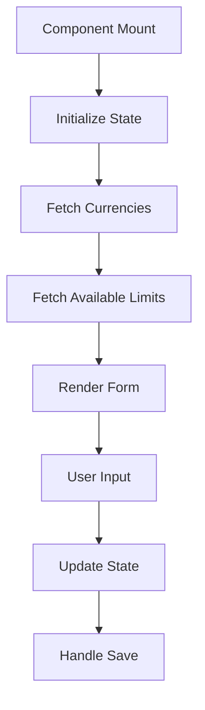
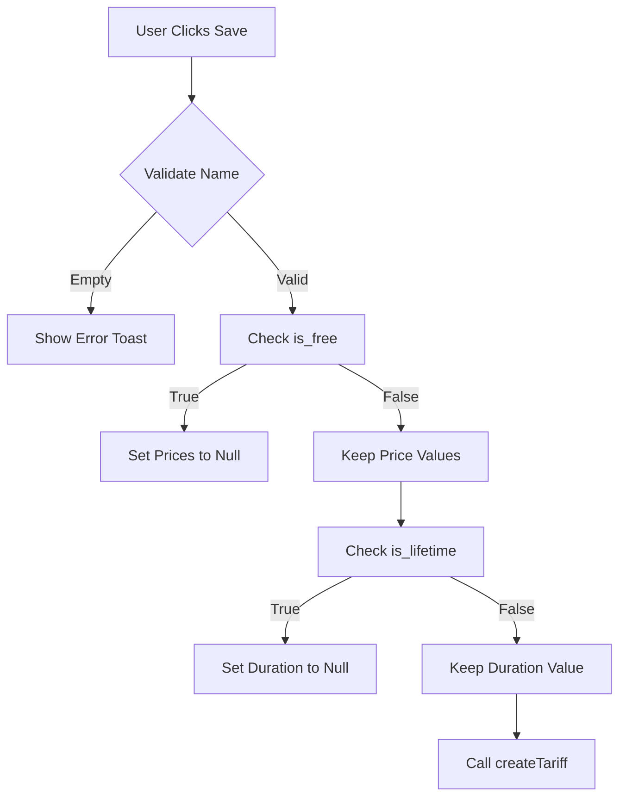
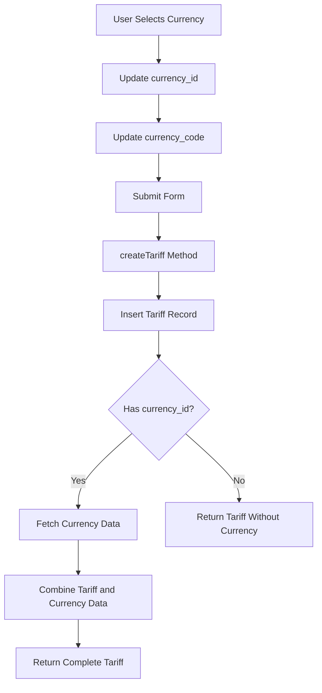
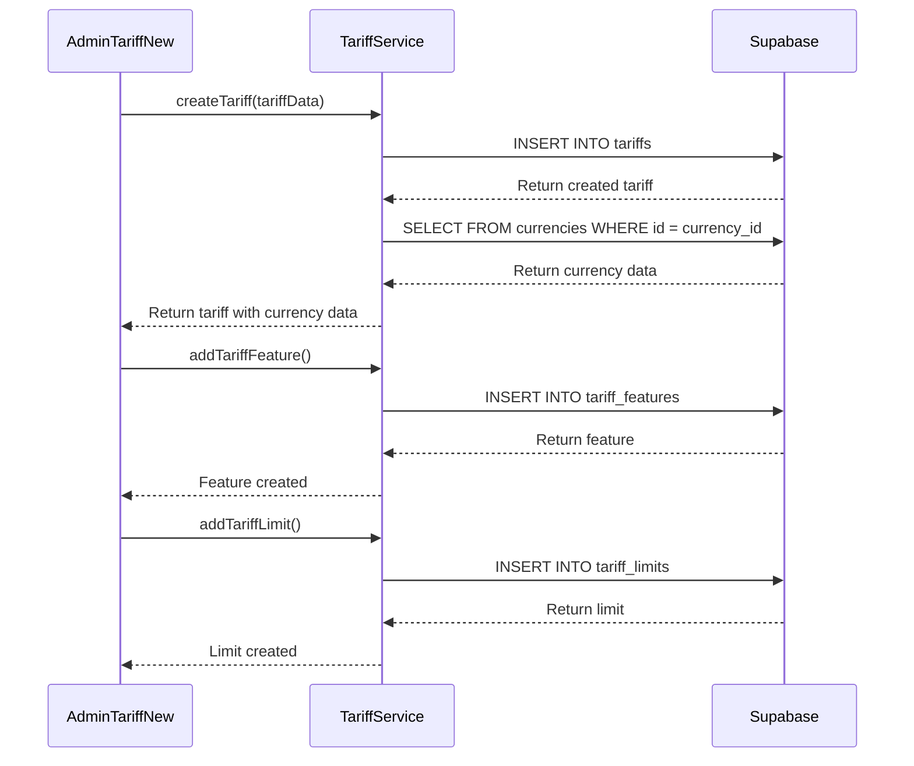
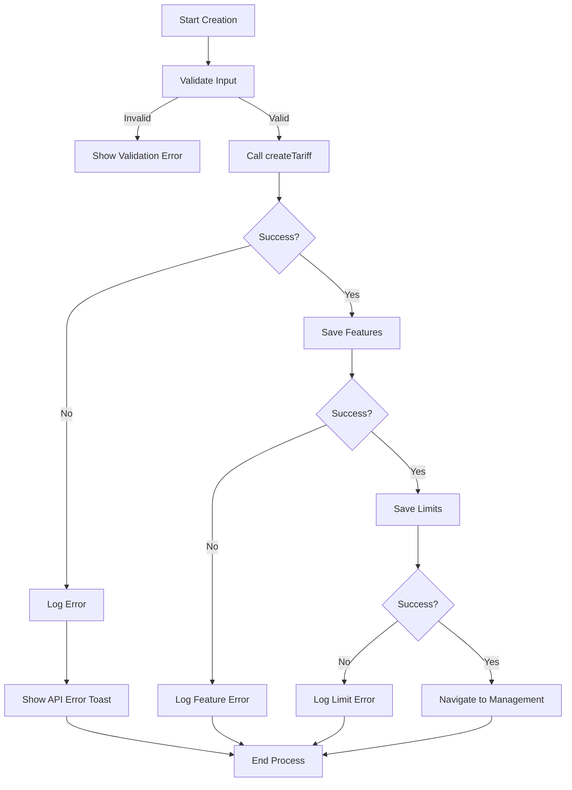

# Tariff Creation

<cite>
**Referenced Files in This Document**   
- [AdminTariffNew.tsx](file://src/pages/admin/AdminTariffNew.tsx)
- [tariff-service.ts](file://src/lib/tariff-service.ts)
</cite>

## Table of Contents
1. [Introduction](#introduction)
2. [Form Structure and State Management](#form-structure-and-state-management)
3. [Validation Logic and Business Rules](#validation-logic-and-business-rules)
4. [Currency Handling and Field Mapping](#currency-handling-and-field-mapping)
5. [Data Flow from UI to Persistence](#data-flow-from-ui-to-persistence)
6. [Error Handling and Recovery](#error-handling-and-recovery)
7. [Performance Considerations](#performance-considerations)
8. [Common Issues and Solutions](#common-issues-and-solutions)

## Introduction
The Tariff Creation feature in the lovable-rise application enables administrators to define pricing plans with customizable features, limits, and currency settings. This document details the implementation of the `AdminTariffNew` component and its integration with the `TariffService.createTariff` method. The system follows a structured approach from UI input through service layer processing to Supabase persistence, with special attention to currency data handling, form validation, and error recovery.

**Section sources**
- [AdminTariffNew.tsx](file://src/pages/admin/AdminTariffNew.tsx#L35-L858)

## Form Structure and State Management
The `AdminTariffNew` component implements a multi-tab interface for tariff creation, managing state through React hooks. The form is divided into three sections: basic information, features, and limits. State is managed using `useState` hooks for form data, currencies, loading states, and temporary tariff features and limits.

The component initializes with default values including USD as the default currency and active status. Currency data is fetched on component mount via `TariffService.getAllCurrencies()`, while available limits are loaded using `LimitService.getLimits()`. The tab-based navigation allows users to switch between tariff configuration sections without losing input data.

Temporary IDs (using `Date.now()`) are used for new features and limits before they are persisted to the database. The `savedTariffId` state tracks the ID of the created tariff to enable subsequent feature and limit associations.



**Diagram sources**
- [AdminTariffNew.tsx](file://src/pages/admin/AdminTariffNew.tsx#L35-L858)

**Section sources**
- [AdminTariffNew.tsx](file://src/pages/admin/AdminTariffNew.tsx#L35-L858)

## Validation Logic and Business Rules
The tariff creation process implements client-side validation and business rules to ensure data integrity. The primary validation occurs in the `handleSave` function, which checks that the tariff name is not empty before proceeding with creation.

Business rules are enforced through the `handleInputChange` function, which automatically updates related fields based on user selections:
- When "Free Plan" is selected, both old and new prices are set to null
- When "Lifetime Access" is selected, duration days are set to null

The form also includes defensive validation for features and limits:
- Features require a non-empty name before being added
- Limits require both a name and a positive value
- Currency selection triggers automatic currency code updates

Error handling is implemented through toast notifications using the `sonner` library, providing user feedback for validation failures and API errors.



**Diagram sources**
- [AdminTariffNew.tsx](file://src/pages/admin/AdminTariffNew.tsx#L35-L858)

**Section sources**
- [AdminTariffNew.tsx](file://src/pages/admin/AdminTariffNew.tsx#L35-L858)

## Currency Handling and Field Mapping
The application handles currency data through a dual-field approach that addresses potential schema conflicts between `currency` and `currency_id` fields. The `TariffService.createTariff` method implements defensive programming to handle both field names, ensuring compatibility with the database schema.

When creating a new tariff, the component sends both `currency_id` and `currency_code` fields to ensure complete data persistence. The currency selection dropdown updates both fields simultaneously - when a user selects a currency, the `currency_id` is set to the currency's ID and the `currency_code` is set to the corresponding code (e.g., "USD").

The service layer handles currency data retrieval through a two-step process:
1. Create the tariff record in the database
2. Fetch the associated currency data separately using the `currency_id`

This approach prevents join-related issues and ensures that currency data is properly resolved even when field naming inconsistencies exist.



**Diagram sources**
- [tariff-service.ts](file://src/lib/tariff-service.ts#L231-L270)
- [AdminTariffNew.tsx](file://src/pages/admin/AdminTariffNew.tsx#L35-L858)

**Section sources**
- [tariff-service.ts](file://src/lib/tariff-service.ts#L231-L270)
- [AdminTariffNew.tsx](file://src/pages/admin/AdminTariffNew.tsx#L35-L858)

## Data Flow from UI to Persistence
The data flow for tariff creation follows a structured path from the UI component through the service layer to Supabase persistence. When the user clicks the save button, the `handleSave` function in `AdminTariffNew` collects form data and calls `TariffService.createTariff`.

The service method first creates the tariff record in the `tariffs` table using Supabase's insert operation with a single record selection. Upon successful creation, it retrieves the currency data separately by querying the `currencies` table using the `currency_id` field. The results are then combined into a single object that includes both tariff details and currency information.

After the tariff is created, the component saves associated features and limits by calling `saveFeatures` and `saveLimits` methods, which in turn use `TariffService.addTariffFeature` and `TariffService.addTariffLimit` to persist these relationships.



**Diagram sources**
- [tariff-service.ts](file://src/lib/tariff-service.ts#L231-L270)
- [AdminTariffNew.tsx](file://src/pages/admin/AdminTariffNew.tsx#L35-L858)

**Section sources**
- [tariff-service.ts](file://src/lib/tariff-service.ts#L231-L270)
- [AdminTariffNew.tsx](file://src/pages/admin/AdminTariffNew.tsx#L35-L858)

## Error Handling and Recovery
The tariff creation process implements comprehensive error handling at multiple levels. Client-side validation prevents submission of incomplete forms, while server-side error handling manages API failures and database constraints.

The `createTariff` method uses try-catch blocks to handle asynchronous operations, with specific error handling for:
- Session validation failures
- Database insertion errors
- Currency data retrieval failures

When currency data cannot be fetched, the method gracefully returns the tariff record without currency information rather than failing the entire operation. This ensures that tariff creation succeeds even when secondary data is unavailable.

The UI layer uses toast notifications to inform users of errors, with different messages for validation errors and API failures. The loading state is properly managed with try-finally blocks to ensure the loading indicator is hidden even if an error occurs.



**Diagram sources**
- [tariff-service.ts](file://src/lib/tariff-service.ts#L231-L270)
- [AdminTariffNew.tsx](file://src/pages/admin/AdminTariffNew.tsx#L35-L858)

**Section sources**
- [tariff-service.ts](file://src/lib/tariff-service.ts#L231-L270)
- [AdminTariffNew.tsx](file://src/pages/admin/AdminTariffNew.tsx#L35-L858)

## Performance Considerations
The tariff creation implementation includes several performance optimizations. The service layer uses separate queries for tariff creation and currency data retrieval rather than joins, which improves query performance and reduces complexity.

The component minimizes re-renders by batching state updates and using efficient event handlers. Currency data is fetched once on component mount and cached in state, eliminating the need for repeated API calls during user interaction.

The creation process follows a sequential approach where the tariff is created first, followed by features and limits. This ensures data integrity by establishing the parent tariff record before creating dependent relationships. However, this approach could be optimized by using database transactions or batch operations to reduce the number of round trips to the server.

Loading states are implemented to provide user feedback during asynchronous operations, with a spinner displayed during initial data loading and a disabled save button during tariff creation.

**Section sources**
- [tariff-service.ts](file://src/lib/tariff-service.ts#L231-L270)
- [AdminTariffNew.tsx](file://src/pages/admin/AdminTariffNew.tsx#L35-L858)

## Common Issues and Solutions
A common issue in the tariff creation process is the potential conflict between `currency` and `currency_id` field names in the database schema. The current implementation addresses this by checking for both field names when retrieving currency data:

```typescript
const currencyField = (createdTariff as any).currency_id || (createdTariff as any).currency;
```

This defensive approach ensures compatibility regardless of which field name is used in the actual database schema.

Another potential issue is the temporary ID system for features and limits. The implementation uses `Date.now()` as a temporary ID, which could theoretically result in collisions. A more robust solution would use a UUID generator or maintain a separate counter in component state.

The currency selection mechanism could be improved by adding validation to ensure the selected currency ID exists in the fetched currencies list. This would prevent submission of invalid currency references.

Finally, the current implementation makes separate API calls for features and limits after tariff creation. For better performance, these could be batched into a single transaction or handled by a server-side function that creates the complete tariff structure atomically.

**Section sources**
- [tariff-service.ts](file://src/lib/tariff-service.ts#L231-L270)
- [AdminTariffNew.tsx](file://src/pages/admin/AdminTariffNew.tsx#L35-L858)