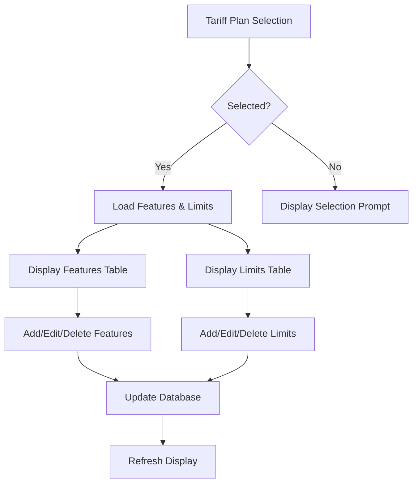
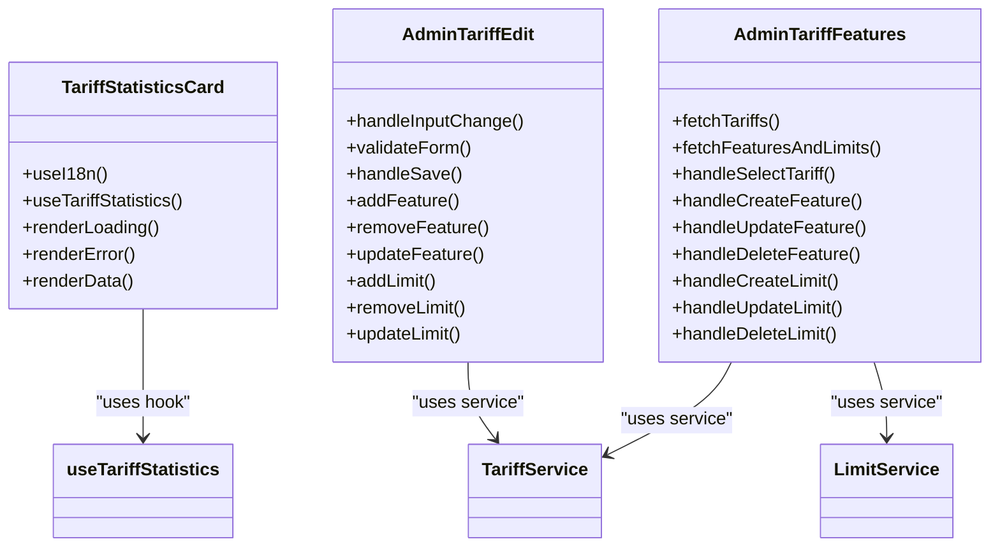
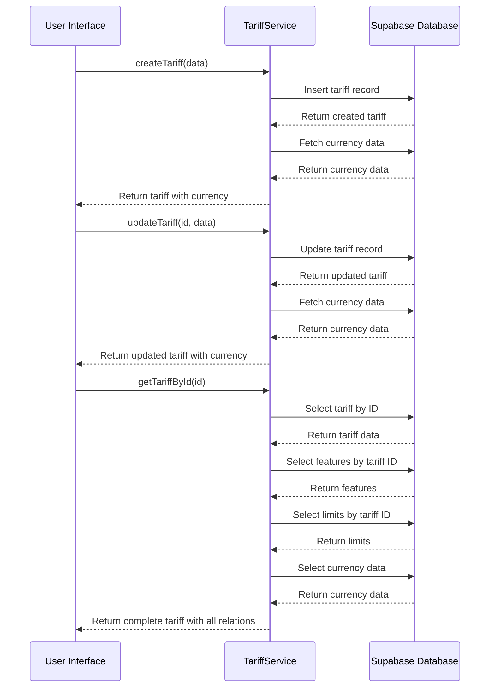
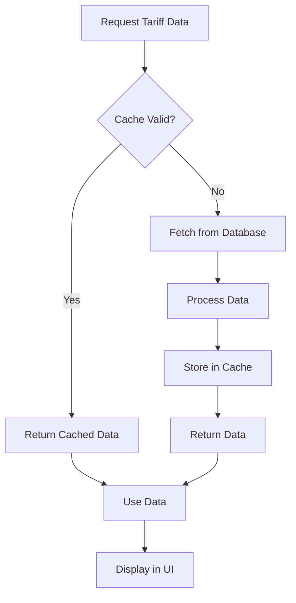

# Tariff Management

<cite>
**Referenced Files in This Document**   
- [AdminTariffEdit.tsx](file://src/pages/admin/AdminTariffEdit.tsx)
- [AdminTariffFeatures.tsx](file://src/pages/admin/AdminTariffFeatures.tsx)
- [TariffStatisticsCard.tsx](file://src/components/admin/TariffStatisticsCard.tsx)
- [tariff-service.ts](file://src/lib/tariff-service.ts)
- [tariff-cache.ts](file://src/lib/tariff-cache.ts)
- [CurrencyManagement.tsx](file://src/pages/admin/settings/CurrencyManagement.tsx)
</cite>

## Table of Contents
1. [Subscription Plan Management](#subscription-plan-management)
2. [Feature and Limit Management](#feature-and-limit-management)
3. [Currency Management](#currency-management)
4. [Interface Components](#interface-components)
5. [Data Flow](#data-flow)
6. [Common Issues and Solutions](#common-issues-and-solutions)
7. [Performance Considerations](#performance-considerations)

## Subscription Plan Management

The tariff management system in the lovable-rise application provides comprehensive capabilities for subscription plan management through the AdminTariffEdit component. This component enables administrators to create, edit, and delete tariff plans with a user-friendly interface that supports all essential plan attributes.

Tariff creation and editing functionality is implemented through a multi-tab interface that separates basic information, features, and limits into distinct sections. The system supports various plan configurations including free plans, lifetime access plans, and time-limited subscriptions. When creating or editing a tariff, administrators can specify the plan name, description, pricing (both old and new prices), duration in days, currency, and various status indicators such as active, visible, and popular flags.

The implementation follows a structured approach where tariff data is managed through form state and validated before submission. The system enforces business rules such as setting prices to null for free plans and duration to null for lifetime access plans. Validation ensures required fields are completed and numeric values are non-negative. The component handles both new tariff creation and existing tariff editing through the same interface, with behavior determined by the presence of an ID parameter in the route.

**Section sources**
- [AdminTariffEdit.tsx](file://src/pages/admin/AdminTariffEdit.tsx#L39-L1218)

## Feature and Limit Management

The tariff management system provides robust feature and limit management capabilities that allow administrators to define what capabilities are included in each subscription plan. Features represent the functional capabilities available to users, while limits define quantitative restrictions on usage.

The AdminTariffFeatures component provides a dedicated interface for managing features and limits across all tariff plans. This component displays a list of available tariff plans in a sidebar, allowing administrators to select a specific plan and manage its associated features and limits. For each selected tariff, administrators can add, edit, and delete features and limits through intuitive form interfaces.

Features are managed as simple text descriptions with an active status flag, allowing administrators to communicate the capabilities included in each plan. Limits include both a name and a numeric value, enabling quantitative restrictions such as maximum store count, supplier count, or product count. The system supports template-based limits through the LimitService, allowing for consistent limit definitions across multiple tariff plans.

Both features and limits support activation/deactivation through toggle switches, enabling administrators to temporarily disable specific capabilities without deleting them. The interface provides confirmation dialogs for deletion operations to prevent accidental data loss.

**Diagram sources**
- [AdminTariffFeatures.tsx](file://src/pages/admin/AdminTariffFeatures.tsx#L26-L587)

**Section sources**
- [AdminTariffFeatures.tsx](file://src/pages/admin/AdminTariffFeatures.tsx#L26-L587)

## Currency Management

The tariff management system includes comprehensive currency management functionality to support international pricing. The CurrencyManagement component provides an administrative interface for managing available currencies, exchange rates, and currency status.

Administrators can view, create, edit, and delete currency entries through a table-based interface with inline editing capabilities. Each currency is defined by a code (e.g., USD, EUR, UAH), name, exchange rate relative to the base currency, and status indicators. The system distinguishes between active and inactive currencies, allowing administrators to temporarily disable currencies without deleting them.

The interface includes special handling for the base currency, which cannot be deleted and serves as the reference point for exchange rates. Currency codes are validated for uniqueness during creation and editing to prevent conflicts. The table display prioritizes the base currency by showing it first, followed by other currencies sorted alphabetically by code.

Currency data is integrated with the tariff system through the tariff-service, where each tariff plan references a specific currency for its pricing. The system supports currency selection through dropdown menus in tariff creation and editing interfaces, displaying both the currency code and name for clarity.

**Section sources**
- [CurrencyManagement.tsx](file://src/pages/admin/settings/CurrencyManagement.tsx#L1-L364)

## Interface Components

The tariff management system utilizes several specialized interface components to provide a cohesive administrative experience. These components are designed to be reusable across different parts of the application while maintaining consistency in appearance and behavior.

The TariffStatisticsCard component provides a visual summary of tariff plan statistics, displaying key metrics such as the number of active tariffs. This component uses the useTariffStatistics hook to fetch data from the TariffService and displays loading states with skeleton placeholders during data retrieval. Error states are handled gracefully with appropriate messaging to inform administrators of issues.

Form components for tariff operations follow a consistent design pattern with tabbed interfaces that organize related fields. The AdminTariffEdit component uses tabs to separate basic information, features, and limits, reducing cognitive load and improving usability. Form fields include appropriate validation feedback, with error messages displayed below the relevant input.

The system employs various UI patterns including:
- Tooltip-triggered action buttons for compact interfaces
- Confirmation dialogs for destructive operations
- Loading indicators for asynchronous operations
- Responsive layouts that adapt to different screen sizes
- Access control indicators that show read-only mode for non-administrative users

**Diagram sources**
- [TariffStatisticsCard.tsx](file://src/components/admin/TariffStatisticsCard.tsx#L6-L56)
- [AdminTariffEdit.tsx](file://src/pages/admin/AdminTariffEdit.tsx#L39-L1218)
- [AdminTariffFeatures.tsx](file://src/pages/admin/AdminTariffFeatures.tsx#L26-L587)

**Section sources**
- [TariffStatisticsCard.tsx](file://src/components/admin/TariffStatisticsCard.tsx#L6-L56)
- [AdminTariffEdit.tsx](file://src/pages/admin/AdminTariffEdit.tsx#L39-L1218)
- [AdminTariffFeatures.tsx](file://src/pages/admin/AdminTariffFeatures.tsx#L26-L587)

## Data Flow

The tariff management system follows a clear data flow pattern from the user interface through the service layer to the Supabase backend. This architecture ensures data consistency and provides a clean separation of concerns.

When a user interacts with the tariff management interface, form data is collected and validated in the component state. Upon submission, the data is passed to the TariffService which handles communication with the Supabase database. The service layer transforms the data as needed to match the database schema and executes the appropriate CRUD operations.

For tariff creation and editing, the system follows a two-step process:
1. First, the basic tariff information is saved to the database
2. Then, associated features and limits are saved in separate operations

This approach ensures data integrity and allows for proper error handling at each step. The system uses temporary IDs (based on timestamps) for new features and limits during the editing process, replacing them with actual database IDs upon successful creation.

Data retrieval follows an optimized pattern where the TariffService fetches tariff data, currency data, features, and limits in separate queries rather than using complex joins. This approach improves performance and simplifies error handling. The getAllTariffs method uses a Map-based approach to efficiently associate related data without requiring multiple database queries.

**Diagram sources**
- [tariff-service.ts](file://src/lib/tariff-service.ts#L39-L739)
- [AdminTariffEdit.tsx](file://src/pages/admin/AdminTariffEdit.tsx#L39-L1218)

**Section sources**
- [tariff-service.ts](file://src/lib/tariff-service.ts#L39-L739)
- [AdminTariffEdit.tsx](file://src/pages/admin/AdminTariffEdit.tsx#L39-L1218)

## Common Issues and Solutions

The tariff management system addresses several common issues that arise in subscription plan management. One frequent issue is pricing plan conflicts, which occur when administrators attempt to create or modify tariff plans with invalid configurations. The system prevents these conflicts through comprehensive validation that checks for required fields, non-negative numeric values, and valid currency selections.

Another common issue is the accidental deletion of tariff plans or their associated features and limits. The system mitigates this risk through confirmation dialogs for deletion operations and by maintaining temporary IDs for new items during the editing process. This ensures that only intentionally created items are persisted to the database.

Permission-related issues are handled by checking user roles and administrative status when components mount. If a user lacks administrative privileges, the interface displays a read-only mode banner and disables editing functionality, preventing unauthorized changes while still allowing users to view tariff information.

Data loading issues are addressed through robust error handling in the TariffService. When database queries fail, the system logs detailed error information and presents user-friendly error messages through the toast notification system. The useQuery hook in the useTariffStatistics hook includes retry logic to handle transient network issues.

## Performance Considerations

The tariff management system incorporates several performance optimizations to ensure responsive operation even with large datasets. The most significant optimization is the tariff-cache implementation, which provides in-memory caching of tariff data with a configurable duration of 5 minutes.

The TariffCache class implements a singleton pattern to ensure a single cache instance across the application. It stores tariff data along with a timestamp, automatically invalidating the cache when it exceeds the configured duration. This reduces database load and improves response times for frequently accessed tariff data.

The TariffService is designed with performance in mind, using separate queries for related data rather than complex joins. This approach allows for more efficient database operations and better error isolation. The getAllTariffs method uses a Map-based approach to efficiently associate tariffs with their related features, limits, and currency data in memory rather than relying on database joins.

Query optimization is further enhanced through the use of React Query in the useTariffStatistics hook, which provides client-side caching with configurable stale and garbage collection times. The hook is configured with a 5-minute stale time and 10-minute garbage collection time, balancing data freshness with performance.

The system also implements efficient data fetching patterns, loading only necessary data for specific operations. For example, when editing a tariff, the system can load just the tariff name for breadcrumb display without retrieving all related data, reducing initial load times.

**Diagram sources**
- [tariff-cache.ts](file://src/lib/tariff-cache.ts#L2-L44)
- [tariff-service.ts](file://src/lib/tariff-service.ts#L39-L739)

**Section sources**
- [tariff-cache.ts](file://src/lib/tariff-cache.ts#L2-L44)
- [tariff-service.ts](file://src/lib/tariff-service.ts#L39-L739)