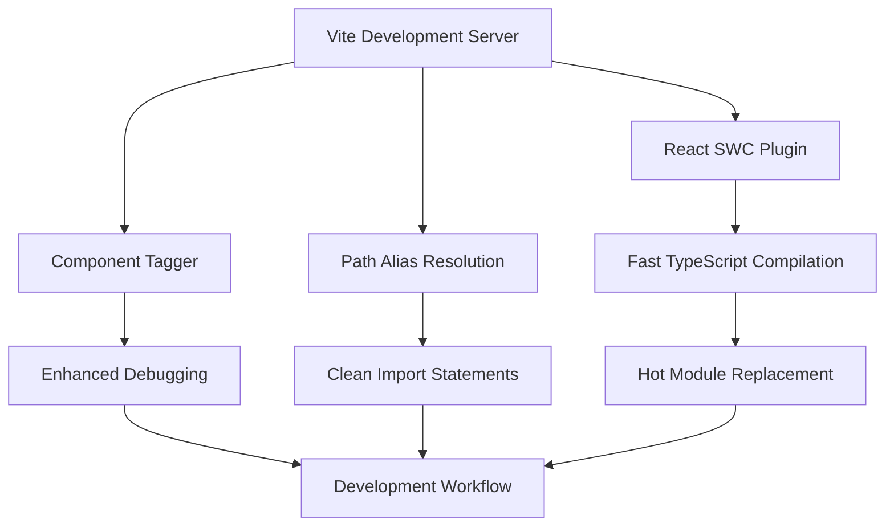
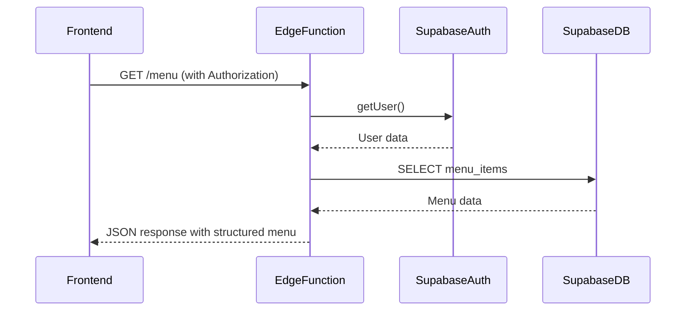

# Technology Stack

<cite>
**Referenced Files in This Document**   
- [package.json](file://package.json)
- [vite.config.ts](file://vite.config.ts)
- [tailwind.config.ts](file://tailwind.config.ts)
- [supabase/functions/auth-me/index.ts](file://supabase/functions/auth-me/index.ts)
- [supabase/functions/menu/index.ts](file://supabase/functions/menu/index.ts)
- [src/lib/user-service.ts](file://src/lib/user-service.ts)
- [src/lib/tariff-service.ts](file://src/lib/tariff-service.ts)
- [src/lib/template-service.ts](file://src/lib/template-service.ts)
- [src/components/ui/button.tsx](file://src/components/ui/button.tsx)
- [src/components/ui/input.tsx](file://src/components/ui/input.tsx)
- [src/integrations/supabase/client.ts](file://src/integrations/supabase/client.ts)
</cite>

## Table of Contents
1. [Frontend Architecture](#frontend-architecture)
2. [Build Tool Configuration](#build-tool-configuration)
3. [Backend Services with Supabase and Deno](#backend-services-with-supabase-and-deno)
4. [UI Framework and Styling System](#ui-framework-and-styling-system)
5. [State Management Strategy](#state-management-strategy)
6. [Form Handling and Validation](#form-handling-and-validation)
7. [Database Layer and Security](#database-layer-and-security)
8. [Dependency Management](#dependency-management)

## Frontend Architecture

The lovable-rise application utilizes React with TypeScript as its core frontend framework, providing a robust type-safe development environment. This combination enables comprehensive type checking, enhanced developer experience through IntelliSense, and improved code maintainability across the large codebase. The application structure follows a component-based architecture with clear separation of concerns, organizing components into logical directories such as `admin`, `user`, and `ui` components.

TypeScript interfaces are extensively used throughout the codebase to define data structures, ensuring consistency between frontend components and backend APIs. For example, the `UserProfile` interface in the user service defines the exact shape of user data expected by the application, preventing runtime errors and improving code reliability.

**Section sources**
- [src/lib/user-service.ts](file://src/lib/user-service.ts#L20-L40)
- [src/lib/tariff-service.ts](file://src/lib/tariff-service.ts#L10-L30)

## Build Tool Configuration

Vite serves as the build tool for the lovable-rise application, configured through the `vite.config.ts` file. This modern build tool provides fast development server startup and hot module replacement, significantly improving developer productivity. The configuration includes specific server settings with host "::" and port 8080, enabling IPv6 support and consistent development environment across different machines.

The Vite configuration also incorporates the `@vitejs/plugin-react-swc` plugin for optimized React compilation and the `lovable-tagger` component tagger in development mode, which enhances component debugging capabilities. Path aliases are configured with the "@" symbol pointing to the src directory, simplifying module imports throughout the application.



**Diagram sources**
- [vite.config.ts](file://vite.config.ts#L1-L22)

**Section sources**
- [vite.config.ts](file://vite.config.ts#L1-L22)

## Backend Services with Supabase and Deno

The backend architecture leverages Supabase as the primary database and authentication provider, complemented by Deno Edge Functions for server-side logic. This combination provides a serverless architecture that scales efficiently while maintaining low latency through edge deployment. The Deno functions are located in the `supabase/functions` directory and handle critical operations such as user authentication, menu management, and permissions.

The `auth-me` function serves as an authentication endpoint that validates user sessions and retrieves profile information, implementing proper error handling and logging for debugging purposes. Similarly, the `menu` function manages menu items with role-based access control, ensuring that only administrators can modify menu structures while regular users can only retrieve their authorized menu items.

These Edge Functions follow RESTful principles with proper HTTP status codes and JSON responses, implementing CORS headers to enable cross-origin requests from the frontend application. The functions use Supabase's client library to interact with the PostgreSQL database, maintaining consistency with the application's data access patterns.



**Diagram sources**
- [supabase/functions/auth-me/index.ts](file://supabase/functions/auth-me/index.ts#L1-L129)
- [supabase/functions/menu/index.ts](file://supabase/functions/menu/index.ts#L1-L302)

**Section sources**
- [supabase/functions/auth-me/index.ts](file://supabase/functions/auth-me/index.ts#L1-L129)
- [supabase/functions/menu/index.ts](file://supabase/functions/menu/index.ts#L1-L302)

## UI Framework and Styling System

The application implements a comprehensive UI framework using Radix UI components enhanced with Tailwind CSS for styling. Radix UI provides accessible, unstyled primitive components that serve as the foundation for the application's interactive elements, while Tailwind CSS enables rapid UI development through utility-first classes.

The component library in `src/components/ui` contains wrappers around Radix UI primitives, applying consistent styling and behavior across the application. For example, the Button component uses `class-variance-authority` (cva) to define variant styles such as "default", "destructive", "outline", and custom "hero" variants, ensuring design consistency while maintaining flexibility.

Tailwind CSS is configured through `tailwind.config.ts` with custom theme extensions including color definitions, border radii, keyframes, and animations. The configuration supports dark mode through CSS variables and includes custom color palettes for different application sections, including a dedicated "admin" color scheme for administrative interfaces.

```mermaid
classDiagram
class Button {
+variant : "default"|"destructive"|"outline"|"secondary"|"ghost"|"link"|"hero"
+size : "default"|"sm"|"lg"|"icon"
+asChild : boolean
+className : string
}
class Input {
+type : string
+className : string
}
class ThemeProvider {
+children : ReactNode
}
Button --> ThemeProvider : "respects"
Input --> ThemeProvider : "respects"
ThemeProvider --> "tailwind.config.ts" : "uses configuration"
```

**Diagram sources**
- [src/components/ui/button.tsx](file://src/components/ui/button.tsx#L1-L58)
- [src/components/ui/input.tsx](file://src/components/ui/input.tsx#L1-L22)
- [tailwind.config.ts](file://tailwind.config.ts#L1-L147)

**Section sources**
- [src/components/ui/button.tsx](file://src/components/ui/button.tsx#L1-L58)
- [src/components/ui/input.tsx](file://src/components/ui/input.tsx#L1-L22)
- [tailwind.config.ts](file://tailwind.config.ts#L1-L147)

## State Management Strategy

The application employs React Query (TanStack Query) as its primary state management solution for server state, complemented by React Context for global client state. This hybrid approach separates concerns between data fetched from the server and application-wide UI state, providing an efficient and predictable state management pattern.

React Query is used extensively in custom hooks to manage data fetching, caching, and synchronization with the Supabase backend. The service classes in the `src/lib` directory, such as `UserService` and `TariffService`, encapsulate API logic and integrate with React Query to provide optimized data fetching with features like automatic caching, background refetching, and error handling.

For global UI state such as theme preferences and user roles, the application uses React Context providers defined in the `src/providers` directory. This approach avoids prop drilling while maintaining reactivity across the component tree. The combination of React Query for server state and Context for client state follows modern React best practices, ensuring optimal performance and developer experience.

**Section sources**
- [src/lib/user-service.ts](file://src/lib/user-service.ts#L1-L335)
- [src/lib/tariff-service.ts](file://src/lib/tariff-service.ts#L1-L739)
- [src/providers/theme-provider.tsx](file://src/providers/theme-provider.tsx)

## Form Handling and Validation

Form management in the application is handled through React Hook Form combined with Zod for schema validation. This powerful combination provides excellent performance by minimizing re-renders and offering type-safe validation with clear error messages. The integration between these libraries is facilitated by the `@hookform/resolvers` package, which bridges Zod's validation schema with React Hook Form's form handling capabilities.

Forms throughout the application, such as user management and tariff configuration, leverage this pattern to ensure data integrity before submission to the backend. Zod schemas define the exact structure and validation rules for form data, providing both runtime type checking and TypeScript type inference. This eliminates the need for separate interface definitions and validation logic, reducing code duplication and potential inconsistencies.

The form components are built using the UI primitives from Radix UI, ensuring accessibility and consistent styling across different form elements. Error states are properly handled and displayed to users, with validation occurring both on the client side before submission and on the server side through Supabase's Row Level Security policies.

**Section sources**
- [package.json](file://package.json#L50-L52)
- [src/lib/user-auth-schemas.ts](file://src/lib/user-auth-schemas.ts)

## Database Layer and Security

The application utilizes Supabase's PostgreSQL database with Row Level Security (RLS) as the foundation for data persistence and access control. This architecture provides a secure, scalable database layer that enforces data access policies at the database level, preventing unauthorized access even if application logic is compromised.

The database schema includes tables for users, tariffs, menu items, and various business entities, with relationships managed through foreign keys and constraints. RLS policies are defined for each table, specifying precise conditions under which users can read, create, update, or delete records based on their role and ownership.

The `rls-monitor.ts` and `role-assignment-monitor.ts` services in the `src/lib` directory provide additional application-level checks to complement the database RLS policies, creating a defense-in-depth security approach. Database interactions occur through the Supabase client configured in `src/integrations/supabase/client.ts`, which establishes the connection to the Supabase project and provides type safety through generated types.

This database architecture enables fine-grained access control where administrators have broad permissions while regular users can only access their own data, ensuring data privacy and compliance with security best practices.

**Section sources**
- [src/integrations/supabase/client.ts](file://src/integrations/supabase/client.ts)
- [src/lib/rls-monitor.ts](file://src/lib/rls-monitor.ts)
- [src/lib/role-assignment-monitor.ts](file://src/lib/role-assignment-monitor.ts)

## Dependency Management

Dependency management in the lovable-rise application is handled through Bun with the `bun.lockb` file, as indicated by the presence of this file in the root directory alongside the standard `package.json`. The `package.json` file lists all project dependencies, including React, Supabase client, React Query, Radix UI components, Tailwind CSS, and various utility libraries.

The dependency strategy follows a careful balance between functionality and bundle size, selecting libraries that provide maximum value with minimal overhead. For example, the application uses `class-variance-authority` for conditional class composition and `clsx` for class merging, optimizing the rendering of Tailwind utility classes.

Development dependencies include testing tools like Vitest, linting with ESLint, and TypeScript for type checking, ensuring code quality and consistency across the codebase. The version ranges in `package.json` are carefully selected to balance stability with access to bug fixes and security updates, with major versions pinned to prevent breaking changes.

The presence of both `bun.lockb` and `package-lock.json` suggests a transition or dual compatibility strategy, allowing the application to be installed with either Bun or npm/yarn package managers while maintaining consistent dependency resolution.

**Section sources**
- [package.json](file://package.json#L1-L102)
- [bun.lockb](file://bun.lockb)
- [package-lock.json](file://package-lock.json)