# Testing Strategy

<cite>
**Referenced Files in This Document**   
- [vitest.config.ts](file://vitest.config.ts)
- [auth-header.test.ts](file://src/__tests__/auth-header.test.ts)
- [profile-service.test.ts](file://src/__tests__/profile-service.test.ts)
- [user-auth-service.test.ts](file://src/__tests__/user-auth-service.test.ts)
- [setup.ts](file://src/test/setup.ts)
- [user-auth-service.ts](file://src/lib/user-auth-service.ts)
- [profile-service.ts](file://src/lib/profile-service.ts)
</cite>

## Table of Contents
1. [Testing Pyramid Overview](#testing-pyramid-overview)
2. [Test Setup and Configuration](#test-setup-and-configuration)
3. [Unit Testing Implementation](#unit-testing-implementation)
4. [Integration Testing](#integration-testing)
5. [Common Testing Issues and Solutions](#common-testing-issues-and-solutions)
6. [Performance Considerations](#performance-considerations)

## Testing Pyramid Overview

The lovable-rise application implements a comprehensive testing strategy following the testing pyramid model, which emphasizes a balanced approach to software testing with different levels of test coverage. The testing pyramid consists of three primary layers: unit tests, integration tests, and end-to-end tests, with unit tests forming the foundation and being the most numerous.

At the base of the pyramid are unit tests, which focus on individual components and functions in isolation. These tests are designed to be fast, reliable, and focused on specific functionality. The middle layer consists of integration tests, which verify the interactions between different components and services. At the top of the pyramid are end-to-end tests, which validate complete user workflows and system behavior.

This approach ensures that the majority of tests are fast and focused unit tests, while still providing comprehensive coverage through integration and end-to-end tests. The pyramid structure helps maintain a healthy balance between test coverage and execution speed, allowing for rapid feedback during development while ensuring system reliability.

**Section sources**
- [vitest.config.ts](file://vitest.config.ts#L1-L21)
- [user-auth-service.test.ts](file://src/__tests__/user-auth-service.test.ts#L1-L54)

## Test Setup and Configuration

The testing environment for the lovable-rise application is configured using Vitest, a modern testing framework designed for Vite-based projects. The configuration is defined in the vitest.config.ts file, which extends the main Vite configuration to include testing-specific settings.

The test environment is set to 'jsdom', which provides a browser-like environment for testing frontend components and DOM interactions. This allows for realistic testing of React components and their behavior without requiring a full browser environment. The setupFiles configuration points to src/test/setup.ts, which contains essential mocks and configurations needed for consistent test execution.

The test configuration includes an include pattern that targets files with test or spec extensions, ensuring that all test files are discovered and executed. Excluded directories include node_modules, dist, and other temporary or external directories to prevent unnecessary test execution. Code coverage is configured using the v8 provider with multiple reporters (text, json, and html) to provide comprehensive coverage analysis in different formats.

```mermaid
flowchart TD
A["Test Configuration"] --> B["Environment: jsdom"]
A --> C["Setup Files: setup.ts"]
A --> D["Include Pattern: **/*.{test,spec}.*"]
A --> E["Exclude Pattern: node_modules, dist, etc."]
A --> F["Coverage: v8 with text, json, html reporters"]
A --> G["Alias: @ → /src"]
```



**Diagram sources**
- [vitest.config.ts](file://vitest.config.ts#L1-L21)

**Section sources**
- [vitest.config.ts](file://vitest.config.ts#L1-L21)
- [setup.ts](file://src/test/setup.ts#L1-L89)

## Unit Testing Implementation

Unit testing in the lovable-rise application focuses on testing individual service classes in isolation, particularly the user-auth-service and profile-service. These tests are designed to verify the correctness of business logic, error handling, and data processing within each service.

The user-auth-service tests validate various authentication workflows, including user registration, login, password reset, and session management. These tests use mocking to isolate the service from external dependencies, particularly the Supabase client. The tests verify that the service correctly handles different scenarios, such as successful authentication, invalid credentials, and network errors.

Similarly, the profile-service tests focus on profile creation, retrieval, and update operations. These tests ensure that profile data is properly validated, stored, and retrieved from the database. The tests also verify error handling for scenarios such as missing required fields, database errors, and permission issues.

```mermaid
classDiagram
class UserAuthService {
+register(data : RegistrationData) : Promise~AuthResponse~
+login(data : LoginData) : Promise~AuthResponse~
+resetPassword(data : ResetPasswordData) : Promise~{success : boolean, error : string | null}~
+logout() : Promise~{success : boolean, error : string | null}~
+getCurrentUser() : Promise~AuthResponse~
}
class ProfileService {
+getProfile(userId : string) : Promise~UserProfile | null~
+getProfileByEmail(email : string) : Promise~UserProfile | null~
+upsertProfile(profileData : Partial~UserProfile~ & { id : string }) : Promise~UserProfile | null~
+updateProfile(userId : string, updates : Partial~UserProfile~) : Promise~UserProfile | null~
+createProfileWithAuth(profileData : Partial~UserProfile~ & { id : string }, accessToken? : string) : Promise~UserProfile~
}
class UserAuthError {
+EMAIL_EXISTS
+EMAIL_CONFIRMATION_REQUIRED
+REGISTRATION_FAILED
+LOGIN_FAILED
+NETWORK_ERROR
+PROFILE_CREATION_FAILED
}
class ProfileOperationError {
+PROFILE_NOT_FOUND
+PROFILE_CREATION_FAILED
+PROFILE_UPDATE_FAILED
+INSUFFICIENT_PERMISSIONS
+NETWORK_ERROR
}
UserAuthService --> UserAuthError : "uses"
ProfileService --> ProfileOperationError : "uses"
```

**Diagram sources**
- [user-auth-service.ts](file://src/lib/user-auth-service.ts#L173-L986)
- [profile-service.ts](file://src/lib/profile-service.ts#L842-L856)

**Section sources**
- [user-auth-service.test.ts](file://src/__tests__/user-auth-service.test.ts#L1-L54)
- [profile-service.test.ts](file://src/__tests__/profile-service.test.ts#L1-L176)
- [user-auth-service.ts](file://src/lib/user-auth-service.ts#L173-L986)
- [profile-service.ts](file://src/lib/profile-service.ts#L842-L856)

## Integration Testing

Integration testing in the lovable-rise application focuses on verifying the interactions between different components and services, particularly the API flows and component interactions. These tests ensure that the various parts of the application work together correctly and that data flows properly through the system.

The auth-header.test.ts file contains integration tests that verify the correct generation of authentication headers for API requests. These tests mock the Supabase client's getSession method to simulate different authentication states and verify that the appropriate headers are included in API requests. The tests ensure that authenticated requests include the Authorization header with the bearer token, while unauthenticated requests do not include this header.

Integration tests also verify the interaction between the user-auth-service and profile-service, particularly during user registration and login workflows. These tests ensure that when a user registers or logs in, their profile is properly created or updated in the database, and that the appropriate session information is maintained.


**Diagram sources**
- [auth-header.test.ts](file://src/__tests__/auth-header.test.ts#L1-L92)
- [user-auth-service.ts](file://src/lib/user-auth-service.ts#L173-L986)
- [profile-service.ts](file://src/lib/profile-service.ts#L842-L856)

**Section sources**
- [auth-header.test.ts](file://src/__tests__/auth-header.test.ts#L1-L92)
- [user-auth-service.test.ts](file://src/__tests__/user-auth-service.test.ts#L1-L54)
- [profile-service.test.ts](file://src/__tests__/profile-service.test.ts#L1-L176)

## Common Testing Issues and Solutions

The lovable-rise application addresses several common testing challenges, particularly related to mocking Supabase dependencies and managing authentication state. One of the primary challenges is properly mocking the Supabase client to isolate tests from external dependencies while still providing realistic behavior.

The tests use Vitest's mocking capabilities to replace the Supabase client with mock implementations that simulate different responses and error conditions. This allows for comprehensive testing of both success and failure scenarios without making actual API calls. The mock implementations are configured to return specific data or errors based on the test requirements, enabling precise control over the test environment.

Another common issue is managing authentication state during testing. The application addresses this by using the setup.ts file to mock window.location and other browser APIs, ensuring consistent behavior across tests. The tests also use dynamic imports to ensure that the latest version of functions is used, particularly when testing functions that depend on authentication state.

The profile-service tests demonstrate a sophisticated approach to handling PostgREST PGRST116 errors (empty result errors) by converting them to null values instead of throwing exceptions. This prevents tests from failing due to expected empty results and allows for more realistic testing of profile existence checks.

**Section sources**
- [setup.ts](file://src/test/setup.ts#L1-L89)
- [profile-service.test.ts](file://src/__tests__/profile-service.test.ts#L1-L176)
- [profile-service.ts](file://src/lib/profile-service.ts#L842-L856)

## Performance Considerations

The testing strategy for the lovable-rise application includes several performance considerations to ensure fast and efficient test execution. The use of Vitest as the testing framework provides excellent performance characteristics, with fast startup times and efficient test execution.

Test execution speed is optimized through the use of focused unit tests that test individual functions in isolation, minimizing dependencies and setup overhead. The configuration excludes unnecessary directories from test discovery, reducing the number of files that need to be processed during test runs.

Code coverage reporting is configured to use the v8 engine, which provides accurate and efficient coverage analysis without significantly impacting test execution time. The coverage reports are generated in multiple formats (text, json, and html) to support different use cases, from quick console feedback to detailed analysis in HTML reports.

The test setup minimizes the use of heavy mocks and instead focuses on mocking only the necessary parts of external dependencies. This reduces the overhead associated with complex mock setups and improves test performance. The use of jsdom as the test environment also contributes to faster execution compared to full browser testing solutions.

**Section sources**
- [vitest.config.ts](file://vitest.config.ts#L1-L21)
- [setup.ts](file://src/test/setup.ts#L1-L89)