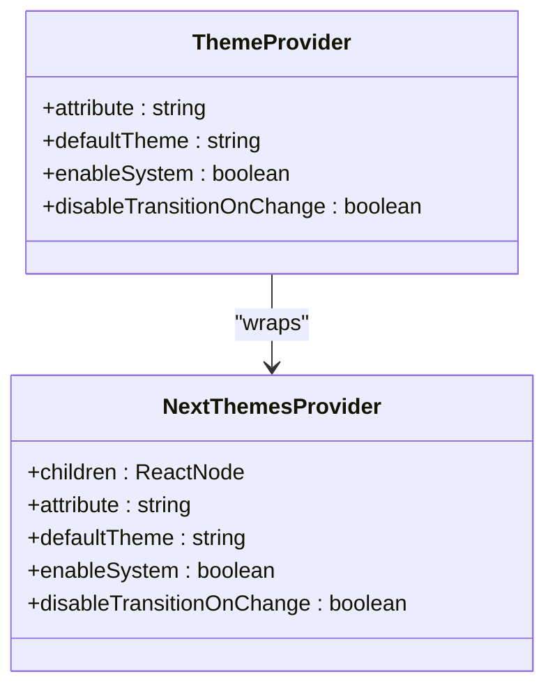
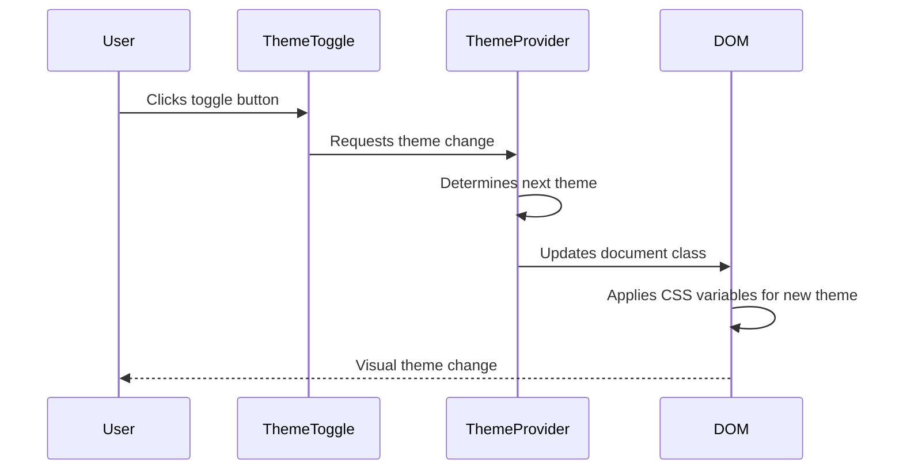
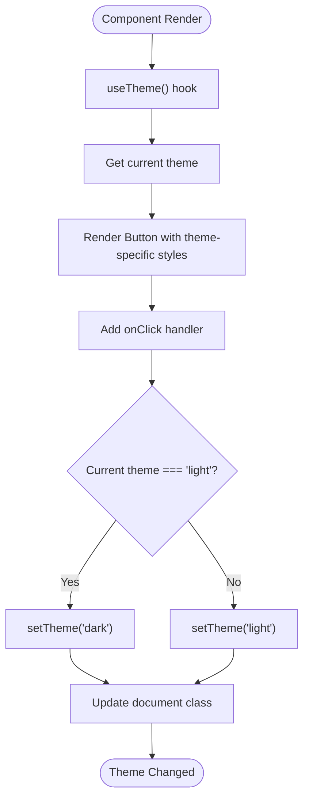
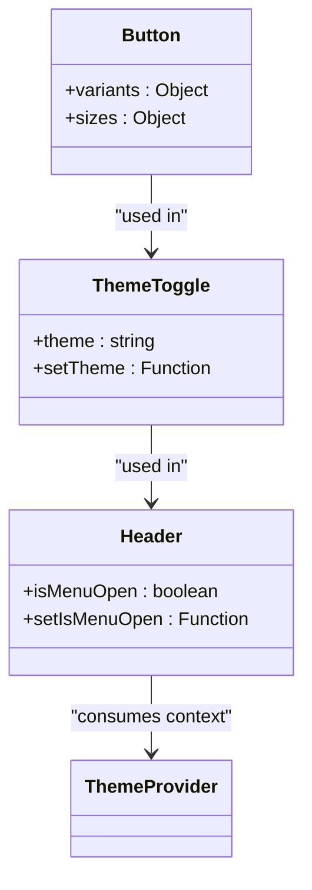

# Theming and Customization

<cite>
**Referenced Files in This Document**   
- [theme-provider.tsx](file://src/providers/theme-provider.tsx)
- [index.css](file://src/index.css)
- [tailwind.config.ts](file://tailwind.config.ts)
- [theme-toggle.tsx](file://src/components/ui/theme-toggle.tsx)
- [App.tsx](file://src/App.tsx)
</cite>

## Table of Contents
1. [Theming System Overview](#theming-system-overview)
2. [Theme Provider Implementation](#theme-provider-implementation)
3. [CSS Variables and Design System](#css-variables-and-design-system)
4. [Dark Mode Implementation](#dark-mode-implementation)
5. [Tailwind CSS Integration](#tailwind-css-integration)
6. [Theme Toggle Component](#theme-toggle-component)
7. [Component Adaptation Examples](#component-adaptation-examples)
8. [Third-Party Component Theming](#third-party-component-theming)
9. [Performance Considerations](#performance-considerations)

## Theming System Overview

The lovable-rise application implements a comprehensive theming system that enables dynamic theme switching between light and dark modes. The system is built on a combination of CSS custom properties (variables), Tailwind CSS utility classes, and React context management through the next-themes library. This approach provides a flexible and maintainable solution for theme customization across the entire application.

The theming architecture follows a layered approach where base styles are defined using CSS variables, extended through Tailwind's theme configuration, and managed at the application level through a theme provider context. This allows for consistent styling across components while maintaining the ability to customize specific aspects of the design system.

**Section sources**
- [theme-provider.tsx](file://src/providers/theme-provider.tsx#L1-L7)
- [tailwind.config.ts](file://tailwind.config.ts#L1-L147)
- [index.css](file://src/index.css#L1-L166)

## Theme Provider Implementation

The theme management system is implemented using the ThemeProvider component from the next-themes library, which is wrapped in a custom provider to maintain application-specific configuration. The provider is initialized at the root level of the application, ensuring that theme context is available to all components.

The ThemeProvider is configured with specific options including the default theme (light mode), system preference detection, and transition behavior. The attribute-based theme switching approach uses CSS classes to apply different theme variations, which is particularly effective when combined with Tailwind CSS's dark mode variants.



**Diagram sources**
- [theme-provider.tsx](file://src/providers/theme-provider.tsx#L5-L7)
- [App.tsx](file://src/App.tsx#L52-L122)

**Section sources**
- [theme-provider.tsx](file://src/providers/theme-provider.tsx#L5-L7)
- [App.tsx](file://src/App.tsx#L52-L122)

## CSS Variables and Design System

The application's design system is built on CSS custom properties defined in the index.css file, following the HSL color model for maximum flexibility in theme adjustments. The color palette is organized into semantic variables that represent different aspects of the UI, such as background, foreground, primary, secondary, and various component-specific colors.

The CSS variables are defined in two main contexts: the light theme (default) and the dark theme (within the .dark class). This approach allows for seamless theme switching by simply adding or removing the dark class from the root element. The HSL format enables easy programmatic adjustments to hue, saturation, and lightness values, making it ideal for creating theme variations.

The design system also includes utility classes that reference these CSS variables, providing a consistent way to apply theme-aware styling across components. These utilities include background colors, text colors, and other visual properties that adapt to the current theme.

```mermaid
erDiagram
THEME_VARIABLES {
string --background
string --foreground
string --primary
string --secondary
string --accent
string --destructive
string --border
string --input
string --ring
string --radius
}
LIGHT_THEME {
string --background: "0 0% 100%"
string --foreground: "158 62% 20%"
string --primary: "158 62% 30%"
string --secondary: "158 40% 92%"
}
DARK_THEME {
string --background: "158 30% 10%"
string --foreground: "158 20% 95%"
string --primary: "158 62% 40%"
string --secondary: "158 20% 25%"
}
THEME_VARIABLES ||--o{ LIGHT_THEME : "defines"
THEME_VARIABLES ||--o{ DARK_THEME : "defines"
```

**Diagram sources**
- [index.css](file://src/index.css#L1-L64)
- [index.css](file://src/index.css#L60-L137)

**Section sources**
- [index.css](file://src/index.css#L1-L166)

## Dark Mode Implementation

Dark mode is implemented using a class-based approach where the presence of the "dark" class on the root element triggers the dark theme variables. This implementation leverages the next-themes library's ability to manage theme state and automatically apply the appropriate class to the document element.

The dark theme variables are defined within the .dark CSS selector, which overrides the default (light) theme values. This approach ensures that all components automatically adapt to the dark theme when the class is applied, without requiring individual component modifications. The transition between themes is handled smoothly through CSS transitions defined in component styles.

The system also respects user preferences by detecting the system's preferred color scheme through the enableSystem option in the ThemeProvider configuration. This allows the application to automatically match the user's operating system theme setting on first visit, while still allowing manual override through the theme toggle.



**Diagram sources**
- [theme-toggle.tsx](file://src/components/ui/theme-toggle.tsx#L7-L22)
- [theme-provider.tsx](file://src/providers/theme-provider.tsx#L5-L7)

**Section sources**
- [index.css](file://src/index.css#L60-L137)
- [theme-toggle.tsx](file://src/components/ui/theme-toggle.tsx#L7-L22)

## Tailwind CSS Integration

The theming system is tightly integrated with Tailwind CSS, which serves as the primary styling framework for the application. The Tailwind configuration extends the default theme to include custom colors that reference the CSS variables defined in the index.css file. This creates a seamless connection between the utility-first CSS approach and the dynamic theming system.

In the tailwind.config.ts file, color values are defined using the hsl(var(--variable-name)) syntax, which allows Tailwind to generate utility classes that reference the CSS variables. This means that Tailwind classes like "bg-background" and "text-foreground" automatically adapt to the current theme, as they reference the corresponding CSS variables that change based on the active theme.

The integration also includes custom utility classes for admin-specific layout elements, such as page, sidebar, header, and content backgrounds. These utilities use the admin-specific CSS variables, ensuring consistent styling across the administrative interface while maintaining theme adaptability.

```mermaid
graph TD
A[Tailwind Config] --> B[Theme Extension]
B --> C[Color Definitions]
C --> D[hsl(var(--background))]
C --> E[hsl(var(--foreground))]
C --> F[hsl(var(--primary))]
D --> G[bg-background utility]
E --> H[text-foreground utility]
F --> I[bg-primary utility]
G --> J[Component Styling]
H --> J
I --> J
K[CSS Variables] --> D
K --> E
K --> F
```

**Diagram sources**
- [tailwind.config.ts](file://tailwind.config.ts#L50-L90)
- [index.css](file://src/index.css#L1-L166)

**Section sources**
- [tailwind.config.ts](file://tailwind.config.ts#L1-L147)
- [index.css](file://src/index.css#L139-L166)

## Theme Toggle Component

The ThemeToggle component provides a user interface for switching between light and dark themes. It uses the useTheme hook from next-themes to access the current theme state and the setTheme function for updating it. The component renders a button with Sun and Moon icons that are conditionally displayed based on the current theme, providing visual feedback to the user.

The implementation includes animated transitions between the Sun and Moon icons using Tailwind's transition and transform utilities. The icons are positioned absolutely and use rotation and scale transformations to create a smooth visual effect when switching themes. The button also includes hover states that change color based on the current theme, enhancing the user experience.

Accessibility is considered in the implementation with a visually hidden span containing the label "Toggle theme", ensuring that screen readers can properly interpret the button's purpose. The component is designed to be reusable and is integrated into various layout components throughout the application.



**Diagram sources**
- [theme-toggle.tsx](file://src/components/ui/theme-toggle.tsx#L7-L22)

**Section sources**
- [theme-toggle.tsx](file://src/components/ui/theme-toggle.tsx#L7-L22)
- [Header.tsx](file://src/components/Header.tsx#L7-L96)

## Component Adaptation Examples

Components throughout the application adapt to different themes through various mechanisms. The most common approach is using Tailwind's dark variant, which applies styles when the dark class is present on the root element. For example, buttons use different hover colors in dark mode, as defined in the button component's variant configuration.

The Header component demonstrates theme adaptation by including the ThemeToggle component and using theme-aware utility classes for its background and text colors. The header uses a semi-transparent background with backdrop blur effects that adapt to the current theme, creating a visually appealing and functional navigation bar.

UI components like cards, inputs, and badges automatically adapt to the current theme through the CSS variable system. When the theme changes, these components immediately reflect the new color scheme without requiring any additional configuration. This consistency is achieved through the centralized definition of design tokens in the CSS variables.



**Diagram sources**
- [button.tsx](file://src/components/ui/button.tsx#L10-L28)
- [theme-toggle.tsx](file://src/components/ui/theme-toggle.tsx#L7-L22)
- [Header.tsx](file://src/components/Header.tsx#L7-L96)

**Section sources**
- [button.tsx](file://src/components/ui/button.tsx#L10-L28)
- [Header.tsx](file://src/components/Header.tsx#L7-L96)

## Third-Party Component Theming

While the application's custom components seamlessly adapt to the theme system, third-party components may require special consideration for proper theme integration. The CSS variable approach provides a significant advantage in this regard, as any component that respects CSS custom properties will automatically adapt to the current theme.

For third-party components that don't use CSS variables, the application can leverage Tailwind's utility classes to override specific styles. The theme-aware utility classes like bg-background and text-foreground can be applied directly to third-party components to ensure visual consistency.

In cases where deeper customization is needed, the application can create wrapper components that apply the necessary theme-specific styles. These wrappers can use the useTheme hook to conditionally apply classes or inline styles based on the current theme, providing a clean abstraction layer between the third-party component and the application's theming system.

**Section sources**
- [index.css](file://src/index.css#L1-L166)
- [tailwind.config.ts](file://tailwind.config.ts#L1-L147)

## Performance Considerations

The theming system is designed with performance in mind, minimizing both CSS bundle size and rendering overhead. By using CSS variables and class-based theme switching, the system avoids the need for multiple CSS files or complex JavaScript-based style calculations.

The CSS bundle size is optimized by defining all theme variables in a single location and reusing them across components. This approach reduces duplication and ensures that the CSS output is as small as possible. The use of CSS variables also enables the browser to efficiently manage style calculations, as the variables are computed once and reused across multiple properties.

Rendering performance is maintained through the use of efficient CSS selectors and the avoidance of expensive style recalculations. The class-based theme switching approach ensures that only the necessary style changes are applied when switching themes, rather than re-rendering entire component trees. The system also leverages CSS transitions for smooth visual changes without impacting application performance.

The integration with Tailwind CSS further enhances performance by generating only the utility classes that are actually used in the application, thanks to Tailwind's tree-shaking capabilities. This ensures that the final CSS bundle contains only the necessary styles, keeping file sizes small and load times fast.

**Section sources**
- [index.css](file://src/index.css#L1-L166)
- [tailwind.config.ts](file://tailwind.config.ts#L1-L147)
- [theme-provider.tsx](file://src/providers/theme-provider.tsx#L1-L7)