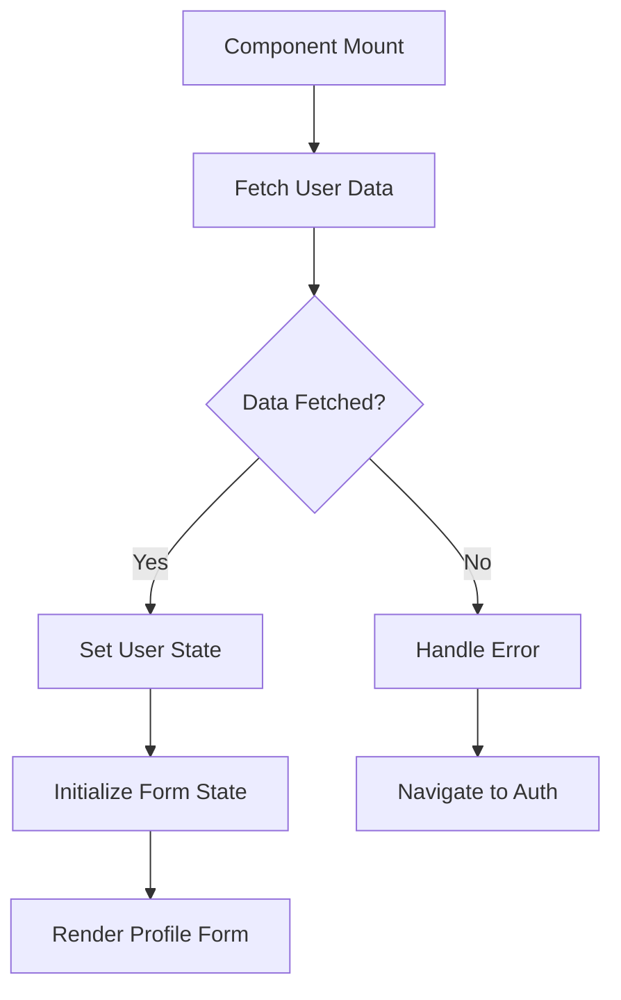
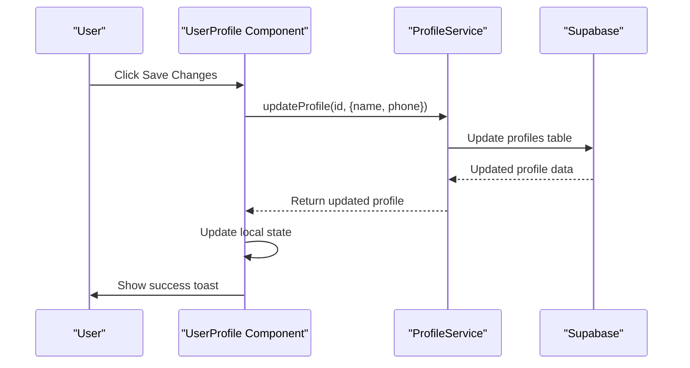
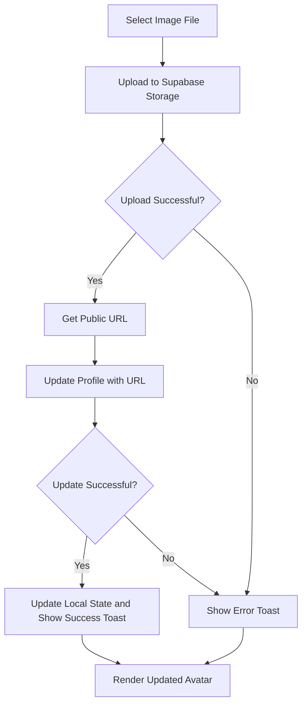
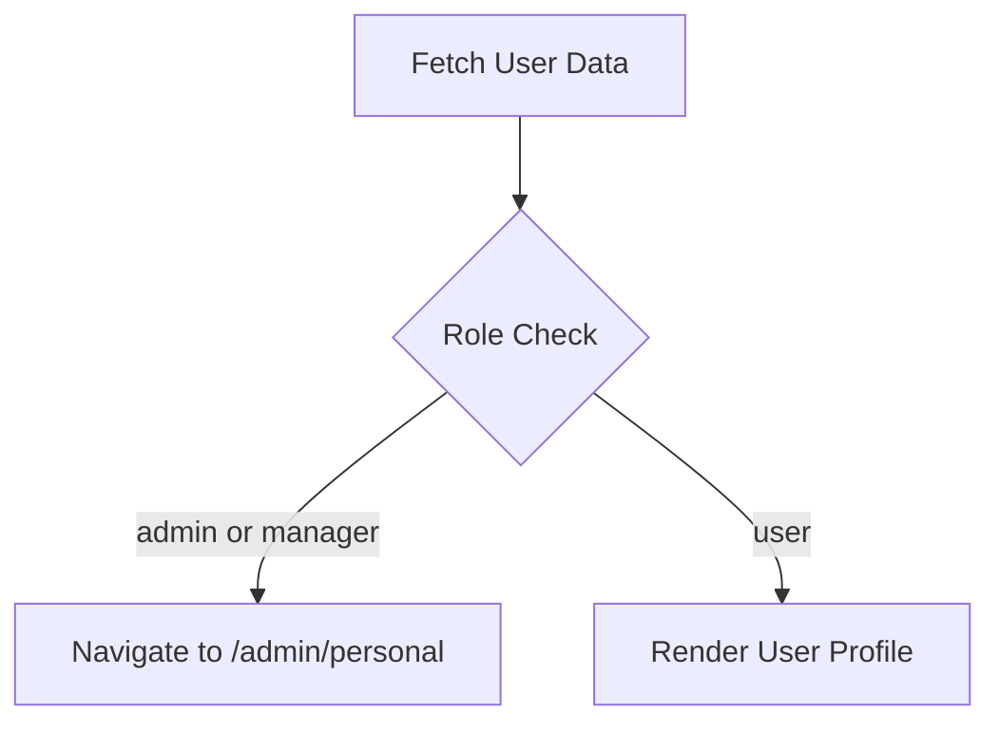

# Profile Management

<cite>
**Referenced Files in This Document**   
- [UserProfile.tsx](file://src/pages/UserProfile.tsx)
- [profile-service.ts](file://src/lib/profile-service.ts)
- [client.ts](file://src/integrations/supabase/client.ts)
</cite>

## Table of Contents
1. [Introduction](#introduction)
2. [Core Components](#core-components)
3. [User Data Fetching and State Management](#user-data-fetching-and-state-management)
4. [Profile Update Functionality](#profile-update-functionality)
5. [Avatar Upload Workflow](#avatar-upload-workflow)
6. [Role-Based Access Control](#role-based-access-control)
7. [Error Handling and User Feedback](#error-handling-and-user-feedback)
8. [Responsive Design and Accessibility](#responsive-design-and-accessibility)

## Introduction
The Profile Management feature in the lovable-rise application enables users to manage their personal information, including name, phone number, and avatar. This document details the implementation of the UserProfile component, focusing on user data fetching, form state management, profile updates, avatar uploads, and role-based access control. The integration with ProfileService and Supabase Storage is explained, along with error handling and user feedback mechanisms.

## Core Components

The UserProfile component is implemented in `UserProfile.tsx` and integrates with the `ProfileService` for profile updates and Supabase Storage for avatar uploads. The component uses React hooks such as `useState` and `useEffect` for state management and side effects. It also leverages the Supabase client for database and storage operations.

**Section sources**
- [UserProfile.tsx](file://src/pages/UserProfile.tsx#L16-L262)
- [profile-service.ts](file://src/lib/profile-service.ts#L59-L814)

## User Data Fetching and State Management

The UserProfile component fetches user data using the `UserAuthService.getCurrentUser()` method within a `useEffect` hook. The user data is stored in the `user` state variable, and loading state is managed with the `loading` state variable. Form fields for name and phone are managed using `useState`, with initial values set from the fetched user data.

**Diagram sources**
- [UserProfile.tsx](file://src/pages/UserProfile.tsx#L16-L262)

**Section sources**
- [UserProfile.tsx](file://src/pages/UserProfile.tsx#L16-L262)

## Profile Update Functionality

The profile update functionality is implemented in the `handleSave` function, which calls `ProfileService.updateProfile()` with the updated name and phone fields. The function uses async/await to handle the asynchronous update operation. Upon successful update, the local user state is updated, and a success toast notification is displayed. Errors are caught and displayed using an error toast notification.

**Diagram sources**
- [UserProfile.tsx](file://src/pages/UserProfile.tsx#L16-L262)
- [profile-service.ts](file://src/lib/profile-service.ts#L233-L286)

**Section sources**
- [UserProfile.tsx](file://src/pages/UserProfile.tsx#L16-L262)
- [profile-service.ts](file://src/lib/profile-service.ts#L233-L286)

## Avatar Upload Workflow

The avatar upload workflow involves selecting an image file, uploading it to Supabase Storage, and updating the user's profile with the public URL. The `handleAvatarUpload` function handles the file input change event, uploads the file to the 'avatars' bucket, retrieves the public URL, and updates the profile using `ProfileService.updateProfile()`.

**Diagram sources**
- [UserProfile.tsx](file://src/pages/UserProfile.tsx#L16-L262)
- [client.ts](file://src/integrations/supabase/client.ts#L1-L31)

**Section sources**
- [UserProfile.tsx](file://src/pages/UserProfile.tsx#L16-L262)
- [client.ts](file://src/integrations/supabase/client.ts#L1-L31)

## Role-Based Access Control

The UserProfile component implements role-based access control by redirecting admin and manager users to the admin profile page. This is achieved in the `useEffect` hook that fetches the user data. If the user's role is 'admin' or 'manager', the component navigates to '/admin/personal' using the `navigate` function.

**Diagram sources**
- [UserProfile.tsx](file://src/pages/UserProfile.tsx#L16-L262)

**Section sources**
- [UserProfile.tsx](file://src/pages/UserProfile.tsx#L16-L262)

## Error Handling and User Feedback

Error handling in the UserProfile component is implemented using try-catch blocks around asynchronous operations. Errors during profile updates or avatar uploads are caught, logged to the console, and displayed to the user using toast notifications from the `sonner` library. Success messages are also displayed using toast notifications to provide feedback on successful operations.

**Section sources**
- [UserProfile.tsx](file://src/pages/UserProfile.tsx#L16-L262)

## Responsive Design and Accessibility

The UserProfile component is designed to be responsive and accessible. It uses a grid layout that adjusts to different screen sizes, with form fields stacking vertically on smaller screens. Labels are properly associated with input fields using the `htmlFor` attribute, and ARIA attributes are used to enhance accessibility. The component also provides visual feedback during loading and saving states.

**Section sources**
- [UserProfile.tsx](file://src/pages/UserProfile.tsx#L16-L262)