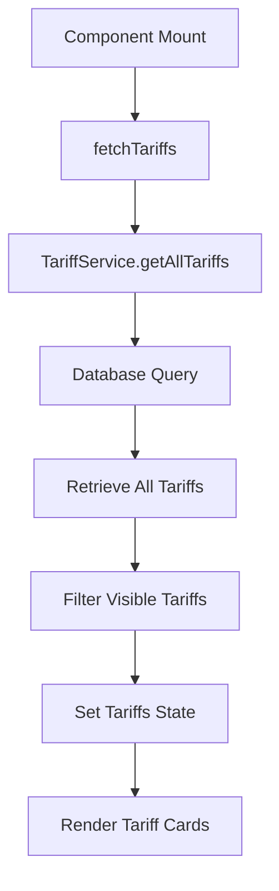
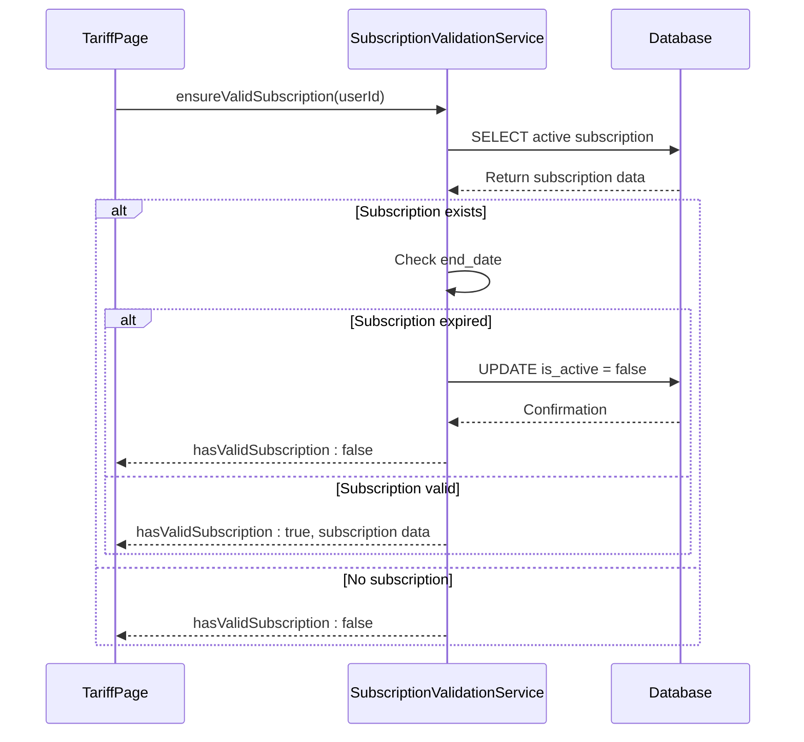
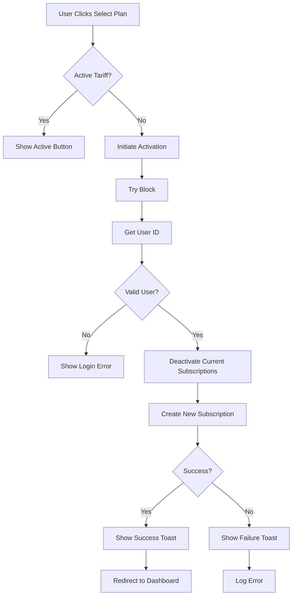
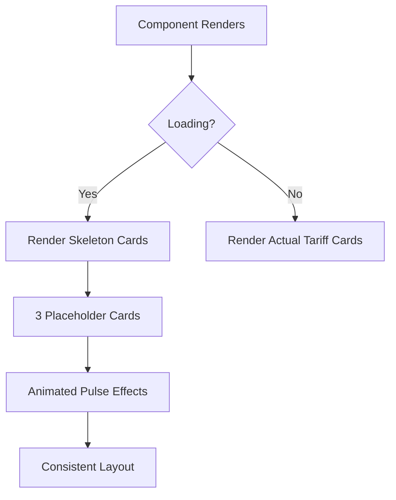

# Subscription Management

<cite>
**Referenced Files in This Document**   
- [TariffPage.tsx](file://src/pages/TariffPage.tsx)
- [tariff-service.ts](file://src/lib/tariff-service.ts)
- [subscription-validation-service.ts](file://src/lib/subscription-validation-service.ts)
- [types.ts](file://src/integrations/supabase/types.ts)
- [card.tsx](file://src/components/ui/card.tsx)
- [badge.tsx](file://src/components/ui/badge.tsx)
- [button.tsx](file://src/components/ui/button.tsx)
</cite>

## Table of Contents
1. [Introduction](#introduction)
2. [TariffPage Component Implementation](#tariffpage-component-implementation)
3. [Tariff Listing and Pricing Display](#tariff-listing-and-pricing-display)
4. [Subscription Activation Workflow](#subscription-activation-workflow)
5. [Visual Design Elements](#visual-design-elements)
6. [Error Handling and User Feedback](#error-handling-and-user-feedback)
7. [Performance Considerations](#performance-considerations)
8. [Security and Best Practices](#security-and-best-practices)
9. [Conclusion](#conclusion)

## Introduction
The Subscription Management feature in the lovable-rise application provides users with a comprehensive interface for selecting and managing their subscription plans. The TariffPage component serves as the central hub for tariff selection, offering users a clear view of available plans, pricing information, and features. This document details the implementation of the TariffPage component, focusing on tariff listing, pricing display, subscription activation workflow, and visual design elements. The system integrates with the TariffService for data retrieval and the SubscriptionValidationService for managing subscription status, ensuring a seamless user experience for subscription management.

## TariffPage Component Implementation

The TariffPage component is implemented as a React functional component that manages the display and interaction of subscription plans. It utilizes React hooks for state management and side effects, with useState for managing tariffs, loading state, and active tariff identification. The component fetches tariff data through the TariffService and validates the user's current subscription status using the SubscriptionValidationService. The implementation follows a clean separation of concerns, with distinct functions for currency symbol handling, duration formatting, and icon selection based on tariff characteristics.

**Section sources**
- [TariffPage.tsx](file://src/pages/TariffPage.tsx#L50-L534)

## Tariff Listing and Pricing Display

### Tariff Fetching and Filtering
The TariffPage component fetches tariffs using the TariffService.getAllTariffs() method, which retrieves all active tariffs from the database. The component specifically filters for visible tariffs by checking the 'visible' property, ensuring only user-facing plans are displayed. This filtering occurs client-side after the initial data retrieval, allowing for flexible presentation of tariff options while maintaining data integrity.

**Diagram sources**
- [TariffPage.tsx](file://src/pages/TariffPage.tsx#L100-L115)
- [tariff-service.ts](file://src/lib/tariff-service.ts#L50-L200)

### Currency Symbol Handling
The component implements a getCurrencySymbol function that maps currency codes to their corresponding symbols for visual display. This function supports multiple currencies including USD ($), EUR (€), GBP (£), JPY (¥), and UAH (₴), ensuring proper localization of pricing information. The implementation uses a switch statement to return the appropriate symbol wrapped in a styled span element, maintaining consistent typography across different screen sizes.

### Duration Formatting
The formatDuration function converts numeric duration values into human-readable text representations. It handles special cases such as lifetime subscriptions (null duration) and standard monthly (30 days) and yearly (365 days) plans. For custom durations, it returns a formatted string with the number of days, providing flexibility for various subscription periods while maintaining user-friendly presentation.

**Section sources**
- [TariffPage.tsx](file://src/pages/TariffPage.tsx#L117-L163)

## Subscription Activation Workflow

### Current Subscription Validation
The component validates the user's current subscription status on mount using the SubscriptionValidationService.ensureValidSubscription method. This service checks for expired subscriptions by comparing the end_date with the current date, automatically deactivating any expired subscriptions. The validation process ensures users always see their current subscription status accurately reflected in the interface.

**Diagram sources**
- [TariffPage.tsx](file://src/pages/TariffPage.tsx#L60-L85)
- [subscription-validation-service.ts](file://src/lib/subscription-validation-service.ts#L50-L140)

### Subscription Activation Process
When a user selects a new tariff, the component initiates a multi-step activation process:
1. Retrieves the current user ID from the authentication system
2. Deactivates any existing active subscriptions by updating the is_active field to false
3. Calculates the new subscription's end date based on the selected tariff's duration_days
4. Creates a new subscription record with the appropriate start and end dates
5. Redirects the user to the dashboard upon successful activation

The process includes comprehensive error handling, with user feedback provided through toast notifications for both success and failure scenarios. The implementation ensures data consistency by performing the deactivation and creation operations as separate database transactions.

**Section sources**
- [TariffPage.tsx](file://src/pages/TariffPage.tsx#L460-L530)

## Visual Design Elements

### Tier-Based Icon Selection
The component implements a sophisticated icon selection system that assigns visual indicators based on tariff characteristics. Free plans are marked with a Zap icon, while lifetime subscriptions receive a Crown icon. For paid plans, the system analyzes the price hierarchy among all available tariffs and assigns tier-appropriate icons:
- Entry-level plans: Rocket icon
- Mid-tier plans: Banknote icon  
- Premium plans: TrendingUp icon

This tiering system is calculated dynamically by sorting paid tariffs by price and determining the relative position of each plan within the pricing structure.

### Popular Plan Badges
Tariffs marked as popular in the database receive a distinctive visual treatment with a "Popular" badge in the top-right corner of the tariff card. This badge features a Star icon and uses the primary color scheme to draw attention to recommended plans. The visual treatment includes a border, shadow, and slight elevation to make popular plans stand out from standard options.

### Discount Indicators
When a tariff has both an old_price and new_price with the old price being higher, the component displays a discount badge showing the percentage reduction. This visual indicator helps users quickly identify value propositions and special offers. The discount calculation uses the standard formula: ((old_price - new_price) / old_price) * 100, rounded to the nearest integer.

### Lifetime Subscription Markers
Lifetime subscriptions are clearly identified with a secondary badge containing a Crown icon and the text "Lifetime". This marker appears below the pricing information, ensuring users can easily distinguish perpetual plans from time-limited subscriptions. The implementation checks the is_lifetime property to determine whether to display this indicator.

**Section sources**
- [TariffPage.tsx](file://src/pages/TariffPage.tsx#L290-L450)

## Error Handling and User Feedback

### Failed Subscription Updates
The subscription activation process includes comprehensive error handling for various failure scenarios:
- Authentication issues (user not logged in)
- Database errors during subscription creation
- Network connectivity problems
- Validation failures

When an error occurs, the system displays an appropriate toast notification using the Sonner library, providing clear feedback to the user. The error handling is implemented within a try-catch block that captures both expected and unexpected exceptions, ensuring the application remains stable even when subscription operations fail.

**Diagram sources**
- [TariffPage.tsx](file://src/pages/TariffPage.tsx#L460-L530)

### User Feedback Mechanisms
The component employs multiple feedback mechanisms to enhance user experience:
- Toast notifications for success and error states
- Visual button states (disabled for active subscriptions)
- Loading skeletons during data retrieval
- Clear call-to-action buttons with appropriate labels

These feedback mechanisms ensure users are always aware of the system state and the results of their actions, reducing confusion and improving overall usability.

**Section sources**
- [TariffPage.tsx](file://src/pages/TariffPage.tsx#L460-L530)

## Performance Considerations

### Loading States with Skeleton Screens
The component implements a sophisticated loading state using skeleton screens to provide immediate visual feedback while tariff data is being retrieved. During the loading phase, three placeholder cards are displayed with animated pulse effects, maintaining the layout structure and giving users a clear indication that content is being prepared. This approach improves perceived performance by reducing the feeling of waiting time.

**Diagram sources**
- [TariffPage.tsx](file://src/pages/TariffPage.tsx#L225-L450)

### Data Fetching Optimization
The TariffService implements several optimization techniques to improve performance:
- Batched queries for related data (currencies, features, limits)
- Caching of frequently accessed data
- Efficient sorting and filtering operations
- Minimized database round trips

These optimizations ensure that tariff data is retrieved quickly and efficiently, contributing to a responsive user interface even with multiple tariff options.

**Section sources**
- [tariff-service.ts](file://src/lib/tariff-service.ts#L50-L200)

## Security and Best Practices

### Secure Subscription Management
The implementation follows security best practices for subscription management:
- Authentication verification before subscription changes
- Proper authorization checks through Supabase RLS (Row Level Security)
- Secure data transmission using HTTPS
- Input validation for all user interactions

The system leverages Supabase's built-in security features, including Row Level Security policies that ensure users can only modify their own subscription data. The implementation also follows the principle of least privilege, with database operations limited to the minimum required permissions.

### Data Integrity
The subscription activation workflow maintains data integrity through:
- Atomic operations for subscription deactivation and creation
- Proper date handling and timezone considerations
- Validation of all input data
- Comprehensive error logging

These practices ensure that subscription data remains consistent and accurate, preventing issues such as multiple active subscriptions or incorrect billing periods.

**Section sources**
- [TariffPage.tsx](file://src/pages/TariffPage.tsx#L460-L530)
- [subscription-validation-service.ts](file://src/lib/subscription-validation-service.ts#L50-L140)

## Conclusion
The Subscription Management feature in the lovable-rise application provides a robust and user-friendly interface for tariff selection and subscription management. The TariffPage component effectively combines comprehensive functionality with thoughtful design, offering users clear information about available plans while ensuring secure and reliable subscription operations. The implementation leverages the TariffService for efficient data retrieval and the SubscriptionValidationService for maintaining subscription integrity, creating a seamless experience from plan selection to activation. With its attention to visual design, performance optimization, and error handling, the system provides a professional-grade subscription management solution that meets both user needs and technical requirements.