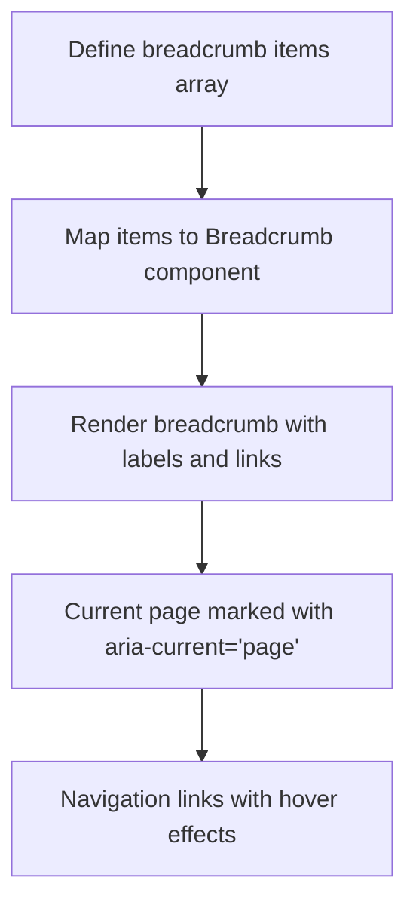
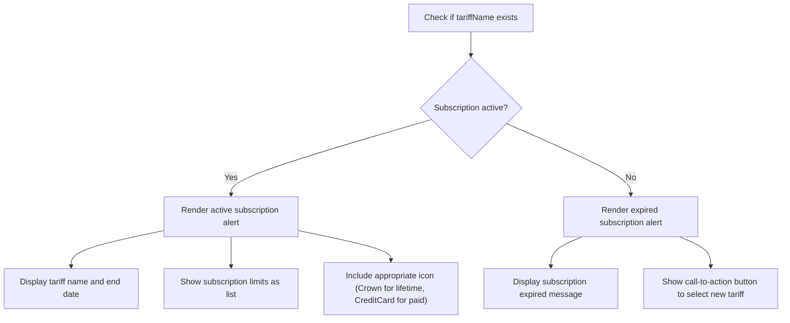
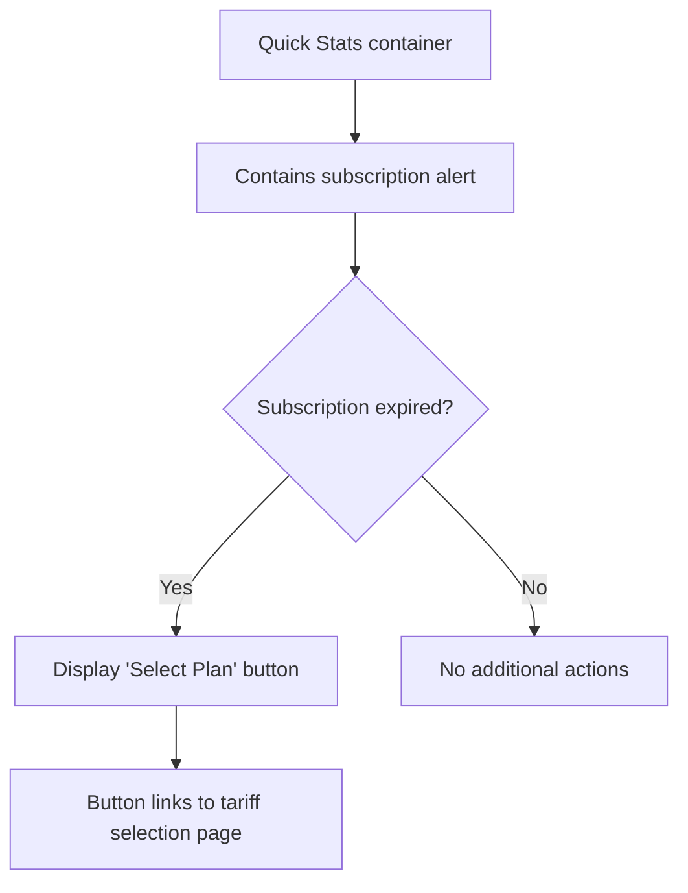
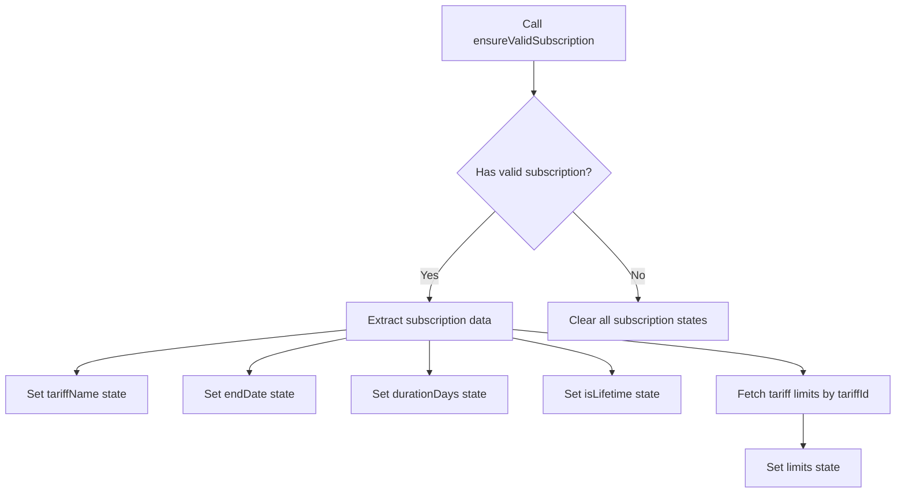
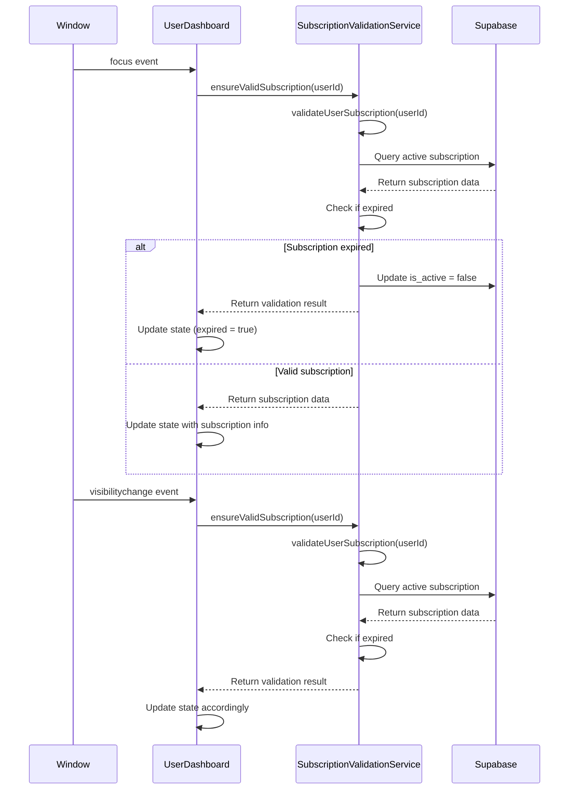
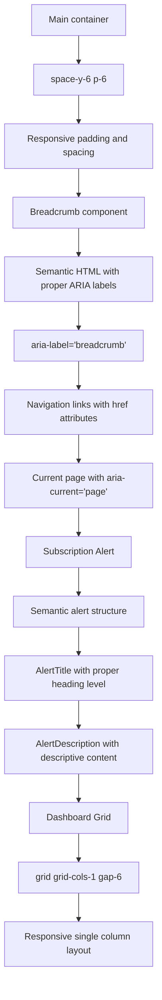
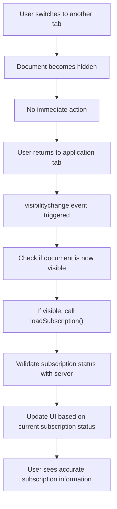
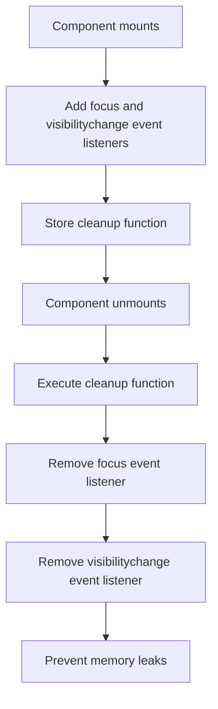

# User Dashboard

<cite>
**Referenced Files in This Document**   
- [UserDashboard.tsx](file://src/pages/UserDashboard.tsx)
- [breadcrumb.tsx](file://src/components/ui/breadcrumb.tsx)
- [subscription-validation-service.ts](file://src/lib/subscription-validation-service.ts)
- [useBreadcrumbs.ts](file://src/hooks/useBreadcrumbs.ts)
- [tariff-service.ts](file://src/lib/tariff-service.ts)
</cite>

## Table of Contents
1. [Introduction](#introduction)
2. [Breadcrumb Navigation Implementation](#breadcrumb-navigation-implementation)
3. [Subscription Status Alert](#subscription-status-alert)
4. [Quick Stats Section](#quick-stats-section)
5. [Subscription Data Fetching and Display](#subscription-data-fetching-and-display)
6. [Real-time Subscription Validation](#real-time-subscription-validation)
7. [State Management and Conditional Rendering](#state-management-and-conditional-rendering)
8. [Responsive Grid Layout and Accessibility](#responsive-grid-layout-and-accessibility)
9. [Common Issues and Solutions](#common-issues-and-solutions)

## Introduction
The User Dashboard feature in the lovable-rise application provides users with a centralized interface to view their subscription status, access key statistics, and navigate through the application. This document details the implementation of the dashboard interface, focusing on the breadcrumb navigation, subscription status alert, and quick stats section. The dashboard leverages React's useEffect hook for real-time subscription validation and state management to ensure users are always informed about their subscription status.

## Breadcrumb Navigation Implementation

The breadcrumb navigation in the User Dashboard is implemented using the Breadcrumb component from the UI library. It provides a clear navigation path for users, enhancing usability and accessibility. The breadcrumb items are defined as an array of objects, each containing a label and optional href and current properties.



**Diagram sources**
- [breadcrumb.tsx](file://src/components/ui/breadcrumb.tsx#L12-L42)
- [UserDashboard.tsx](file://src/pages/UserDashboard.tsx#L33-L35)

**Section sources**
- [UserDashboard.tsx](file://src/pages/UserDashboard.tsx#L33-L35)
- [breadcrumb.tsx](file://src/components/ui/breadcrumb.tsx#L12-L42)

## Subscription Status Alert

The subscription status alert displays critical information about the user's active subscription, including tariff name, end date, and associated limits. The alert is conditionally rendered based on the subscription status and uses different visual styles for active and expired subscriptions.



**Diagram sources**
- [UserDashboard.tsx](file://src/pages/UserDashboard.tsx#L100-L124)
- [alert.tsx](file://src/components/ui/alert.tsx#L12-L39)

**Section sources**
- [UserDashboard.tsx](file://src/pages/UserDashboard.tsx#L100-L124)

## Quick Stats Section

The quick stats section provides users with immediate access to key metrics and information. Currently, this section serves as a container for the subscription alert and any additional quick access buttons or statistics that may be added in the future.



**Diagram sources**
- [UserDashboard.tsx](file://src/pages/UserDashboard.tsx#L130-L136)

**Section sources**
- [UserDashboard.tsx](file://src/pages/UserDashboard.tsx#L130-L136)

## Subscription Data Fetching and Display

The dashboard fetches and displays the user's active subscription information through a comprehensive process that includes validation, data retrieval, and state management. The system retrieves the tariff name, end date, duration, and associated limits to provide a complete picture of the user's subscription status.



**Diagram sources**
- [UserDashboard.tsx](file://src/pages/UserDashboard.tsx#L78-L98)
- [subscription-validation-service.ts](file://src/lib/subscription-validation-service.ts#L60-L114)
- [tariff-service.ts](file://src/lib/tariff-service.ts#L500-L520)

**Section sources**
- [UserDashboard.tsx](file://src/pages/UserDashboard.tsx#L78-L98)

## Real-time Subscription Validation

The real-time subscription validation mechanism ensures that users are always informed about their subscription status, even when returning to the application after a period of inactivity. The system uses window focus and visibility events to trigger subscription validation checks.



**Diagram sources**
- [UserDashboard.tsx](file://src/pages/UserDashboard.tsx#L85-L98)
- [subscription-validation-service.ts](file://src/lib/subscription-validation-service.ts#L60-L114)

**Section sources**
- [UserDashboard.tsx](file://src/pages/UserDashboard.tsx#L85-L98)

## State Management and Conditional Rendering

The UserDashboard component implements comprehensive state management using React's useState and useEffect hooks. The component manages multiple state variables to track subscription details and uses conditional rendering to display appropriate content based on the subscription status.

```mermaid
classDiagram
class UserDashboard {
+endDate : string | null
+tariffName : string | null
+durationDays : number | null
+expired : boolean
+isDemo : boolean
+isLifetime : boolean
+limits : Array{limit_name : string, value : number, id? : number}
+loadSubscription() : Promise~void~
+useEffect() : void
}
class SubscriptionValidationService {
+ensureValidSubscription(userId : string) : Promise~{hasValidSubscription : boolean, subscription : any | null, isDemo : boolean}~
+validateUserSubscription(userId : string) : Promise~{isValid : boolean, subscription : any | null, wasDeactivated : boolean}~
+isExpired(endDate : string | null) : boolean
}
class TariffService {
+getTariffLimits(tariffId : number) : Promise~TariffLimit[]~
}
UserDashboard --> SubscriptionValidationService : "uses"
UserDashboard --> TariffService : "uses"
SubscriptionValidationService --> Supabase : "queries"
TariffService --> Supabase : "queries"
```

**Diagram sources**
- [UserDashboard.tsx](file://src/pages/UserDashboard.tsx#L46-L76)
- [subscription-validation-service.ts](file://src/lib/subscription-validation-service.ts#L60-L114)
- [tariff-service.ts](file://src/lib/tariff-service.ts#L500-L520)

**Section sources**
- [UserDashboard.tsx](file://src/pages/UserDashboard.tsx#L46-L76)

## Responsive Grid Layout and Accessibility

The User Dashboard implements a responsive grid layout using Tailwind CSS classes, ensuring optimal display across different device sizes. The interface also incorporates accessibility features to support users with various needs.



**Diagram sources**
- [UserDashboard.tsx](file://src/pages/UserDashboard.tsx#L100-L136)
- [breadcrumb.tsx](file://src/components/ui/breadcrumb.tsx#L12-L42)
- [alert.tsx](file://src/components/ui/alert.tsx#L12-L39)

**Section sources**
- [UserDashboard.tsx](file://src/pages/UserDashboard.tsx#L100-L136)

## Common Issues and Solutions

This section addresses common issues related to subscription status management and provides solutions implemented in the User Dashboard.

### Subscription Status Desynchronization
A common issue occurs when the subscription status becomes desynchronized between the client and server, particularly when users keep the application open for extended periods.

**Solution: Event-driven Refreshes**
The implementation addresses this issue through event-driven refreshes using window focus and visibility events:



The useEffect cleanup function ensures proper event listener management:



**Diagram sources**
- [UserDashboard.tsx](file://src/pages/UserDashboard.tsx#L85-L98)

**Section sources**
- [UserDashboard.tsx](file://src/pages/UserDashboard.tsx#L85-L98)