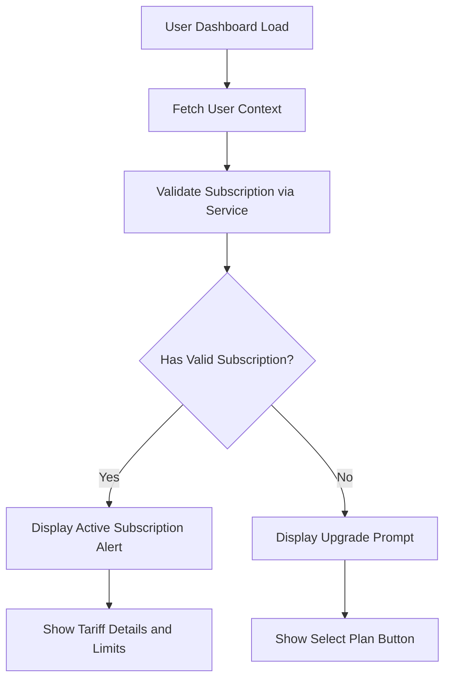
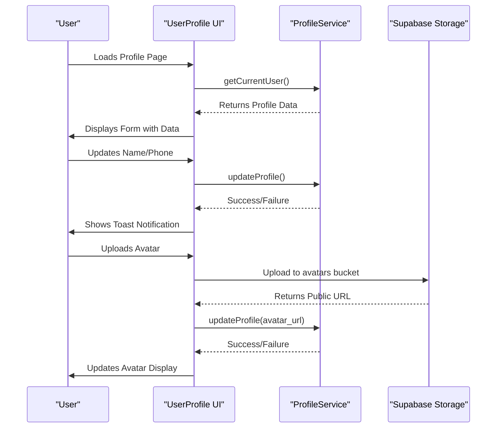
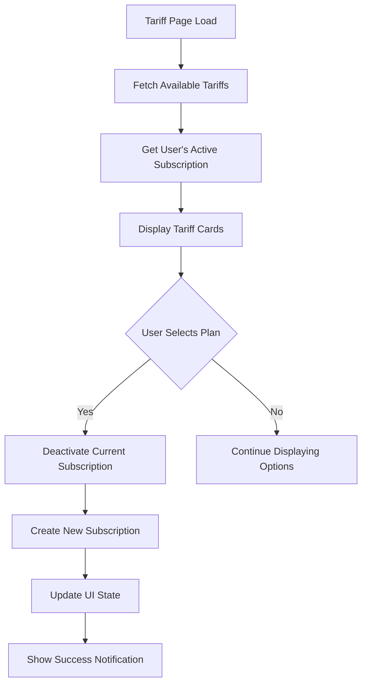
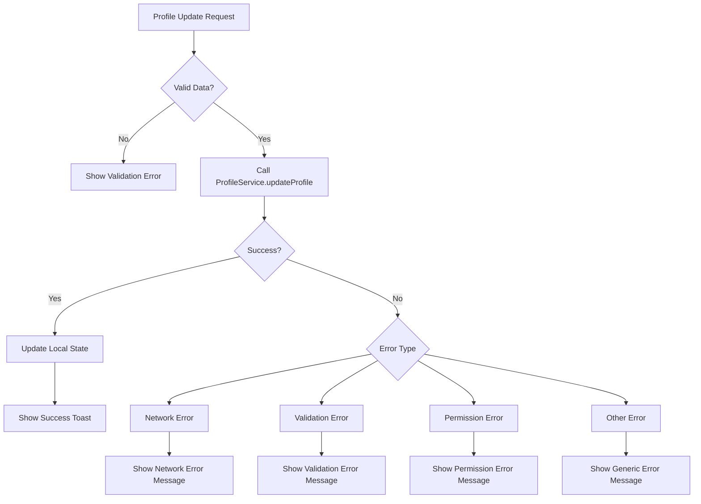

# User Features

<cite>
**Referenced Files in This Document**   
- [UserDashboard.tsx](file://src/pages/UserDashboard.tsx)
- [UserProfile.tsx](file://src/pages/UserProfile.tsx)
- [TariffPage.tsx](file://src/pages/TariffPage.tsx)
- [subscription-validation-service.ts](file://src/lib/subscription-validation-service.ts)
- [profile-service.ts](file://src/lib/profile-service.ts)
- [error-handler.ts](file://src/lib/error-handler.ts)
</cite>

## Table of Contents
1. [User Dashboard Interface](#user-dashboard-interface)
2. [Profile Management Functionality](#profile-management-functionality)
3. [Subscription Management Interface](#subscription-management-interface)
4. [Common Issues and Solutions](#common-issues-and-solutions)
5. [Performance Considerations](#performance-considerations)

## User Dashboard Interface

The user dashboard interface provides a comprehensive overview of the user's account status and subscription information. The dashboard displays a subscription alert that shows the current tariff plan, expiration date, and associated limits. The interface is implemented in the `UserDashboard` component, which fetches subscription data through the `SubscriptionValidationService` to ensure the subscription is valid and not expired.

The dashboard includes a breadcrumb navigation system and displays subscription details including tariff name, end date, and usage limits. For demo or trial accounts, a special indicator is shown. The interface also handles both active and expired subscription states, providing appropriate messaging and call-to-action buttons for users to upgrade their plans.

**Diagram sources**
- [UserDashboard.tsx](file://src/pages/UserDashboard.tsx#L22-L159)

**Section sources**
- [UserDashboard.tsx](file://src/pages/UserDashboard.tsx#L22-L159)

## Profile Management Functionality

The profile management functionality allows users to update their personal information including name and phone number, as well as upload a profile avatar. The `UserProfile` component implements a form-based interface where users can edit their details and save changes. The component fetches the current user data on load and provides real-time feedback through loading states and success/error notifications.

Users can update their profile information by modifying the form fields and clicking the save button. The interface also allows avatar uploads through a file input that triggers Supabase storage operations. Email addresses cannot be changed through this interface as they are considered immutable primary identifiers. The member since date is displayed as read-only information.

**Diagram sources**
- [UserProfile.tsx](file://src/pages/UserProfile.tsx#L16-L262)
- [profile-service.ts](file://src/lib/profile-service.ts#L59-L814)

**Section sources**
- [UserProfile.tsx](file://src/pages/UserProfile.tsx#L16-L262)

## Subscription Management Interface

The subscription management interface allows users to view available tariff plans and upgrade their current subscription. The `TariffPage` component displays all available plans with their features, limits, and pricing information. Users can see which plan they are currently subscribed to, with visual indicators for active plans.

The interface fetches tariff data from the `TariffService` and displays it in a grid layout with cards for each plan. Each tariff card shows the plan name, description, price, features, and usage limits. Users can select a new plan which triggers a subscription update process that deactivates their current subscription and creates a new one with the selected tariff.

The subscription validation service automatically checks subscription status on page load and when the browser tab regains focus, ensuring users always see up-to-date subscription information. This prevents issues with stale subscription data that might occur if a subscription expires while the user is away from the application.

**Diagram sources**
- [TariffPage.tsx](file://src/pages/TariffPage.tsx#L0-L536)
- [subscription-validation-service.ts](file://src/lib/subscription-validation-service.ts#L6-L144)

**Section sources**
- [TariffPage.tsx](file://src/pages/TariffPage.tsx#L0-L536)

## Common Issues and Solutions

### Subscription Status Synchronization

A common issue in the application is subscription status synchronization, where the UI might display outdated subscription information. This is addressed through the `SubscriptionValidationService` which implements multiple strategies to ensure accurate subscription status:

1. **Automatic Validation**: The service validates subscription status on every page load and navigation
2. **Focus Event Listeners**: The dashboard listens for window focus and visibility change events to refresh subscription data when the user returns to the application
3. **Expiration Checking**: The service checks the end_date of subscriptions and automatically deactivates expired ones
4. **Cache Management**: Subscription data is not cached to ensure always fresh data is displayed

The service handles both regular subscriptions with end dates and lifetime subscriptions that do not expire. For demo accounts, special handling ensures they are properly identified and displayed with appropriate messaging.

### Error Handling in Profile Updates

Profile updates may fail due to various reasons including network issues, validation errors, or permission problems. The application implements comprehensive error handling through the `error-handler.ts` module which provides user-friendly error messages and appropriate feedback:

- **Validation Errors**: Displayed when required fields are missing or invalid
- **Network Errors**: Shown when connectivity issues prevent profile updates
- **Permission Errors**: Indicate when users lack necessary permissions
- **Avatar Upload Failures**: Specific errors for image upload problems

The error handling system uses standardized error codes and messages to ensure consistent user experience across different parts of the application.

**Diagram sources**
- [subscription-validation-service.ts](file://src/lib/subscription-validation-service.ts#L6-L144)
- [error-handler.ts](file://src/lib/error-handler.ts#L0-L416)

**Section sources**
- [subscription-validation-service.ts](file://src/lib/subscription-validation-service.ts#L6-L144)
- [error-handler.ts](file://src/lib/error-handler.ts#L0-L416)

## Performance Considerations

### Data Loading States

The application implements several performance optimizations for user-facing operations:

1. **Progressive Loading**: Components show skeleton loaders during data fetching to provide immediate feedback
2. **Conditional Rendering**: Subscription alerts and action buttons are only rendered when relevant
3. **Event-Driven Updates**: Subscription data is refreshed on window focus and visibility changes to minimize unnecessary API calls
4. **Error Resilience**: Failed subscription loading is handled silently without disrupting the user experience

The UserProfile component shows a loading spinner while fetching user data, preventing users from interacting with incomplete information. The TariffPage displays skeleton cards during the initial data loading phase, providing a smooth perceived performance.

### Error Handling and User Feedback

The application uses toast notifications to provide feedback on profile updates and subscription changes. Success messages confirm operations like profile updates and avatar uploads, while error messages guide users on how to resolve issues. The error handling system categorizes errors into meaningful types and provides appropriate user-facing messages.

Network requests are wrapped in try-catch blocks with specific error handling for different failure modes. The application distinguishes between validation errors (user input issues) and system errors (network, server issues) to provide targeted feedback. For critical operations like profile updates, the UI disables action buttons during processing to prevent duplicate submissions.

**Section sources**
- [UserDashboard.tsx](file://src/pages/UserDashboard.tsx#L22-L159)
- [UserProfile.tsx](file://src/pages/UserProfile.tsx#L16-L262)
- [error-handler.ts](file://src/lib/error-handler.ts#L0-L416)