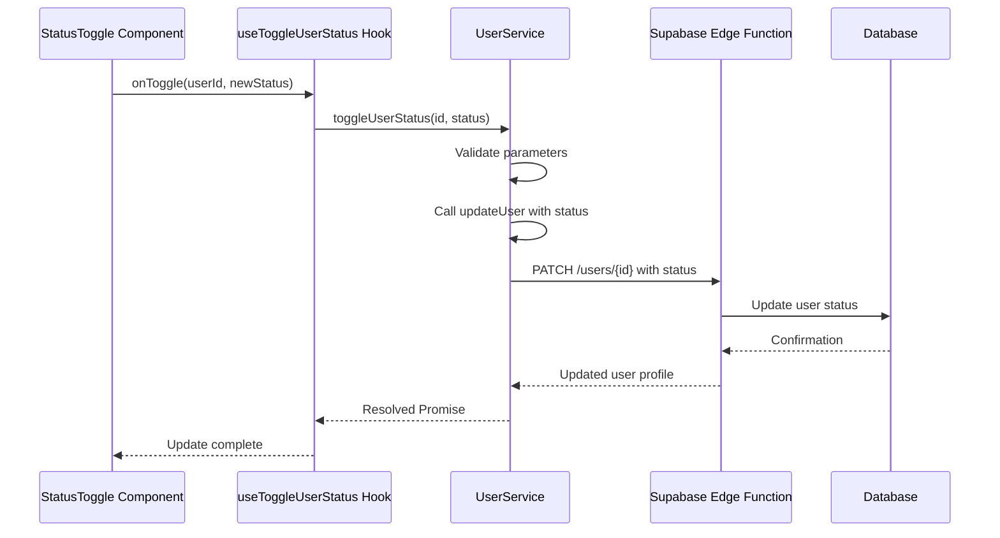
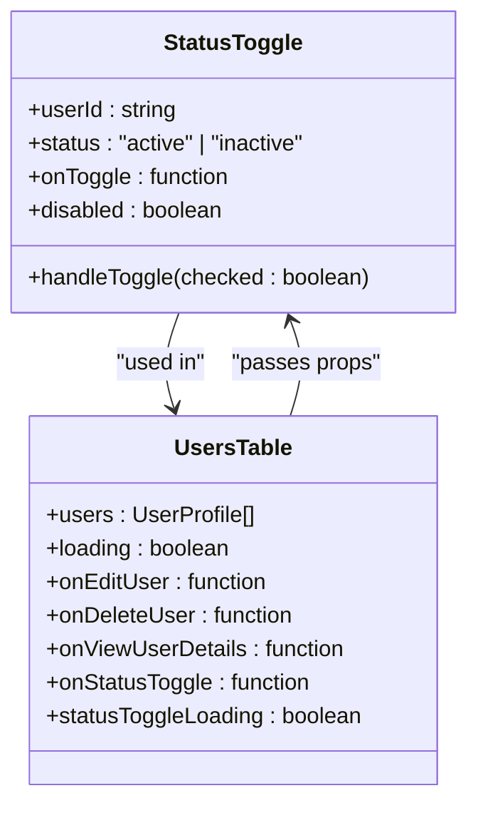

# Status Management

<cite>
**Referenced Files in This Document**   
- [user-service.ts](file://src/lib/user-service.ts)
- [StatusToggle.tsx](file://src/components/admin/StatusToggle.tsx)
- [UsersTable.tsx](file://src/components/admin/UsersTable.tsx)
- [useUsers.ts](file://src/hooks/useUsers.ts)
</cite>

## Table of Contents
1. [Introduction](#introduction)
2. [User Status Implementation](#user-status-implementation)
3. [Data Flow and Integration](#data-flow-and-integration)
4. [Validation and Business Logic](#validation-and-business-logic)
5. [UI Components](#ui-components)
6. [Error Handling](#error-handling)
7. [Optimistic Updates](#optimistic-updates)
8. [Best Practices](#best-practices)

## Introduction
The lovable-rise application implements a comprehensive user status management system that allows administrators to toggle user status between active and inactive states. This document details the implementation of the `toggleUserStatus` method in the `UserService` class, its integration with UI components like `StatusToggle` and `UsersTable`, and the complete data flow from user interaction to database persistence. The system incorporates validation rules, error handling, and optimistic updates to provide a seamless user experience while maintaining data integrity.

## User Status Implementation

The user status management functionality is centered around the `toggleUserStatus` method in the `UserService` class. This method serves as the primary interface for changing a user's status and follows a well-defined implementation pattern.

The `toggleUserStatus` method accepts two parameters: the user ID and the target status ("active" or "inactive"). It performs comprehensive validation on these inputs before proceeding with the status update. The method then delegates the actual update operation to the `updateUser` method, passing only the status field to be updated.

This implementation follows the principle of separation of concerns, where the `toggleUserStatus` method focuses on status-specific logic and validation, while the `updateUser` method handles the general user update functionality. The method returns a Promise that resolves to the updated `UserProfile` object, allowing the calling code to access the user's new state after the update.

**Section sources**
- [user-service.ts](file://src/lib/user-service.ts#L301-L310)

## Data Flow and Integration

The data flow for user status management follows a clear path from the user interface through the service layer to the database. When an administrator interacts with the status toggle in the UI, the following sequence of events occurs:

1. The UI component triggers the status change event
2. The event is handled by the component's callback function
3. The `toggleUserStatus` method in `UserService` is called with the user ID and new status
4. Input validation is performed on the parameters
5. The `updateUser` method is called with the status update data
6. Authentication headers are obtained and included in the request
7. A PATCH request is sent to the Supabase Edge Function
8. The database is updated with the new status
9. The updated user profile is returned to the client

This flow ensures that all status changes are properly authenticated and validated before being persisted to the database. The use of Supabase Edge Functions provides a secure intermediary layer between the client application and the database, allowing for additional business logic and validation on the server side.

**Diagram sources**
- [user-service.ts](file://src/lib/user-service.ts#L301-L310)
- [StatusToggle.tsx](file://src/components/admin/StatusToggle.tsx#L1-L40)

## Validation and Business Logic

The user status management system implements comprehensive validation rules to ensure data integrity and prevent invalid state transitions. These validation rules are applied at multiple levels of the application stack.

At the service layer, the `toggleUserStatus` method performs three key validations:
1. The user ID must be provided and not empty
2. The status parameter must be defined and not null
3. The status value must be either "active" or "inactive"

These validations are implemented using conditional checks that throw `ApiError` instances with appropriate error messages and HTTP status codes when validation fails. The error messages are descriptive and help administrators understand what went wrong.

The business logic for status management is designed to be idempotent, meaning that attempting to set a user's status to its current value is a valid operation that will succeed without error. This simplifies the UI implementation, as the toggle component doesn't need to track the current state before making the API call.

The system also incorporates session validation through the `SessionValidator` class, ensuring that only authenticated administrators can modify user status. This validation occurs before any database operations, providing an additional layer of security.

**Section sources**
- [user-service.ts](file://src/lib/user-service.ts#L301-L310)
- [user-service.ts](file://src/lib/user-service.ts#L179-L222)

## UI Components

The user interface for status management consists of two primary components: `StatusToggle` and `UsersTable`. These components work together to provide an intuitive and responsive interface for administrators to manage user status.

The `StatusToggle` component is a reusable UI element that combines a switch control with a status badge. It displays the current status visually and allows administrators to toggle between active and inactive states with a single click. The component accepts several props:
- `userId`: The ID of the user whose status is being toggled
- `status`: The current status of the user
- `onToggle`: A callback function triggered when the status is changed
- `disabled`: A boolean indicating whether the toggle is disabled

The `UsersTable` component integrates the `StatusToggle` component into a comprehensive user management interface. It displays a table of users with their current status and provides the `onStatusToggle` callback that connects the UI interaction to the underlying service layer. The table also handles loading states, displaying a skeleton loader when status updates are in progress.

Both components are designed with accessibility in mind, using appropriate ARIA labels and keyboard navigation support. They also incorporate internationalization through the `useI18n` hook, allowing the status labels to be translated into different languages.

**Diagram sources**
- [StatusToggle.tsx](file://src/components/admin/StatusToggle.tsx#L1-L40)
- [UsersTable.tsx](file://src/components/admin/UsersTable.tsx#L1-L412)

## Error Handling

The user status management system implements a robust error handling strategy to ensure reliability and provide meaningful feedback to administrators. Errors are handled at multiple levels of the application stack, from input validation to network communication.

When validation errors occur, such as missing user ID or invalid status value, the system throws `ApiError` instances with appropriate HTTP status codes (400 for bad requests). These errors are caught by the calling code and can be displayed to the administrator with descriptive messages.

For authentication-related errors, such as invalid or expired sessions, the system returns 401 status codes. This ensures that only authenticated administrators can modify user status, and that their sessions are validated before any changes are made.

Network errors and server-side issues are handled with 500 status codes, indicating internal server errors. The system logs these errors for debugging purposes while presenting a user-friendly message to the administrator.

The error handling is further enhanced by the `handleApiError` function, which normalizes different types of error objects into a consistent `ApiError` format. This simplifies error handling in the UI components, as they can expect a consistent error structure regardless of the source of the error.

**Section sources**
- [user-service.ts](file://src/lib/user-service.ts#L301-L310)
- [user-service.ts](file://src/lib/user-service.ts#L314-L335)

## Optimistic Updates

The application implements optimistic updates for user status changes, providing a responsive user experience while ensuring data consistency. This is achieved through the `useToggleUserStatus` hook in the `useUsers.ts` file.

When a status change is initiated, the hook performs the following steps:
1. Cancels any pending queries for user data
2. Takes a snapshot of the current user list
3. Optimistically updates the user list in the cache with the new status
4. Sends the update request to the server
5. Handles success or failure appropriately

If the update succeeds, the query cache is invalidated, causing a fresh fetch of user data to ensure consistency. If the update fails, the hook rolls back to the previous state using the snapshot taken before the update, providing a seamless recovery from errors.

This approach makes the UI feel more responsive, as the status change is reflected immediately without waiting for the server response. It also handles network latency gracefully, maintaining a smooth user experience even under less-than-ideal network conditions.

The optimistic update strategy is particularly important for user status management, as administrators may be updating multiple users in quick succession. Without optimistic updates, each status change would require a round-trip to the server, creating a laggy and frustrating experience.

**Section sources**
- [useUsers.ts](file://src/hooks/useUsers.ts#L160-L197)

## Best Practices

The user status management implementation follows several best practices for building reliable and maintainable applications:

1. **Separation of Concerns**: The system separates UI components from business logic, with the `StatusToggle` component handling presentation and the `UserService` class handling data operations.

2. **Input Validation**: Comprehensive validation is performed on all inputs at the service layer, preventing invalid data from reaching the database.

3. **Error Handling**: A consistent error handling strategy is implemented across the application, with meaningful error messages and appropriate HTTP status codes.

4. **Type Safety**: TypeScript interfaces are used throughout the codebase to ensure type safety and provide better developer experience.

5. **Authentication and Authorization**: All operations are protected by session validation, ensuring that only authenticated administrators can modify user status.

6. **Optimistic Updates**: The UI is updated immediately upon user interaction, providing a responsive experience while maintaining data consistency.

7. **Internationalization**: The components are designed to support multiple languages through the `useI18n` hook.

8. **Accessibility**: The UI components follow accessibility best practices, including proper labeling and keyboard navigation support.

9. **Performance Optimization**: The system uses caching and efficient data fetching strategies to minimize network requests and improve performance.

10. **Consistent API Design**: The service methods follow a consistent pattern, making them easy to understand and use.

These best practices contribute to a robust and maintainable user status management system that can be extended and modified as the application evolves.