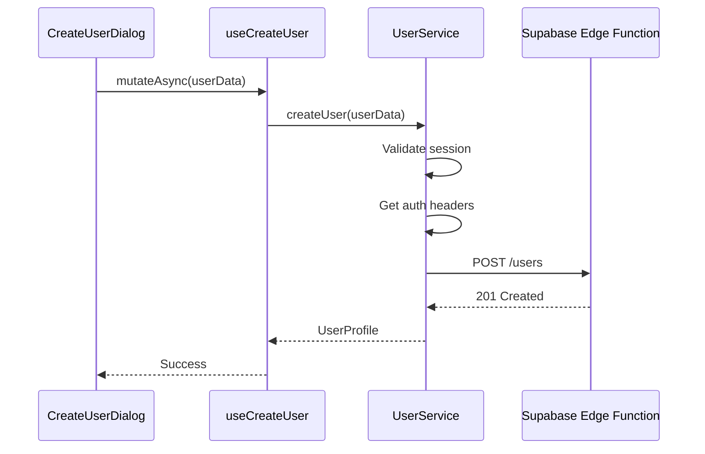
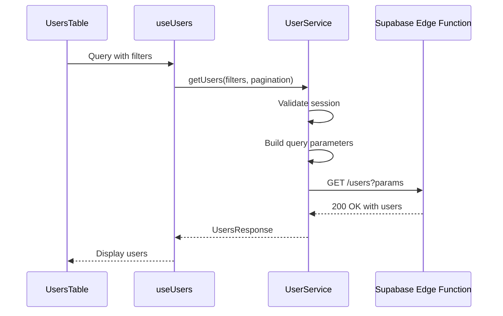
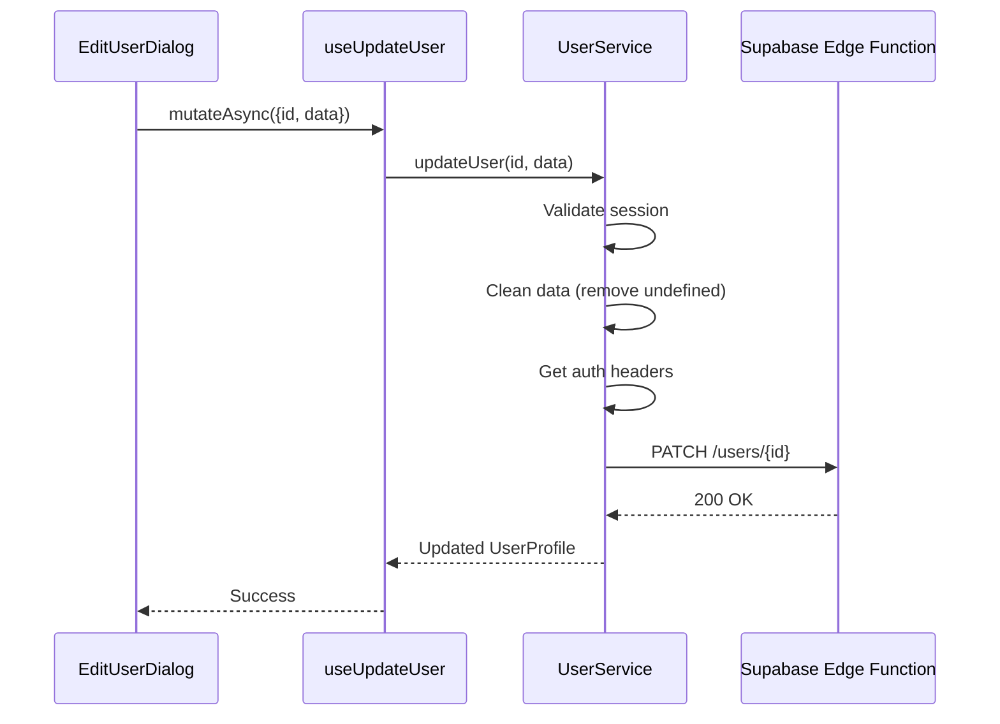
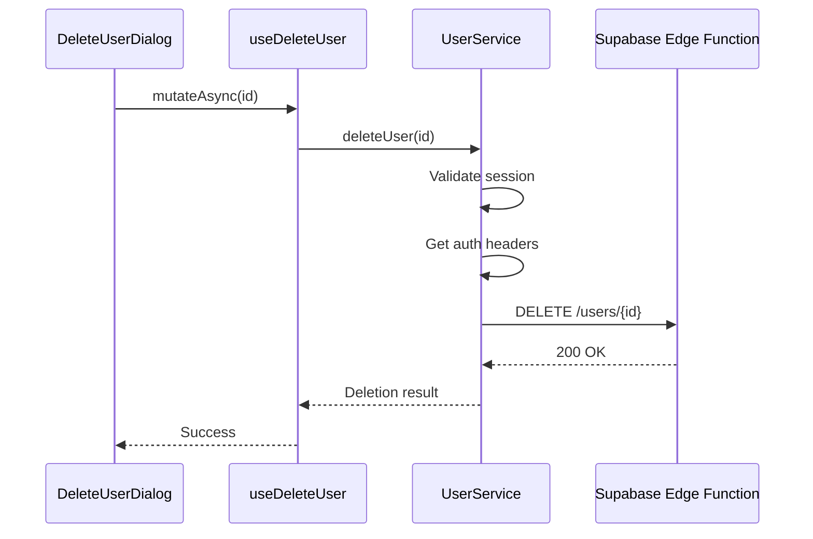
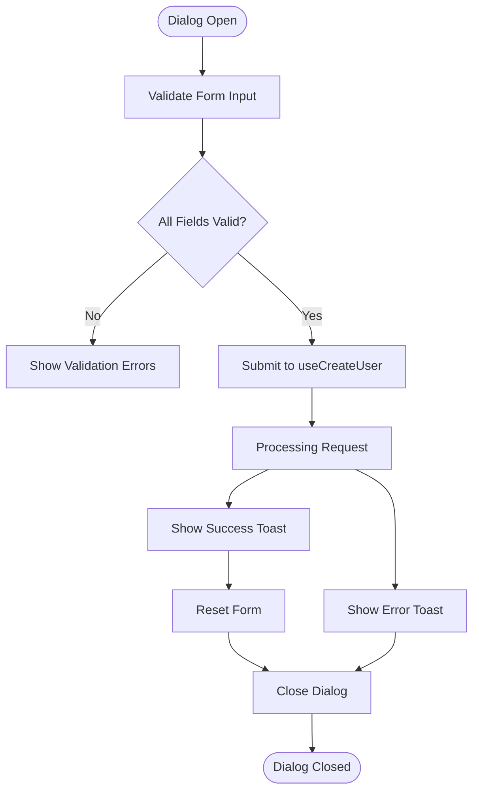
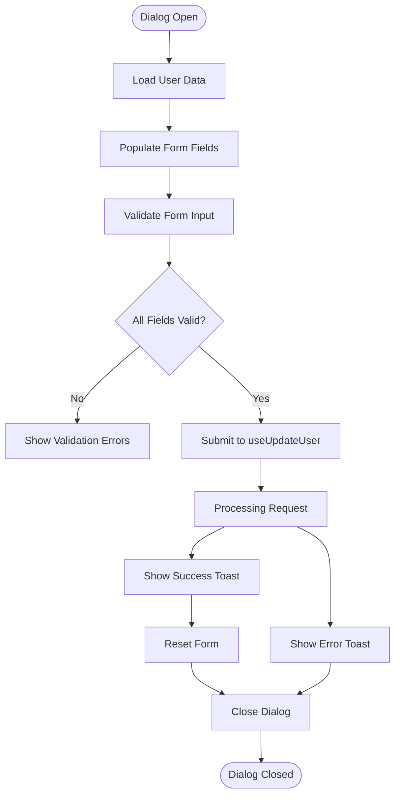
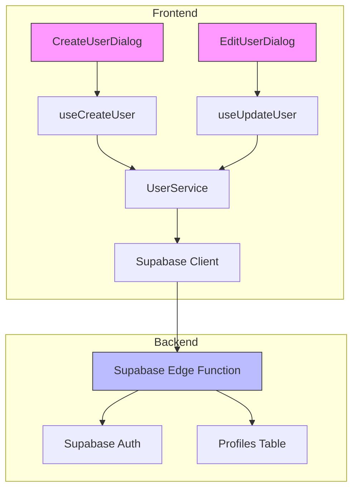
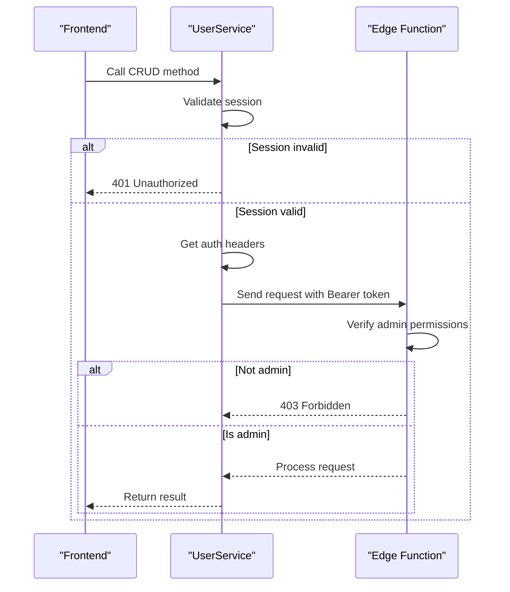
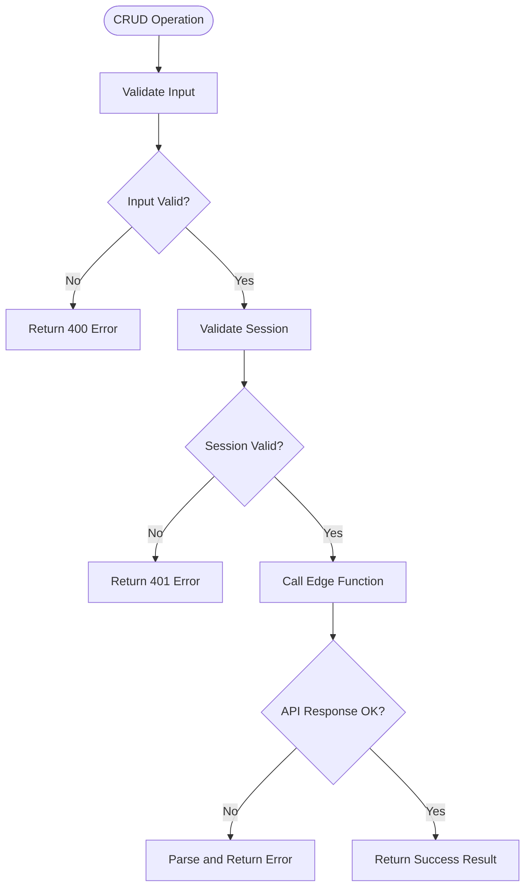

# User CRUD Operations

<cite>
**Referenced Files in This Document**   
- [user-service.ts](file://src/lib/user-service.ts)
- [CreateUserDialog.tsx](file://src/components/admin/CreateUserDialog.tsx)
- [EditUserDialog.tsx](file://src/components/admin/EditUserDialog.tsx)
- [useUsers.ts](file://src/hooks/useUsers.ts)
- [index.ts](file://supabase/functions/users/index.ts)
- [client.ts](file://src/integrations/supabase/client.ts)
</cite>

## Table of Contents
1. [Introduction](#introduction)
2. [Core CRUD Operations](#core-crud-operations)
3. [UI Components](#ui-components)
4. [Data Flow and Integration](#data-flow-and-integration)
5. [Error Handling](#error-handling)
6. [Best Practices](#best-practices)

## Introduction

The lovable-rise application implements a comprehensive user management system with full CRUD (Create, Read, Update, Delete) operations. This documentation details the implementation of user management functionality, focusing on the UserService class methods and their integration with UI components and backend services. The system follows a layered architecture with React components, React Query hooks for state management, a service layer for business logic, and Supabase Edge Functions for backend operations.

**Section sources**
- [user-service.ts](file://src/lib/user-service.ts#L81-L311)

## Core CRUD Operations

The UserService class provides static methods for all user management operations, implementing a clean and consistent API for user data manipulation. Each method handles authentication, error management, and communication with the backend service.

### Create Operation

The `createUser` method creates a new user account with validation and proper error handling. It requires essential user information including email, password, and name.

**Parameters:**
- `userData`: Object containing user information (email, password, name, phone, role, notify_by_email)

**Return Value:**
- `UserProfile`: Object containing the created user's information

**Error Conditions:**
- Missing required fields (400)
- Invalid session (401)
- Backend service errors (500)

**Diagram sources**
- [user-service.ts](file://src/lib/user-service.ts#L125-L168)
- [index.ts](file://supabase/functions/users/index.ts#L250-L310)

**Section sources**
- [user-service.ts](file://src/lib/user-service.ts#L125-L168)

### Read Operations

The UserService provides two methods for reading user data: `getUsers` for retrieving multiple users with filtering and pagination, and `getUser` for retrieving a single user by ID.

**Parameters for getUsers:**
- `filters`: Object for filtering users by search, status, role, etc.
- `pagination`: Object specifying page number and limit

**Return Value:**
- `UsersResponse`: Object containing users array, total count, current page, and limit

**Diagram sources**
- [user-service.ts](file://src/lib/user-service.ts#L81-L123)
- [index.ts](file://supabase/functions/users/index.ts#L100-L140)

**Section sources**
- [user-service.ts](file://src/lib/user-service.ts#L81-L123)

### Update Operation

The `updateUser` method modifies existing user information with partial updates. It accepts only the fields that need to be changed.

**Parameters:**
- `id`: User ID to update
- `data`: Object containing fields to update (name, phone, status)

**Return Value:**
- `UserProfile`: Object containing the updated user's information

**Error Conditions:**
- Missing user ID (400)
- No fields provided for update (400)
- Invalid session (401)
- Backend service errors (500)

**Diagram sources**
- [user-service.ts](file://src/lib/user-service.ts#L170-L215)
- [index.ts](file://supabase/functions/users/index.ts#L312-L380)

**Section sources**
- [user-service.ts](file://src/lib/user-service.ts#L170-L215)

### Delete Operation

The `deleteUser` method removes a user account from both the authentication system and profile database.

**Parameters:**
- `id`: User ID to delete

**Return Value:**
- Object indicating success status and which components were deleted (auth, profile)

**Error Conditions:**
- Missing user ID (400)
- Invalid session (401)
- Backend service errors (500)

**Diagram sources**
- [user-service.ts](file://src/lib/user-service.ts#L265-L311)
- [index.ts](file://supabase/functions/users/index.ts#L382-L450)

**Section sources**
- [user-service.ts](file://src/lib/user-service.ts#L265-L311)

## UI Components

The user management interface is implemented through dialog components that provide a clean and intuitive user experience with proper form validation and state management.

### CreateUserDialog

The CreateUserDialog component provides a form for creating new user accounts with comprehensive validation.

**Key Features:**
- Form validation using Zod schema
- Password visibility toggle
- Loading state during submission
- Success callback on completion

**Diagram sources**
- [CreateUserDialog.tsx](file://src/components/admin/CreateUserDialog.tsx#L46-L257)
- [useUsers.ts](file://src/hooks/useUsers.ts#L80-L99)

**Section sources**
- [CreateUserDialog.tsx](file://src/components/admin/CreateUserDialog.tsx#L46-L257)

### EditUserDialog

The EditUserDialog component allows administrators to modify existing user information.

**Key Features:**
- Pre-populated form with existing user data
- Email field is readonly
- Form reset on dialog close
- Loading state during submission

**Diagram sources**
- [EditUserDialog.tsx](file://src/components/admin/EditUserDialog.tsx#L54-L202)
- [useUsers.ts](file://src/hooks/useUsers.ts#L101-L122)

**Section sources**
- [EditUserDialog.tsx](file://src/components/admin/EditUserDialog.tsx#L54-L202)

## Data Flow and Integration

The user CRUD operations follow a consistent data flow pattern from UI components through service layers to the backend and back.

### Architecture Overview

**Diagram sources**
- [user-service.ts](file://src/lib/user-service.ts)
- [index.ts](file://supabase/functions/users/index.ts)
- [client.ts](file://src/integrations/supabase/client.ts)

**Section sources**
- [user-service.ts](file://src/lib/user-service.ts)
- [index.ts](file://supabase/functions/users/index.ts)

### Authentication Flow

The system implements a secure authentication flow for all CRUD operations:

1. Session validation before each operation
2. Bearer token authentication headers
3. Admin permission checks for write operations
4. Error handling for invalid or expired sessions

**Diagram sources**
- [user-service.ts](file://src/lib/user-service.ts#L85-L88)
- [index.ts](file://supabase/functions/users/index.ts#L40-L80)

**Section sources**
- [user-service.ts](file://src/lib/user-service.ts#L81-L311)
- [index.ts](file://supabase/functions/users/index.ts#L40-L489)

## Error Handling

The system implements comprehensive error handling at multiple levels to provide a robust user experience.

### Client-Side Error Handling

Each CRUD operation includes validation and error handling:

- Input validation before API calls
- Session validation before operations
- Proper error messages for different failure scenarios
- User-friendly toast notifications

**Diagram sources**
- [user-service.ts](file://src/lib/user-service.ts)
- [useUsers.ts](file://src/hooks/useUsers.ts)

**Section sources**
- [user-service.ts](file://src/lib/user-service.ts)
- [useUsers.ts](file://src/hooks/useUsers.ts)

### Common Issues and Solutions

**Validation Failures:**
- Ensure all required fields are provided
- Check password length requirements (minimum 8 characters)
- Verify email format is valid

**Network Errors:**
- Check internet connection
- Verify Supabase service availability
- Implement retry logic for transient failures

**Authentication Issues:**
- Ensure user has valid session
- Verify admin role for write operations
- Check token expiration and refresh if necessary

## Best Practices

### State Management

The application uses React Query for efficient state management:

- Automatic caching of user data
- Background refetching for stale data
- Optimistic updates for better UX
- Error boundaries and retry mechanisms

### Security Considerations

- All write operations require admin authentication
- Passwords are never exposed in client code
- Bearer tokens are used for authentication
- Input validation on both client and server

### Performance Optimization

- Pagination for user lists
- Selective field updates
- Caching with appropriate stale times
- Prefetching of user data

### User Experience

- Loading states during operations
- Success and error toast notifications
- Form validation with clear error messages
- Confirmation dialogs for destructive operations