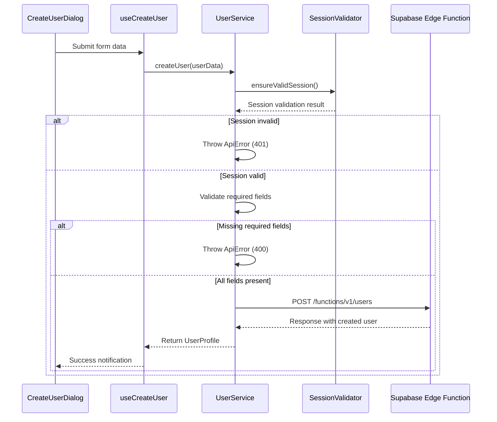
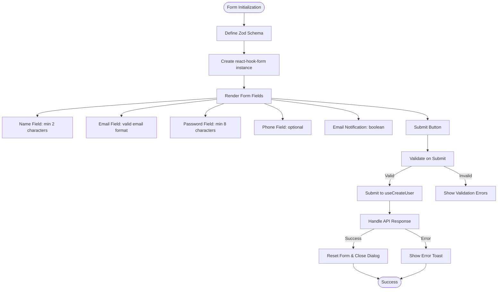
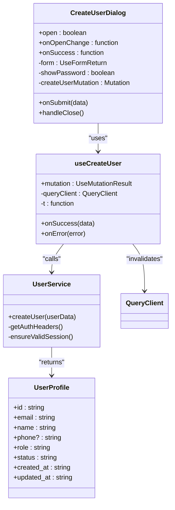
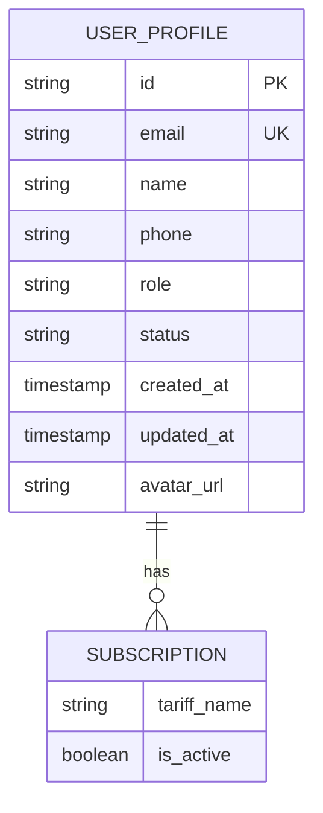

# User Creation

<cite>
**Referenced Files in This Document**   
- [user-service.ts](file://src/lib/user-service.ts)
- [CreateUserDialog.tsx](file://src/components/admin/CreateUserDialog.tsx)
- [session-validation.ts](file://src/lib/session-validation.ts)
- [user-auth-schemas.ts](file://src/lib/user-auth-schemas.ts)
- [useUsers.ts](file://src/hooks/useUsers.ts)
- [UsersTable.tsx](file://src/components/admin/UsersTable.tsx)
- [AdminUsersPage.tsx](file://src/pages/admin/AdminUsersPage.tsx)
</cite>

## Table of Contents
1. [Introduction](#introduction)
2. [User Creation Workflow](#user-creation-workflow)
3. [UserService Implementation](#userservice-implementation)
4. [CreateUserDialog Component](#createuserdialog-component)
5. [Data Flow and Integration](#data-flow-and-integration)
6. [Error Handling and Validation](#error-handling-and-validation)
7. [UserProfile and Admin Integration](#userprofile-and-admin-integration)
8. [Common Issues and Solutions](#common-issues-and-solutions)

## Introduction

The User Creation feature in the lovable-rise application enables administrators to create new user accounts through a dedicated interface. This functionality is implemented through a combination of frontend components and backend services that work together to validate input, authenticate requests, and persist user data. The system follows a structured workflow from UI input to database persistence, with comprehensive validation at each step to ensure data integrity and security.

The feature is accessible through the admin interface and provides a seamless experience for creating new users with appropriate role assignments and notifications. The implementation leverages modern React patterns with TypeScript, Zod for validation, and react-hook-form for form state management, ensuring type safety and robust error handling throughout the process.

## User Creation Workflow

The user creation process follows a well-defined sequence from initial form display to successful user creation and UI update. When an administrator clicks the "Add User" button in the Admin Users interface, the CreateUserDialog component is displayed, presenting a form with fields for name, email, password, phone number, and email notification preferences.

The workflow begins with the AdminUsersPage component, which contains the main users table and management interface. When the user creation process is initiated, the following sequence occurs:

1. The administrator clicks the "Add User" button, triggering the display of the CreateUserDialog
2. The dialog renders a form with validation rules defined by Zod schema
3. The user fills out the required fields and submits the form
4. Frontend validation occurs through react-hook-form and Zod
5. Upon successful validation, the form data is passed to the useCreateUser hook
6. The hook calls the UserService.createUser method with the validated data
7. The service validates the user's session and sends an HTTP POST request to the Supabase Edge Function
8. Upon successful creation, the UI is updated and a success notification is displayed

This workflow ensures that user creation is both user-friendly and secure, with multiple layers of validation and error handling to prevent data inconsistencies and provide clear feedback to administrators.

**Section sources**
- [AdminUsersPage.tsx](file://src/pages/admin/AdminUsersPage.tsx#L1-L350)
- [CreateUserDialog.tsx](file://src/components/admin/CreateUserDialog.tsx#L1-L257)

## UserService Implementation

The UserService class provides the core implementation for user creation functionality through its static createUser method. This method serves as the primary interface between the frontend application and the Supabase Edge Functions backend, handling all aspects of user creation including validation, authentication, and HTTP communication.

The createUser method accepts a CreateUserData object containing the user's email, password, name, phone number, role, and email notification preference. Before proceeding with the creation process, the method performs several critical validation steps:

**Diagram sources**
- [user-service.ts](file://src/lib/user-service.ts#L145-L186)
- [session-validation.ts](file://src/lib/session-validation.ts#L1-L399)

The method first validates that essential fields (email, password, and name) are present in the userData object. If any of these required fields are missing, it throws an ApiError with status code 400. This client-side validation serves as the first line of defense against incomplete user data.

Following field validation, the method ensures that the current user has a valid authentication session by calling SessionValidator.ensureValidSession(). This step is crucial for security, as it verifies that only authenticated administrators can create new users. If the session validation fails, the method throws an ApiError with status code 401.

Once both field and session validation pass, the method constructs an HTTP POST request to the Supabase Edge Function endpoint. The request includes authentication headers with the current user's access token and a JSON payload containing the user data. The role field defaults to 'user' if not explicitly provided, ensuring that new users are created with appropriate permissions.

The method handles the response from the Edge Function, parsing the JSON response and validating that it contains a user object. If the response indicates success, the method returns the created user's profile. If the response indicates failure, it throws an appropriate ApiError based on the server's response.

**Section sources**
- [user-service.ts](file://src/lib/user-service.ts#L145-L186)

## CreateUserDialog Component

The CreateUserDialog component implements the user interface for creating new users, leveraging React's component model and several third-party libraries to provide a robust and user-friendly experience. The component is built using the Dialog component from the UI library, which provides a modal interface for the user creation form.

The form structure is managed by react-hook-form, which handles form state, validation, and submission. The component defines a Zod schema (createUserSchema) that specifies the validation rules for each form field:

**Diagram sources**
- [CreateUserDialog.tsx](file://src/components/admin/CreateUserDialog.tsx#L1-L257)
- [user-auth-schemas.ts](file://src/lib/user-auth-schemas.ts#L1-L34)

The component's state management is handled through several React hooks. The showPassword state controls the visibility of the password field, allowing administrators to toggle between masked and plain text display of the password. The form state is managed by react-hook-form's useForm hook, which is configured with the Zod resolver to enforce the validation schema.

The onSubmit handler processes the form submission, performing a final check for required fields before passing the data to the useCreateUser mutation. This double validation (both through Zod and manual checking) ensures that no incomplete data reaches the backend service. The handler also manages the form reset and dialog closure upon successful user creation.

The component's UI is designed with accessibility and usability in mind. Each form field is wrapped in a FormField component from the UI library, which handles the association between labels, inputs, and error messages. The password field includes a toggle button with eye icons to show or hide the password, improving usability while maintaining security.

**Section sources**
- [CreateUserDialog.tsx](file://src/components/admin/CreateUserDialog.tsx#L1-L257)

## Data Flow and Integration

The data flow for user creation spans multiple layers of the application, from the UI components through hooks and services to the external Supabase Edge Functions. This integration is facilitated by React Query's useMutation hook, which manages the asynchronous operation and provides built-in error handling and success callbacks.

The integration begins with the useCreateUser hook, which serves as the bridge between the CreateUserDialog component and the UserService. This custom hook wraps the UserService.createUser method in a React Query mutation, providing several benefits:

**Diagram sources**
- [useUsers.ts](file://src/hooks/useUsers.ts#L80-L99)
- [user-service.ts](file://src/lib/user-service.ts#L145-L186)

When the useCreateUser hook is invoked, it returns a mutation object that includes the mutateAsync function for triggering the user creation process. The hook configures the mutation with onSuccess and onError callbacks that handle the post-creation workflow.

On successful user creation, the onSuccess callback invalidates the users query cache, ensuring that the UsersTable component will fetch the updated list of users on its next render. This automatic cache invalidation provides a seamless user experience, as the newly created user appears in the table without requiring a manual page refresh.

The callback also displays a success toast notification using the useToast hook, providing immediate feedback to the administrator. The toast includes the name of the created user and a success message, enhancing the user experience with personalized feedback.

On error, the onError callback logs the error to the console and displays an error toast with an appropriate message. This error handling ensures that any issues during user creation are communicated clearly to the administrator, facilitating troubleshooting and resolution.

The data flow from the UI to the backend is completed by the direct HTTP POST request from UserService to the Supabase Edge Function. This request includes the user data in the request body and authentication headers with the current user's access token. The Edge Function processes the request, creates the user in the database, and returns the created user's profile, which is then propagated back through the call stack to the UI components.

**Section sources**
- [useUsers.ts](file://src/hooks/useUsers.ts#L80-L99)
- [user-service.ts](file://src/lib/user-service.ts#L145-L186)

## Error Handling and Validation

The user creation feature implements comprehensive error handling and validation at multiple levels to ensure data integrity and provide clear feedback to administrators. The validation strategy follows a layered approach, with client-side validation preventing obviously invalid data from reaching the server, and server-side validation providing a final check before data persistence.

Client-side validation is implemented through the Zod schema (createUserSchema) defined in the CreateUserDialog component. This schema specifies the following validation rules:

- Email field: Must be a valid email format
- Password field: Must be at least 8 characters long
- Name field: Must be at least 2 characters long
- Phone field: Optional, no specific validation
- Notify by email field: Boolean with default value of true

These validation rules are enforced by react-hook-form's Zod resolver, which automatically validates the form data against the schema and displays error messages for invalid fields. The validation occurs in real-time as the user types, providing immediate feedback.

In addition to schema-based validation, the component performs a manual check for required fields in the onSubmit handler. This double validation ensures that even if the schema validation were somehow bypassed, the essential fields (email, password, and name) would still be checked before the data is sent to the server.

The UserService.createUser method implements additional validation on the client side before making the HTTP request. It checks for the presence of required fields and validates the current user's session. If any validation fails, it throws an ApiError with an appropriate status code and message.

Server-side validation occurs within the Supabase Edge Function, which performs its own checks on the incoming data. If the validation fails at this level, the function returns an error response with a specific error message and status code. The UserService method captures this response and converts it into an ApiError, which is then handled by the useCreateUser hook's onError callback.

Common error scenarios and their handling include:

- **Missing required fields**: Caught by client-side validation, with specific error messages displayed for each missing field
- **Invalid email format**: Caught by Zod validation, with an error message indicating the email is invalid
- **Weak password**: Caught by Zod validation, with an error message indicating the password is too short
- **Duplicate email**: Handled by the Supabase Edge Function, which returns a 409 conflict error if the email already exists
- **Session expiration**: Handled by the SessionValidator, which attempts to refresh the session or returns a 401 unauthorized error
- **Network failures**: Handled by the fetch API and React Query, with appropriate error messages displayed to the user

This multi-layered validation and error handling approach ensures that user creation is both secure and user-friendly, preventing data inconsistencies while providing clear guidance for administrators when errors occur.

**Section sources**
- [CreateUserDialog.tsx](file://src/components/admin/CreateUserDialog.tsx#L1-L257)
- [user-service.ts](file://src/lib/user-service.ts#L145-L186)
- [useUsers.ts](file://src/hooks/useUsers.ts#L80-L99)

## UserProfile and Admin Integration

The UserProfile interface defines the structure of user data returned by the UserService.createUser method and used throughout the admin interface. This interface includes essential user properties such as id, email, name, phone, role, status, and timestamps for creation and update. It also includes optional properties for avatar URL and subscription information, providing a comprehensive representation of user data.

**Diagram sources**
- [user-service.ts](file://src/lib/user-service.ts#L29-L43)

The created user is seamlessly integrated into the admin user management interface through several mechanisms. The most important of these is the cache invalidation performed by the useCreateUser hook's onSuccess callback. When a new user is successfully created, the hook calls queryClient.invalidateQueries with the users query key, which triggers a refetch of the users list.

This cache invalidation ensures that the UsersTable component displays the updated list of users, including the newly created user. The table is designed to handle loading states and empty states, providing a smooth user experience during the data fetching process.

The UsersTable component displays key information about each user, including their name (with avatar), status, email, phone number, subscription details, and creation date. Administrators can interact with user records through the table, accessing actions such as editing user details, deleting users, toggling user status, and viewing detailed user information.

The integration extends to other admin components as well. For example, the AdminUsersPage component provides filtering and sorting capabilities, allowing administrators to find specific users or view users in a particular order. The page also includes pagination for handling large numbers of users, ensuring that the interface remains responsive even with extensive user databases.

The role assignment for new users is handled by defaulting to the 'user' role in the createUser method. This ensures that new users are created with appropriate permissions and can be promoted to higher roles (admin or manager) as needed through the edit user functionality.

The admin interface also provides feedback on user creation success through toast notifications. These notifications include the name of the created user and a success message, providing immediate confirmation that the operation was completed successfully.

**Section sources**
- [user-service.ts](file://src/lib/user-service.ts#L29-L43)
- [UsersTable.tsx](file://src/components/admin/UsersTable.tsx#L1-L412)
- [AdminUsersPage.tsx](file://src/pages/admin/AdminUsersPage.tsx#L1-L350)

## Common Issues and Solutions

The user creation feature may encounter several common issues that administrators should be aware of. Understanding these issues and their solutions can help ensure smooth operation of the user management system.

**Validation Errors**: One of the most common issues is validation errors due to incomplete or incorrectly formatted data. To prevent these errors, administrators should ensure that all required fields (email, password, and name) are filled out completely. The email should be in a valid format (e.g., user@example.com), and the password should be at least 8 characters long. The form provides real-time validation feedback, highlighting fields with errors and displaying specific error messages.

**Duplicate Email Conflicts**: Attempting to create a user with an email address that already exists in the system will result in a conflict error. To resolve this issue, administrators should verify that the email address is not already associated with an existing user. The system does not allow multiple users with the same email address to prevent confusion and ensure account security.

**Network Failures**: Network connectivity issues can prevent the user creation request from reaching the Supabase Edge Function. If this occurs, administrators should check their internet connection and try the operation again. The application includes error handling that displays appropriate messages when network failures occur, helping administrators understand the nature of the problem.

**Session Expiration**: If the administrator's session expires during the user creation process, the operation will fail with an authentication error. To prevent this issue, administrators should ensure they are actively using the application and re-authenticate if prompted. The SessionValidator automatically attempts to refresh expired sessions, but this may not always be successful.

**Rate Limiting**: The system may implement rate limiting to prevent abuse of the user creation functionality. If an administrator attempts to create too many users in a short period, they may encounter rate limit errors. In such cases, administrators should wait for a period before attempting additional user creations.

To ensure robust user onboarding, administrators should follow these best practices:

1. Always verify the accuracy of user information before submission
2. Use strong, unique passwords for new users
3. Consider the appropriate role assignment for each user
4. Enable email notifications when appropriate to welcome new users
5. Verify that the user appears in the users list after creation
6. Check for any error messages or notifications that may indicate issues

By following these guidelines and understanding the common issues and their solutions, administrators can effectively manage user creation and ensure a smooth onboarding experience for new users in the lovable-rise application.

**Section sources**
- [user-service.ts](file://src/lib/user-service.ts#L145-L186)
- [CreateUserDialog.tsx](file://src/components/admin/CreateUserDialog.tsx#L1-L257)
- [useUsers.ts](file://src/hooks/useUsers.ts#L80-L99)