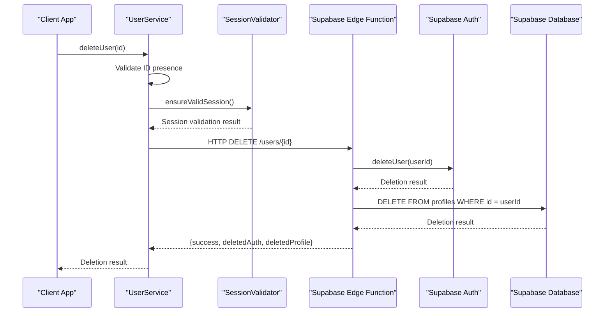
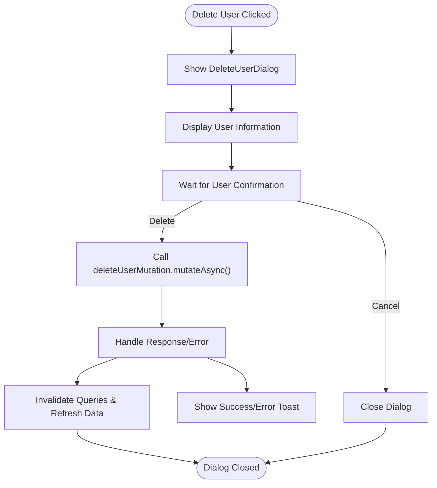
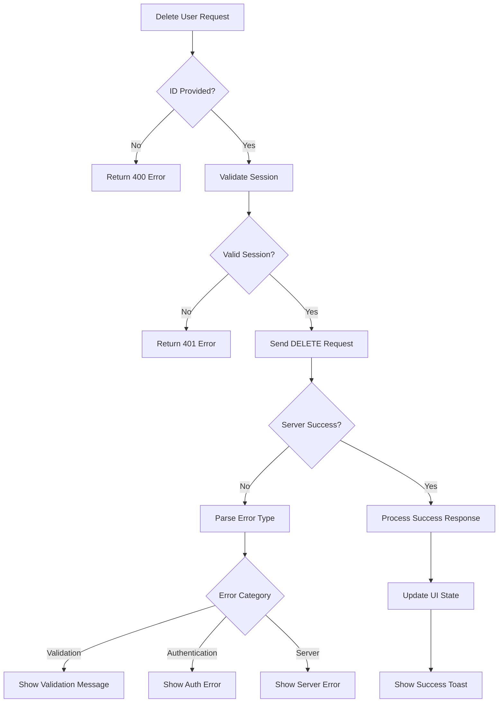

# User Deletion

<cite>
**Referenced Files in This Document**  
- [user-service.ts](file://src/lib/user-service.ts)
- [DeleteUserDialog.tsx](file://src/components/admin/DeleteUserDialog.tsx)
- [users/index.ts](file://supabase/functions/users/index.ts)
- [useUsers.ts](file://src/hooks/useUsers.ts)
- [session-validation.ts](file://src/lib/session-validation.ts)
</cite>

## Table of Contents
1. [Introduction](#introduction)
2. [User Deletion Implementation](#user-deletion-implementation)
3. [DeleteUserDialog Component](#deleteuserdialog-component)
4. [Response Structure and Cleanup](#response-structure-and-cleanup)
5. [Error Handling](#error-handling)
6. [Safety Checks and Data Consistency](#safety-checks-and-data-consistency)
7. [Common Issues and Solutions](#common-issues-and-solutions)
8. [Best Practices](#best-practices)

## Introduction
This document provides a comprehensive analysis of the user deletion feature in the lovable-rise application. It covers the implementation of the deleteUser method in the UserService class, the DeleteUserDialog component's confirmation pattern, response structure handling, error management, safety checks, and best practices for secure and auditable user removal.

## User Deletion Implementation

The user deletion functionality is implemented through a coordinated client-server architecture, with the UserService class orchestrating the deletion process on the client side and the Supabase Edge Function handling the actual data removal on the server side.

The deleteUser method in the UserService class follows a strict validation and authorization workflow before initiating the deletion request. It first validates that a user ID is provided, then ensures the current session is valid through the SessionValidator. This two-step validation process prevents unauthorized deletion attempts and ensures that only authenticated administrators can perform this sensitive operation.

**Diagram sources**  
- [user-service.ts](file://src/lib/user-service.ts#L261-L298)
- [users/index.ts](file://supabase/functions/users/index.ts#L436-L489)

**Section sources**  
- [user-service.ts](file://src/lib/user-service.ts#L261-L298)

## DeleteUserDialog Component

The DeleteUserDialog component implements a safety-focused confirmation pattern that prevents accidental deletions through multiple layers of verification. The dialog presents a clear visual warning with a destructive action indicator and requires explicit user confirmation before proceeding with the deletion.

The component displays comprehensive user information including name, email, and phone number, allowing administrators to verify they are deleting the correct account. It also lists the consequences of deletion, informing users that all associated data will be permanently removed. This transparency helps prevent accidental deletions and ensures administrators understand the impact of their actions.

The dialog implements loading states and disabled buttons during the deletion process to prevent multiple submission attempts. It integrates with React Query through the useDeleteUser hook, which handles the mutation state and provides automatic error handling and success notifications.

**Diagram sources**  
- [DeleteUserDialog.tsx](file://src/components/admin/DeleteUserDialog.tsx#L36-L131)
- [useUsers.ts](file://src/hooks/useUsers.ts#L129-L145)

**Section sources**  
- [DeleteUserDialog.tsx](file://src/components/admin/DeleteUserDialog.tsx#L36-L131)

## Response Structure and Cleanup

The user deletion operation returns a structured response object that provides detailed information about the deletion outcome: `{success, deletedAuth, deletedProfile}`. This granular response enables precise cleanup operations and user feedback.

The success field indicates whether the overall operation was successful, while the deletedAuth and deletedProfile fields provide specific information about which components were successfully removed. This distinction is crucial for handling partial deletions that might occur due to temporary system issues or permission constraints.

On the client side, the useDeleteUser hook processes this response to provide appropriate user feedback. When both auth and profile deletion succeed, a comprehensive success message is displayed. If only one component is deleted, a more specific message informs the administrator of the partial outcome. This detailed feedback helps administrators understand the system state and take appropriate follow-up actions if needed.

The response structure also informs cache management operations. Upon successful deletion, the hook invalidates relevant queries and removes the user data from the cache, ensuring the UI reflects the current system state without requiring a full page refresh.

**Section sources**  
- [users/index.ts](file://supabase/functions/users/index.ts#L450-L470)
- [useUsers.ts](file://src/hooks/useUsers.ts#L130-L145)

## Error Handling

The user deletion system implements comprehensive error handling at multiple levels to ensure robust operation and meaningful user feedback. The system distinguishes between client-side validation errors, session-related issues, and server-side operation failures.

Client-side validation catches missing user IDs before any network requests are made, preventing unnecessary server calls. The SessionValidator ensures that only authenticated administrators can initiate deletions, returning appropriate 401 errors for invalid sessions. These validation steps occur before the HTTP request is sent, providing immediate feedback to users.

Server-side error handling in the Supabase Edge Function captures various failure scenarios including database constraints, permission issues, and system errors. The function attempts to delete both the authentication record and profile data independently, allowing partial success when possible. This approach ensures that if one deletion fails, the other can still proceed, maintaining system consistency.

The client-side error handling in the useDeleteUser hook captures these errors and displays appropriate toast notifications to inform administrators. The system logs detailed error information for debugging while presenting user-friendly messages that guide administrators on potential next steps.

**Diagram sources**  
- [user-service.ts](file://src/lib/user-service.ts#L261-L298)
- [users/index.ts](file://supabase/functions/users/index.ts#L436-L489)
- [user-service.ts](file://src/lib/user-service.ts#L314-L319)

**Section sources**  
- [user-service.ts](file://src/lib/user-service.ts#L261-L298)
- [users/index.ts](file://supabase/functions/users/index.ts#L436-L489)

## Safety Checks and Data Consistency

The user deletion system incorporates multiple safety checks to prevent accidental deletions and ensure data consistency across the application. The primary safety mechanism is the confirmation dialog, which requires explicit user action to proceed with deletion.

The system implements session validation to ensure that only authenticated administrators with appropriate permissions can delete users. This prevents unauthorized access and ensures accountability for deletion operations. The SessionValidator also handles token refresh automatically, reducing the likelihood of deletion failures due to expired sessions.

Data consistency is maintained through transactional-like behavior in the Supabase Edge Function. Although the function doesn't use database transactions, it attempts to delete both the authentication record and profile data independently, tracking the success of each operation. This approach ensures that even if one deletion fails, the other can still proceed, and the system can report the partial outcome accurately.

The client-side implementation includes loading states and disabled buttons during the deletion process, preventing multiple submission attempts that could lead to race conditions or duplicate operations. The use of React Query's mutation system provides additional safeguards by managing the operation state and preventing concurrent executions.

**Section sources**  
- [session-validation.ts](file://src/lib/session-validation.ts#L42-L343)
- [users/index.ts](file://supabase/functions/users/index.ts#L436-L489)

## Common Issues and Solutions

Several common issues can arise during user deletion operations, and the system implements specific solutions to address them.

**Deletion failures due to foreign key constraints**: The current implementation does not handle foreign key constraints from related data such as user subscriptions or other dependent records. A recommended solution is to implement cascading deletes in the database schema or to create a comprehensive cleanup process that removes dependent records before deleting the user profile.

**Incomplete cleanup**: In rare cases, network issues or server errors might result in partial deletions where either the authentication record or profile data is removed but not both. The system addresses this by returning detailed response information and could be enhanced with a reconciliation process that verifies and completes pending deletions.

**Race conditions**: Multiple administrators attempting to delete the same user simultaneously could lead to race conditions. The system mitigates this through loading states and disabled buttons, but could be further improved with optimistic UI updates and conflict resolution strategies.

**Solutions**:
- Implement transactional operations using database transactions or stored procedures
- Add pre-deletion validation to check for dependent records
- Create a background job system for handling complex cleanup operations
- Implement reconciliation processes to handle partial failures
- Add audit logging to track deletion operations and support recovery

**Section sources**  
- [users/index.ts](file://supabase/functions/users/index.ts#L436-L489)
- [user-service.ts](file://src/lib/user-service.ts#L261-L298)

## Best Practices

The user deletion implementation follows several best practices for secure and auditable user removal:

**Security practices**:
- Require explicit administrator authentication for deletion operations
- Implement multi-layer validation (client and server-side)
- Use secure authentication tokens without exposing sensitive information
- Prevent unauthorized access through proper role-based permissions

**Data integrity practices**:
- Provide detailed response information about deletion outcomes
- Implement proper error handling and recovery mechanisms
- Maintain consistency between authentication and application data
- Use loading states to prevent multiple submission attempts

**User experience practices**:
- Implement clear confirmation dialogs with visual warnings
- Display comprehensive user information for verification
- List consequences of deletion to inform administrators
- Provide meaningful success and error messages
- Use toast notifications to confirm operation outcomes

**Operational practices**:
- Implement proper logging for debugging and auditing
- Use standardized error structures for consistent handling
- Invalidate cache appropriately after data modifications
- Handle network failures gracefully with appropriate retries
- Monitor system health and session status proactively

These practices ensure that user deletion is performed securely, reliably, and with appropriate safeguards against accidental data loss.

**Section sources**  
- [user-service.ts](file://src/lib/user-service.ts#L261-L298)
- [DeleteUserDialog.tsx](file://src/components/admin/DeleteUserDialog.tsx#L36-L131)
- [users/index.ts](file://supabase/functions/users/index.ts#L436-L489)