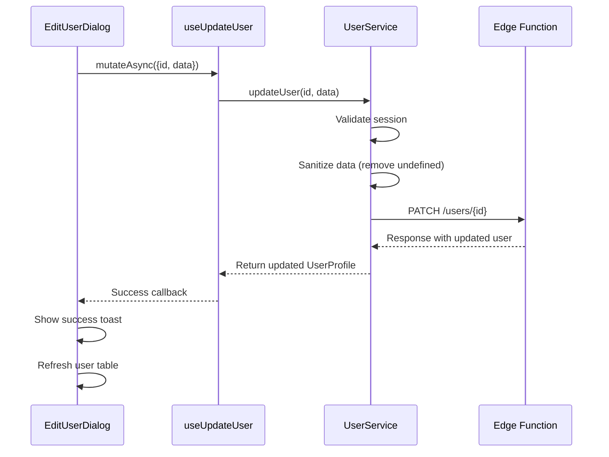
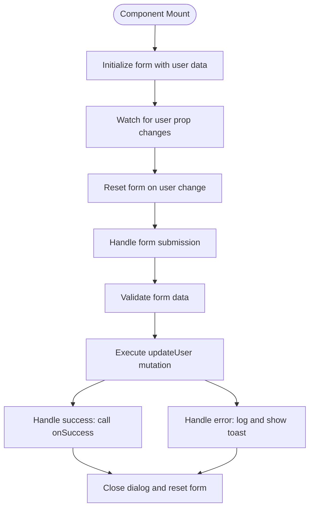
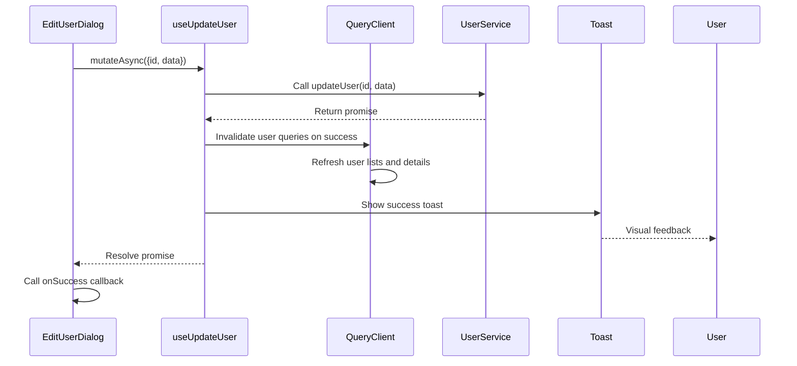
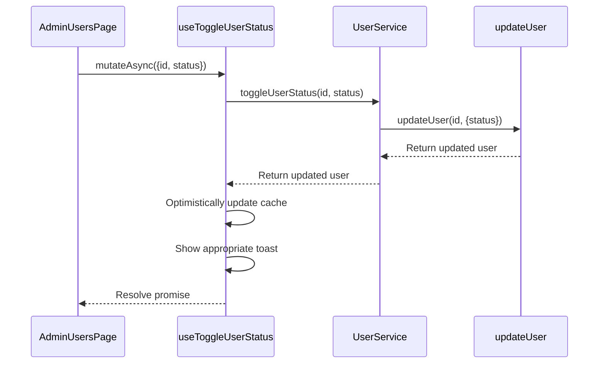

# User Editing

<cite>
**Referenced Files in This Document**   
- [user-service.ts](file://src/lib/user-service.ts)
- [EditUserDialog.tsx](file://src/components/admin/EditUserDialog.tsx)
- [useUsers.ts](file://src/hooks/useUsers.ts)
</cite>

## Table of Contents
1. [Introduction](#introduction)
2. [User Update Implementation](#user-update-implementation)
3. [UpdateUserData Interface](#updatedata-interface)
4. [EditUserDialog Component](#edituserdialog-component)
5. [Integration with UI Layer](#integration-with-ui-layer)
6. [Toggle User Status](#toggle-user-status)
7. [Common Issues and Solutions](#common-issues-and-solutions)

## Introduction
The User Editing feature in the lovable-rise application enables administrators to modify user information through a dedicated interface. This functionality is implemented through the UserService class, which handles communication with the backend Edge Function via HTTP PATCH requests. The EditUserDialog component provides the user interface for editing user data, integrating with the UserService through React Query mutations. This document details the implementation of user updates, including ID validation, data sanitization, partial updates, and the integration between the service layer and UI components.

## User Update Implementation

The `updateUser` method in the `UserService` class implements the core functionality for modifying user data. The method follows a structured approach to ensure data integrity and proper error handling.



**Diagram sources**
- [user-service.ts](file://src/lib/user-service.ts#L201-L240)
- [useUsers.ts](file://src/hooks/useUsers.ts#L101-L122)
- [EditUserDialog.tsx](file://src/components/admin/EditUserDialog.tsx#L61-L102)

**Section sources**
- [user-service.ts](file://src/lib/user-service.ts#L201-L240)

### ID Validation
The `updateUser` method begins with rigorous validation of the user ID parameter. The method throws an `ApiError` with status code 400 if the ID is missing or falsy, ensuring that updates are only attempted with valid identifiers. This validation occurs before any session validation or network requests, providing immediate feedback for invalid inputs.

### Data Sanitization
Before sending the update request, the method performs data sanitization by removing any properties with `undefined` values from the update payload. This is accomplished using `Object.fromEntries` with a filter that excludes entries where the value is `undefined`. This approach allows the API to distinguish between properties that should be updated (with explicit values) and those that should be ignored (omitted entirely). The method also validates that at least one field is provided for update, preventing empty update requests.

### Partial Updates via HTTP PATCH
The service implements partial updates using the HTTP PATCH method, which is appropriate for modifying specific fields of a resource without affecting others. The request is sent directly to the Supabase Edge Function endpoint with the sanitized data payload. The implementation uses the user's authentication token in the Authorization header, ensuring that only authorized users can perform updates. Upon successful response, the method returns the updated user profile, which includes the current values of all user fields.

## UpdateUserData Interface

The `UpdateUserData` interface defines the structure of data that can be updated for a user. This interface uses optional properties to enable flexible partial updates.

```mermaid
classDiagram
class UpdateUserData {
+name? : string
+phone? : string
+status? : "active" | "inactive"
}
note right of UpdateUserData
Interface for partial user updates
All properties are optional to support
PATCH requests with only changed fields
end note
```

**Diagram sources**
- [user-service.ts](file://src/lib/user-service.ts#L74-L78)

**Section sources**
- [user-service.ts](file://src/lib/user-service.ts#L74-L78)

The interface includes three optional properties:
- `name`: Allows updating the user's full name
- `phone`: Enables modification of the user's phone number
- `status`: Permits changing the user's active status

The optional nature of these properties (indicated by the `?` suffix) allows clients to include only the fields they wish to update. For example, to update only a user's name, the client can provide an object with just the `name` property. The data sanitization process in the `updateUser` method ensures that `undefined` values are removed from the payload, while `null` values are preserved if explicitly set.

## EditUserDialog Component

The `EditUserDialog` component provides the user interface for editing user information. It is implemented as a modal dialog that displays a form pre-populated with the current user data.



**Diagram sources**
- [EditUserDialog.tsx](file://src/components/admin/EditUserDialog.tsx#L54-L202)

**Section sources**
- [EditUserDialog.tsx](file://src/components/admin/EditUserDialog.tsx#L54-L202)

### Form Initialization
The component uses `react-hook-form` with `zod` validation to manage the form state. When the component mounts or when the `user` prop changes, the form is initialized with the current user data through the `defaultValues` configuration and a `useEffect` hook that calls `form.reset()`. This ensures that the form always displays the most current user information, even if the user object changes while the dialog is open.

### State Synchronization
The component maintains synchronization between its internal state and the parent component through the `open` and `onOpenChange` props. When the dialog is closed (either by submitting the form or clicking cancel), the form state is reset and the `onOpenChange` callback is invoked with `false`. This pattern ensures that the dialog's open state is controlled by the parent component, promoting reusability and consistent state management.

### Submission Handling
Form submission is handled through the `onSubmit` function, which is called when the form is validated and submitted. The function extracts the form data and calls the `updateUserMutation.mutateAsync` method with the user ID and update data. The mutation is configured to handle both success and error cases, with appropriate feedback provided to the user through toast notifications.

## Integration with UI Layer

The integration between the `UserService.updateUser` method and the UI layer is facilitated by React Query's `useMutation` hook through the `useUpdateUser` custom hook.



**Diagram sources**
- [useUsers.ts](file://src/hooks/useUsers.ts#L101-L122)
- [EditUserDialog.tsx](file://src/components/admin/EditUserDialog.tsx#L61-L102)

**Section sources**
- [useUsers.ts](file://src/hooks/useUsers.ts#L101-L122)

### Success Feedback
Upon successful user update, the `useUpdateUser` hook provides immediate feedback through multiple mechanisms:
1. It invalidates relevant queries using `queryClient.invalidateQueries`, which triggers automatic refetching of user lists and the specific user's details
2. It displays a success toast notification using the `toast.success` function, providing visual confirmation to the user
3. It calls the `onSuccess` callback passed from the `EditUserDialog`, allowing the parent component to handle post-update actions such as closing the dialog

### Table Refresh
The automatic table refresh is implemented through query invalidation rather than direct state manipulation. When a user is updated, the hook invalidates all queries related to user lists and the specific user's details. This causes any components displaying user data to automatically refetch the latest information on their next render cycle, ensuring that the UI reflects the most current state without requiring manual refresh actions.

## Toggle User Status

The `toggleUserStatus` method provides a convenience function for changing a user's active status. This method is implemented as a wrapper around the `updateUser` method, demonstrating code reuse and a consistent API design.



**Diagram sources**
- [user-service.ts](file://src/lib/user-service.ts#L301-L311)
- [useUsers.ts](file://src/hooks/useUsers.ts#L165-L188)

**Section sources**
- [user-service.ts](file://src/lib/user-service.ts#L301-L311)

The method performs parameter validation to ensure that a valid status value ("active" or "inactive") is provided. It then delegates to the `updateUser` method with an object containing only the `status` field. This design leverages the existing update infrastructure while providing a specialized interface for status changes. The corresponding `useToggleUserStatus` hook implements optimistic updates, temporarily updating the UI before the server response is received, which improves perceived performance.

## Common Issues and Solutions

### Stale Data
Stale data can occur when multiple users are editing the same record simultaneously. The application addresses this through query invalidation after successful updates, ensuring that all clients receive the latest data. For critical operations, consider implementing versioning or last-write-wins strategies on the server side.

### Concurrent Edits
The current implementation does not prevent concurrent edits. A potential solution would be to implement a locking mechanism where the first user to edit a record acquires a temporary lock, preventing others from editing until the first user saves or cancels.

### Validation Failures
Validation failures are handled through the form's `zod` schema, which validates the name field (minimum 2 characters) and email format. Server-side validation in the `updateUser` method provides additional protection against invalid data. Error messages are displayed through toast notifications, providing clear feedback to users.

### Network Errors
Network errors are handled by the `useUpdateUser` mutation's `onError` callback, which logs the error and displays a user-friendly message. The mutation's retry configuration (set to 1 retry) provides basic resilience against transient network issues.