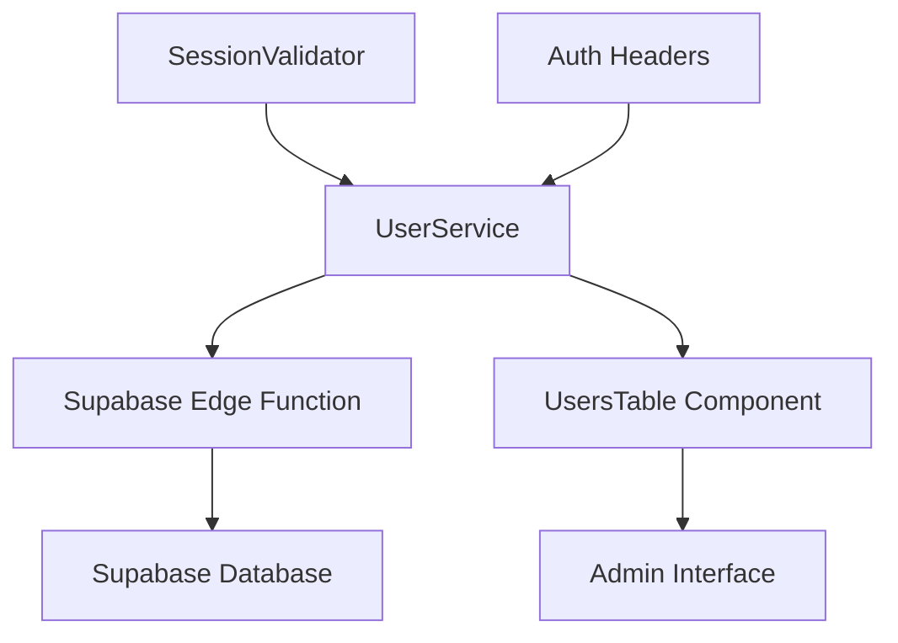
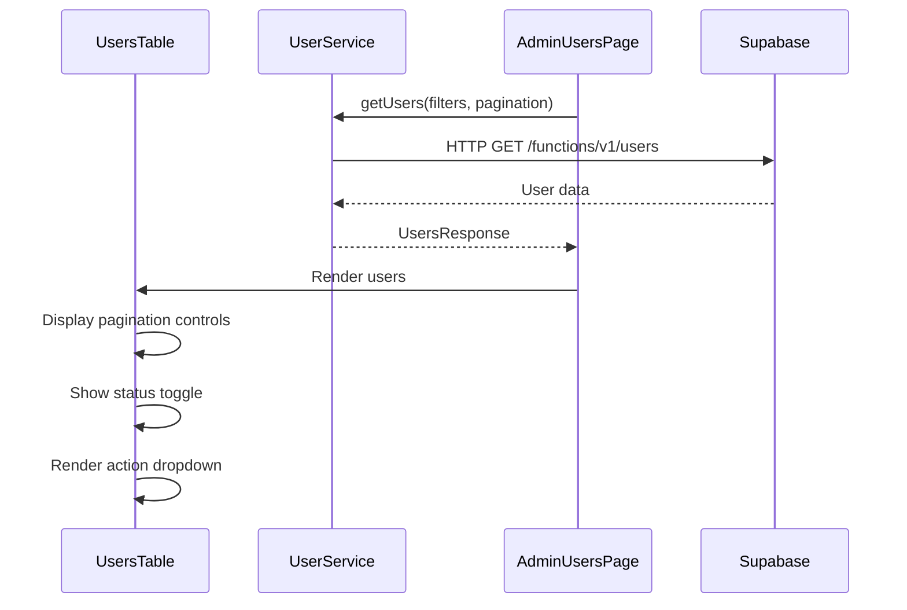
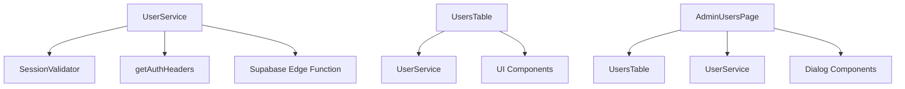

# User Retrieval

<cite>
**Referenced Files in This Document**   
- [user-service.ts](file://src/lib/user-service.ts)
- [UsersTable.tsx](file://src/components/admin/UsersTable.tsx)
- [AdminUsersPage.tsx](file://src/pages/admin/AdminUsersPage.tsx)
- [session-validation.ts](file://src/lib/session-validation.ts)
- [useUsers.ts](file://src/hooks/useUsers.ts)
</cite>

## Table of Contents
1. [Introduction](#introduction)
2. [Core Components](#core-components)
3. [Architecture Overview](#architecture-overview)
4. [Detailed Component Analysis](#detailed-component-analysis)
5. [Dependency Analysis](#dependency-analysis)
6. [Performance Considerations](#performance-considerations)
7. [Troubleshooting Guide](#troubleshooting-guide)

## Introduction
The User Retrieval feature in the lovable-rise application provides comprehensive functionality for managing user data through the UserService class. This system enables administrators to retrieve user information with advanced filtering, sorting, and pagination capabilities. The implementation integrates with Supabase Edge Functions for secure data access and features a responsive UsersTable component for data presentation. The architecture ensures proper authentication, error handling, and type safety throughout the user retrieval process.

## Core Components
The User Retrieval feature is built around the UserService class, which provides static methods for retrieving user data. The getUsers method handles paginated retrieval with filtering capabilities, while the getUser method fetches individual user records. These methods work in conjunction with the UsersTable component for data presentation and the useUsers hook for React integration. The system ensures proper session validation and authentication header management for secure data access.

**Section sources**
- [user-service.ts](file://src/lib/user-service.ts#L81-L311)
- [UsersTable.tsx](file://src/components/admin/UsersTable.tsx#L38-L52)

## Architecture Overview
The User Retrieval architecture follows a client-server pattern where the frontend UserService class communicates with Supabase Edge Functions via HTTP requests. The system maintains proper authentication through session validation and Bearer token headers. Data flows from the Supabase backend through the UserService methods to the UsersTable component for presentation. The architecture includes proper error handling, caching considerations, and type safety through TypeScript interfaces.



**Diagram sources **
- [user-service.ts](file://src/lib/user-service.ts#L81-L311)
- [UsersTable.tsx](file://src/components/admin/UsersTable.tsx#L38-L52)

## Detailed Component Analysis

### UserService Implementation
The UserService class provides the core functionality for user retrieval operations. It includes methods for fetching multiple users with pagination and filtering, as well as retrieving individual user records.

#### User Retrieval Methods
```mermaid
classDiagram
class UserService {
+static getUsers(filters : UserFilters, pagination : PaginationParams) Promise~UsersResponse~
+static getUser(id : string) Promise~UserProfile~
}
class UsersResponse {
+users : UserProfile[]
+total : number
+page : number
+limit : number
}
class UserProfile {
+id : string
+email : string
+name : string
+phone? : string
+role : "user" | "admin" | "manager"
+status : "active" | "inactive"
+created_at : string
+updated_at : string
+avatar_url? : string
+subscription? : { tariff_name : string | null; is_active : boolean }
}
UserService --> UsersResponse : "returns"
UserService --> UserProfile : "contains"
```

**Diagram sources **
- [user-service.ts](file://src/lib/user-service.ts#L81-L311)
- [user-service.ts](file://src/lib/user-service.ts#L29-L63)

**Section sources**
- [user-service.ts](file://src/lib/user-service.ts#L81-L311)

### UsersTable Component Analysis
The UsersTable component renders user data retrieved by the UserService and provides interactive features for user management.

#### Data Presentation and Interaction


**Diagram sources **
- [UsersTable.tsx](file://src/components/admin/UsersTable.tsx#L38-L52)
- [user-service.ts](file://src/lib/user-service.ts#L81-L311)
- [AdminUsersPage.tsx](file://src/pages/admin/AdminUsersPage.tsx#L132-L160)

**Section sources**
- [UsersTable.tsx](file://src/components/admin/UsersTable.tsx#L38-L52)

## Dependency Analysis
The User Retrieval feature depends on several key components for proper functionality. The UserService relies on session validation to ensure authenticated access and uses Supabase Edge Functions for data retrieval. The UsersTable component depends on UI components for rendering and interacts with dialog components for user actions. The system maintains proper separation of concerns while ensuring cohesive functionality across components.



**Diagram sources **
- [user-service.ts](file://src/lib/user-service.ts#L81-L311)
- [session-validation.ts](file://src/lib/session-validation.ts#L371-L398)
- [UsersTable.tsx](file://src/components/admin/UsersTable.tsx#L38-L52)

**Section sources**
- [user-service.ts](file://src/lib/user-service.ts#L81-L311)
- [session-validation.ts](file://src/lib/session-validation.ts#L371-L398)

## Performance Considerations
The User Retrieval system implements several performance optimizations for handling user data efficiently. The UserService methods include proper caching through React Query's staleTime and gcTime settings. The implementation uses pagination to limit data transfer and includes loading states to provide feedback during data retrieval. The system also implements prefetching to improve navigation performance between pages.

**Section sources**
- [useUsers.ts](file://src/hooks/useUsers.ts#L69-L78)
- [user-service.ts](file://src/lib/user-service.ts#L81-L311)

## Troubleshooting Guide
The User Retrieval system includes comprehensive error handling for common issues. Network timeouts are handled through React Query's retry mechanism, while session expiration triggers proper authentication flow. Empty results are managed through appropriate UI feedback in the UsersTable component. The system provides detailed error messages for debugging and includes proper fallback mechanisms for failed operations.

**Section sources**
- [user-service.ts](file://src/lib/user-service.ts#L314-L319)
- [error-handler.ts](file://src/lib/error-handler.ts#L199-L242)
- [user-service.ts](file://src/lib/user-service.ts#L81-L311)