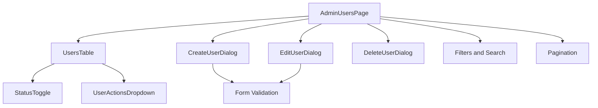
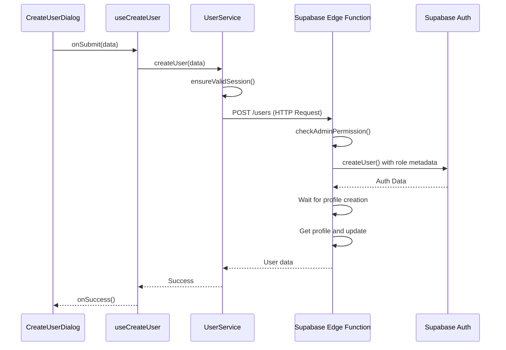

# User Management

<cite>
**Referenced Files in This Document**   
- [UsersTable.tsx](file://src/components/admin/UsersTable.tsx)
- [CreateUserDialog.tsx](file://src/components/admin/CreateUserDialog.tsx)
- [EditUserDialog.tsx](file://src/components/admin/EditUserDialog.tsx)
- [DeleteUserDialog.tsx](file://src/components/admin/DeleteUserDialog.tsx)
- [StatusToggle.tsx](file://src/components/admin/StatusToggle.tsx)
- [admin-service.ts](file://src/lib/admin-service.ts)
- [user-service.ts](file://src/lib/user-service.ts)
- [useUsers.ts](file://src/hooks/useUsers.ts)
- [index.ts](file://supabase/functions/users/index.ts)
- [AdminUsersPage.tsx](file://src/pages/admin/AdminUsersPage.tsx)
</cite>

## Table of Contents
1. [Role-Based Access Control](#role-based-access-control)
2. [CRUD Operations for User Management](#crud-operations-for-user-management)
3. [UI Components for User Management](#ui-components-for-user-management)
4. [Data Flow from UI to Supabase Edge Functions](#data-flow-from-ui-to-supabase-edge-functions)
5. [Common Issues and Solutions](#common-issues-and-solutions)
6. [Performance Considerations](#performance-considerations)

## Role-Based Access Control

The lovable-rise application implements a role-based access control (RBAC) system with distinct permissions for admin and user roles. The system defines three primary roles: "admin", "manager", and "user", each with different levels of access and capabilities. The admin role has full access to all user management functions, including creating, editing, deleting, and modifying user statuses. The role validation occurs at multiple levels: in the Supabase Edge Function, the admin-service, and the user-service. When creating or updating users, the system validates that the role is one of the permitted values ("admin", "manager", "user") before processing the request. The Edge Function specifically checks for admin permissions on POST, PATCH, and DELETE operations by verifying the user's role in their profile. This multi-layered approach ensures that only authorized users can perform administrative functions, maintaining the security and integrity of the user management system.

**Section sources**
- [index.ts](file://supabase/functions/users/index.ts#L1-L489)
- [admin-service.ts](file://src/lib/admin-service.ts#L5-L311)
- [user-service.ts](file://src/lib/user-service.ts#L81-L311)

## CRUD Operations for User Management

The user management system implements comprehensive CRUD (Create, Read, Update, Delete) operations for managing user accounts. The Create operation allows administrators to add new users through the CreateUserDialog component, which collects essential information including email, password, name, phone number, and email notification preferences. The Read operation is implemented through the UsersTable component, which displays user data including name, email, phone, role, status, and subscription information with support for filtering, sorting, and pagination. The Update operation enables administrators to modify user details such as name, phone number, role, and status through the EditUserDialog component. The Delete operation provides functionality to remove users from both the authentication system and profiles table, with proper error handling and confirmation dialogs. Each operation includes validation and error handling to ensure data integrity and provide meaningful feedback to administrators.

**Section sources**
- [CreateUserDialog.tsx](file://src/components/admin/CreateUserDialog.tsx#L46-L257)
- [EditUserDialog.tsx](file://src/components/admin/EditUserDialog.tsx#L54-L202)
- [DeleteUserDialog.tsx](file://src/components/admin/DeleteUserDialog.tsx)
- [UsersTable.tsx](file://src/components/admin/UsersTable.tsx#L247-L412)
- [user-service.ts](file://src/lib/user-service.ts#L81-L311)

## UI Components for User Management

The user management interface consists of several key components that provide a comprehensive administrative experience. The UsersTable component serves as the central display for user data, presenting information in a tabular format with columns for customer name, status, email, phone, tariff, subscription status, creation date, and actions. The table includes loading skeletons for better user experience during data fetching and displays a message when no users are found. The CreateUserDialog and EditUserDialog components provide modal interfaces for creating and modifying user accounts, featuring form validation and real-time feedback. The StatusToggle component allows administrators to activate or deactivate user accounts with a simple switch interface. The AdminUsersPage component orchestrates these elements, providing filters for search, status, role, and sorting, along with pagination controls for navigating through large datasets. These components work together to create an intuitive and efficient user management interface.

**Diagram sources**
- [AdminUsersPage.tsx](file://src/pages/admin/AdminUsersPage.tsx#L49-L348)
- [UsersTable.tsx](file://src/components/admin/UsersTable.tsx#L247-L412)
- [CreateUserDialog.tsx](file://src/components/admin/CreateUserDialog.tsx#L46-L257)
- [EditUserDialog.tsx](file://src/components/admin/EditUserDialog.tsx#L54-L202)

## Data Flow from UI to Supabase Edge Functions

The data flow for user management operations follows a structured pattern from the UI components through the application services to the Supabase Edge Functions. When an administrator performs an action such as creating, editing, or deleting a user, the request originates in the UI component (e.g., CreateUserDialog) and is processed by a React Hook (e.g., useCreateUser). The hook invokes the corresponding method in the UserService class, which first validates the user's session using SessionValidator.ensureValidSession() to ensure the administrator has proper authentication. The service then constructs an HTTP request with appropriate headers and sends it to the Supabase Edge Function at the designated endpoint (e.g., /functions/v1/users). The Edge Function performs additional authorization checks to verify the user has admin privileges before processing the request. For create operations, the function uses Supabase Auth Admin API to create the user and associates the role in user metadata. For read operations, the function queries the profiles table with optional filtering and pagination parameters. The response flows back through the same chain to update the UI and invalidate relevant caches.

**Diagram sources**
- [CreateUserDialog.tsx](file://src/components/admin/CreateUserDialog.tsx#L46-L257)
- [useUsers.ts](file://src/hooks/useUsers.ts#L85-L122)
- [user-service.ts](file://src/lib/user-service.ts#L81-L311)
- [index.ts](file://supabase/functions/users/index.ts#L1-L489)

## Common Issues and Solutions

The user management system addresses several common issues that may arise during administration. One frequent issue is role assignment conflicts, which are prevented by validating roles against a predefined list ("admin", "manager", "user") both in the frontend form schema and in the Edge Function. Another common issue is duplicate email addresses during user creation, which is handled by catching the Supabase authentication error and returning a 409 Conflict response with a clear message. The system also addresses timing issues between user creation in Auth and profile creation in the database by implementing a 2-second delay and subsequent verification query to ensure the profile exists before returning success. For PATCH requests, the system includes comprehensive validation to handle empty or malformed request bodies, ensuring that updates only proceed with valid JSON data. Additionally, the system handles cases where a user might exist in one system (Auth) but not the other (profiles table) by providing partial success responses that indicate which components were successfully deleted.

**Section sources**
- [index.ts](file://supabase/functions/users/index.ts#L1-L489)
- [CreateUserDialog.tsx](file://src/components/admin/CreateUserDialog.tsx#L46-L257)
- [user-service.ts](file://src/lib/user-service.ts#L81-L311)

## Performance Considerations

The user management system incorporates several performance optimizations to ensure responsive operation with large datasets. The system implements React Query for efficient data fetching, caching, and background synchronization, with a stale time of 5 minutes and garbage collection time of 10 minutes to balance freshness and performance. For user listing operations, the system uses pagination with configurable limits to prevent overwhelming the client with large datasets. The Edge Function optimizes database queries by combining user data with subscription information in a single query rather than making multiple individual requests. The frontend implements prefetching of user data to improve perceived performance when navigating between pages. Loading states are managed with skeletons to provide immediate visual feedback while data loads. The system also implements debounced search functionality to reduce the frequency of API calls during typing. For status updates, the system uses optimistic updates to provide immediate UI feedback while the request processes in the background, enhancing the user experience. These performance considerations ensure that the user management interface remains responsive and efficient even with substantial user bases.

**Section sources**
- [useUsers.ts](file://src/hooks/useUsers.ts#L69-L78)
- [AdminUsersPage.tsx](file://src/pages/admin/AdminUsersPage.tsx#L49-L348)
- [index.ts](file://supabase/functions/users/index.ts#L1-L489)
- [user-service.ts](file://src/lib/user-service.ts#L81-L311)