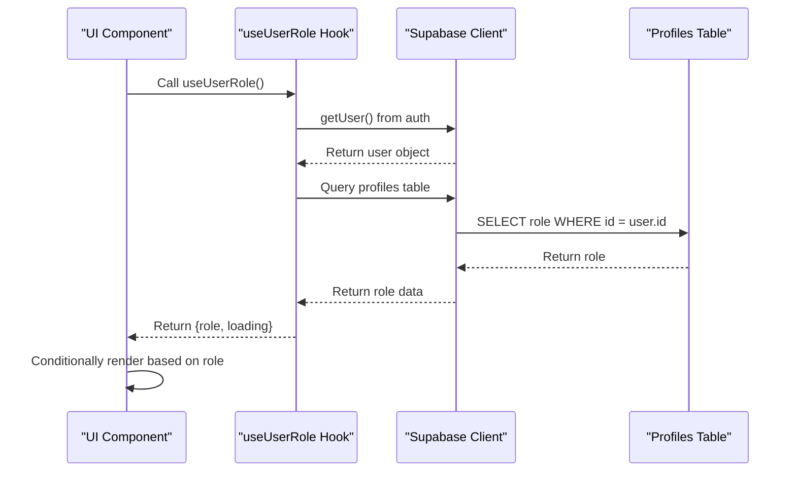
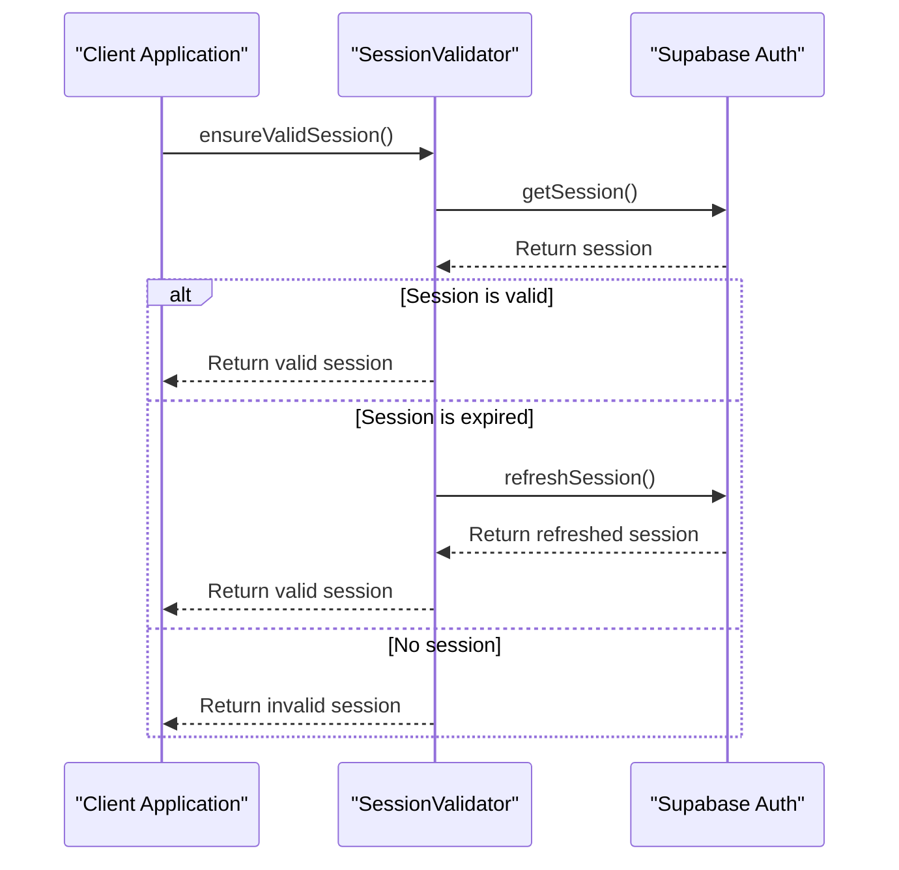
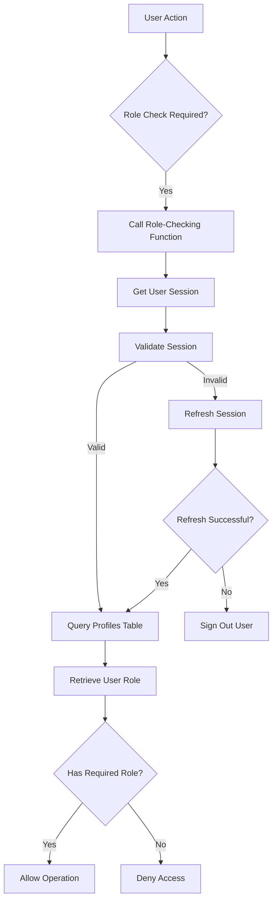

# User Roles and Permissions

<cite>
**Referenced Files in This Document**   
- [useUserRole.ts](file://src/hooks/useUserRole.ts)
- [user-service.ts](file://src/lib/user-service.ts)
- [profile-service.ts](file://src/lib/profile-service.ts)
- [session-validation.ts](file://src/lib/session-validation.ts)
- [permissions/index.ts](file://supabase/functions/permissions/index.ts)
- [UsersTable.tsx](file://src/components/admin/UsersTable.tsx)
- [UserLayout.tsx](file://src/components/UserLayout.tsx)
- [role-assignment-monitor.ts](file://src/lib/role-assignment-monitor.ts)
</cite>

## Table of Contents
1. [Introduction](#introduction)
2. [Role-Based Access Control Implementation](#role-based-access-control-implementation)
3. [Supported Roles and Permissions](#supported-roles-and-permissions)
4. [Role Enforcement at UI and Service Layers](#role-enforcement-at-ui-and-service-layers)
5. [Security Mechanisms](#security-mechanisms)
6. [Data Flow for Role Checking](#data-flow-for-role-checking)
7. [Common Issues and Solutions](#common-issues-and-solutions)
8. [Best Practices for Role Management](#best-practices-for-role-management)
9. [Conclusion](#conclusion)

## Introduction
The lovable-rise application implements a comprehensive role-based access control (RBAC) system to manage user permissions across the platform. This document details the implementation of user roles and permissions, focusing on the three supported roles: user, admin, and manager. The system enforces role-based access at both the UI and service layers, ensuring that users can only access functionality appropriate to their role. Security mechanisms such as session validation and Row Level Security (RLS) policies are implemented to protect against unauthorized access. The document also covers common issues like role assignment conflicts and unauthorized access attempts, providing solutions and best practices for effective role management.

## Role-Based Access Control Implementation
The role-based access control system in lovable-rise is implemented through a combination of client-side and server-side mechanisms. The system leverages Supabase for authentication and authorization, with role information stored in the profiles table. When a user authenticates, their role is retrieved from the database and used to determine their access level throughout the application. The implementation includes both immediate role checks and cached role information to optimize performance while maintaining security.

The RBAC system is designed to be extensible, allowing for the addition of new roles and permissions without significant changes to the core architecture. Role checks are performed at multiple levels, including the UI layer for conditional rendering and the service layer for data access control. This multi-layered approach ensures that even if one layer is compromised, other layers provide additional protection.

**Section sources**
- [profile-service.ts](file://src/lib/profile-service.ts#L100-L150)
- [user-service.ts](file://src/lib/user-service.ts#L50-L100)

## Supported Roles and Permissions
The lovable-rise application supports three primary roles: user, admin, and manager. Each role has a specific set of permissions that determine what actions the user can perform and what data they can access.

The **user** role is the default role assigned to new registrations. Users have access to basic functionality such as viewing their profile, managing their personal information, and accessing their dashboard. They can view and interact with data related to their own account but cannot access administrative functions or view data from other users.

The **admin** role has the highest level of access in the system. Admins can manage all aspects of the application, including user management, system settings, and configuration. They have full access to all data and can perform operations such as creating, updating, and deleting users. Admins can also assign roles to other users and manage permissions across the system.

The **manager** role has intermediate access between users and admins. Managers can perform administrative tasks within specific domains or departments but do not have system-wide administrative privileges. They can view and manage data for users within their scope but cannot modify system-wide settings or access data outside their designated areas.

**Section sources**
- [profile-service.ts](file://src/lib/profile-service.ts#L70-L90)
- [permissions/index.ts](file://supabase/functions/permissions/index.ts#L10-L50)

## Role Enforcement at UI and Service Layers
Role enforcement in lovable-rise occurs at both the UI and service layers, providing a comprehensive security approach. At the UI layer, the `useUserRole` hook is used to determine the current user's role and conditionally render components based on their permissions. This hook retrieves the user's role from the profiles table and provides it to components that need to make role-based decisions.

**Diagram sources**
- [useUserRole.ts](file://src/hooks/useUserRole.ts#L1-L35)
- [UserLayout.tsx](file://src/components/UserLayout.tsx#L200-L250)

At the service layer, role enforcement is implemented through the UserService and profile-service. These services validate the user's role before performing operations, ensuring that only authorized users can access specific functionality. For example, the UserService checks if the current user has admin privileges before allowing user creation or deletion operations.

The system also includes role-based access control in Edge Functions, which are serverless functions that run on the Supabase platform. These functions validate the user's role before processing requests, providing an additional layer of security. The permissions Edge Function specifically handles role-based access to menu items and other resources, ensuring that users can only access functionality appropriate to their role.

**Section sources**
- [useUserRole.ts](file://src/hooks/useUserRole.ts#L1-L35)
- [user-service.ts](file://src/lib/user-service.ts#L150-L200)
- [permissions/index.ts](file://supabase/functions/permissions/index.ts#L50-L100)

## Security Mechanisms
The lovable-rise application implements several security mechanisms to protect against unauthorized access and ensure the integrity of the role-based access control system. The primary security mechanisms include session validation, Row Level Security (RLS) policies, and role assignment monitoring.

Session validation is a critical component of the security architecture. The SessionValidator class ensures that user sessions are valid and properly authenticated before allowing access to protected resources. It validates the access token, checks for session expiration, and handles token refresh when necessary. This mechanism prevents unauthorized access by ensuring that only users with valid sessions can perform operations.

**Diagram sources**
- [session-validation.ts](file://src/lib/session-validation.ts#L50-L150)

Row Level Security (RLS) policies are implemented at the database level to ensure that users can only access data they are authorized to view. These policies are defined in the Supabase database and are enforced automatically for all queries. For example, the profiles table has RLS policies that restrict access based on the user's role, ensuring that users can only view their own profile data unless they have admin privileges.

The application also includes a role assignment monitoring system to detect and prevent role assignment conflicts. The RoleAssignmentMonitor class periodically checks for potential issues with role assignments, such as users being assigned incorrect roles or missing admin accounts. This monitoring system helps maintain the integrity of the role-based access control system and provides early warning of potential security issues.

**Section sources**
- [session-validation.ts](file://src/lib/session-validation.ts#L1-L200)
- [role-assignment-monitor.ts](file://src/lib/role-assignment-monitor.ts#L1-L100)

## Data Flow for Role Checking
The data flow for role checking in lovable-rise follows a consistent pattern across the application. When a user performs an action that requires role verification, the system follows a series of steps to determine if the user has the necessary permissions.

The process begins with the client-side application calling a role-checking function, such as `useUserRole` for UI components or `isAdmin` for service-layer operations. These functions initiate a request to retrieve the user's role information from the database. The request is authenticated using the user's access token, which is included in the Authorization header.

**Diagram sources**
- [profile-service.ts](file://src/lib/profile-service.ts#L100-L150)
- [session-validation.ts](file://src/lib/session-validation.ts#L50-L100)

The query to the profiles table is subject to Row Level Security policies, ensuring that users can only access their own role information unless they have elevated privileges. The database returns the user's role, which is then used to make the access control decision. The result is cached in the client application to reduce the number of database queries and improve performance.

For operations that require admin privileges, the system performs additional validation to ensure that the user has the necessary permissions. This includes checking the user's role against the required role for the operation and verifying that the session is valid and properly authenticated.

**Section sources**
- [profile-service.ts](file://src/lib/profile-service.ts#L100-L200)
- [user-service.ts](file://src/lib/user-service.ts#L50-L100)

## Common Issues and Solutions
The lovable-rise application may encounter several common issues related to role management and access control. Understanding these issues and their solutions is essential for maintaining a secure and functional system.

One common issue is role assignment conflicts, where users are assigned incorrect roles during registration or role changes. This can occur due to timing issues between authentication and profile creation, or due to errors in the role assignment logic. The solution is to implement proper synchronization between authentication and profile creation, ensuring that roles are assigned correctly and consistently.

Another common issue is unauthorized access attempts, where users try to access functionality or data they are not authorized to view. This can be mitigated by implementing comprehensive role checks at both the UI and service layers, as well as enforcing Row Level Security policies at the database level. The system should also log unauthorized access attempts for monitoring and auditing purposes.

Session expiration and invalidation can also cause issues with role-based access control. When a user's session expires, they may lose access to functionality they were previously authorized to use. The solution is to implement proper session validation and refresh mechanisms, ensuring that users can continue their work without interruption while maintaining security.

**Section sources**
- [role-assignment-monitor.ts](file://src/lib/role-assignment-monitor.ts#L100-L150)
- [session-validation.ts](file://src/lib/session-validation.ts#L200-L250)

## Best Practices for Role Management
Effective role management in the lovable-rise application requires adherence to several best practices. These practices help ensure the security, reliability, and maintainability of the role-based access control system.

First, roles should be assigned based on the principle of least privilege, giving users only the permissions they need to perform their tasks. This minimizes the risk of unauthorized access and reduces the potential impact of security breaches.

Second, role changes should be logged and audited to provide a record of who changed a user's role and when. This audit trail is essential for security monitoring and compliance purposes.

Third, the system should implement proper error handling and fallback mechanisms for role-related operations. For example, if a role check fails due to a temporary issue, the system should default to a secure state rather than granting access.

Fourth, regular monitoring and testing of the role-based access control system should be performed to identify and address potential issues. The RoleAssignmentMonitor class provides a foundation for this monitoring, but additional testing and validation should be performed regularly.

Finally, documentation and training should be provided to administrators and developers to ensure they understand the role-based access control system and can use it effectively.

**Section sources**
- [role-assignment-monitor.ts](file://src/lib/role-assignment-monitor.ts#L1-L50)
- [session-validation.ts](file://src/lib/session-validation.ts#L1-L50)

## Conclusion
The user roles and permissions system in the lovable-rise application provides a comprehensive and secure approach to access control. By implementing role-based access control at multiple layers, including the UI, service, and database levels, the system ensures that users can only access functionality appropriate to their role. The use of session validation, Row Level Security policies, and role assignment monitoring provides additional layers of security and helps maintain the integrity of the system. By following best practices for role management and addressing common issues proactively, the application can maintain a secure and reliable access control system that meets the needs of its users.