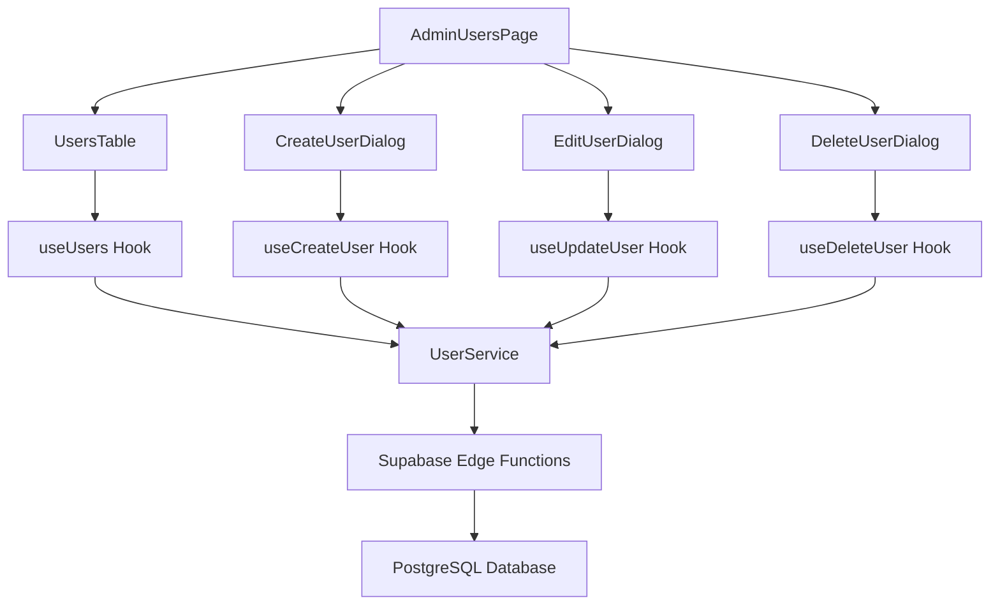

# Admin User Management System

## Overview

A comprehensive user management system for the admin dashboard that allows administrators to create, edit, delete, and manage users with the "user" role. The system is built with modern React patterns, TypeScript, and includes full internationalization support.

## Features

### Core Functionality
- ✅ **User Table Display**: Responsive table with sorting, filtering, and pagination
- ✅ **Create Users**: Form-based user creation with email notifications
- ✅ **Edit Users**: Update user information (name, phone)
- ✅ **Delete Users**: Soft delete with confirmation dialog
- ✅ **Status Management**: Toggle user active/inactive status
- ✅ **Search & Filter**: Real-time search by name/email, status filtering
- ✅ **Bulk Operations**: Export functionality (ready for implementation)

### Technical Features
- ✅ **TypeScript**: Full type safety throughout the system
- ✅ **React Query**: Optimized data fetching and caching
- ✅ **Form Validation**: Zod schemas with React Hook Form
- ✅ **Internationalization**: Ukrainian and English language support
- ✅ **Responsive Design**: Mobile-first design with Tailwind CSS
- ✅ **Accessibility**: shadcn/ui components with ARIA support
- ✅ **Error Handling**: Comprehensive error boundaries and user feedback
- ✅ **Loading States**: Skeleton loaders and progress indicators

## Architecture

### Component Structure
```
src/
├── pages/admin/
│   └── AdminUsersPage.tsx          # Main users management page
├── components/admin/
│   ├── UsersTable.tsx              # Data table with sorting/filtering
│   ├── CreateUserDialog.tsx        # User creation form dialog
│   ├── EditUserDialog.tsx          # User editing form dialog
│   ├── DeleteUserDialog.tsx        # Delete confirmation dialog
│   └── StatusToggle.tsx            # Status toggle with confirmation
├── hooks/
│   └── useUsers.ts                 # React Query hooks for user operations
├── lib/
│   └── user-service.ts             # User API service layer
└── providers/
    └── i18n-provider.tsx           # Updated with user management translations
```

### Data Flow


## API Integration

### Endpoints Used
- `GET /functions/v1/users` - Fetch users with filtering
- `POST /functions/v1/users` - Create new user
- `PATCH /functions/v1/users/:id` - Update user
- `DELETE /functions/v1/users/:id` - Delete user

### Data Models
```typescript
interface UserProfile {
  id: string;
  email: string;
  name: string;
  phone?: string;
  role: "user" | "admin" | "manager";
  status: "active" | "inactive";
  created_at: string;
  updated_at: string;
  avatar_url?: string;
}
```

## Usage Guide

### Navigation
Users page is accessible via:
- **Admin Menu**: Click "Users" in the sidebar
- **Direct URL**: `/admin/users`
- **Menu Integration**: Listed as a static route with order index 2

### Creating Users
1. Click "Add User" button
2. Fill in required fields:
   - Full Name (required)
   - Email Address (required)
   - Password (required, min 8 characters)
   - Phone Number (optional)
3. Toggle "Send credentials by email" if needed
4. Click "Create User"

### Managing Users
- **Edit**: Click edit icon in Actions dropdown
- **Delete**: Click delete icon in Actions dropdown
- **Status Toggle**: Use the toggle switch in Status column
- **Contact**: Click email/phone in Actions dropdown

### Filtering & Search
- **Search**: Type in search box to filter by name or email
- **Status Filter**: Select "All Status", "Active", or "Inactive"
- **Sorting**: Click column headers to sort
- **Refresh**: Click refresh button to reload data

## Internationalization

### Supported Languages
- **Ukrainian (uk)**: Primary language
- **English (en)**: Secondary language

### Translation Keys
All user management text is translated using the `useI18n` hook:
```typescript
const { t } = useI18n();
// Usage examples:
t("users_title")           // "Users" / "Користувачі"
t("add_user")             // "Add User" / "Додати користувача"
t("status_active")        // "Active" / "Активний"
```

### Language Switching
Language preference is managed globally through the i18n provider and persists across sessions.

## Responsive Design

### Breakpoints
- **Mobile (< 640px)**: Stacked layout, essential columns only
- **Tablet (640px - 1024px)**: Condensed table with dropdown actions
- **Desktop (> 1024px)**: Full table layout with all columns

### Mobile Adaptations
- Collapsible table columns
- Touch-friendly buttons and toggles
- Swipe gestures support (future enhancement)
- Optimized form layouts

## Error Handling

### Client-Side Errors
- **Form Validation**: Real-time validation with Zod schemas
- **Network Errors**: Automatic retry with user feedback
- **Component Errors**: Error boundaries with fallback UI
- **Loading States**: Skeleton loaders prevent layout shift

### User Feedback
- **Success Messages**: Toast notifications for successful operations
- **Error Messages**: Clear error descriptions with suggested actions
- **Confirmation Dialogs**: Prevent accidental deletions
- **Loading Indicators**: Progress feedback for all async operations

## Security Considerations

### Access Control
- **Admin Only**: User management restricted to admin role
- **Row Level Security**: Database-level access control
- **Token Validation**: All API calls require valid admin tokens

### Data Protection
- **Input Sanitization**: All user inputs validated and sanitized
- **SQL Injection Prevention**: Parameterized queries via Supabase
- **XSS Protection**: Content properly escaped in rendering

## Performance Optimizations

### Caching Strategy
- **React Query**: Automatic caching with 5-minute stale time
- **Optimistic Updates**: Immediate UI updates with rollback on failure
- **Request Deduplication**: Prevent duplicate API calls

### Loading Optimizations
- **Skeleton Loaders**: Prevent layout shift during loading
- **Progressive Enhancement**: Core functionality works without JavaScript
- **Lazy Loading**: Components loaded on demand

## Testing

### Integration Test
Run the validation script to test the complete implementation:
```typescript
import { validateUserManagementImplementation } from './src/test-user-management';
const results = validateUserManagementImplementation();
```

### Manual Testing Checklist
- [ ] Navigate to `/admin/users`
- [ ] Verify table loads with user data
- [ ] Test search functionality
- [ ] Test status filtering
- [ ] Test column sorting
- [ ] Create a new user
- [ ] Edit existing user
- [ ] Toggle user status
- [ ] Delete user with confirmation
- [ ] Test form validation
- [ ] Test responsive design
- [ ] Test language switching

## Troubleshooting

### Common Issues

1. **TypeScript Errors**
   - Ensure all types are properly imported
   - Check database types are up to date
   - Verify component prop interfaces

2. **API Errors**
   - Check Supabase connection
   - Verify admin authentication
   - Check edge function deployment

3. **Styling Issues**
   - Ensure Tailwind CSS is properly configured
   - Check shadcn/ui components are installed
   - Verify responsive classes are applied

4. **Translation Missing**
   - Check i18n provider includes all required keys
   - Verify useI18n hook usage
   - Test both language variants

### Debug Mode
Enable debug logging in development:
```typescript
// Add to user-service.ts
console.log('API Request:', { filters, pagination });
console.log('API Response:', response);
```

## Future Enhancements

### Planned Features
- [ ] Advanced user permissions management
- [ ] Bulk user operations (import/export CSV)
- [ ] User activity tracking and audit logs
- [ ] Advanced filtering (date ranges, role-based)
- [ ] User profile avatars with upload
- [ ] Email template customization
- [ ] Real-time notifications for user actions

### Technical Improvements
- [ ] Unit test coverage with Jest/React Testing Library
- [ ] E2E tests with Playwright
- [ ] Performance monitoring and analytics
- [ ] Advanced caching strategies
- [ ] Offline support with service workers

## Contributing

### Development Setup
1. Ensure all dependencies are installed: `npm install`
2. Start development server: `npm run dev`
3. Run type checking: `npx tsc --noEmit`
4. Test the implementation: Import and run validation script

### Code Standards
- TypeScript strict mode enabled
- ESLint configuration for React/TypeScript
- Prettier for code formatting
- Conventional commit messages
- Component-driven development patterns

## Support

For questions or issues related to the user management system:
1. Check this documentation first
2. Review the integration test results
3. Check the browser console for errors
4. Verify API responses in Network tab
5. Test with different user roles and permissions

---

*This user management system is built with modern React patterns and follows industry best practices for security, accessibility, and user experience.*